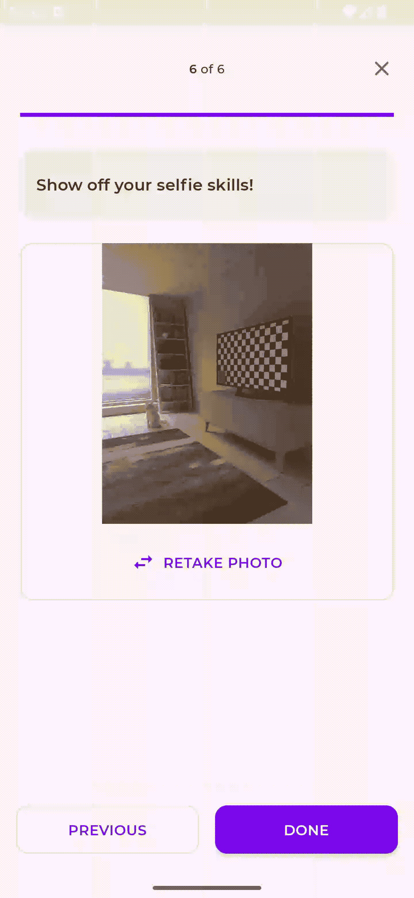
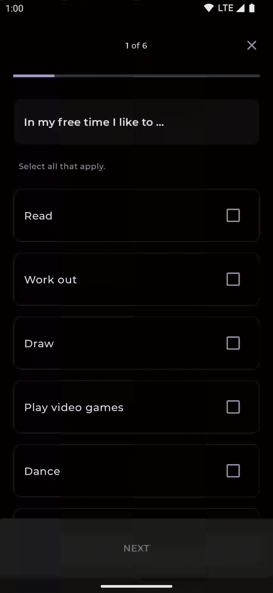
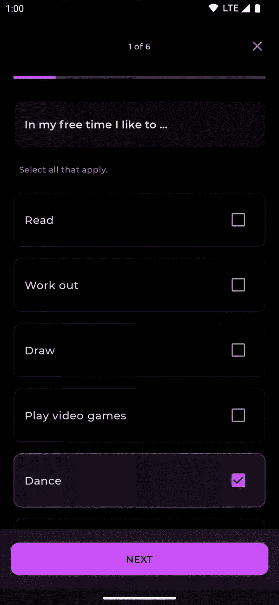
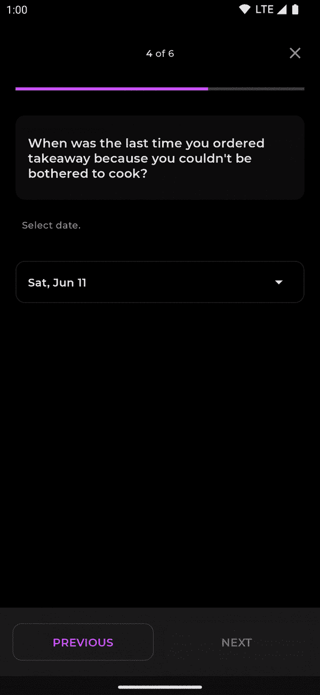
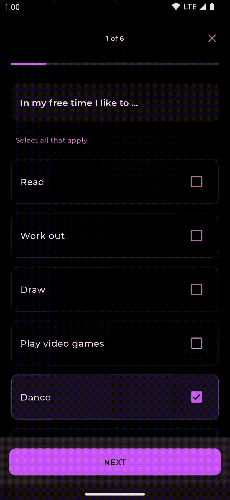
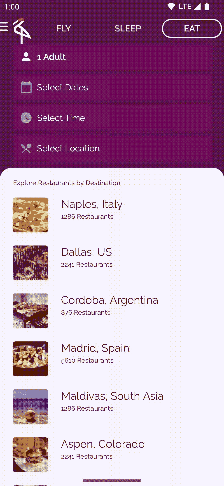
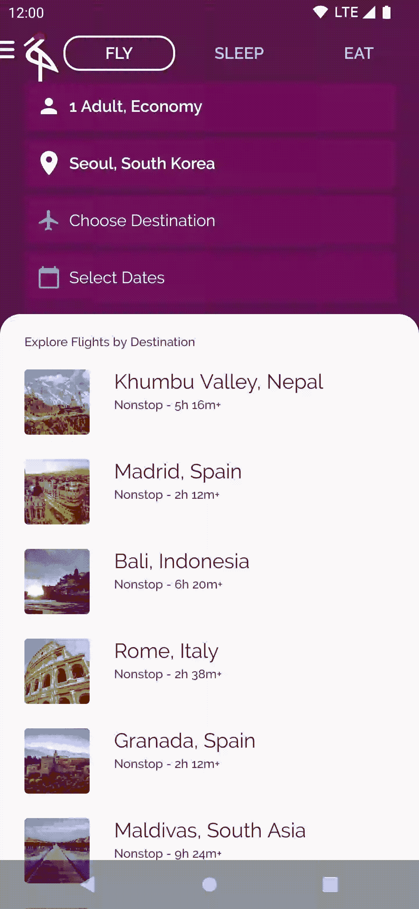

# 在 Jetpack Compose 中自定义动画内容🌟

> 原文：<https://medium.com/androiddevelopers/customizing-animatedcontent-in-jetpack-compose-629c67b45894?source=collection_archive---------2----------------------->

## 了解如何使用 AnimatedContent 在不同类型的内容之间进行更多的自定义过渡

您是否在不同的组件之间切换，并担心当用户立即看到屏幕上的变化时会产生不和谐的效果，而没有在两者之间进行优雅的转换？好吧，不要再看了！ [AnimatedContent](https://developer.android.com/jetpack/compose/animation#animatedcontent) (目前处于实验阶段)是一个可组合组件，它允许你在不同的可组合组件之间进行更平滑、更定制的过渡效果。默认情况下，在`AnimatedContent`中包装变化的组件，会淡入淡出并缩放内容。这可以让你的应用程序的外观和感觉有很大的不同，不需要太多的努力。

让我们看一个简单的例子，在 [Jetsurvey 应用](https://github.com/android/compose-samples/tree/main/Jetsurvey)中，我们有一个条件，可以在调查结果或调查本身的问题之间切换:

运行这个程序，我们可以观察到状态变化转换并不像我们希望的那样平滑:

Instant transition between questions and result

如果我们将`when`语句包装在`AnimatedContent`中，将新的`state`作为`targetState`传入，我们可以很容易地在这两个屏幕之间获得更好的转换:

在`AnimatedContent` lambda 中，使用`targetState`参数而不是`state`参数很重要，因为这将确保动画在需要快速切换不同状态时流畅运行。运行这个程序，我们可以看到两个组件之间的转换有很大的改进(降低到 0.25 倍):

# 对动画内容使用自定义 transitionSpec

让我们使用可选的`transitionSpec`参数对这个转换进行更多的定制，这个参数可以在`AnimatedContent` composable 中找到。默认情况下，`transitionSpec`将为进入和退出过渡执行自定义的内容淡入淡出和缩放。为了使它更具定制性，让我们将新内容从底部改为`slideInVertically`和`fadeOut`以前的内容。

`slideInVertically`函数接受一个`initialOffsetY`函数。这是一个决定动画开始位置的函数。在这种情况下，我们返回一个内容为`fullHeight`的`initialOffsetY`。这意味着动画将从屏幕底部的偏移设置开始(在`fullHeight`)。这可能看起来有点混乱，但是在 Android 中绘图时的坐标系是从内容左上角的`[0,0]`点开始的，所以坐标`[0, fullHeight]`在内容的底部。我们也可以指定`[animationSpec](https://developer.android.com/jetpack/compose/animation#animationspec)`(补间，弹簧等。)来定制动画的持续时间或类型。让我们看看现在是什么样子:

那看起来好多了！内容从底部滑入，传出的内容淡出。要查看自定义过渡的其他选项，请参见 [EnterTransition 和 ExitTransition 文档](https://developer.android.com/jetpack/compose/animation#enter-exit-transition)。

# 动画显示问题变化

使用`AnimatedContent`的另一个示例实现是当在集合中的不同问题之间转换时。以前，内容会在没有动画的情况下改变，如下所示:

通过包装`AnimatedContent`中的`Question`组件，我们将获得问题转换的默认转换:

为了更好地过渡，我们可以将之前的问题移到屏幕左侧，新问题从右侧进入。让我们如前所示指定`transitionSpec`:

这对于我们的调查很有帮助，正如我们所料，调查内容会顺利进行。但是您可能会注意到，如果我们单击“上一步”按钮，动画就没有多大意义了，因为它从错误的方向退出了屏幕:

我们需要它来反转动画，将“新”内容从左边滑入，旧内容从右边滑出。为此，我们可以扩展我们如何使用`transitionSpec`。这个有`[AnimatedContentScope](https://developer.android.com/reference/kotlin/androidx/compose/animation/AnimatedContentScope)`作为接收器，让我们有能力观察或访问`initialState`和`targetState`。这允许我们根据不同的状态有条件地改变我们的逻辑:

我们可以检查`targetState.questionIndex`，并将其与`initialState.questionIndex`进行比较，如果`target.questionIndex`更大，我们知道我们正在调查中前进。然后，我们将动画设置为`slideInHorizontally`，内容宽度的起始偏移量为,`slideOutHorizontally`为内容的负宽度。如果`targetState.questionIndex`变小，我们知道我们在调查中退步了。然后，我们可以设置与前进相反的用法:`-fullWidth`用于滑入，而`fullWidth`用于滑出:

我们现在有了更好的前进和后退动画:

有一个助手方法`[slideIntoContainer](https://developer.android.com/reference/kotlin/androidx/compose/animation/AnimatedContentScope#slideIntoContainer(androidx.compose.animation.AnimatedContentScope.SlideDirection,androidx.compose.animation.core.FiniteAnimationSpec,kotlin.Function1))`，也可以用来实现从某些方向的滑动动画，而不需要计算出所需的初始偏移量。`slideIntoContainer(towards = AnimatedContentScope.SlideDirection.Up)`可以代替我们使用的`slideInHorizontally`和`slideOutHorizontally`。`slideIntoContainer`和`slideIn/OutHorizontally/Vertically`的区别在于`slideIntoContainer/slideOutOfContainer`使用容器尺寸作为初始/目标偏移。当容器的大小因`SizeTransform`滑入或滑出而改变时，这尤其有用。

# 更改 zIndex

另一个可以定制的属性是`AnimatedContent`上的`targetContentZIndex`。`targetContentZIndex`指定了组件如何堆叠在另一个之上。`zIndex`越高，可组合组件出现的位置就越靠前。使用上面的同一个示例，我们可以自定义动画，使其看起来像纸叠起来的效果:

我们将`targetContentZIndex`设置为`questionIndex`，因为随着调查的深入，这个数字会越来越高。这将产生以下动画:

# 自定义大小转换

`AnimatedContent`还提供了为容器尺寸变化定制动画的能力，通过指定一个`[SizeTransform](https://developer.android.com/reference/kotlin/androidx/compose/animation/package-summary#SizeTransform(kotlin.Boolean,kotlin.Function2))`，我们可以调整尺寸变化将如何被动画化。例如，查看[起重机示例 app](https://github.com/android/compose-samples/tree/main/Crane) :

如果我们在屏幕顶部的飞行/睡眠/进食标签周围添加`AnimatedContent`，我们可以定制尺寸如何随时间变化。在这个例子中，我们使用`tween`作为`sizeAnimationSpec`，在动画的不同帧改变容器的大小:

我们也可以为它提供任何其他的`[animationSpec](https://developer.android.com/jetpack/compose/animation#animationspec)` [选项](https://developer.android.com/jetpack/compose/animation#animationspec)，例如，我们也可以使用`keyframes`并使用提供的`initialSize`和`targetSize`来确定我们在这个动画中可能想要的不同关键帧。虽然现在一个简单的`tween`看起来不错。这将产生以下动画:

# 摘要

是一个简单的 API，使得组件之间的转换更加令人愉快。要查看完整的代码示例，请看一下这个 [Jetsurvey pull 请求](https://github.com/android/compose-samples/pull/842)和 [Crane pull 请求](https://github.com/android/compose-samples/pull/843)，前者引入了这个变化，后者也引入了`AnimatedContent`。

值得一提的是，这个 API 是实验性的，我们正在积极寻找您对它的任何反馈，请查看[动画内容文档](https://developer.android.com/jetpack/compose/animation#animatedcontent)了解更多信息。

如果您有任何问题，请随时在 Twitter [@riggaroo](https://twitter.com/riggaroo) 上联系我，或者如果您有任何反馈或错误要报告，请在[撰写动画问题跟踪器](https://issuetracker.google.com/issues/new?component=1070767&template=1626715)上报告。

过渡愉快！💫

*感谢* [*刘朵朵*](https://medium.com/u/c6093e8a8d5b?source=post_page-----629c67b45894--------------------------------) *和* [*新美乐股份公司斯托亚诺维奇*](https://medium.com/u/f4d5f1a633bb?source=post_page-----629c67b45894--------------------------------) *的点评*