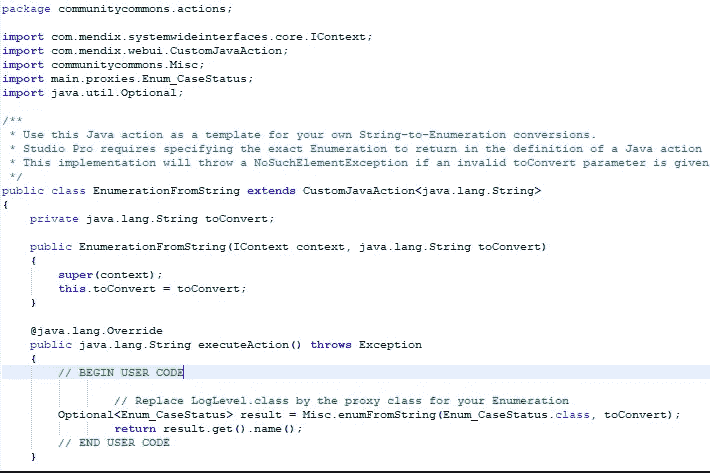

# 定制 Java 操作| Mendix

> 原文：<https://medium.com/mendix/customizing-java-actions-mendix-25ec5cc14f24?source=collection_archive---------1----------------------->

# 对于 Java 爱好者来说，在 Mendix 现有功能的基础上添加 Java 的能力就像蛋糕上的樱桃。另一方面，能够定制现有代码对于初学者或者像我这样不太熟悉 Java 的人来说确实是一件幸事！

[Community Commons 函数库](https://marketplace.mendix.com/link/component/170)模块为我们的应用程序提供了许多可重用的 Java 方法，可以从微流或其他自定义 Java 动作中调用这些方法。大多数是通用的，少数是特定的，但是我们可以根据自己的需要调整它们。从这里开始都是 Java，但是不要担心，我们已经得到它了！

## **用例**

我将通过我遇到的一个例子来引导您定制 java 动作。

当时的情况是根据另一个对象返回的“字符串”类型属性来设置“枚举”类型的 PrevStatus 属性的值。

Case File Entity and Enum used for PrevStatus

## **接近**

1.  其中一种方法是通过多个决策活动使用“If-Else ”,根据匹配的字符串分配枚举值。然而，有许多状态需要检查，这个解决方案并不令人满意，不足以继续完成所有困难的工作。

Left : Main microflow used to set Case to PrevStatus, Right : Submicroflow showing ‘If-Else’ approach to decide Prevstatus

2.因此，第二个想法出现了:更聪明地工作，寻找一个我们可以重用或改编的 java 动作。在 Community commons(从 Marketplace 下载)中有一个名为“EnumerationFromString”的动作。尽管我们使用此操作时遇到了问题，因为默认情况下，它被预先配置为返回/检查 LogLevel 的枚举(community commons 模块中的现有枚举)。虽然使用 action 感觉是正确的方法，但是我们决定根据我们想要的枚举类型调整 java 代码中的值。

[https://bit.ly/MXW21](https://bit.ly/MXW21)

## **那么，让我们开始摆弄 Java 吧**

这里看一下为设置 CaseFile 对象的 PrevStatus 而创建的微流。第一个活动返回用于 PrevStatus 的字符串值，接下来是名为“EnumerationFromString”的 Java 操作，其中从第一个活动返回的值作为参数传递，最后是设置 CaseFile 属性的 change 对象活动，其中 PrevStatus 的值被设置为从 Java 操作返回的枚举值。

The Java action takes a string as Parameter and returns Enum of type LogLevel

**第一步:**在 Mendix 中打开“EnumerationFromString”Java 动作，将返回类型改为你想要的枚举类型。

Adjusting return value from LogLevel to CaseStatus Enumeration

**步骤 2:** 导航到项目目录中该操作的 Java 文件。

Java action Path

**第三步:**打开 java 文件:大部分 java 文件都是在 [Eclipse](https://www.eclipse.org/downloads/) 中编辑、编译和调试的，但是如果你作为初学者不习惯，你可以在任何你习惯的文件编辑器中打开这个文件，如果有错误，它们会在运行应用程序时显示出来。(在本例中，文件是在[记事本++中打开的](https://notepad-plus-plus.org/))

下面是 Java 操作背后的代码:

Java File of “EnumerationFromString” Java action

在 java 文件中，只有写在**开始-结束代码块**和**导入**之间的代码可以被定制，因此将被执行，其他所有代码将在运行时被覆盖。

**步骤 4** :正如上图中 Begin Code 下的注释所提到的，我们可以用我们想要的枚举替换默认的 LogLevel。很酷，对吧？

要为我们的枚举配置它，我们只需要做一些调整:

a)在顶部的导入部分中，将"**community commons . proxy . log level**替换为"**main . proxy . enum _ case status**"(module folder . proxy . enum name)

通过导航到 javasource 文件夹中模块的文件夹路径，可以找到您的枚举，如下所示:

Path to Enumeration

b)下一步也是最后一步是用我们刚刚在上面添加的枚举名替换开始和结束代码之间所有出现的' **LogLevel**

Customized Java File of EnumerationFromString action

瞧啊。我们完了

保存文件并在 Studio Pro 中启动/运行应用程序，以确保代码编译并检查所需的结果。

## **洞察代码**

a)添加导入是为了让 Java 操作可以访问我们的枚举。

b)存在于开始和结束代码之间的结果变量存储从接受 2 个参数的函数“enumFromString”返回的结果:

*   枚举类(因为 Enum 是一个类，所以传递 EnumName.class)
*   以及需要转换的字符串。

该函数是在一个名为‘Misc’的现有 community commons java 文件中预定义的(这就是 community commons。杂项在顶部导入)。最后，枚举值的名称作为结果返回。

## **结论**

如果我们能试着更好地理解 Java，它会成为我们的朋友。玩笑归玩笑，我希望这能让你对如何在 Mendix 中定制 Java 动作有所了解。记住一些事情也有助于您在可行的情况下修改其他 java 动作，或者甚至通过从现有队列中提取一些队列来创建自己的动作。

一小步最终会让我们爬上高山，如果一个人和爪哇成为朋友，谁知道旅程会把我们带到哪里。

*注意:* *这是我如何处理特定场景的一个例子，可能有多种其他方式来实现这一点，但消费和定制 Java 动作对我来说是一种学习。*

## 阅读更多

 [## Mendix World 2021 |召集您的应用开发团队 2021 年 9 月 7 日至 9 日

### 好像你需要说服…在一个全球制造商社区，他们想通过探索什么来相互学习…

bit.ly](https://bit.ly/MXW21) 

*   [https://docs . mendix . com/app store/modules/community-commons-function-library](https://docs.mendix.com/appstore/modules/community-commons-function-library)
*   [https://docs.mendix.com/refguide/java-actions](https://docs.mendix.com/refguide/java-actions)
*   [https://docs.mendix.com/refguide/java-programming](https://docs.mendix.com/howto/logic-business-rules/extending-your-application-with-custom-java)

*来自发布者-*

*如果你喜欢这篇文章，你可以在我们的* [*媒体页面*](https://medium.com/mendix) *或者我们自己的* [*社区博客网站*](https://developers.mendix.com/community-blog/) *找到更多喜欢的。*

*希望入门的创客，可以注册一个* [*免费账号*](https://signup.mendix.com/link/signup/?source=direct) *，通过我们的* [*学苑*](https://academy.mendix.com/link/home) *获得即时学习。*

有兴趣更多地参与我们的社区吗？你可以加入我们的 [*Slack 社区频道*](https://join.slack.com/t/mendixcommunity/shared_invite/zt-hwhwkcxu-~59ywyjqHlUHXmrw5heqpQ) *或者想更多参与的人，看看加入我们的* [*遇见 ups*](https://developers.mendix.com/meetups/#meetupsNearYou) *。*