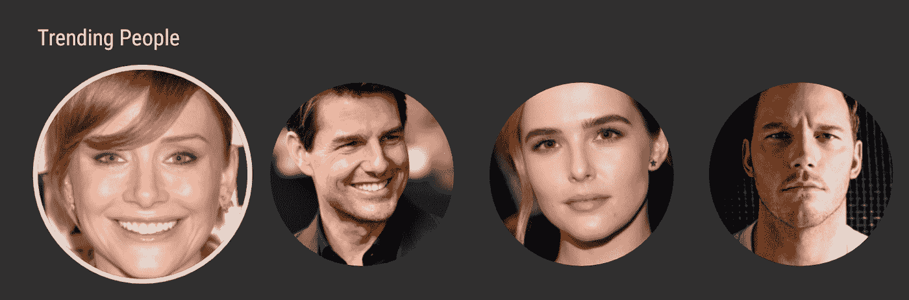

# 为 Android 电视定制靠背

> 原文：<https://medium.com/androiddevelopers/customizing-leanback-for-android-tv-3f8d4a0b2839?source=collection_archive---------7----------------------->

## 把圆木钉放在方孔里

leanback 库提供了一个模板化的用户界面，这样开发者就可以专注于应用的重要部分。

使用 leanback 时，内容按行显示。Leanback 提供了一个矩形卡片视图 [ImageCardView](https://developer.android.com/reference/kotlin/androidx/leanback/widget/ImageCardView) ，可以轻松显示内容。选择时，卡片大小会缩放，并有阴影来突出内容。这非常适合电影海报和专辑封面等内容。


Movie posters work great with the default leanback behavior

有时候，用其他方式而不是矩形来显示内容是一个更好的设计。比如展示一部电影的演员阵容的时候，最好用圆形的头像设计(圆形的 peg，懂吗？).这是一个非常常见的显示头像的设计。



Circular avatars are great for displaying people

在这篇文章中，我们将深入探讨如何自定义一个圆形的卡片视图，而不是默认的正方形，并配置投影和调光效果。

# 创建圆形图像

有许多方法可以将圆形边界应用于图像。如果使用 [Glide](https://github.com/bumptech/glide) ，这就和调用 *circleCropTransform()* 一样简单。

```
val requestOptions = RequestOptions
                    .circleCropTransform()Glide.with(context)
            .load(personImage)
            .apply(requestOptions)
            .into(vh.personImageView)
```

根据图书馆的不同，您的里程可能会有所不同。

# 禁用选定的阴影

即使图像是圆形的，leanback 也会添加与圆形图像不匹配的投影。我们需要定制后倾来禁用阴影。

[ListRowPresenter](https://developer.android.com/reference/kotlin/androidx/leanback/widget/ListRowPresenter) 选中时在每张卡片周围添加阴影。它还控制行的样式以及一行中卡片之间的交互。

您可以通过将 [shadowEnabled](https://developer.android.com/reference/kotlin/androidx/leanback/widget/ListRowPresenter#setShadowEnabled%28kotlin.Boolean%29) 标志设置为 false 来禁用阴影。这告诉 leanback 不要在选中的卡片周围添加阴影。

```
val customListRowPresenter = object : ListRowPresenter().apply {
    shadowEnabled = false
}
```

下图显示了所选卡片及其阴影:


当您将“shadowEnabled *`* 的值设置为 false 时，阴影消失:


但是，当行处于非活动状态时，仍然会有阴影。如下图所示，当图像为圆形时，阴影更加明显。接下来，我们将消除阴影。


# 活动和非活动行

默认情况下，当用户选择一行时，其他行是暗显的。此效果由 ListRowPresenter 控制。

ListRowPresenter 中有一个方法可以被覆盖以禁用该效果。扩展 presenter 并覆盖[isUsingDefaultListSelectEffect](https://developer.android.com/reference/kotlin/androidx/leanback/widget/ListRowPresenter#isUsingDefaultListSelectEffect%28%29)()以返回 false。

```
val customListRowPresenter = object : ListRowPresenter() {
    override fun isUsingDefaultListSelectEffect() = false
}
```

这将消除非活动行的阴影效果。


请小心。当您禁用非活动行的变暗时，很难确定选择了哪张卡。

# 把所有的放在一起

用几行代码定制 ListRowPresenter 可以消除阴影效应，并允许我们用向后倾斜组件构建自定义用户体验。

```
val customListRowPresenter = object : ListRowPresenter() {
        override fun isUsingDefaultListSelectEffect() = false
    }.apply {
        shadowEnabled = false
    }
```

# 向所选卡片添加边框

移除阴影后，您可以通过添加边框来使所选卡片更引人注目。很明显下图选择的是第三人。


如果您使用卡片的自定义视图，请在布局中添加边框。

```
<?xml version="1.0" encoding="utf-8"?>
<FrameLayout
    xmlns:android="[http://schemas.android.com/apk/res/android](http://schemas.android.com/apk/res/android)"
    android:layout_width="wrap_content"
    android:layout_height="wrap_content"
    android:padding="8dp"> <FrameLayout
        android:layout_width="wrap_content"
        android:layout_height="wrap_content"
        android:id="@+id/imageBackground"
        android:background="[@drawable/bg_avatar_border](http://twitter.com/drawable/bg_avatar_border)"
        android:padding="4dp"> <ImageView
            android:id="@+id/personImage"
            android:layout_width="[@dimen/card_avatar_width](http://twitter.com/dimen/card_avatar_width)"
            android:layout_height="[@dimen/card_avatar_width](http://twitter.com/dimen/card_avatar_width)"
            android:adjustViewBounds="true"
           />
    </FrameLayout>
</FrameLayout>
```

向图像视图周围的视图添加背景。背景应该是一个选择器，选择时设置背景，否则删除它。

```
<?xml version="1.0" encoding="utf-8"?>
<selector xmlns:android="[http://schemas.android.com/apk/res/android](http://schemas.android.com/apk/res/android)"><item android:state_selected="true"
        android:drawable="[@drawable/bg_avatar](http://twitter.com/drawable/bg_avatar)" />
    <item android:state_selected="false"
        android:drawable="[@android](http://twitter.com/android):color/transparent" /></selector>
```

在这个例子中，一个 oval drawable 资源被用作背景。

```
<?xml version="1.0" encoding="utf-8"?>
<shape xmlns:android="[http://schemas.android.com/apk/res/android](http://schemas.android.com/apk/res/android)"
    android:shape="oval"> <size android:width="[@dimen/card_avatar_border_width](http://twitter.com/dimen/card_avatar_border_width)"
        android:height="[@dimen/card_avatar_border_width](http://twitter.com/dimen/card_avatar_border_width)" /> <stroke android:color="[@color/lb_tv_white](http://twitter.com/color/lb_tv_white)"
        android:width="4dp" /></shape>
```

使用 Android Studio 中的视图层次工具或在开发者选项中启用**显示布局边界**，以更好地了解每张卡片周围的填充和边距如何影响它们之间的间距以及图像周围的边框。


# 你定制了什么？

Leanback 为 Android TV 构建模板化 ui 提供了很大的灵活性。在短短的五行代码中，我们能够定制 leanback 组件来支持圆形图像！这是如何定制 leanback 的一个例子。

您有哪些需要定制向后倾斜的使用案例？请留言或给我发推文( [@benjamintravels](https://twitter.com/benjamintravels) )继续讨论。