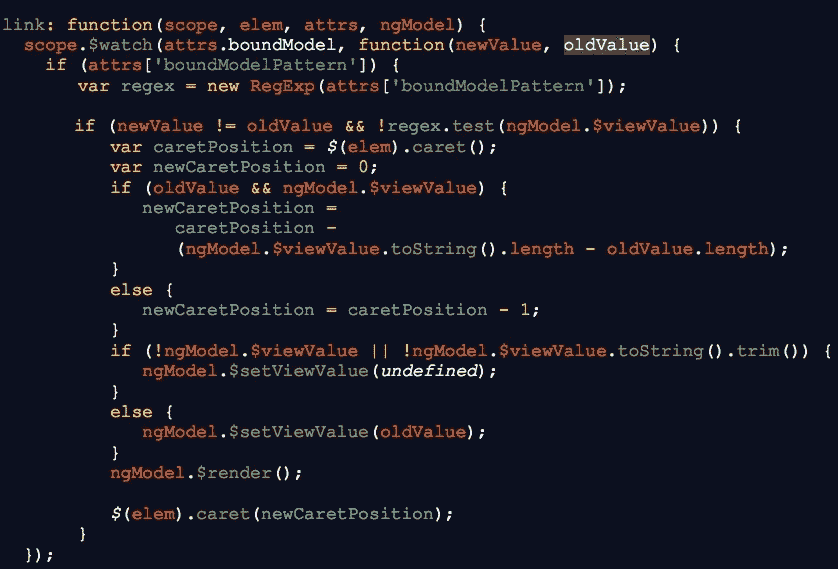

# 通过防止无效用户输入，将开发时间减半

> 原文：<https://medium.com/walmartglobaltech/cutting-dev-time-in-half-with-invalid-user-input-prevention-bea29ea315c?source=collection_archive---------5----------------------->

@realAdamHammond

在这篇文章中，Adam Hammond 描述了一种在开发过程中消除错误处理工作的新策略，以减少开发时间(根据他的经验，大约是一半)。

1981 年，计算机科学家 Jon Bentley 在卡耐基梅隆大学发表了一篇名为“[编写高效代码](http://repository.cmu.edu/cgi/viewcontent.cgi?article=3435&context=compsci)”的技术报告，他被认为创作了基于启发式的划分算法 k-d 树在书中，他估计多达 90%的程序代码是为内务处理或异常错误处理情况编写的，其中大部分是由糟糕的用户或计算机输入造成的。他的发现表明，只有 10%的代码是为名义案例编写的。这意味着，如果设计一种策略来减少与输入验证和错误处理相关的编程工作量，构建应用程序所涉及的总编程工作量将会大大减少。

本特利的论文在今天和 20 多年前一样重要。最近，我的任务是构建一个 AngularJS web 前端应用程序，它需要多个表单来向数据库添加记录。其中一些需要大量能够接受多方面输入(逗号分隔值、通配符等)的输入字段。)这很难证实。事实上，输入验证的工作量和复杂性是如此之大，以至于当我们最初向利益相关者推介该应用时，他们估计需要一年多的时间才能完成，并很快拒绝了它。这在很大程度上是由于实现传统输入验证系统所涉及的工作:要么 a)调用一个验证函数，如果输入错误，则显示一个错误指示/消息，要么 b)等到用户单击提交按钮，然后立即分析所有字段。

这些策略的明显问题是，为每个特定的输入字段编写验证函数、更改输入字段的样式以显示错误状态，以及设计向用户显示错误消息的 UI 元素都需要时间。因此，我决定尝试一些不同的、有点激进的方法，而不是使用这些传统的方法:*首先防止用户输入无效的输入。*

对于我的解决方案，我创建了两个相互包含的自定义 AngularJS 指令，附加到一个输入字段:bound-model 和 bound-model-pattern。bound-model-pattern 指令需要一个包含正则表达式的字符串，该表达式为该输入字段的有效输入定义了模式。bound-model 指令需要一个包含模型对象名称的字符串，该对象的值将根据 bound-model-pattern 正则表达式进行测试，以确定其有效性。我将所有的验证逻辑封装在绑定模型指令中，并使绑定模型指令要求绑定模型模式指令的存在。其工作方式是，我将 angular $watch(一种 AngularJS 方法，每当模型对象值改变时执行代码)应用于由 bound-model 指令定义的模型对象。在$watch 定义中，我根据绑定模型模式测试新值。如果新值通过了测试，我什么也不做——我们都很好；如果测试失败，那么我将绑定模型对象的值设置回旧值(更改前)。所有这些都发生在设置$viewValue 之前(即，在用户的输入实际呈现在屏幕上之前)，有效地防止用户在输入字段中输入任何会导致其值违反 bound-model-pattern 的内容。当用户从剪贴板粘贴输入时，该解决方案也能工作。我还使用了一个 jQuery 插件——caret . js——在用户输入无效数据时维护用户在输入字段中的插入符号位置(我遇到了一个问题，如果用户试图输入无效数据，在回滚输入字段的值后会导致输入字段失去焦点)。下面是我的自定义绑定模型指令定义的链接定义:

这种防止错误的方法不仅为常见问题提供了一个优雅的解决方案，还极大地减少了必要的开发工作量。我不必编写一行代码来解释无效的用户输入——我所要做的就是在 input 元素上添加一个自定义 AngularJS 指令，并为数据构造适当的 bound-model-pattern 正则表达式。这导致完成项目所需的总体工作量减少了 50%。我能够在几个月内独自完成最初估计需要整个团队一年多时间才能完成的工作。

最重要的是，该解决方案提供了出色的用户体验。用户知道他们完全不受意外打字错误的影响，意外打字错误会导致错误和工作流程中断。这让人放心。这也让他们更舒适地更深入地探索应用程序。他们不是通过试错来学习，而是通过尝试来学习应用程序。以前，用户应该已经知道每个字段的有效输入应该是什么。现在，他们所要做的就是尝试输入一个值，如果该值被字段接受，那么他们就知道它是有效的。

由于高达 90%的总编程工作致力于错误处理，显然需要一种策略来简化这种工作负载。上面概述的方法可能会减少一半以上的工作量。由于软件开发最昂贵的方面是支付程序员的工资，消除对错误处理的需求意味着将软件项目的总成本削减近一半。这还没有考虑到质量保证带来的额外好处:减少 45%的代码意味着减少 45%的测试。如今有如此多的软件项目延迟完成并超出预算，一个大幅减少错误处理所需工作量的策略对于未来项目的成功至关重要。