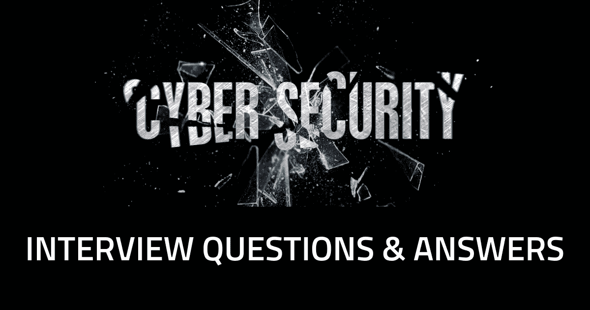

# 网络安全工作面试问题

> 原文：<https://medium.com/quick-code/cyber-security-job-interview-questions-f93455632ec8?source=collection_archive---------0----------------------->

与任何工作面试一样，网络安全职位的申请人需要就特定工作的职责和一般领域进行有见地的发言。信息安全工作面试问题可能围绕一个特定的任务，比如说，设计防火墙或在某些应用程序中保护信息。但是，根据角色及其涵盖范围，网络安全分析师面试问题可能需要展示关于各种技术和编程语言的广泛知识。鉴于网络安全职位涉及保护敏感的商业数据，你必须证明你是值得信赖的，可靠的，并拥有解决问题的技能，独创性，以及面对困难局面时的冷静。更多信息请访问 [**网络安全在线培训**](https://onlineitguru.com/cyber-security-training.html)

## 1.你为什么要找新的工作？

面试官问这个问题是想了解是什么促使了你职业生涯的改变。你想承担更多的责任吗？扩展你技能的机会？你觉得你已经超越了你原来的职位吗？你是在寻求更高的薪水和更少的出差吗？那么，为什么你应该得到更多的钱，你如何在一个中心位置更有效地工作？解释你找新工作的动机，表明你认为这个新职位对你和公司都是一个积极的改变。

## 2.你最大的优点和成就是什么？

抓住机会展示你是如何帮助你以前的公司的。您是否设计了防止违规的最新防火墙？你重新路由路由器了吗？有助于信息访问安全？你能很好地与人合作并表现出领导才能吗？谈谈你熟悉的技术类型，以及你在上一份工作中是如何产生积极影响的。解释你是如何与同事建立稳固的关系的，你们是如何在成功的项目上合作的，以及你打算如何在这家新公司做同样的事情。

## 3.你最大的缺点是什么？(相关:你是如何克服一个问题的？)

每个人都会犯错，没有人擅长所有的事情。你应该诚实地评估你可以改进什么，以及你计划如何在你的新角色中展示这种改进。挖掘你的过去:你可能监督了对一次违规或其他严重问题的回应。这可能不是你的错，但你处理的方式显示了你的专业精神和解决问题的能力。甚至可能是创新思维。表现出你愿意从错误中学习，即使这些错误不是你自己的，并且你能够处理危机。解释你是如何承担责任并逐步成为领导者的。

## 4.你如何设想你工作的头 90 天？

你的回答应该包括你打算如何与你的团队成员会面，以了解更多关于他们的信息，以及你们如何合作。你应该谈谈你将如何优先了解你的经理需要你做什么，以及所有利益相关者希望实现什么，同时与你的同事建立密切的关系。你应该问自己能做些什么来立刻产生影响。谈谈你打算如何学习，并尽快进入商界。通过 [**道德黑客培训**](https://onlineitguru.com/ethical-hacking-course.html) 将您的职业生涯推向新的成功高度

## 5.威胁、漏洞和风险之间有什么区别？

回答这个问题需要对网络安全有深刻的理解，任何在这个领域工作的人都应该能够给出有力的回答。你应该会想到接下来会有一个问题，问你更关注这三者中的哪一个。一个简单的说法是:威胁来自于针对组织中的漏洞(或弱点)的人，由于该漏洞没有被正确地识别为风险，所以没有得到缓解或处理。

## 6.您如何着手保护服务器？

您可能希望将这个答案分成几个步骤，尤其是当它涉及到特定类型的服务器时。你的回答将让我们一窥你的决策能力和思维过程。有多种方法可以回答这个问题，就像有多种方法可以保护服务器一样。您可能会引用不信任任何人的概念或最小特权原则。让你的专业知识来引导你对这个问题和接下来的其他问题的回答。

## 7.为什么 DNS 监控很重要？

有些人认为这是不必要的，否则的话，表明有弱点的域名服务。其他人说 DNS 监控是谨慎的，因为 DNS 查询是来自网络的数据渗透向量，允许任何主机通过端口 53 与互联网通信。在[**网络安全培训**](https://onlineitguru.com/cyber-security-training.html) 了解更多信息

## 8.ping 通过哪个端口工作？

小心这个。Ping 是类似 IP 的第三层协议；端口是第 4 层协议 TCP 和 UDP 的一个元素。

## 9.编码、加密和哈希之间有什么区别？

这个问题应该会激发一个关于加密的简短对话，这给了你解释你的加密知识的机会。

## 10.什么是 SSL？

SSL 是一种标准的安全技术，用于在服务器和客户端(通常是 web 服务器和 web 浏览器)之间创建加密链接。

## 11.HTTPS、SSL 和 TLS 之间有什么区别？

HTTPS 是超文本传输协议，保护网络通信的安全。TLS 是传输层安全协议，是 SSL 的后续协议。您必须证明您知道这三者之间的区别，以及如何使用网络相关协议来理解其中包含的内在风险。

## 12.您会寻找哪种异常来识别受损系统？

有多种方法可以回答这个问题，但同样，你需要展示你的专业知识和独创性。一个可能的答案是画出一个基本的网络架构，用它的 IPS/IDS、防火墙和其他安全技术来描述流量类型和其他危害迹象。

## 13.如果您必须在传输过程中压缩和加密数据，您会先做哪一项？

先压缩再加密，因为先加密可能很难看出压缩有多大效果。

## 14.您将如何加强用户身份验证？

无论你如何回答，都要提到双因素认证或不可否认性，以及你将如何实现它。

更多面试问题请查看 [**网络安全课程**](https://onlineitguru.com/cyber-security-training.html)