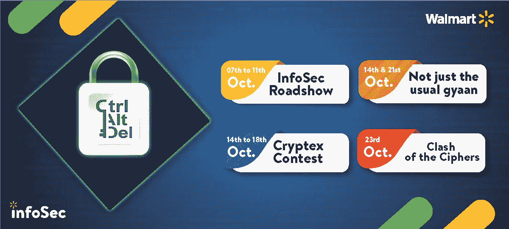
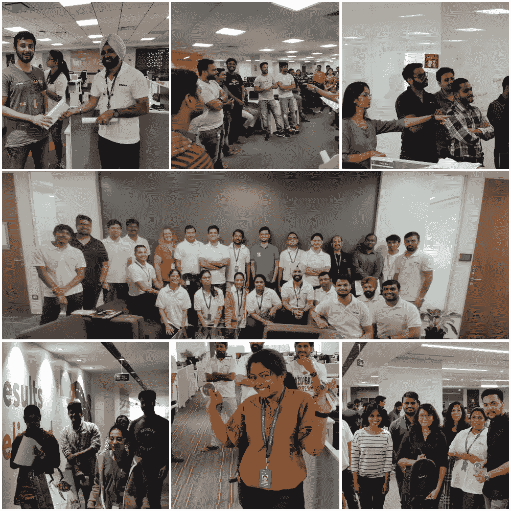
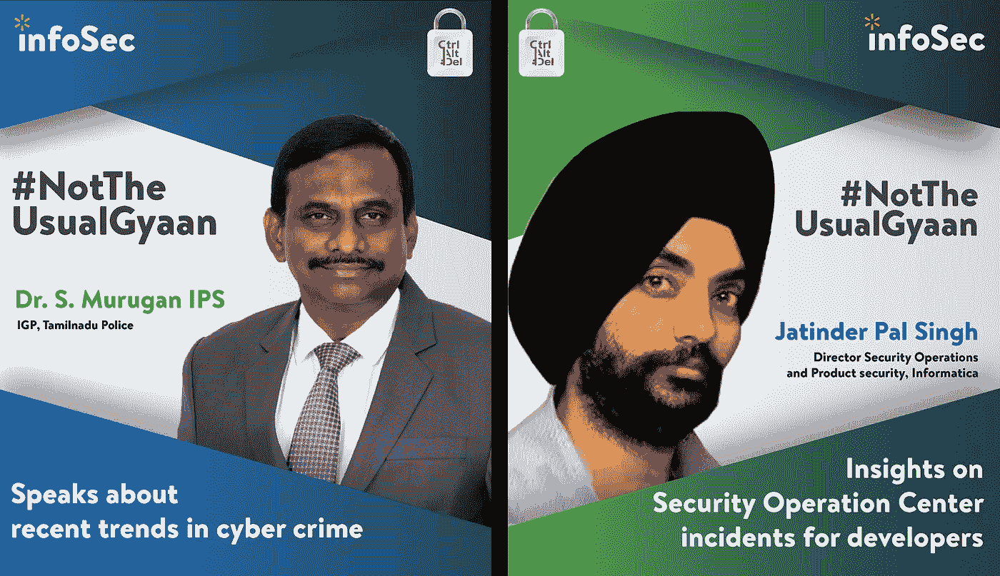
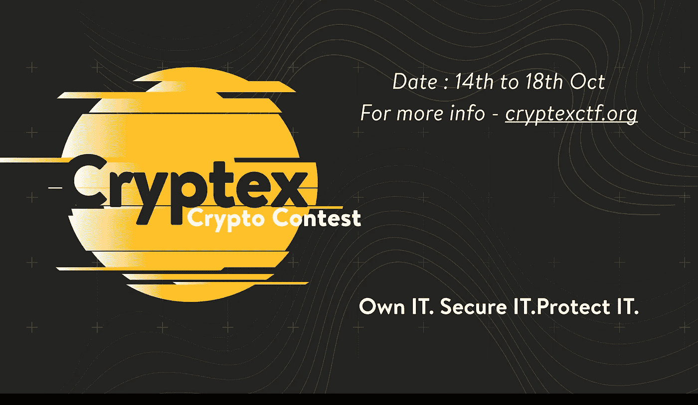
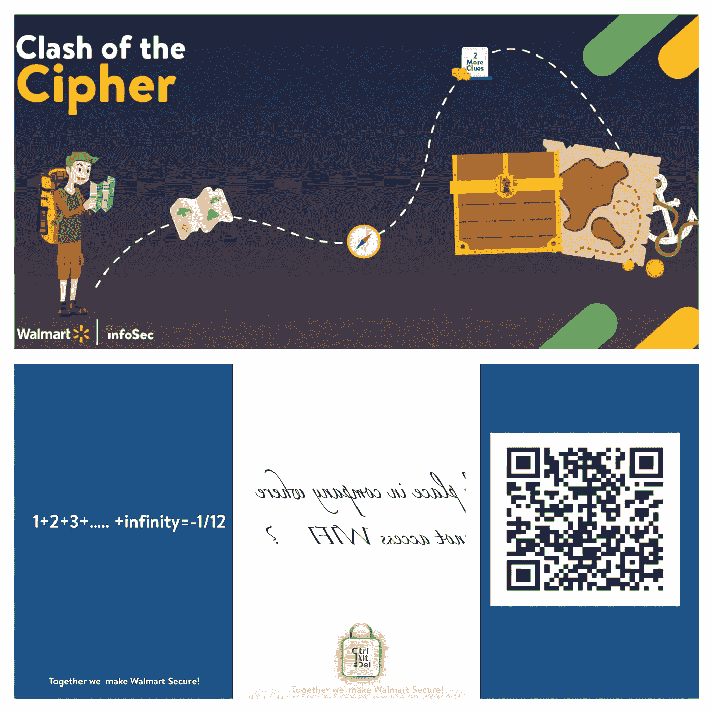

# 印度沃尔玛实验室 2019 年网络安全意识之旅

> 原文：<https://medium.com/walmartglobaltech/cybersecurity-awareness-journey-2019-at-walmart-labs-india-7cd5e7855b97?source=collection_archive---------5----------------------->

Picture Credit — pixabay.com

最近的研究表明，首席信息官们将相当一部分预算用于改善技术控制以缓解网络问题。然而，必须承认，最昂贵的控制措施是不够的。虽然安全研究人员和网络专家担心 Meltdown 和 Spectre 等新威胁，但员工无知的长期问题仍然存在。安全部门花费了大量的时间和精力试图遏制不安全的员工行为，但问题依然存在，攻击者也变得越来越先进。

在沃尔玛实验室，我们一直倡导符合公司目标、政策和标准的安全意识举措。我们通过每周宣传电子邮件、安全会议和活动、夺旗比赛、有趣的加密游戏和最先进的网络钓鱼计划来引领我们的宣传活动。

## 基于角色的意识举措

一种尺寸不适合所有人。在一个由应用程序开发人员、架构师、人力资源、财务和联合支持服务组成的异构组织中，我们计划将安全意识培训完善为基于角色的模式，根据员工处理的工作职能提供培训。作为第一步，我们已经确定开发人员职务系列员工必须接受关于 OWASP 十大漏洞的年度培训计划。尽管每个项目中使用的技术栈都是独一无二的，但这种语言无关的在线培训允许开发人员识别他们编写的代码的安全分支。从长远来看，加强对如何开发安全应用程序的关键理解有利于他们的职业道路和组织的安全立场。意识团队还在为处理高度敏感的 PII(个人身份信息)和 PCI(支付卡行业)数据的财务和人力资源团队设计策划培训计划。

## 从重复发生的事件中吸取教训

安全意识团队根据事件管理团队触发的实时事件定制了沟通内容。举例来说，这就是我们如何在组织中建立密码意识的。曾经发生过员工无意中在消息应用程序中共享私钥细节，而服务帐户密码以明文形式在公司内部网中共享的事件。在通过电子邮件和海报讨论密码安全时，我们不仅仅给出了使用长而强的密码的常规建议。我们向同事解释了如何使用基于加密的工具安全地共享敏感令牌。我们提供了关于使用哈希和 salt 安全存储密码的培训。此外，培训课程还介绍了如何使用 HttpOnly 和 HTTP 响应头中的安全标志来保护 web 服务器和浏览器之间交换的 HTTP cookies。

## 信息安全的人性一面

众所周知，安全团队是应用程序团队生产部署的拦路虎。为了改变这种看法，InfoSec 每月举行一次安全风险合规流程的公开会议，员工可以在会上与我们的风险分析师互动，并立即澄清他们的疑问。我们确保所有应用程序团队都了解安全审查，并且在他们开始 SDLC 流程时，InfoSec 团队始终可以主动提供安全咨询。我们开展了两次宣传活动，六月份的人类防火墙活动和十月份的 CtrlAltDel 活动，旨在重申安全的重要性，并保证通过交互式调查和测验来培养员工的参与度。

## 先睹为快我们的安全意识活动:CtrlAltDel 2019

CtrlAltDel Timeline

10 月，InfoSec 团队带着网络安全意识活动 CtrlAltDel 回来了，主题是“拥有它”。保护好它。保护它。

**活动的准备工作:**为了布置背景，我们与内部沟通团队合作，设计了带有网络信息的定制挂件和帐篷卡，并将其放置在所有隔间和地板上。员工和供应商被告知如何了解沃尔玛的政策和标准，以及这些政策和标准在保护我们的资产方面的重要性。他们得到了关于如何报告违规行为的便捷信息，以及在沃尔玛笔记本电脑或任何公司资产被盗或意外丢失的情况下可以联系的联系电话。

Tent Cards and Danglers

**路演:**我们以路演开始了我们的活动。InfoSec 员工参观了位于 Bengaluru 和 Gurgaon 的所有工厂，并提前了解了 CtrlAltDel 日历。这是一个非常互动和信息丰富的会议，为期五天，与印度各地的同事分享了网络问答和简短的安全提示。更有趣的是,“信息安全”的产品在我们办公室大受欢迎。

Roadshow

**外部演讲环节:**Informatica 产品安全总监 Jatinder Pal Singh 讨论了“安全运营中心的现状”。Jatin 指出，随着我们软件产品内外接触点数量的不断增加，网络风险已经增加到一个程度，采取预防性方法来保护产品/数据安全已经不够了。在这种情况下，违规只是“何时”的问题，他讨论了他在检测和应对软件产品网络攻击方面的经验。

10 月 21 日，S. Murugan IPS 博士谈到了网络犯罪的最新趋势，并分享了他的执法经验。他给出了保持在线安全的提示，简要介绍了暗网问题和社交媒体卫生清单。

Speaker Sessions

**Cryptex 竞赛:** InfoSec 团队发起了一项 CTF，向网络爱好者提出了三个关于密码学和网络安全的名人堂问题，历时五天。这三个名人堂问题如此命名是因为它们是几个月前进行的另一项 CTF 的一部分。CTF 有大约 20 个问题，除了这三个，其余都没有解决。因此，我们决定再次提出这些问题，作为员工在安全意识月中需要解决的挑战。令我们高兴的是，我们收到了这三个问题中的两个问题的正确解决方案，这些解决方案揭示了我们的同事中存在的惊人的加密相关人才。

Cryptex Contest

我们以一场网络寻宝活动结束了我们的活动日程，在本加卢鲁的所有办公室里上演了“密码冲突”。比赛的获胜者将获得奖励，包括奖品和糖果，以及在公司社交媒体平台上的公开承认。

Clash of the Cipher — Treasure hunt clues

CtrlAltDel 宣传活动确保员工能够充当防火墙，随时向安全团队寻求澄清。在沃尔玛实验室，我们相信安全是每个人的责任。我们希望明年继续我们的安全意识之旅，提出更好的想法，将网络安全无缝集成到我们的个人和职业文化中。