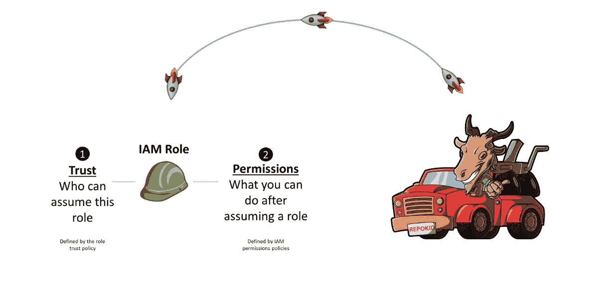

# 基于产品驱动型组织的网络安全云管理

> 原文：<https://medium.com/globant/cybersecurity-cloud-management-on-product-driven-organisation-d48ff0eba26a?source=collection_archive---------0----------------------->

## 分布式高速开发的最低特权

假设您加入了一家云原生公司，采用超过 500 个 EC2 的区域方法、多客户方法，许多开发团队创建应用程序，每天进行部署，停下来“清理和组织”不是一个选项。您的任务是在不丧失灵活性的情况下实现基础设施的安全性。

从我的角度来看，你必须选择:

1.  惊慌而逃，
2.  把手弄脏，开始想办法提高安全性

## 产品驱动和开发团队文化中的云安全方法

目前(2020 年)，我们正面临着一个时变阶段，即交付 IT 服务从传统方法转向敏捷方法。这种变化对组织安全方法提出了挑战，组织安全方法需要从“先拒绝后允许”或保护边界转变为保护整个 it IT 流程，同时不影响 WIP 并更快地交付产品。

因此，在这个时候，从限制性方法转向协作性方法是必须的。因此，像持续法规遵从性和持续安全性这样方法在这个时代越来越受关注。

从云原生公司和云基础架构的角度考虑，建议应用最小特权…但是根据前面的场景，如何做到这一点呢？

## 最低特权+高速开发

为了连接两个世界，如果你同意我的观点，我会分享一个可能的解决方案，非常酷，来自网飞，叫做: **Repokid** 和 **Aardvark**

Aardvark

## 这些是如何工作的？

对 Aardvark 来说，基本上他所有解决方案的核心是 AWS Access advisor。对于那些不知道 Access Advisor 的人，请看下图:

访问顾问是 IAM 产品的一部分，只能通过控制台访问，因此 Aardvark 是一个高效的访问顾问，它按照算法检查和记录角色。

## 在后台

## 90 天后未使用的角色或策略会发生什么情况？

答案是 Repokid 会处理未使用的角色。

## **总之:**

如果你所在的公司正处于初创阶段，交付产品对公司的发展至关重要，那么你将需要创建能够应对这种组织速度的基础设施和安全解决方案，因为我们都知道，如今“增加更多力量”并不总是最好的解决方案。因此，自动化和打造弹性基础设施才是正确的道路。

有了这些强大的工具，您可以用附加了 98%的策略的一些角色开始您的操作。您只需要删除与您的安全策略和审计相关的功能，例如:删除“停止 Cloudtrail”、“访问 IAM 和处理密钥”等功能。

使用这种方法，任何开发人员都可以开始创建他的项目，创建 EC2，Buckets，而不用担心许可问题，同时 Aardvark 和 Repokid 正在运行并收集关于所用角色和策略的信息。最后，在 90D 之后，工具开始移除未使用的角色。

使用这种方法，你将使用“持续安全”的概念，这是一个非常酷的实践。

## 你能在哪里找到它

[https://github.com/Netflix/repokid](https://github.com/Netflix/repokid)

## 附加说明

这是一个有趣的视频，来自加州 2019 年的 AppSec，其中介绍了 Repokid，并设置了理解它的基本原理。

希望这有所帮助！

帕布鲁棕色