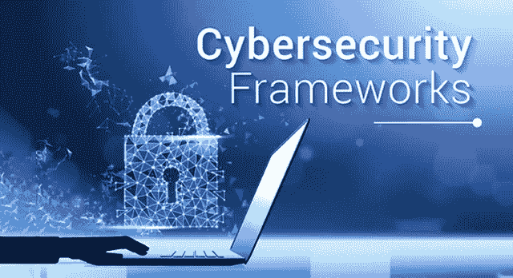
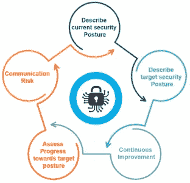
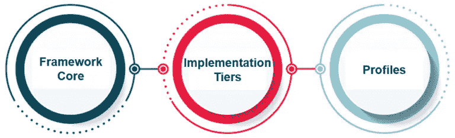
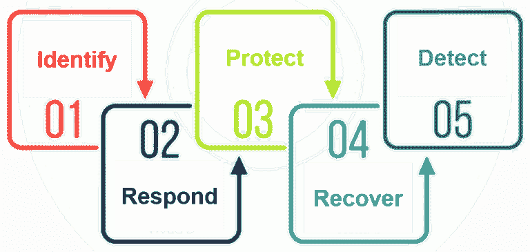
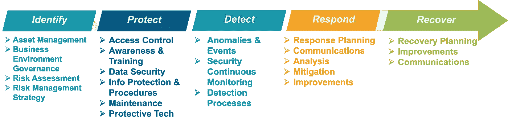
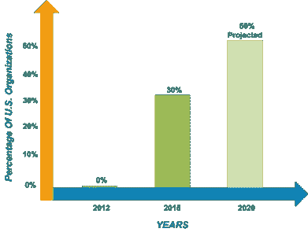
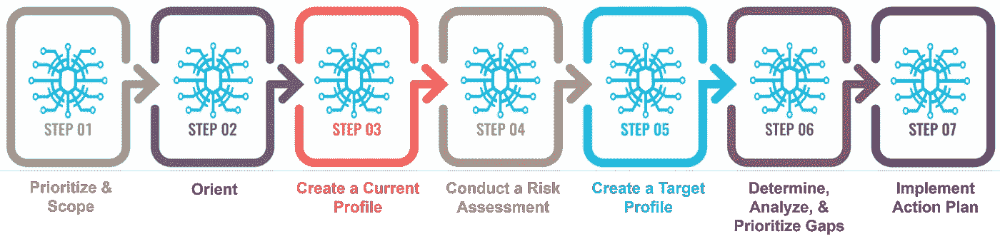
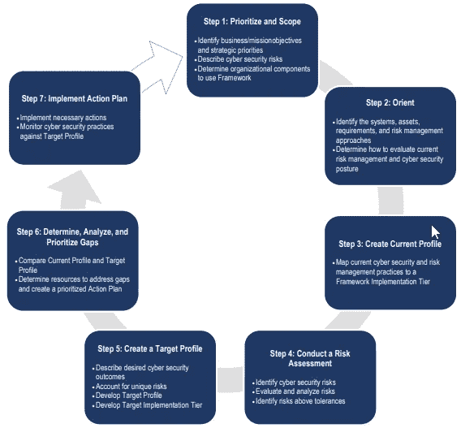

# 网络安全框架 101 —网络安全框架综合指南

> 原文：<https://medium.com/edureka/cybersecurity-framework-89bbab5aaf17?source=collection_archive---------5----------------------->

Cybersecurity Frameworks — Edureka

数据是最有价值的资产，这就是数据安全成为国际议程的原因。数据泄露和安全故障会给世界经济带来风险。意识到国家和经济安全的需要，美国总统发布了一项 [*行政命令*](https://obamawhitehouse.archives.gov/the-press-office/2013/02/12/executive-order-improving-critical-infrastructure-cybersecurity) 以制定一个 ***网络安全*** 框架来帮助降低网络风险。深入研究提要，以了解有关该框架的更多信息。

以下是我在本文中介绍的内容:

*   为什么是网络安全框架？
*   什么是网络安全框架？
*   网络安全框架的类型
*   框架的组件
*   网络安全框架的五大功能
*   使用网络安全框架
*   实施网络安全框架的步骤

我希望这能引起你的注意。先说第一个话题。

# 为什么是网络安全框架？

实施该框架是有效的，因为:

*   它导致从遵守到行动和具体成果的转变
*   它有内置的成熟度模型和差距分析，因此您不需要在 CSF 之上添加额外的成熟度模型
*   它给你一个衡量你在哪里和你需要去哪里的标准
*   它可以分阶段或分等级实施，这使得它对业务更有吸引力

# 什么是网络安全框架？

> 该框架是基于现有准则和实践的自愿指导，旨在帮助组织更好地管理和降低网络安全风险。

通过企业和政府之间的协调努力制定的意向框架由措施、规则和实践组成，以展示必要基础的安全性。该框架的*有组织、适应性强、可重复且有效的*方法有助于 critical foundation 的房屋所有者和管理员监督与网络安全相关的危害。

# 网络安全框架的目标

除了帮助协会监督和减少可能的风险，它还旨在培养内部和外部权威合作伙伴之间的风险和网络安全管理沟通。

# 网络安全框架的类型

最常采用的框架是:

## **PCI DSS(支付卡行业数据安全标准)**:

这是保护支付账户安全所需实施的一套安全控制措施。它旨在保护信用卡、借记卡和现金卡交易

## **ISO 27001/27002(国际标准化组织)**:

信息安全管理和信息安全计划要素的最佳实践建议。

## **CIS 关键安全控制**:

网络保护活动的规定安排，提供特别和值得注意的方法来阻止当前最不可避免和最危险的攻击。控制的一个关键优势是，它们组织和集中较少的高产出的活动

## **NIST 框架**:

改善关键基础设施网络安全的框架，目标是通过利用标准方法和流程，提高本组织管理网络安全风险的准备程度

# 网络安全框架的组成部分

有三个关键组件:

## **框架核心:**

它使用普通的可理解语言给出了所需的网络安全练习和结果的安排。该核心指导协会监督和减少其网络安全机会，以补充协会当前的网络安全和风险管理流程。

## **实施层级:**

它通过设置协会如何看待网络安全风险管理来帮助协会。这些层级管理协会，以考虑其网络安全计划的适当彻底程度，并定期用作谈论危险饥饿、任务需求和支出计划的专门工具。

## **简介:**

概要文件是一个协会对他们的组织先决条件和目标的新颖安排，以及对框架核心的令人垂涎的结果的资产。档案主要用于识别和组织门户，以增强协会的网络安全。

# 网络安全框架的五大功能

函数是框架中包含的最大的审议量。它们是框架核心的基础，其他每个组件都是围绕着框架核心分类的。该框架包括的五项职能是:

1.  **识别:**识别功能有助于在监督网络安全方面建立对框架、个人、资源、信息和能力的层次理解。
2.  **保护:**保护功能图适当屏蔽，保证基础管理的传递。保护功能加强了限制或遏制潜在网络安全事件影响的能力。
3.  **检测:**检测功能表征了识别网络安全场合事件的拟合练习。检测功能能够适时揭示网络安全情况。
4.  **响应:**响应功能结合了适当的活动，以针对显著的网络安全事件采取行动。响应功能增强了控制潜在网络安全事件影响的能力。
5.  **恢复:**恢复功能区分适当的练习，以保持计划的多样性，并重建因网络安全事件而受阻的任何能力或管理。

## **各功能的需求类别**

好了，已经讨论了框架的功能和组件，让我们看看这些框架是如何使用的。

# 使用网络安全框架

使用该框架可以改善组织的关键基础设施。该框架可以分阶段实施，因此可以定制以满足任何组织的需求。该框架旨在补充而非取代协会的网络安全计划和风险管理表格。

# 谁应该使用框架？

网络安全框架适用于各种规模、部门和发展的协会。该框架被设计成具有极强的适应性。通过内置的定制选项，该框架可以被修改以供任何组织使用。

一个拥有较低网络安全支出计划的小型协会，或者一个拥有较大支出计划的大型企业，都准备好以一种对他们来说可以实现的方式来接近结果。正是这种适应性使得该框架能够被刚刚开始建立网络安全计划的协会所利用，同时还为开发计划的协会提供了一些激励。

# 组织如何使用该框架？

在最近几年的过程中，NIST 一直在观察该网络如何利用该框架。这些是我们看到发展的一些常规例子:

*   权威人士已经掌握了该框架的词汇，可以就网络安全机会展开有教育意义的讨论
*   协会已经利用这些等级来决定危险管理的理想等级
*   协会正在寻找一种方法，使简介在很大程度上有助于理解他们商业环境中当前的网络安全问题
*   档案和执行设计正被用于组织和规划网络安全变革演习

# 实施网络安全框架的步骤

网络安全框架定义了建立网络安全计划的 7 个步骤:

## **组织使用网络安全框架的示例**

核部门网络安全框架的实施:

美国的原子反应堆在合作创建和执行数字安全原则、设备和程序方面有着良好的声誉，这些原则、设备和程序保证了健康、安全和稳定的质量。

## 框架实施的好处:

该框架旨在具有足够的适应性，可供开发数字安全和风险管理程序的协会以及创建较少的程序的协会使用。

通常，实施该框架为协会提供了一个工具，以:

*   评估并特别描述其当前和重点关注的数字安全问题
*   确定其当前项目、程序和劳动力中的差距
*   利用持久和可重复的过程，识别和组织开发的门户
*   评估实现其目标数字安全法案的进展
*   展示协会对框架中被广泛接受的程序的安排
*   强调任何可能优于框架规定实践的当前实践
*   用典型的、可感知的方言向内部和外部合作伙伴传达其数字安全法案，包括客户、控制者、金融专家和方法制作者

以下是如何使用网络安全框架来展示美国核电厂的网络安全实践如何与该框架保持一致。

这就把我们带到了关于网络安全框架的文章的结尾。我希望这篇文章对你有所帮助，并增加了你的知识价值。

如果你想查看更多关于人工智能、DevOps、道德黑客等市场最热门技术的文章，那么你可以参考 [Edureka 的官方网站。](https://www.edureka.co/blog/?utm_source=medium&utm_medium=content-link&utm_campaign=cybersecurity-framework)

请留意本系列中的其他文章，它们将解释各种

> 1.[什么是密码学？](/edureka/what-is-cryptography-c94dae2d5974)
> 
> 2.[什么是网络安全？](/edureka/what-is-cybersecurity-778feb0da72)
> 
> 3.[隐写术教程](/edureka/steganography-tutorial-1a3c5214a00f)
> 
> 4.[什么是网络安全？](/edureka/what-is-network-security-1f659407dcc)
> 
> 5.[什么是计算机安全？](/edureka/what-is-computer-security-c8eb1b38de5)
> 
> 6.[什么是应用安全？](/edureka/application-security-tutorial-e6a0dda25f5c)
> 
> 7.[渗透测试](/edureka/what-is-penetration-testing-f91668e2291a)
> 
> 8.[道德黑客教程](/edureka/ethical-hacking-tutorial-1081f4aacc53)
> 
> 9.关于 Kali Linux 你需要知道的一切
> 
> 10.[使用 Python 的道德黑客](/edureka/ethical-hacking-using-python-c489dfe77340)
> 
> 11. [DDOS 攻击](/edureka/what-is-ddos-attack-9b73bd7b9ba1)
> 
> 12.[使用 Python 的 MAC changer](/edureka/macchanger-with-python-ethical-hacking-7551f12da315)
> 
> 13 [ARP 欺骗](/edureka/python-arp-spoofer-for-ethical-hacking-58b0bbd81272)
> 
> 14. [Proxychains，Anonsurf & MacChange](/edureka/proxychains-anonsurf-macchanger-ethical-hacking-53fe663b734)
> 
> 15.[足迹](/edureka/footprinting-in-ethical-hacking-6bea07de4362)
> 
> 16.[50 大网络安全面试问答](/edureka/cybersecurity-interview-questions-233fbdb928d3)

*原载于 2018 年 6 月 28 日*[*www.edureka.co*](https://www.edureka.co/blog/cybersecurity-framework/)*。*