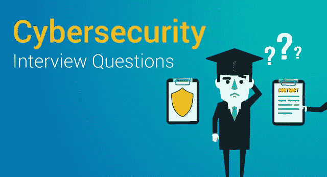
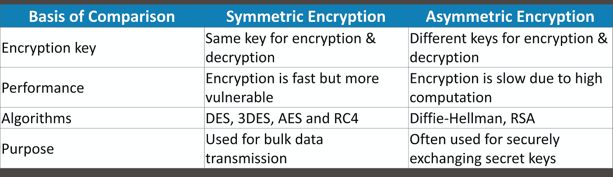
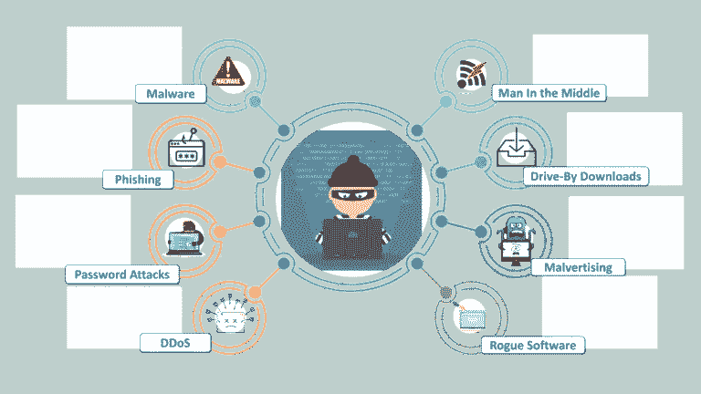
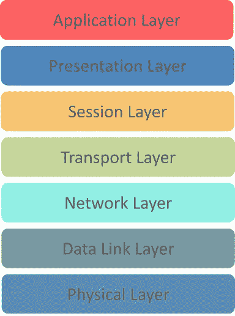
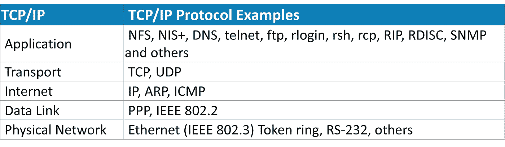
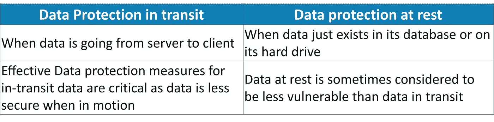
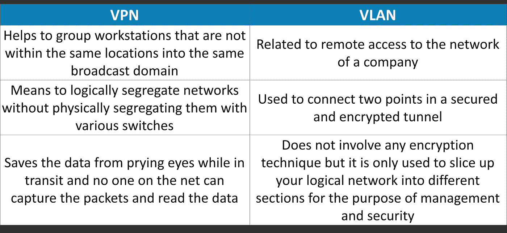

# 50 大网络安全面试问答

> 原文：<https://medium.com/edureka/cybersecurity-interview-questions-233fbdb928d3?source=collection_archive---------1----------------------->

网络安全工作已经成为当今 IT 行业最受欢迎的工作之一。有需求，也有竞争，要想获得网络安全方面的工作，你需要成为其中的佼佼者。虽然掌握必要的网络安全技能是成功的一半，但破解面试则完全是另一回事。为了帮助你通过面试，我们整理了这个顶级网络安全面试问题和答案列表。

本文分为两部分:

**A 部分-理论问题**和**B 部分-基于情景的问题**。我们开始吧！

# A 部分-理论问题

## 1.什么是密码学？

密码术是对保护信息和通信的技术的实践和研究，主要是为了保护数据不被第三方使用。

## 2.对称加密和非对称加密有什么区别？

## 3.IDS 和 IPS 有什么区别？

**IDS** 是**入侵检测系统**，它只检测入侵，管理员必须注意防止入侵。然而，在 **IPS** 即**入侵防御系统**中，系统检测到入侵并采取措施防止入侵。

## 4.解释中情局三合会。

**CIA** 代表**机密性、完整性、**和**可用性。CIA** 是一个旨在指导信息安全政策的模型。这是组织最常用的模型之一。

***保密***

这些信息应该只有授权人员才能访问和阅读。未经授权的人员不应接触到它。应该对信息进行高度加密，以防有人利用黑客手段访问数据，这样即使数据被访问，也是不可读或不可理解的。

***诚信***

确保数据没有被未授权的实体修改。完整性确保数据不会被未授权人员破坏或修改。如果授权的个人/系统试图修改数据，并且修改不成功，那么数据应该被恢复，并且不应该被破坏。

***可用性***

只要用户需要，数据就应该对用户可用。硬件维护、定期升级、数据备份和恢复、网络瓶颈等都应该得到重视。

## 5.加密与哈希有何不同？

加密和哈希都用于将可读数据转换为不可读格式。不同之处在于，加密数据可以通过解密过程转换回原始数据，而哈希数据不能转换回原始数据。

## 6.什么是防火墙，为什么使用防火墙？

防火墙是设置在系统/网络边界上的网络安全系统，用于监控和控制网络流量。防火墙主要用于保护系统/网络免受病毒、蠕虫、恶意软件等的侵害。防火墙还可以防止远程访问和内容过滤。

## 7.VA(漏洞评估)和 PT(渗透测试)有什么区别？

**漏洞评估**是在目标上寻找漏洞的过程。在这里，组织知道他们的系统/网络有缺陷或弱点，希望找到这些缺陷，并优先修复这些缺陷。

**渗透测试**是在目标上寻找漏洞的过程。在这种情况下，组织可能已经设置了他们能想到的所有安全措施，并且想要测试他们的系统/网络是否有任何其他方式可以被黑客攻击。

## 8.什么是三次握手？

三次握手是一种在 **TCP/IP** 网络中使用的方法，用于在主机和客户端之间建立连接。它被称为**三次握手**，因为它是客户端和服务器交换数据包的三步方法。这三个步骤如下:

1.  客户端向服务器发送一个 SYN(Synchronize)数据包，检查服务器是否启动或有开放的端口
2.  如果客户端有开放的端口，服务器会向客户端发送 SYN-ACK 数据包
3.  客户端对此进行确认，并将 ACK(确认)数据包发送回服务器

## 9.可以从 Web 应用程序接收到的响应代码是什么？

-> **1xx** —信息响应
- > **2xx** —成功
- > **3xx** —重定向
- > **4xx** —客户端错误
- > **5xx** —服务器端错误

## 10.什么是 traceroute？为什么用？

Traceroute 是一个显示数据包路径的工具。它列出了数据包经过的所有点(主要是路由器)。这主要在数据包没有到达目的地时使用。Traceroute 用于检查连接停止或中断的位置，以确定故障点。

## 11.HIDS 和 NIDS 有什么不同？

**【HIDS(主机入侵检测系统)**和 **NIDS(网络入侵检测系统)**都是入侵检测系统，工作目的相同，即检测入侵。唯一的区别是 **HIDS** 是在特定的主机/设备上设置的。它监控特定设备的流量和可疑的系统活动。另一方面， **NIDS** 建立在网络上。它监控网络中所有设备的流量。

## 12.设置防火墙的步骤是什么？

以下是设置防火墙的步骤:

1.  *用户名/密码:*修改防火墙设备的默认密码
2.  *远程管理:*禁用远程管理功能
3.  *端口转发:*为某些应用程序配置适当的端口转发以正常工作，例如 web 服务器或 FTP 服务器
4.  *DHCP 服务器:*在具有现有 DHCP 服务器的网络上安装防火墙会导致冲突，除非防火墙的 DHCP 被禁用
5.  *日志记录:*要排除防火墙问题或潜在攻击，请确保日志记录已启用，并了解如何查看日志
6.  *策略:*您应该有可靠的安全策略，并确保防火墙被配置为执行这些策略。

## 13.解释 SSL 加密

**SSL(安全套接字层)**是在 Web 服务器和浏览器之间创建加密连接的行业标准安全技术。这用于维护数据隐私和保护在线交易中的信息。建立 SSL 连接的步骤如下:

1.  浏览器试图连接到受 SSL 保护的 web 服务器
2.  浏览器向浏览器发送其 SSL 证书的副本
3.  浏览器检查 SSL 证书是否可信。如果可信，则浏览器向 web 服务器发送消息，请求建立加密连接
4.  web 服务器发送确认以启动 SSL 加密连接
5.  SSL 加密通信发生在浏览器和 web 服务器之间

## 14.您将采取什么步骤来保护服务器？

安全服务器使用安全套接字层(SSL)协议进行数据加密和解密，以保护数据免受未经授权的拦截。

以下是保护服务器的四种简单方法:

第一步:确保你的根用户和管理员用户有一个安全的密码

第二步:接下来你需要做的是在你的系统上创建新用户。这些将是您用来管理系统的用户

**步骤 3:** 从默认 root/管理员帐户中删除远程访问

第 4 步:下一步是为远程访问配置防火墙规则

## 15.解释数据泄漏

数据泄漏是指有意或无意地将数据从组织内部传输到外部未经授权的目的地。它是向未经授权的实体披露机密信息。根据发生的方式，数据泄漏可以分为 3 类:

1.  **意外泄露**:一个实体由于错误或疏忽无意地将数据发送给未授权的人
2.  **故意破坏**:授权实体故意向未授权实体发送数据
3.  **系统黑客**:黑客技术被用来造成数据泄露

可以通过使用被称为 **DLP(数据泄漏预防)**工具的工具、软件和策略来防止数据泄漏。

## 16.有哪些常见的网络攻击？

以下是一些常见的网络攻击，可能会对您的系统产生负面影响。

## 17.什么是暴力攻击？你如何能预防它？

蛮力是一种通过重复尝试所有可能凭证的排列和组合来找出正确凭证的方法。在大多数情况下，暴力攻击是自动进行的，工具/软件会自动尝试使用凭据列表登录。有多种方法可以防止暴力攻击。其中一些是:

*   **密码长度**:您可以设置密码的最小长度。密码越长，越难找到。
*   **密码复杂性**:密码中包含不同格式的字符使得暴力攻击更加困难。使用字母数字密码以及特殊字符、大写和小写字符会增加密码的复杂性，使其难以被破解。
*   **限制登录尝试**:设置登录失败次数的限制。例如，您可以将登录失败次数限制设置为 3 次。因此，当连续 3 次登录失败时，限制用户在一段时间内登录，或者发送电子邮件或 OTP 以用于下次登录。因为暴力破解是一个自动化的过程，限制登录尝试将会破坏暴力破解过程。

## 18.什么是端口扫描？

端口扫描是一种用于识别主机上开放端口和可用服务的技术。黑客使用端口扫描来查找有助于利用漏洞的信息。管理员使用端口扫描来验证网络的安全策略。一些常见的端口扫描技术有:

1.  Ping 扫描
2.  TCP 半开
3.  TCP 连接
4.  用户数据报协议(User Datagram Protocol)
5.  秘密扫描

## 19.OSI 模型有哪些不同的层次？

OSI 模型是应用程序如何通过网络进行通信的参考模型。OSI 参考的目的是指导供应商和开发商，使数字通信产品和软件程序能够互操作。

以下是 OSI 层:

**物理层:**负责通过通信介质将数字数据从发送方传输到接收方，

**数据链路层:**处理进出物理链路的数据移动。它还负责数据位的编码和解码。

**网络层:**负责数据包转发，为网络通信提供路由路径。

**传输层:**负责网络上的端到端通信。它从上面的层分离数据，并将其传递到网络层，然后确保所有数据都已成功到达接收端。

**会话层:**控制发送方和接收方之间的连接。它负责启动、结束和管理会话，并建立、维护和同步发送方和接收方之间的交互。

**表示层:**它处理以适当的格式和数据结构呈现数据，而不是发送原始数据报或数据包。

**应用层:**提供应用与网络之间的接口。它专注于进程到进程的通信，并提供了一个通信接口。

## 20.什么是 VPN？

**VPN** 代表**虚拟专用网**。它用于创建安全和加密的连接。当您使用 VPN 时，来自客户端的数据被发送到 VPN 中的一个点进行加密，然后通过互联网发送到另一个点。此时，数据被解密并发送到服务器。当服务器发送一个响应时，该响应被发送到 VPN 中的一个点，在那里它被加密，并且这个加密的数据被发送到 VPN 中的另一个点，在那里它被解密。最后，解密后的数据被发送到客户端。使用 VPN 的全部目的是确保加密的数据传输。

## 21.你对网络中的风险、漏洞和威胁有什么理解？

*   ***威胁* :** 有可能危害系统或组织的人
*   ***漏洞* :** 系统中可能被潜在黑客利用的弱点
*   ***风险* :** 当威胁利用漏洞时，潜在的损失或损害

## 22.如何防止身份盗窃？

以下是防止身份盗窃的方法:

*   确保强而唯一的密码
*   避免在线分享机密信息，尤其是在社交媒体上
*   从已知和可信的网站购物
*   使用最新版本的浏览器
*   安装高级恶意软件和间谍软件工具
*   针对财务数据使用专门的安全解决方案
*   始终更新您的系统和软件
*   保护您的 SSN(社会安全号码)

## 23.什么是黑帽、白帽、灰帽黑客？

众所周知，黑帽黑客拥有大量侵入计算机网络的知识。他们可以编写恶意软件来访问这些系统。这种类型的黑客滥用他们的技能来窃取信息或出于恶意目的使用被黑系统。

**白帽黑客**利用他们的能力做好事，因此他们也被称为**道德黑客**。这些人大多被公司聘为安全专家，试图找到并修复系统中的漏洞和安全漏洞。他们用自己的技能来帮助提高安全性。

灰帽黑客是白帽和黑帽黑客的混合体。他们在没有所有者许可的情况下寻找系统漏洞。如果他们发现任何漏洞，他们会向所有者报告。与黑帽黑客不同，他们不会利用发现的漏洞。

## 24.您应该多久执行一次补丁管理？

补丁一发布就要做好管理。对于 windows，补丁一旦发布，就应该在一个月内应用到所有机器上。网络设备也一样，一发布就打补丁。应遵循正确的补丁程序管理。

## 25.如何重置密码保护的 BIOS 配置？

由于 BIOS 是一个预启动系统，它有自己的设置和首选项存储机制。复位的一个简单方法是，取出 CMOS 电池，使存储设置的存储器失去电源，因此，它将丢失其设置。

## 26.解释 MITM 袭击以及如何防止它？

**MITM(中间人)**攻击是一种黑客将自己置于双方通信之间并窃取信息的攻击。假设有两方 **A** 和 **B** 正在进行通信。然后黑客加入这个通信。他冒充 **B** 到 **A** 并在**B**前冒充 **A** 将双方的数据发送给黑客，黑客窃取所需数据后将数据重定向到目的方。虽然双方认为他们是在相互交流，但实际上，他们是在与黑客交流。

您可以通过使用以下实践来防止 MITM 攻击:

*   使用 VPN
*   使用强 WEP/WPA 加密
*   使用入侵检测系统
*   HTTPS 部队
*   基于公钥对的认证

## 27.解释 DDOS 攻击以及如何防范？

**DDOS(分布式拒绝服务)**攻击是一种导致服务器拒绝向真正的客户端提供服务的网络攻击。DDOS 攻击可以分为两种类型:

1.  **洪泛攻击**:在这种类型中，黑客向服务器发送大量服务器无法处理的流量。因此，服务器停止运行。这种类型的攻击通常是通过使用不断向服务器发送数据包的自动化程序来执行的。
2.  **崩溃攻击:**在这种类型中，黑客利用服务器上的漏洞导致系统崩溃，因此服务器无法向客户端提供服务。

您可以通过以下做法来防止 DDOS 攻击:

*   使用防 DDOS 服务
*   配置防火墙和路由器
*   使用前端硬件
*   使用负载平衡
*   处理交通高峰

## 28.解释 XSS 袭击以及如何防止它？

**XSS(跨站脚本)**是一种网络攻击，黑客可以将恶意的客户端脚本注入网页。XSS 可用于劫持会话和窃取 cookies、修改 DOM、远程执行代码、使服务器崩溃等。

您可以通过使用以下方法来防止 XSS 攻击:

*   验证用户输入
*   净化用户输入
*   编码特殊字符
*   使用反 XSS 服务/工具
*   使用 XSS HTML 过滤器

## 29.什么是 ARP，它是如何工作的？

**地址解析协议(ARP)** 是用于将互联网协议地址(IP 地址)映射到本地网络中识别的物理机器地址的协议。

当目的地为特定局域网中主机的输入数据包到达网关时，网关会要求 ARP 程序找到与 IP 地址匹配的物理主机或 MAC 地址。

ARP 程序在 ARP 高速缓存中查找，如果找到地址，就提供地址，以便将数据包转换成正确的数据包长度和格式并发送给机器。

如果找不到该 IP 地址的条目，ARP 会向局域网上的所有机器广播一个特殊格式的请求数据包，以查看是否有一台机器知道它有与之相关联的 IP 地址。

## 30.什么是局域网内的端口阻塞？

限制用户访问局域网内的一组服务称为端口阻塞。

停止源节点通过端口访问目的节点。由于应用程序在端口上工作，因此端口被阻塞以限制访问，从而填补了网络基础设施中的安全漏洞。

## 31.哪些协议属于 TCP/IP 互联网层？

## 32.什么是僵尸网络？

僵尸网络是许多连接到互联网的设备，每个设备上都运行着一个或多个僵尸程序。设备上的僵尸程序和用于攻击受害者的恶意脚本。僵尸网络可用于窃取数据、发送垃圾邮件和执行 DDOS 攻击。

## 33.什么是咸哈希？

盐是一个随机数据。当受到适当保护的密码系统收到新密码时，它会创建该密码的哈希值，即随机盐值，然后将组合值存储在其数据库中。这有助于抵御字典攻击和已知的哈希攻击。

**示例:**如果有人在两个不同的系统上使用相同的密码，并且使用相同的哈希算法，则哈希值会相同，但是，即使其中一个系统使用 salt 作为哈希值，哈希值也会不同。

## 34.解释 SSL 和 TLS

*SSL* 意在验证发送者的身份，但除此之外它不会搜索任何东西。SSL 可以帮助你追踪你正在交谈的人，但有时也可能被欺骗。

*TLS* 也是一个身份识别工具，就像 SSL 一样，但是它提供了更好的安全特性。它为数据提供了额外的保护，因此 SSL 和 TLS 通常一起使用以获得更好的保护。

## 35.什么是传输中的数据保护与静态数据保护？

## 36.什么是 2FA，公共网站如何实现？

称为 ***“多因素认证”的额外安全层。***

不仅需要密码和用户名，还需要只有该用户拥有的东西，即只有他们应该知道或立即拥有的信息，如物理令牌。

认证应用取代了通过文本、语音电话或电子邮件获取验证码的需要。

## 37.什么是认知网络安全？

认知网络安全是人工智能技术在人类思维过程中的应用，用于检测威胁和保护物理和数字系统。

自学式安全系统使用数据挖掘、模式识别和自然语言处理来模拟人脑，尽管是在高性能的计算机模型中。

## 38.VPN 和 VLAN 有什么区别？

## 39.解释网络钓鱼以及如何防范？

**网络钓鱼**是一种网络攻击，黑客伪装成值得信任的人或企业，试图通过欺诈性电子邮件或即时消息窃取敏感的财务或个人信息。

您可以通过使用以下做法来防止网络钓鱼攻击:

*   不要在您不信任的网页中输入敏感信息
*   验证网站的安全性
*   使用防火墙
*   使用具有互联网安全性的防病毒软件
*   使用反网络钓鱼工具栏

## 40.解释 SQL 注入以及如何防范？

**SQL 注入** (SQLi)是一种代码注入攻击，攻击者操纵发送到服务器的数据，执行恶意 SQL 语句来控制 web 应用的数据库服务器，从而访问、修改和删除未经授权的数据。这种攻击主要用于接管数据库服务器。

您可以通过使用以下实践来防止 SQL 注入攻击:

*   使用准备好的语句
*   使用存储过程
*   验证用户输入

# B 部分—基于情景的问题

## 1.这里有一种情况-您从帮助台收到以下电子邮件:

*亲爱的 XYZ 电子邮件用户，*

为了给更多用户腾出空间，我们将删除所有不活动的电子邮件帐户。以下是您必须发送的内容，以避免您的帐户被删除:

*   *姓名(姓氏和名字):*
*   *邮箱登录:*
*   *密码:*
*   *出生日期:*
*   *备选电子邮件*

如果我们在本周末之前没有收到您的上述信息，您的电子邮件帐户将被终止。

**如果你是用户，你会怎么做？证明你的答案。**

这封邮件是 ***【钓鱼】***——试图诱骗你 ***“上钩”的经典例子。***

除此之外，公司永远不会在邮件中询问个人信息。

他们想要你的信息。不要回复电子邮件、即时消息、短信和电话等。，询问您的密码或其他私人信息。

你不应该把你的密码透露给任何人，即使他们说他们为 UCSC、ITS 或其他校园组织工作。

## 2.你的一个朋友给你的邮箱发了一张电子贺卡。你要点击附件才能拿到卡。

## ***你是干什么的？证明你的答案***

这里有四种风险:

*   一些附件包含病毒或其他恶意程序，所以一般来说，打开未知或未经请求的附件是有风险的。
*   此外，在某些情况下，只要点击一个恶意链接就可以感染计算机，所以除非你确定一个链接是安全的，否则不要点击它。
*   电子邮件地址可能是伪造的，所以仅仅因为电子邮件说它是来自你认识的人，你不能在没有和那个人核实的情况下确定这一点。
*   最后，一些网站和链接看起来合法，但它们实际上是旨在窃取您的信息的骗局。

## 3.XYZ 的一名工作人员订阅了许多免费杂志。现在，要激活她的订阅，其中一个杂志要求她的出生月份，第二个要求她的出生年份，另一个要求她的娘家姓。

## ***你从这种情况推断出什么？证明。***

所有这三份时事通讯可能有相同的母公司或通过相同的服务分发。母公司或服务可以将看似无害的单个信息组合起来，用于或出售身份盗窃

甚至有可能有第四份简讯将生日作为激活问题之一

通常关于个人信息的问题是可选的。除了对这里描述的情况持怀疑态度之外，不要在没有合法必要的情况下提供个人信息，或者向你不认识的人或公司提供个人信息。

## 4.在我们的计算实验室中，打印账单通常与用户的登录联系在一起。有时人们打电话来抱怨他们从未做过的印刷账单，结果却发现账单确实是正确的。

## ***从这种情况你推断出什么？证明。***

有时他们意识到他们把自己的账户借给了一个忘记密码的朋友，而这个朋友帮他们打印了密码。因此指控。也有可能是有人从他们身后进来，用了他们的账户

这通常是共享或公共电脑的问题。如果你离开时没有正确注销电脑，其他人可能会在你身后进入并检索你正在做的事情，使用你的帐户等。离开之前，请务必注销所有帐户，退出程序，并关闭浏览器窗口。

## 5.我的计算机实验室发生了这样一个案例。我的一个朋友在学校的计算机实验室使用了他们的雅虎账户。她确保在离开实验室之前她的账户没有被打开。有人跟踪她，用同一个浏览器重新进入她的账户。他们开始用它发邮件。

## ***你觉得这里可能会发生什么？***

第一个人可能没有注销她的帐户，因此新的人可以直接进入历史记录并访问她的帐户。

另一种可能是她确实注销了，但是没有清除她的网络缓存。(这是通过浏览器菜单来清除浏览器已保存供将来使用的页面。)

## 6.校园里的两个不同的办公室正在努力纠正一名员工的银行账户中的一个错误，这个错误是由一个直接的存款错误引起的。

*1 号办公室通过电子邮件将正确的账户和存款信息发送给 2 号办公室，2 号办公室迅速解决了问题。员工向银行确认，一切确实都已理顺。*

*员工向银行确认，所有事情确实都已解决。*

## ***这里出了什么问题？***

帐户和存款信息是敏感数据，可能被用于身份盗窃。通过电子邮件发送这种或任何类型的敏感信息是非常危险的，因为电子邮件通常是不隐私或不安全的。任何知道怎么做的人都可以沿着它的路线到达任何地方。

作为一种替代方案，这两个办公室可以互相呼叫或与其合作，以更安全的方式发送信息。

## 7.电脑屏幕上的鼠标开始自己移动，点击桌面上的东西。你是做什么的？

*a)叫你的同事过来，让他们看到*

断开你的电脑与网络的连接

c)拔掉你的鼠标

告诉你的主管

关闭你的电脑

*f)运行杀毒*

*g)以上所有*

## ***选择所有适用的选项。***

## **正确答案是 B&d**

这肯定是可疑的。立即将问题报告给你的主管和 it 支持中心:itrequest.ucsc.edu，459-HELP (4357)，help@ucsc.edu 或克尔大厅 54 室，上午 8 点到下午 5 点

此外，由于有人似乎有可能远程控制计算机，所以最好您能断开计算机与网络的连接(如果有无线网络，请将其关闭)，直到有人来帮助。如果可能的话，不要关电脑。

## 8.下面是一个数据库中调出的密码列表。

*答. @#$)* & ^%*

*B. akHGksmLN*

*C.UcSc4Evr！*

*D .密码 1*

## **以下哪个密码符合 UCSC 的密码要求？**

答案是 UcSc4Evr！

这是满足以下所有 UCSC 要求的唯一选择:

长度至少为 8 个字符

至少包含以下 4 种字符类型中的 3 种:小写字母、大写字母、数字、特殊字符

前面或后面没有数字的单词

## 9.您收到一封来自银行的电子邮件，告诉您您的帐户有问题。该电子邮件提供了说明和链接，以便您可以登录您的帐户并解决问题。

## **你该怎么做？**

删除邮件。更好的办法是使用网络客户端(例如 Gmail、雅虎邮箱等。)并举报为垃圾邮件或钓鱼，然后删除。

任何主动要求您输入帐户信息、透露您的密码、金融帐户信息、社会安全号码或其他个人或私人信息的电子邮件或电话都是可疑的，即使它似乎来自您熟悉的公司。始终使用您知道的合法方法联系发件人，以验证邮件是否来自他们。

## 10.不久前，IT 人员收到了一些投诉，称我们的一台校园电脑正在发送伟哥垃圾邮件。他们检查了一下，报告是真的:一名黑客在电脑上安装了一个程序，使其在电脑主人不知情的情况下自动发送大量垃圾邮件。

## 你认为黑客是如何进入电脑进行设置的？

这实际上是黑客破解密码的结果。使用不容易被猜到的密码，并通过不共享或写下密码来保护您的密码，可以帮助防止这种情况。密码长度应至少为 8 个字符，并混合使用大小写字母、数字和符号。

即使在这种情况下，这是一个被黑客攻击的密码，其他可能导致这种情况的原因有:

*   过时的补丁/更新
*   没有防病毒软件或防病毒软件过期

*希望这些网络安全面试问题能帮助你在面试中表现出色。我祝你一切顺利！*如果你想查看更多关于人工智能、DevOps、道德黑客等市场最热门技术的文章，你可以参考 Edureka 的官方网站。

请留意本系列中的其他文章，它们将解释网络安全的各个方面。

> 1.[什么是网络安全？](/edureka/what-is-cybersecurity-778feb0da72)
> 
> 2.[网络安全框架](/edureka/cybersecurity-framework-89bbab5aaf17)
> 
> 3.[隐写术教程](/edureka/steganography-tutorial-1a3c5214a00f)
> 
> 4.[什么是网络安全？](/edureka/what-is-network-security-1f659407dcc)
> 
> 5.[什么是计算机安全？](/edureka/what-is-computer-security-c8eb1b38de5)
> 
> 6.[什么是应用安全？](/edureka/application-security-tutorial-e6a0dda25f5c)
> 
> 7.[渗透测试](/edureka/what-is-penetration-testing-f91668e2291a)
> 
> 8.[道德黑客教程](/edureka/ethical-hacking-tutorial-1081f4aacc53)
> 
> 9.[关于 Kali Linux 你需要知道的一切](/edureka/ethical-hacking-using-kali-linux-fc140eff3300)
> 
> 10.[使用 Python 的道德黑客](/edureka/ethical-hacking-using-python-c489dfe77340)
> 
> 11. [DDOS 攻击](/edureka/what-is-ddos-attack-9b73bd7b9ba1)
> 
> 12.[使用 Python 的 MAC changer](/edureka/macchanger-with-python-ethical-hacking-7551f12da315)
> 
> 13 [ARP 欺骗](/edureka/python-arp-spoofer-for-ethical-hacking-58b0bbd81272)
> 
> 14. [Proxychains，Anonsurf & MacChange](/edureka/proxychains-anonsurf-macchanger-ethical-hacking-53fe663b734)
> 
> 15.[足迹](/edureka/footprinting-in-ethical-hacking-6bea07de4362)
> 
> 16.[什么是密码学？](/edureka/what-is-cryptography-c94dae2d5974)

*原载于*[*https://www.edureka.co*](https://www.edureka.co/blog/interview-questions/cybersecurity-interview-questions/)*。*