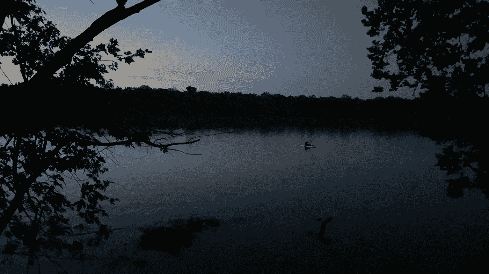
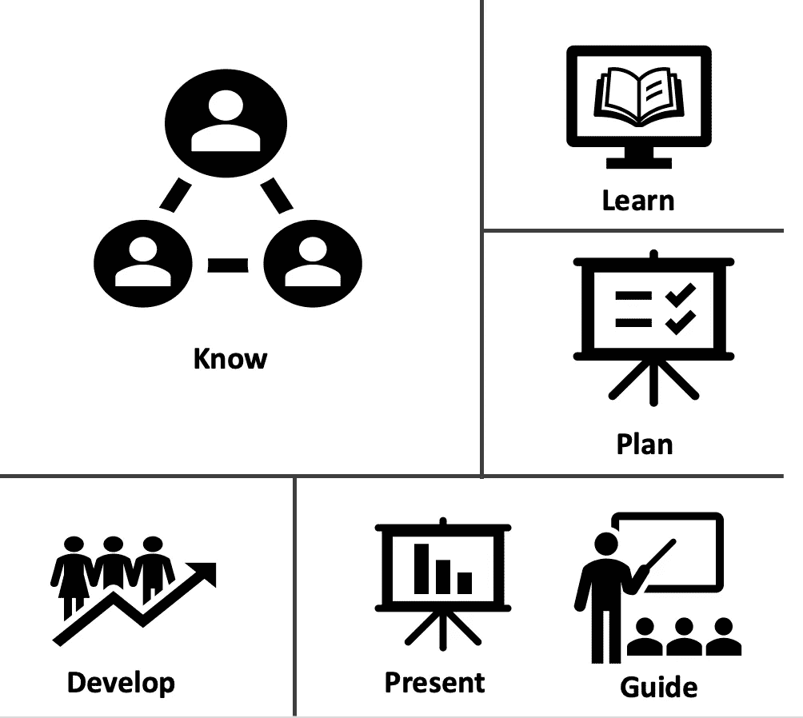
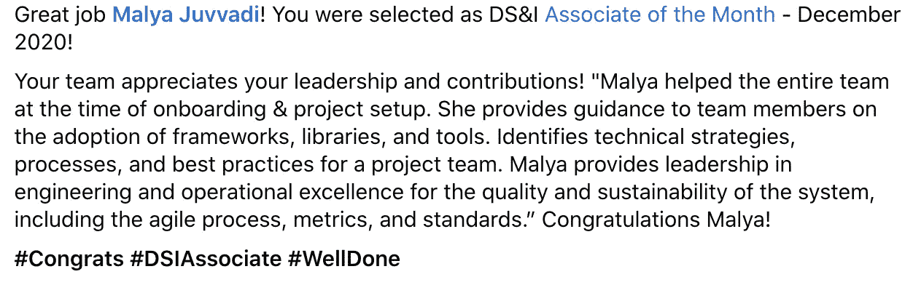

# 学习的循环总是会有新的开始

> 原文：<https://medium.com/walmartglobaltech/cycle-of-learning-will-always-have-new-beginning-aaefc61e49ba?source=collection_archive---------9----------------------->

> 我们每天都在学习新的个人或专业知识，为什么我们学习总是有助于找到正确的道路。

**这里有一个关于一名女性软件工程师的小故事:**

当我开始做软件工程师 II 时，我的第一个问题是→ ***选择哪条职业道路？***

1.  前端开发人员
2.  后端开发人员
3.  全栈开发人员
4.  数据工程师
5.  数据架构师
6.  数据科学家和更多…

我有兴趣学习所有可用的技术。我的职业规划是集中精力，尽可能多的学习。

Learning Opportunities will Rise daily

尽管我加入沃尔玛时技能有限，但我会毫不犹豫地接受任何交给我的任务。有时候完成起来太有挑战性了，但我从未放弃。对学习更多东西的兴趣总是帮助我保持专注。

Knowledge is like Water!! Go with the flow, there might be few blockers but always find a way out

有时，由于缺乏指导，管理任务很困难。因为我必须努力知道正确的解决方案，所以我习惯于搜索→失败→重试。失败帮助我知道了处理一个问题的多种方法。

Sometimes Failing is also Beautiful

休息一下，保持工作生活平衡总是好的；这有助于重振热情，帮助我们专注于目标。

We Fall to Grow — inspired from trees 🌳

有人让我们泄气，很少有人引导我们。我们必须在一个组织中寻找合适的导师。我从导师那里听过的一句很有意思的话是 ***我们以 T 字形收集我们的知识；我们应该深入了解一条职业道路，并收集其他职业道路的知识。***

我的经验告诉我在一个组织中要关注以下关键活动。

1.  **了解**产品/客户需求和可用技术
2.  **学习**技术
3.  **计划**利用现有技术完成产品/客户需求
4.  根据组织标准开发
5.  **展示**并收集客户反馈&领导
6.  **指导**组织新的团队成员和其他团队。

如果你真的相信某件事，永远不要放弃，保持坚强和专注。

有些人可能会面临类似的困难；将来，我想出几个介绍基本细节的入职博客，可能对组织中的新员工有所帮助。

希望你喜欢这些照片😊

— *议员*

[沃尔玛全球技术](https://medium.com/u/c884135151a4?source=post_page-----aaefc61e49ba--------------------------------)#沃尔玛女性

**我以前的博客:**

 [## 我要表达的第一个观点

### 我们开发的是帮助还是宠坏用户？？？文字很重要。他们让我们学习，表达内心的想法…

malyarao.blogspot.com](http://malyarao.blogspot.com/p/my-first-view.html)  [## 数据世界

### 我们是生活在一个智能的世界还是不安全的世界？？？这一次我想以一个真实的例子开始我的话题。之后…

malyarao.blogspot.com](http://malyarao.blogspot.com/p/data-world.html)  [## 教育中的技术

### 在阅读了许多关于教育技术的文章和讨论后，我感到了一些有趣的东西，我…

malyarao.blogspot.com](https://malyarao.blogspot.com/p/blog-page.html)