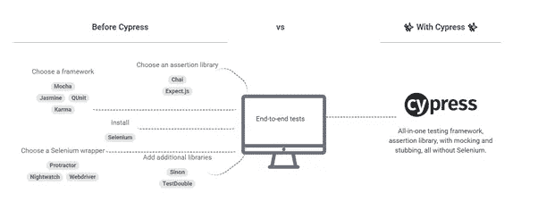
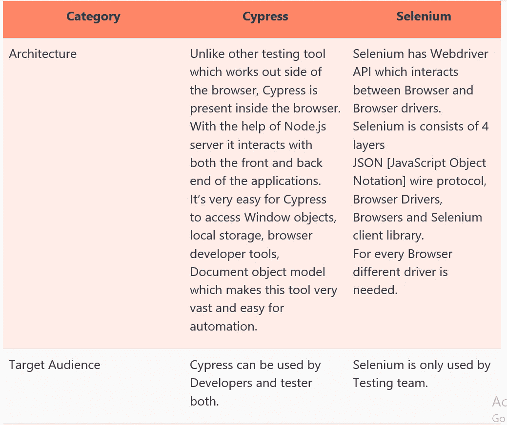
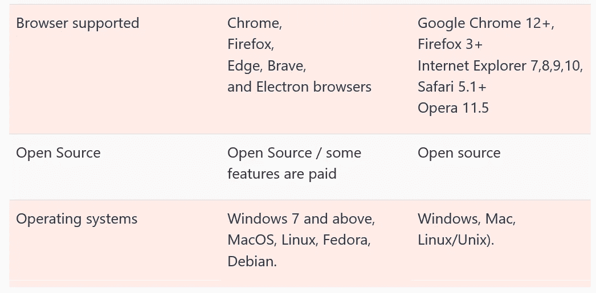

# 柏树和硒孰优孰劣？

> 原文：<https://medium.com/version-1/cypress-vs-selenium-which-is-better-cb621301f9c5?source=collection_archive---------1----------------------->

说到自动化测试工具，Cypress 和 Selenium 都是软件测试人员使用的强大工具。两者各有利弊，但是哪一个才是最适合你需求的工具呢？

在本帖中，我们将比较 Cypress 和 Selenium，并探究哪种工具更适合您的需求。让我们开始吧！

**将讨论以下主题:**

*   柏树是什么？
*   使用柏树的理由
*   柏树的优点
*   柏树的缺点
*   硒是什么？
*   使用硒的原因
*   硒的优势
*   硒的局限性
*   比较柏树和硒
*   丝柏和硒的目标受众是谁？
*   柏树会取代硒吗
*   结论

# 柏树是什么？

Cypress 是一个为下一代构建的网络测试平台。它是在 Mocha 和 Chai 上开发的，是一个基于 JavaScript 的端到端测试平台。Cypress 是一个 web 测试自动化框架，它帮助开发人员和测试人员使用 JavaScript 创建 web 自动化脚本。由于 Cypress 是基于 JavaScript 的，所以它在开发人员中也很受欢迎。

柏树通常被比作硒，但它们的结构是不同的。与 Selenium 相比，Cypress 没有太多的限制，这使得 Cypress 成为创建自动化 web 脚本的更快、更容易的方法。使用 Cypress，任何东西都可以在浏览器上运行时进行测试，后续测试可以由 Cypress 自动完成

单元测试
集成测试
端到端测试

# 使用柏树的理由

1.  由于其架构设计，与其他自动化工具相比，Cypress 提供了快速和稳定的测试执行。
2.  Cypress 有一个在测试执行时捕获屏幕截图的特性，如果它从命令行界面运行，它也可以捕获测试套件的视频。
3.  在开发人员工具部分，它提供了调试选项，帮助开发人员快速轻松地进行调试。
4.  与其他使用等待和休眠来实现测试运行中同步的工具不同，Cypress 有一个内置的特性，默认情况下它会等待下一个动作，并且在进入下一步之前也会等待。
5.  在 Cypress 中，我们可以看到活动的响应时间，这从单元测试的角度来看非常有用。
6.  Cypress 可以和 CI 工具一起使用。
7.  在视窗尺寸特性的帮助下，Cypress 可以检查网页的响应性。
8.  Cypress 以一种清晰的格式提供测试用例状态，它显示通过或失败的测试用例的数量。
9.  Cypress 有很好的错误记录能力，它清楚地描述了任何错误或失败的原因。
10.  Cypress 有很好的文档支持，可以帮助开发人员和测试人员编写关键的测试。

# 柏树的优点

1.  大多数端到端测试工具都是基于 Selenium 的，这就是为什么它们都有相同的问题。为了让赛普拉斯与众不同，它从头开始建造了一个新的建筑。Selenium 通过网络执行远程命令，而 Cypress 运行在与应用程序相同的运行循环中。
2.  Cypress 测试任何在网络浏览器中运行的东西。所有围绕 Cypress 的架构都是为了更好地处理现代 JavaScript 框架而构建的。我们有数百个项目使用最新的 React、Angular、Vue、Elm 等。框架。Cypress 在较旧的服务器渲染页面或应用程序上也能很好地工作。
3.  使用 Cypress API 可以完成测试，这在其他开源 web 自动化工具中是不可能的。
4.  大多数测试工具都是在浏览器之外运行，并通过网络执行远程命令。柏树则完全相反。Cypress 与您的应用程序在同一个运行循环中执行。Cypress 的背后是一个 Node.js 服务器进程。Cypress 和 Node.js 进程不断地相互通信、同步和执行任务。能够访问这两个部分(前端和后端)使我们能够实时响应您的应用程序事件，同时在浏览器之外执行需要更高权限的任务。Cypress 也通过动态读取和改变网络流量在网络层运行。这使得 Cypress 不仅可以修改进出浏览器的所有内容，还可以修改可能干扰其自动化浏览器能力的代码。

    Cypress 最终从上到下控制了整个自动化过程，这使其处于能够了解浏览器内外发生的一切的独特地位。这意味着 Cypress 能够提供比任何其他测试工具更一致的结果。

    因为 Cypress 是本地安装在你的机器上的，它可以额外接入操作系统本身来完成自动化任务。这使得执行任务，如截图，录制视频，一般文件系统操作和网络操作成为可能。
5.  Cypress 是一个可以用于单元、集成和端到端测试的框架，所以它是开发人员和测试人员的选择。
6.  用 Cypress 编写代码非常容易，因为它完全是用 JavaScript 编写的，而且它的调试能力非常强。

**Cypress 包含以下特性:**

7.时间旅行:Cypress 会在测试运行时拍摄快照。

8.调试:可读错误和堆栈跟踪使调试更容易。

9.自动等待:在继续之前自动等待命令和断言。

10.间谍、存根和时钟:验证和控制函数、服务器响应或定时器的行为。

11.网络流量控制:不涉及服务器的控制、存根和测试边缘案例

12.截图和视频:查看失败时自动拍摄的截图，或者从 CLI 运行时查看整个测试套件的视频

13.跨浏览器测试:在本地运行 Firefox 和 Chrome 系列浏览器(包括 Edge 和 Electron)中的测试。

# 柏树的缺点

1.由于 Cypress 是用 JavaScript 编写的，并且它只支持用于测试自动化的 JavaScript，这就成了一个限制，人们应该对 JavaScript 有很好的了解，因为没有其他语言支持它。

2.与 Selenium 等其他工具相比，跨浏览器测试是有限的。

3.移动浏览器测试或原生应用程序无法通过 Cypress 实现自动化。

# 什么是硒

Selenium 是一个开源测试框架，用于 web 应用程序测试，受不同平台和浏览器的支持。selenium 支持许多编程语言，如 c#、java、python、ruby、Perl。Selenium 支持的平台有 Windows、Linux、Mac OS 和 Solaris。

# 使用硒的原因

1.使用 Selenium 有多种原因，其中最重要的原因是它是开源的。

2.它可以在几乎所有的浏览器上运行，并得到大多数平台的支持。

3.使用这个工具，我们可以用自己选择的语言编写自动化脚本。

4.我们不需要拘泥于或依赖于特定于工具的语言。

# 硒建筑

# 硒的优势

1.  Selenium 支持多种编程语言，如 C#、Java、Python、Perl、Ruby 等。
2.  Selenium 支持多种平台，如 Windows、Linux、iOS。
3.  Selenium 支持自动化脚本的并行或同时执行。
4.  Selenium 有录音和播放[IDE]，这使得自动化很容易，用户可以将这个录音脚本导出到他自己选择的语言中。
5.  Selenium 是开源的，有巨大的社区支持。
6.  Selenium 有助于 DevOps 和持续集成，它可以很容易地与 Jenkins、Maven 等集成。
7.  带有 [Appium](https://www.softwaretestingmaterial.com/appium-with-nodejs-for-automation-testing-of-android-applications/) 的 Selenium 有助于移动测试，这在其他开放测试工具中非常少见。
8.  Selenium 支持无头[浏览器测试](https://www.softwaretestingmaterial.com/what-is-cross-browser-testing/)。

# 硒的局限性

1.  它只适用于基于网络的应用程序。Windows 自动化是 Selenium 做不到的。
2.  Selenium 中的报告特性不好，它依赖于 TestNG 或 Cucumber。
3.  Selenium 在寻找动态 web 元素方面不是很准确。
4.  硒不能自动验证码和条形码。
5.  Selenium 在处理页面加载和同步问题方面不是很强。此外，它不能非常准确地处理弹出窗口。
6.  Selenium 支持屏幕捕捉，但是 Selenium 不能测试图像、视频和音频
7.  使用这个工具需要很强的编程知识。
8.  Selenium 只在应用 UI 测试上有帮助，在单元测试、集成测试、数据库测试上帮不上忙。

# 比较柏树和硒

Selenium 和 Cypress 都是开源的 web 测试自动化框架，但是两者有一些不同之处。以下是两者之间的主要区别。

## **柏树和硒的目标受众是谁**

目标受众基于测试自动化的目标，如果目标是自动化单元、集成和端到端测试，那么 Cypress 是唯一的选择，两个开发人员都是 QA，都是 Cypress 的受众。

但是另一方面，如果目标只是测试 web 浏览器上的应用程序 UI 和功能，那么 Selenium 是最佳选择。

使用 Cypress 的唯一缺点是它完全基于 JavaScript，这对测试人员来说可能很难，因为一般来说，测试人员知道编程语言，但不知道脚本语言。

# 结论

如果开发人员和测试人员都非常了解 JavaScript，那么使用 Cypress 的目的是将自动化单元/集成和端到端测试作为并行过程。而硒纯粹是测试人们的选择。

**关于作者**
Thimmaraju 是 Version 1 的 QA 自动化工程师。