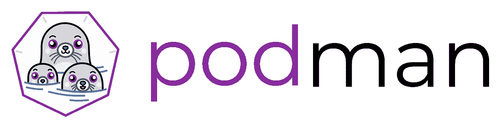
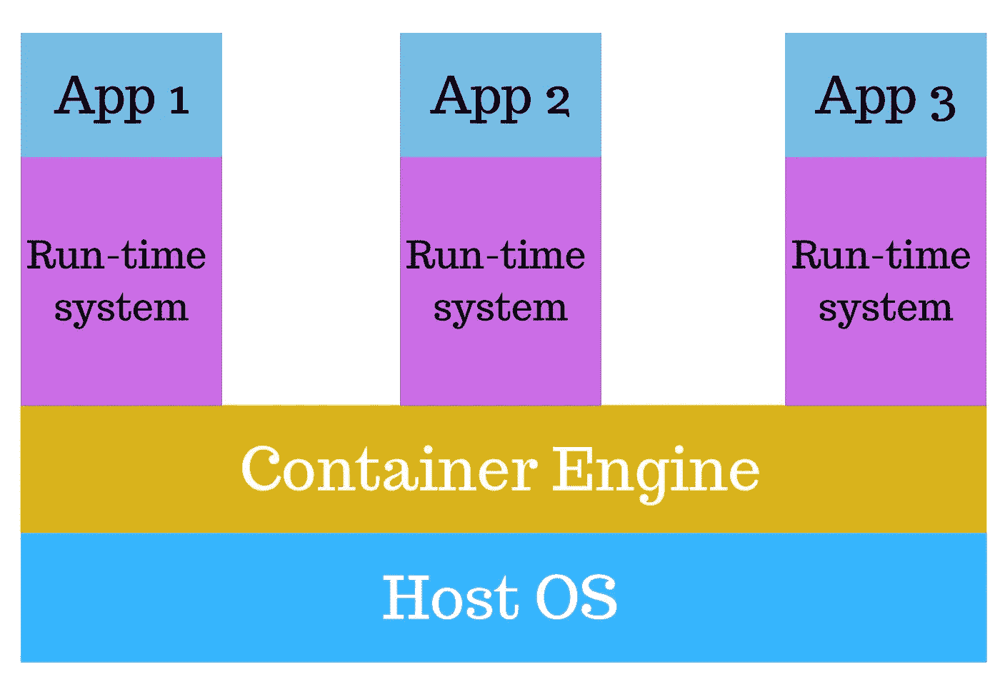
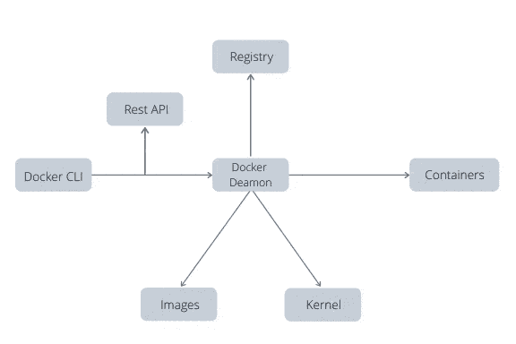
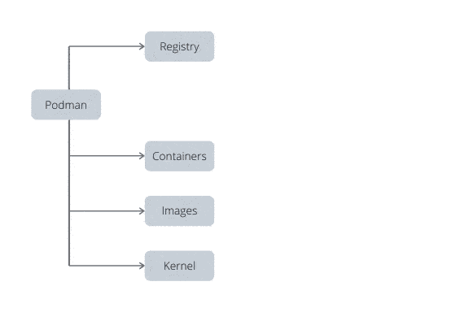
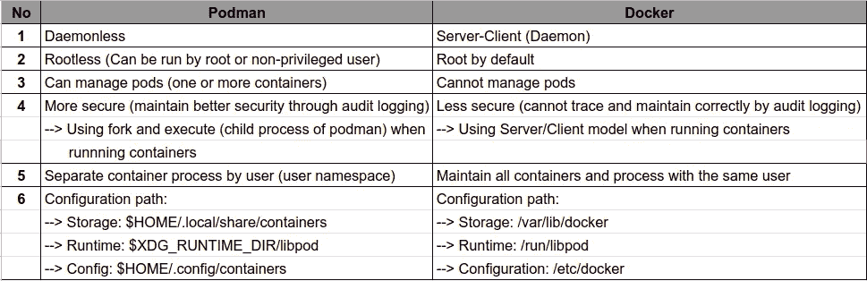

# 无门集装箱发动机

> 原文：<https://medium.easyread.co/daemonless-container-engine-5364394b80ec?source=collection_archive---------0----------------------->

## 波德曼对码头工人

Picture by [https://developers.redhat.com/blog/2018/08/29/intro-to-podman/](https://developers.redhat.com/blog/2018/08/29/intro-to-podman/)

> 本文将讨论[码头工人](https://www.docker.com/get-started)和[搬运工](https://podman.io/getting-started/)的比较。

许多人使用容器来开发、测试甚至运行他们的应用程序。目前，我们可以看到[码头](https://www.docker.com/get-started)是最适用的集装箱化。

Picture by [https://www.cloudmanagementinsider.com/containerization-vs-virtualization/](https://www.cloudmanagementinsider.com/containerization-vs-virtualization/)

# 那么，Docker 是什么？

> [**Docker**](https://www.docker.com/get-started) 是一个通过容器化来开发、运输和运行应用程序(及其库和依赖项)的开源平台。

## **以下是 Docker 如何处理他们的容器:**

*   Docker CLI 使用 Docker Rest API 通过脚本或直接 CLI 命令来控制 Docker 守护进程或与之交互。
*   该守护程序创建并管理 Docker 对象，如图像、容器、网络和卷。
*   因此，当 Docker CLI 向 Docker 守护程序发送命令(管理映像)时，Docker 守护程序会从注册表中推送/提取映像。
*   守护进程在本地容器中制作图像的副本并维护它。

## **docker 有什么问题:**

*   如果 Docker 守护进程出现故障，那么每个子进程都会丢失其踪迹。
    **- >** 单个流程可能是单点故障。
    **- >** 该流程拥有所有子流程(运行容器)。
*   所有 Docker 操作都必须由一个(或多个)具有相同完全根访问权限的用户来执行。

# 还有，波德曼是什么？

> [**Podman**](https://podman.io/getting-started/) 是作为 libpod 库的一部分提供的实用程序。它可用于创建和维护容器。而且最重要的是，波德曼里没有叫守护进程的概念。Podman 通过 runC 容器运行时进程(不是守护进程)直接与映像注册表、容器和映像存储进行交互。

## 以下是波德曼如何处理他们的容器:

*   使用与我们在 Docker CLI 中使用的命令行相同的命令行
*   可以使用 image 和 dockerfile(如 Docker 所用)。
*   如果您想要执行或维护多容器，请使用 podman-compose。

# 所以，这就是波德曼和码头工人的区别:

# 参考

1.  [**码头工人概述**](https://docs.docker.com/get-started/overview/)
2.  [**波德曼入门**](https://podman.io/getting-started/)
3.  [**介绍 runC:一个轻量级通用容器运行时**](https://www.docker.com/blog/runc/)
4.  [**Podman:在本地容器运行时管理 pod 和容器**](https://developers.redhat.com/blog/2019/01/15/podman-managing-containers-pods/)
5.  [**【Dockerless，第 3 部分:使用 Podman**](https://mkdev.me/en/posts/dockerless-part-3-moving-development-environment-to-containers-with-podman) 将开发环境迁移到容器中】
6.  [**用搬运工代替码头工——搬运工的权力**](https://cloudnweb.dev/2019/06/replacing-docker-with-podman-power-of-podman/)
7.  [**集装箱术语实用介绍**](https://developers.redhat.com/blog/2018/02/22/container-terminology-practical-introduction/)