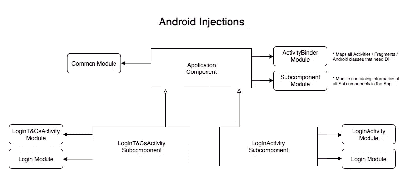
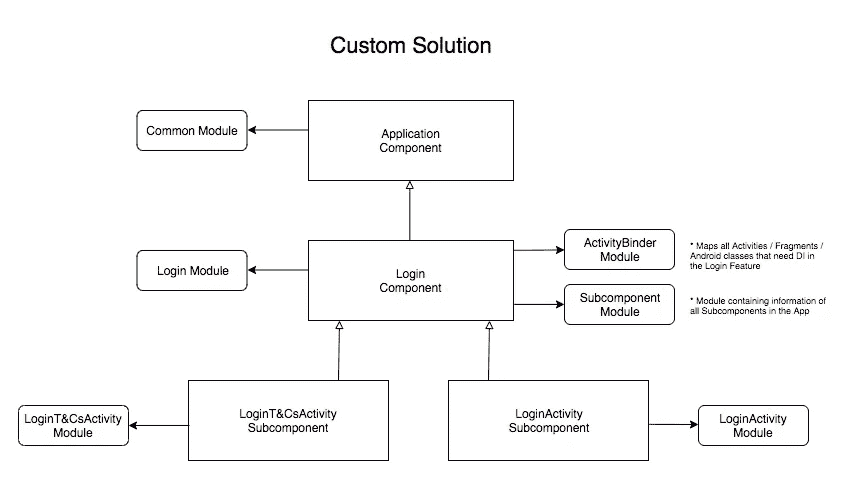

# Dagger 和 Android 思想:Android 中的依赖注入

> 原文：<https://medium.com/capital-one-tech/dagger-android-thoughts-dependency-injection-in-android-d50e799affe3?source=collection_archive---------0----------------------->


我一直在研究关于 [Dagger & Android](https://google.github.io/dagger/android) 的问题，看看我是否应该开始在我的项目中使用它。但是在我开始之前，这里有一些关于这篇文章的背景。

***编辑 4/2/18*** :本文专门谈`dagger.android` [包](https://google.github.io/dagger/api/2.14/dagger/android/package-summary.html)，而不是把匕首笼统地说成安卓的阿迪解决方案。

***编辑 8/8/18*** :社区的想法不多，目前正在调查中。我将很快更新更多的信息。毕竟，有可能让 Dagger Android 与多个组件层一起工作。

# 这篇文章是写给谁的？

*   你知道 Android 中的[依赖注入](https://en.wikipedia.org/wiki/Dependency_injection)。
*   你知道如何使用匕首 2。
*   你听说过 [Dagger & Android](https://google.github.io/dagger/android) 但是不确定你是否应该使用它，它的好处是什么。


# Dagger 和 Android 的优势

*来自 Dagger 文档* —许多 Android 框架类都是由操作系统自己实例化的，比如 Activity 和 Fragment。您必须在生命周期方法中执行成员注入，这会导致一些问题:

*   复制粘贴代码使得以后很难重构。
*   它要求请求注入的类型知道它的注入器。

> Dagger Android Injections 提供了一种在 Android 中使用 Dagger 简化依赖注入的方法

# 放弃

这篇文章是基于我对 [**匕首&安卓 v2.15**](https://github.com/google/dagger/releases/tag/2.15) 如何工作的理解。

Dagger Github 上有一个公开的问题来澄清这一点。我期待着从 Google 或 Dagger 那里得到消息，在未来的版本中包含这个功能。

[](https://github.com/google/dagger/issues/1087) [## 匕首安卓多层次(子)组件问题#1087 谷歌/匕首

### 我想知道使用 Dagger Android 是否可能有不同级别的组件或子组件。想法是…

github.com](https://github.com/google/dagger/issues/1087) 

# 我应该什么时候使用它？

从我的角度来看，对于小型项目来说，这是一个非常好的解决方案，但是由于一些原因，我认为它在大型应用程序中不能很好地扩展。

## 大型应用程序的潜在缺点

*   所有子组件都从 ApplicationComponent 扩展而来。
*   由于上述原因，所有的组件都需要声明它们使用的模块，而不能正确地将它们提取出来并模块化。只有一个抽象层次。
*   任何使用 DI 的 Android 类都需要在 ApplicationComponent 中声明。
*   测试需要用测试实例复制整个结构，这意味着对模拟没有太多的控制。

> 在我看来，所有这些都是一个大型应用程序中的危险信号。一个大的应用程序应该以一种更加可组合的方式构建，能够将公共逻辑提取到可重用的组件中。


**如果以上几点对你的用例很重要，Dagger & Android 可能不适合你。**

***然而，匕首&安卓也有用武之地。***

# 常见用例

如果你使用 Dagger & Android，只有一个功能和两个屏幕的图形会是什么样子？



Dagger & Android Graph

> Dagger & Android 不允许你拥有公共(子)组件，这使得构建和重用代码更加困难。

那张图表不成比例。你能想象它有八个功能，每个功能有三个屏幕吗？

我更希望有一个基于 Dagger 的定制解决方案，具有更好的、更少出错的结构，允许我们尽可能多地重用代码。像这样的东西呢？



Custom solution Graph

# Dagger & Android 生成的代码

让我们来看看 Dagger & Android 在引擎盖下是如何工作的。要注入一个活动，你唯一要做的就是:

```
**AndroidInjection.inject(this)**
```

## 1.什么是男性注射？

```
public static void inject(Activity activity) {
  *checkNotNull*(activity, "activity");
  Application application = activity.getApplication();**// GET THE APPLICATION OBJECT. IF IT IS NOT INSTANCE OF 
// HASACTIVITYINJECTOR THEN THROW AN ERROR**
  if (!(application instanceof HasActivityInjector)) {
    throw new RuntimeException(
        String.*format*(
            "%s does not implement %s",
            application.getClass().getCanonicalName(),
            HasActivityInjector.class.getCanonicalName()));
  }**// GET THE ANDROID INJECTOR THAT ATTACHES SUBCOMPONENT AND ACTIVITY**
  AndroidInjector<Activity> activityInjector =
      ((HasActivityInjector) application).activityInjector();
  *checkNotNull*(activityInjector, "%s.activityInjector() returned null", application.getClass());**// INJECT IT**
  activityInjector.inject(activity);
}
```

## 2.它如何知道使用哪个子组件构建器？

当您在附加到 ApplicationComponent 的模块中将活动与其生成器进行映射时，代码如下:

```
**@Module**
abstract class ActivityBuilder {

    @Binds
    @IntoMap
 **@ActivityKey(MainActivity::class)**    abstract fun **bindMainActivity(builder:MainSubcomponent.Builder)**:
            AndroidInjector.Factory<out Activity>

}
```

在您生成的***DaggerApplicationComponent.java***类中，它将活动与您之前定义的构建器的实例绑定在一起。

```
private Map<Class<? extends Activity>, Provider<AndroidInjector.Factory<? extends Activity>>>
    getMapOfClassOfAndProviderOfFactoryOf() {
  return MapBuilder
      .<Class<? extends Activity>, Provider<AndroidInjector.Factory<? extends Activity>>>
          *newMapBuilder*(1)
 **.put(MainActivity.class, (Provider) mainSubcomponentBuilderProvider)**      .build();
}
```

## 3.将构建器注入到班级中

当您调用 *inject* 时，它将调用第二步中定义的构建器实现实例上的 inject 方法。

# 结论

再次重申上面提到的观点:这篇文章是基于我的研究、阅读和实验。

在决定 Dagger & Android 是否适合你的项目之前，我建议你自己做一些研究。

你想知道更多关于匕首的事吗？看看这篇关于 Android 中**幸存配置变化的文章。**

[](/@manuelvicnt/surviving-configuration-changes-using-dagger-b08042f67092) [## 使用 Dagger 幸存的配置更改

### 自己动手！

medium.com](/@manuelvicnt/surviving-configuration-changes-using-dagger-b08042f67092) 

感谢阅读，

曼努埃尔·维森特 Vivo