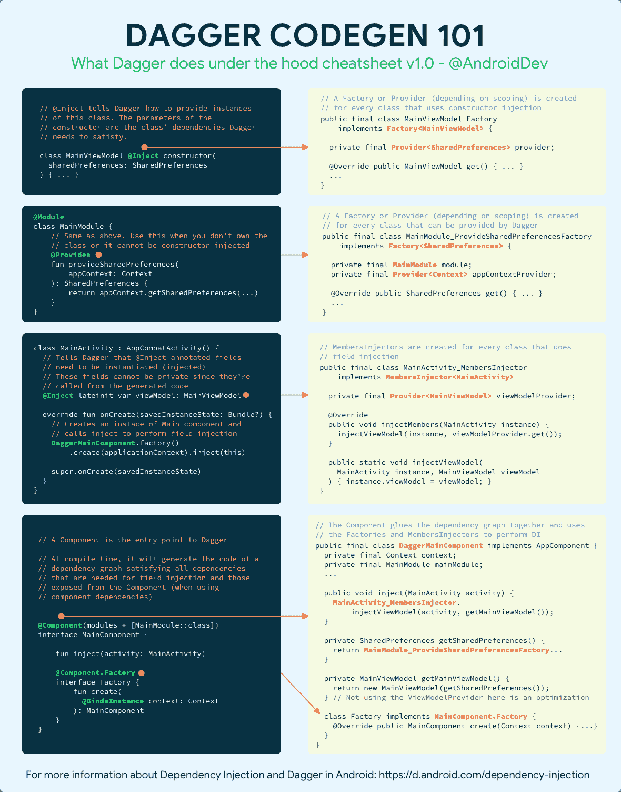
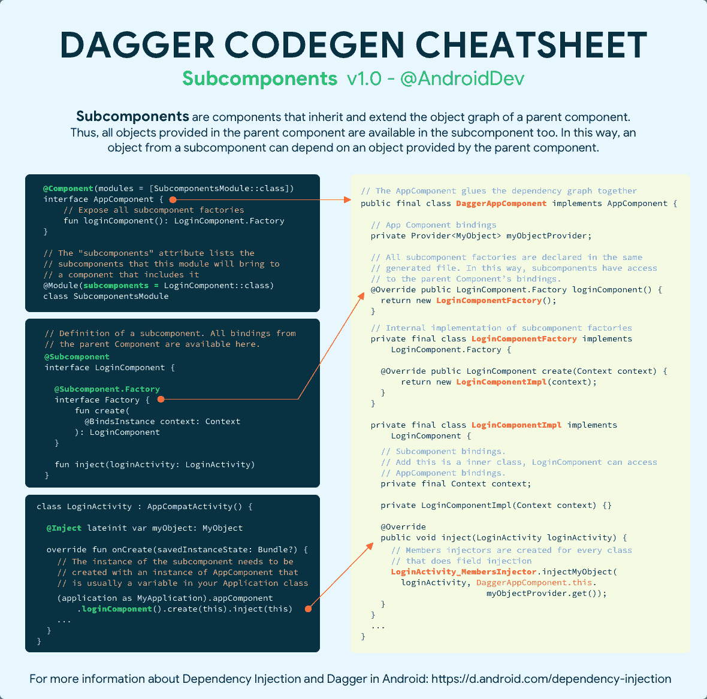
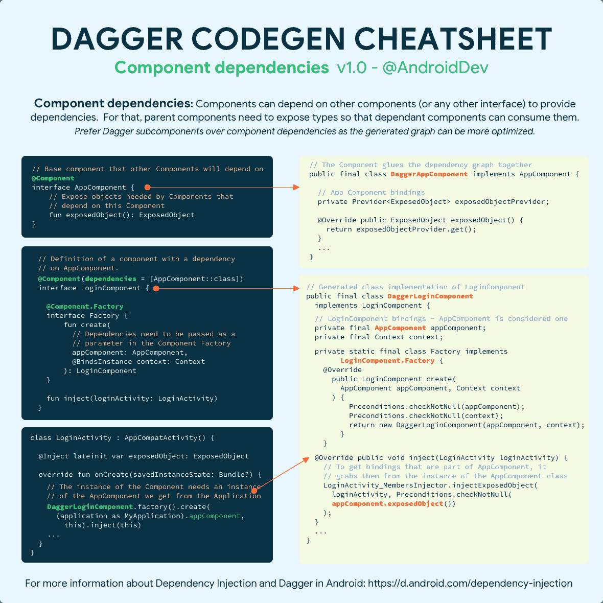

# Dagger 代码生成备忘单

> 原文：<https://medium.com/androiddevelopers/dagger-code-generation-cheat-sheets-6b4fa2da4e7a?source=collection_archive---------0----------------------->

## 你有没有想过匕首在引擎盖下是做什么的🤔？

每个注释都有一个*点*🔍！查看这些备忘单，了解 Dagger 如何解释它们以及它为您生成的代码。关于生成的代码和 Dagger 注释的解释可以在备忘单中作为注释找到。

关于依赖注入的更多信息，为什么你会在你的 Android 应用中使用 Dagger，以及如何使用它，查看 Android 官方文档:【https://d.android.com/dependency-injection 

如果你喜欢循序渐进的学习过程，可以在你的 Android 应用 codelab 中查看使用 Dagger 的[。](https://codelabs.developers.google.com/codelabs/android-dagger/)

此外，如果你对 Dagger 在 Android 中的未来感兴趣，请观看这个 Android 开发者峰会 19 视频:

# 匕首基础

[下载文件](https://developer.android.com/images/training/dependency-injection/dagger-codegen-basics.png)

Dagger basic annotations cheat sheet

# 匕首子组件

[下载文件](https://developer.android.com/images/training/dependency-injection/dagger-codegen-subcomponents.png)

Dagger subcomponents cheat sheet

# 组件依赖关系

[下载文件](https://developer.android.com/images/training/dependency-injection/dagger-codegen-component-dependencies.png)

Dagger component dependencies cheat sheet