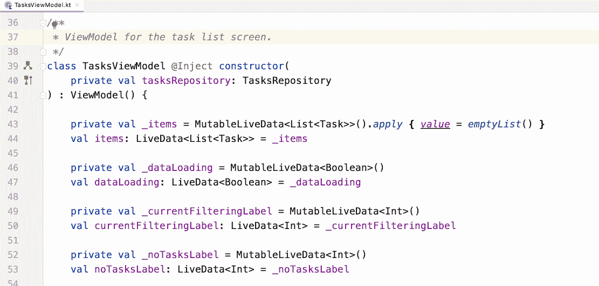
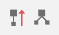
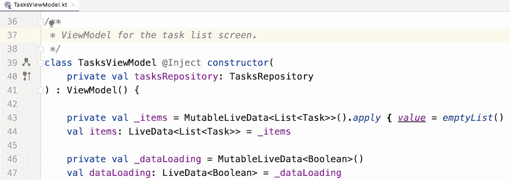
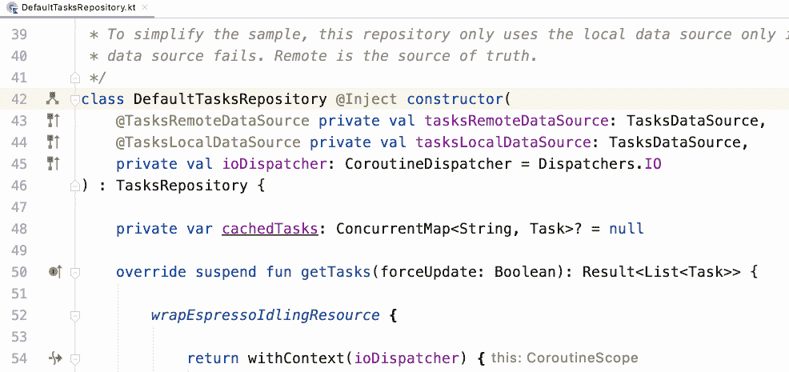
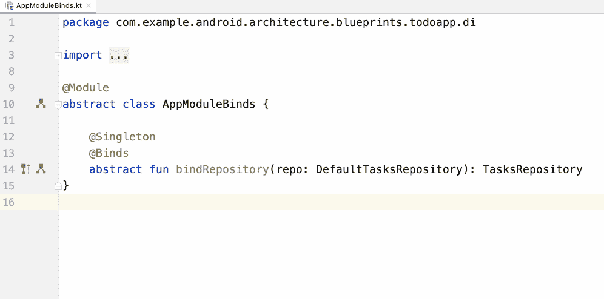
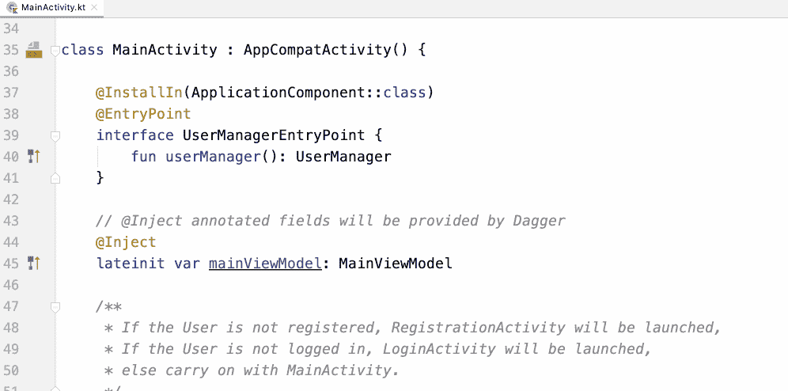
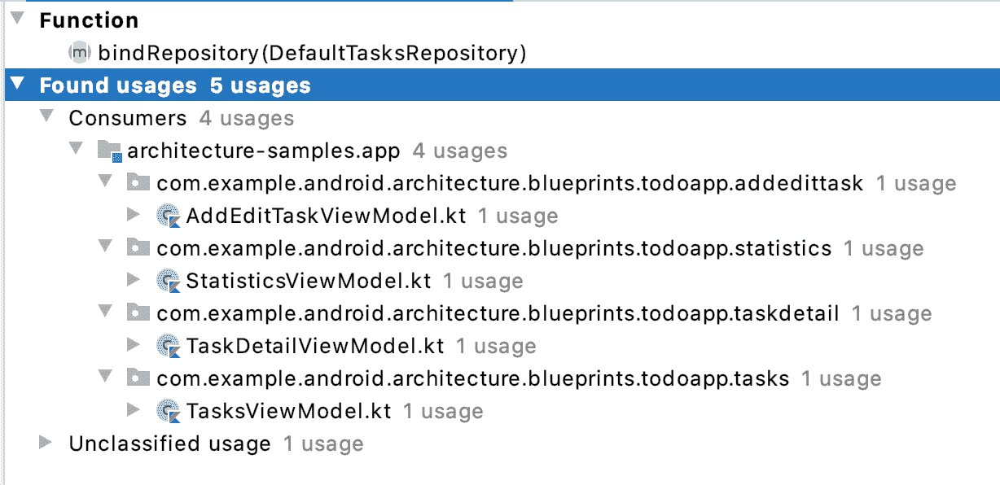

# Android Studio 中的匕首和刀柄导航支持

> 原文：<https://medium.com/androiddevelopers/dagger-navigation-support-in-android-studio-49aa5d149ec9?source=collection_archive---------0----------------------->

> 最后更新:2020 年 7 月 23 日

你有没有在一个项目中迷失过，试图找出匕首或刀柄依赖是从哪里提供的？它来自一个`@Inject`构造函数吗？或者也许来自一种`@Binds`或`@Provides`方法？它有限定词吗？这不是一件容易的事…

🤔如果你只需点击一下就能知道更多的*和*会怎么样？🎯不要再问了！

最新版本的 Android Studio 4.1(目前测试版可用)带有**新的 gutter 图标，允许您轻松地在 Dagger 相关代码**之间导航:依赖生产者和消费者、组件、子组件和模块！同样，您可以在 ***查找用法*** 中找到相同的信息。

**手柄支持**已经加入 Android Studio 4.2(目前在 Canary)。除了上面列出的 Dagger 特性，你还可以从**入口点**的简单导航中获益。

*Easy Dagger and Hilt dependency graph navigation in Android Studio*

如你所见，导航你的 Android 应用程序的匕首图从未如此简单！通过 Android Studio 中的新支持，从*确切地*知道依赖项将来自哪个提供者方法只需**一次点击**。

# 在活动

从 Android Studio 4.1 Canary 7 开始，您可以在使用匕首或刀柄的项目中看到一个新的檐槽图标:

New Dagger and Hilt gutter icons in Android Studio

这些动作的行为如下:

*   带有向上箭头的图标->提供类型的位置(即依赖项的来源)
*   树形图标->其中类型用作依赖项

让我们看一些使用 architecture-samplesGitHub 示例的 [Dagger 分支(](https://github.com/android/architecture-samples/tree/dev-dagger) `[dev-dagger](https://github.com/android/architecture-samples/tree/dev-dagger)` [)的新功能的例子。](https://github.com/android/architecture-samples/tree/dev-dagger)

## 了解依赖性来自哪里

给定一个可以由 Dagger 注入的类，如果您点击带有依赖项向上箭头的 gutter 图标，您将导航到告诉 Dagger 如何提供该类型的方法。

在下面的例子中，`TasksViewModel`依赖于`TasksRepository`。点击 gutter 图标会将您带到提供`TasksRepository`的`AppModuleBinds`中的`@Binds`方法:

Know where a dependency is coming from

## 也适用于限定词！

鉴于上述情况，如果使用限定符提供依赖关系，它将带您到*确切地说是*那个提供者方法！

`DefaultTasksRepository`依赖于带有限定符的`TasksDataSource`。点击 gutter 图标会把你带到`AppModule`中为该类型提供限定符的方法:

It also works with qualifiers!

## 这种类型在哪里被用作依赖项？

当您有一个方法告诉 Dagger 如何提供一个依赖项时，您可以单击带有向下箭头的 gutter 图标来导航到使用该依赖项的位置。如果该依赖关系由多个使用者使用，您可以从列表中选择要导航到的使用者。

在我们的项目中，`DefaultTasksRepository`被不同的`ViewModel`使用，是哪些？您可以通过点击提供者方法的 gutter 图标(在本例中为`@Binds`)来了解它:

Know where a type is used as a dependency

## 刀柄入口点

当你在一个[句柄入口点](https://developer.android.com/training/dependency-injection/hilt-android#not-supported)时，gutter 动作帮助你导航到一个依赖的来源。为了展示这个特性，我们将使用[移植匕首到刀柄代码实验室](https://codelabs.developers.google.com/codelabs/android-dagger-to-hilt/)的`[interop](https://github.com/googlecodelabs/android-dagger-to-hilt/tree/interop)`分支。

*Navigate where a type comes from at an entry point*

# 查找用法

你可以在 Android Studio 的*查找用法*功能中找到你的匕首/刀柄代码之间的相同关系。

例如，如果您右键单击`AppModuleBinds`类的`bindRepository`并选择 ***查找用法*** ，您将看到类似如下的内容:

*Find usages about bindRepository*

你还在等什么，来试试吧？请在您的项目中使用它，并在这个[链接](https://issuetracker.google.com/issues/new?component=192708&template=840533&title=%5BPlease+title+your+report%5D+%23dagger-support)中给我们反馈。希望你喜欢它！