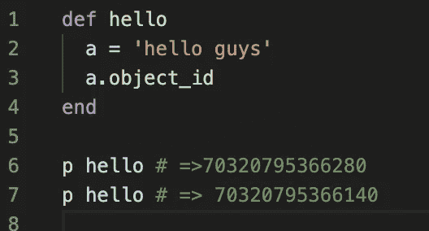
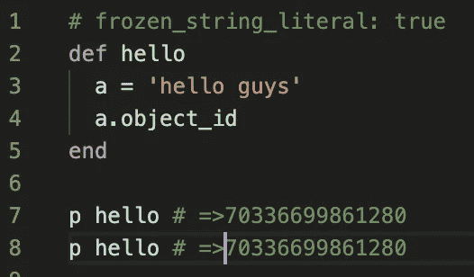

# Dahsyatnya 1 Magic Comment di Ruby

> 原文：<https://medium.easyread.co/dahsyatnya-1-magic-coment-di-ruby-c57af8f7d090?source=collection_archive---------7----------------------->

## Penjelasan dibalik dahsyatnya efek 1 magic comment di ruby


Hi guys, *long time no see* …. akhirnya kali ini bisa menulis lagi di medium.
*Btw* , siapa di sini yang menggunakan **Ruby** ? Atau mungkin menggunakan **RoR(Ruby on Rails)** . *Nah* , mungkin kalian sudah familiar dengan *magic comment* ini atau bahkan belum. So, disini aku bakal jelasin kenapa *magic comment* ini sangat dahsyat efeknya bagi performa aplikasi yang ditulis menggunakan ruby.

# Ruby *Comment*

Ruby memiliki beberapa tipe komentar, komentar tersebut adalah:

## ***Single Line/Multi-Line Comment***

***Single Line / Multi Line comment*** adalah komentar dalam bahasa pemrograman ruby, layaknya bahasa pemrograman lainya yang memiliki komentar, dalam ruby untuk *single line comment* dapat menggunakan `**#**` dan *multi line comment* dapat menggunakan `**=begin … =end**` .

## Shebang C *omment*

***Shebang comment*** `**#!**` adalah komentar yang akan memberi tahu unix shell(ex: *bash* ), sehingga unix shell dapat menjalankan berkas tersebut, ketika kamu menambahkan komen ini di baris pertama berkas ruby kamu maka kamu dapat mengeksekusi kode ruby via unix shell. Contoh:

```
**#!/usr/bin/env ruby
p “Hello World”**
```

## *Magic Comment*

***Magic comment*** adalah sebuah komentar di ruby yang dapat memberi efek kepada aplikasi ruby, contoh `**# frozen_string_literal: true**` .

# Frozen String Literal

Jadi salah satu komen yang dapat memberi efek dahsyat di aplikasi ruby kamu adalah komentar `**frozen_string_literal**` . Komentar ini di rilis di ruby 2.3\. Lalu apa sebenernya komentar ini?

Ketika kamu menambahkan komentar ini di file ruby kamu, semua string yang ada di dalam file tersebut akan otomatis *freeze(immutable)* . Sebelum versi 2.3, untuk membuat suatu string *(immutable)* kita harus menambahkan `**.freeze**` di setiap string. Dengan adanya *magic comment* ini seluruh string yang ada di berkas tersebut akan otomaris *immutable* . Lalu bagaimana efeknya ke aplikasi?

## 1\. Dengan membuat string freeze maka program tidak akan mengalokasi ruang memori baru

Ketika kita melakukan *freeze* ke sebuah string, maka string yang sama tidak membuat alokasi memori baru di sistem, dan hal ini sangat bagus karena ketika kita mengakses suatu string yang sama aplikasi tidak perlu mengalokasi memori lagi.

Contoh:



image1(tanpa magic comment)

Seperti yang kalian lihat kita memanggil suatu string yang sama, namun karena kita tidak membuat string tersebut *freeze(immutable),* maka ketika kita memanggilnya, program akan membuat alokasi memori baru yang mana sangat tidak bagus karena memori sistem kita dapat penuh.



image2(menggunakan magic comment)

Menggunakan 1 *magic comment,* kita tidak mengalokasi ruang memori baru lagi untuk string yang sama.

## 2\. Dengan membuat string freeze maka program akan raise error ketika ada perubahan di string

Ketika kamu menginginkan sebuah string di dalam program kamu konstant dengan menggunakan *1 magic comment* tersebut, program akan *me-raise error* jika ada yang mengubah string didalam program kamu. Namun kamu juga dapat membuat suatu string menjadi *mutable* dengan menambahkan tanda `**+**` sebelum string tersebut atau memanggil function `**dup**` .

# Kesimpulan

Ketika aplikasi kamu semakin bertambah besar, dan sebagian besar dari string adalah *constant* maka menambahkan 1 *comment* `**frozen_string_literal: true**` sangat bermanfaat untuk aplikasi kamu karena akan mengurangi alokasi memori, dan sangat mudah untuk dilakukan hanya menambahkan 1 komen maka kamu mendapatkan peningkatan di aplikasi kamu.

***Extra notes:***

*   Jika ingin membuat string yang mutable dapat menggunakan `**+**` atau `**String.new**`