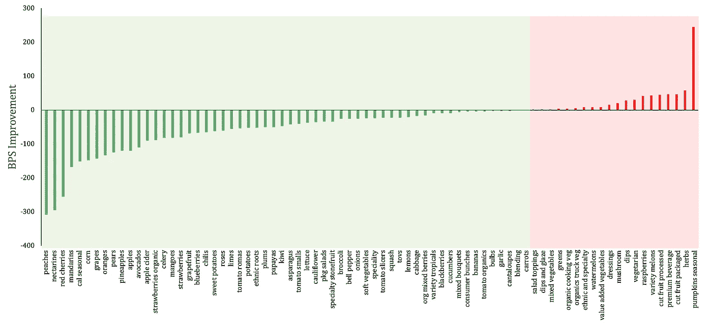
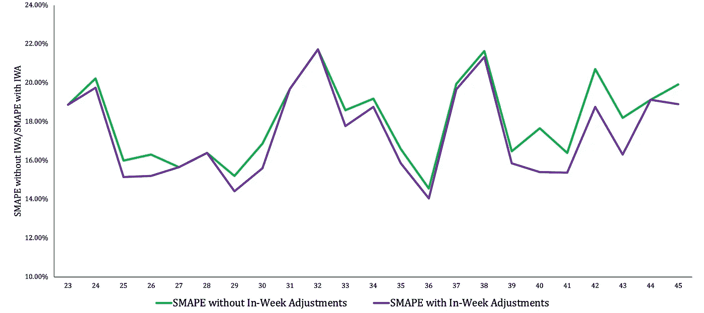

# 用于每周预测模型的工作日需求感知

> 原文：<https://medium.com/walmartglobaltech/daily-demand-sensing-enhancements-for-weekly-forecasting-models-dee7a494dce4?source=collection_archive---------6----------------------->

作者:Sucheta Jawalkar，Chinmay Jha

沃尔玛实验室的智能预测团队的任务是每周为超过 5 亿种商店商品组合提供需求预测！例如，在接下来的 52 周内，每周有多少草莓需要去美国的每家沃尔玛商店，目标是提高库存和减少食物浪费。

我们演示了一个简单的线性建模方法，以引入基于周末销售的预测增强。这种算法方法已经被我们的业务合作伙伴所采用，并且在过去的一年里不断产生业务影响。

> 除了提高需求预测的质量之外，该算法还减少了繁忙的需求经理的预测调整工作，而不会增加额外的 ETL 开销。

我们的商店预测模型每周都进行大规模训练，每周一发布每周预测。我们没有将最近的周末销售纳入我们的模型，因为我们的 ETL 过程是在周五数据进来之后开始的。

周调整(IWA) 项目中**的想法来自生产部门的一名需求经理，他设计并实施了一个类似的调整工具，我们将从**商店优化工具(SOT)** 中调用**周末销售修正**。“周末销售”修正，通过考虑供应天数和装箱数量等因素，使用“补货规则”对商场预测进行实际调整。IWA 算法引入商店级别的历史销售模式和线性模型来预测需求。**

在星期一早上，使用周末农产品销售和每周 SMART 预测来确定商品是销售过量还是销售不足，如果需要，调整星期二到星期五的预测。

使用简单的线性模型来预测周二到周五的需求

需求= A *周六销售额+B *周日销售额+ C*系统预测

**模特培训**

我们根据历史数据来估计预期周末销售额的比例，我们使用这些数据将一个商品-商店组合分类为:如果其销售额超过每周预测的 110%,则销售过剩；如果其销售额低于每周预测的 60%,则销售不足。这些值被硬编码以模仿“周末销售修正”工具。然后，我们使用周六销售额、周日销售额和每周预测作为独立变量，为销售不足和销售过度的项目-商店组合训练单独的线性模型。

**模型评分**

周一早上，我们有最新的周末销售数据。我们重复这个过程，将一个商品商店组合标记为过度销售或销售不足。对于那些过度销售(低价销售)的项目-商店组合，我们使用训练过的过度销售(低价销售)线性模型来生成新的预测。然后，根据这几天的历史销售额占每周总销售额的比例，将预测的预测分布在周二到周五。最后，我们确保算法建议的周二至周五的调整符合补充会计的业务规则，考虑了装箱数、安全库存、最大/最小调整、促销等因素。

**影响**

为了评估 IWA 模型的表现，我们对农产品和杂货的所有类别进行了为期 12 周的全面回溯测试。如下图所示，IWA 展示了巨大的前景，超过 70%的产品类别的 BPS 改善就是证明。

72% of categories showed a basis point improvement in a backtest across 12 weeks

对于生产部门来说，该算法在预测准确性指标方面每周都有超过 40 次的改进。它成功地在草莓等季节性很强的商品的开始和结束时抓住了预测的肩膀，为这一周提供了超过 70 个基点的改善。

Improved SMAPE week on week for strawberries

自 2019 年 3 月实施以来，IWA 算法每周都成功实现了数百个基点的改善，并帮助减少了粮食浪费和库存增加。

*感谢 Micah Nichols 解释 SOT 工具的多次谈话，感谢 Sasanka Katta 的产品理念和产品支持，感谢 Lachlan Bubb 的算法开发和实施；John Bowman 和 Anton Bubna-Litic 负责技术反馈；Avi Dixit 支持 ETL 和 Tableau。*

我在[威廉玛丽学院](https://www.wm.edu/as/physics/)获得了实验核物理博士学位，在[杜克大学](https://phy.duke.edu/)和[圣塔克拉拉大学](https://www.scu.edu/cas/physics/faculty/sucheta-jawalkar/)物理系做了博士后研究，在那里我模拟了数 Pb 的散射数据，以了解已知宇宙的微小构造块的结构。我是 Insight 数据科学研究员，Aspen 学者，喜欢大规模研究机器学习！

Chinmay 获得了麻省理工学院的商业分析硕士学位和马德拉斯印度理工学院的技术学士学位。作为智能预测团队的副产品经理，他帮助构建机器学习产品，以解决零售和电子商务领域的业务问题。