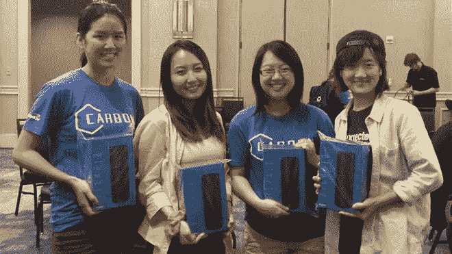
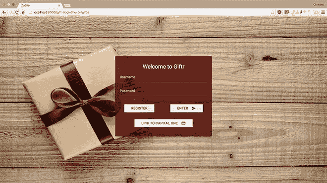

# 敢于梦想:我们在碳黑客马拉松的经历

> 原文：<https://medium.com/capital-one-tech/dare-to-dream-our-experience-at-the-carbon-hackathon-66717a61ccb7?source=collection_archive---------1----------------------->

在享用了一上午丰盛的早餐和首席技术官 Rob Alexander 鼓舞人心的演讲后，所有的实习生都兴奋地开始着手他们的黑客马拉松创意。我和我的队员们聚在一起，我们决定了一个名字:里士满女子队。我们是四名女性技术实习生，目前在首都一号西溪校区的不同区域工作。

我们都是带着不同的背景和技能来到这个团队的。Alice SeongYeon Park 是卡内基梅隆大学的一名硕士生，她与我们的 Django 后端一起工作。同样来自 CMU 的大学生 Ann Chen 用 Materialize 来装饰我们的前台。李依琳和我(分别来自康奈尔和布兰代斯)与 Capital One 的 DevExchange Rewards API 密切合作。最后，我们都贡献了几个小时的工作，并失去了睡眠，以创造一些了不起的东西。

然而，我们的二十多小时并不都是一帆风顺的。注册我们的团队后，我们遇到了古老的黑客马拉松问题:我们应该做什么？我们知道我们想要利用[deve exchange](https://developer.capitalone.com/)开发一个 web 应用程序。我们还想创造一些 Capital One 员工和客户都喜欢的东西。经过一番思考后，我们请我们的团队导师萨姆·奥斯托伊奇来帮助我们。我们终于找到了一个我们都充满热情的想法，并开始了黑客活动。

有如此多的支持系统来帮助我们在极短的时间内做出最好的工作产品。当我遇到问题时，我只需要向众多良师益友中的一位倾诉。我们的每个问题总是至少有一个专家(谢谢 Rick！).我们在酒店的拱廊休息，甚至在停车场放飞无人机，几乎撞上了一些汽车。餐厅总是备有饮料和小吃，完成了真正的黑客马拉松体验。

当我们在酒店房间的大屏幕电视上播放音乐时，我们设计了时尚的节目。我们大多数人对 Django 框架和 Python 以及 Materialize 非常陌生。我们都是 DevExchange 的新手，但本着黑客马拉松的精神，我们尝试了一下。所以我们在深夜编写应用程序。

到了评判的时候，我们练习了一千遍。我们名为 Giftr 的应用程序将从用户那里众包礼物创意。用户的账户可以连接到 Capital One，以便在挑选礼物时参考他们的奖励余额。该网站的功能包括根据标签和价格等进行分类的搜索功能。在评委之间，我们花时间探索其他实习生的项目，并对整个团队的才华和创造力感到惊讶。

当获胜的队伍即将被宣布时，我们互相开玩笑说我们太伟大了，以至于排名都过去了。事实上，我们没想到会被叫到自己的名字。我们知道自己做得很好，其他实习生也一样——这就足够了。我们很满意已经尽了最大努力。

说到底，我为我的团队感到骄傲。我很自豪我们冒险学习令人兴奋的新框架。我很自豪我们对我们的想法同样充满热情。我很自豪我们有如此伟大的团队合作。创造空间让不同背景的工程师可以不受限制地合作并发挥创造力是非常重要的。就在这两天里，作为工程师和个人，我们成长了很多。未来实习生注意:永远不要低估关心一件事的力量。即使“仅仅”是一次黑客马拉松，也有很多东西需要学习。

要了解更多关于 Capital One 的 API、开源、社区活动和开发人员文化的信息，请访问我们的一站式开发人员门户网站 DevExchange。