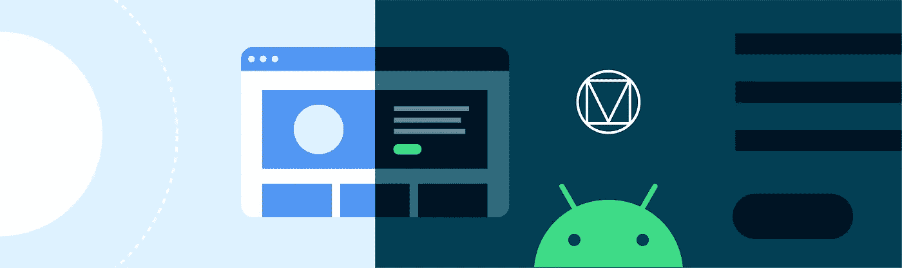
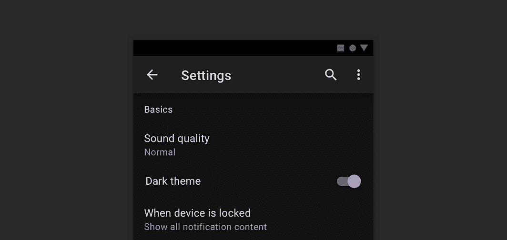
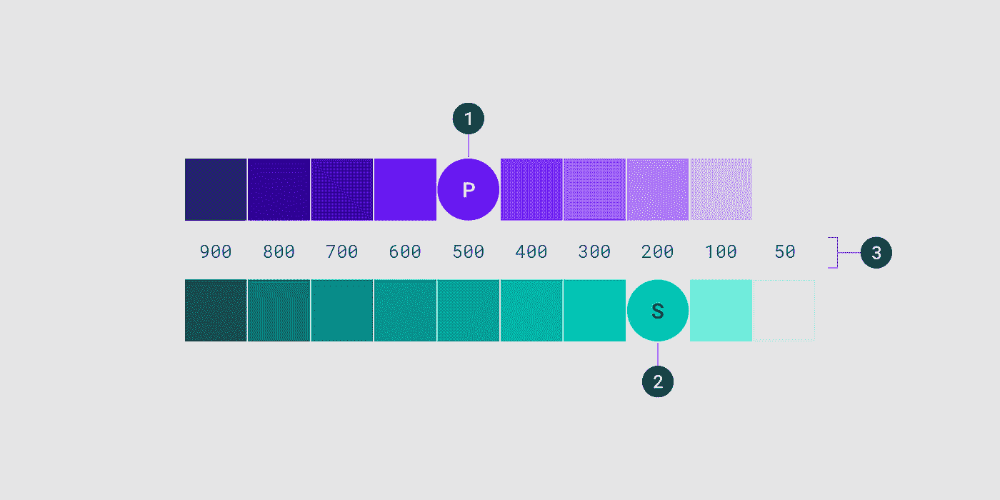
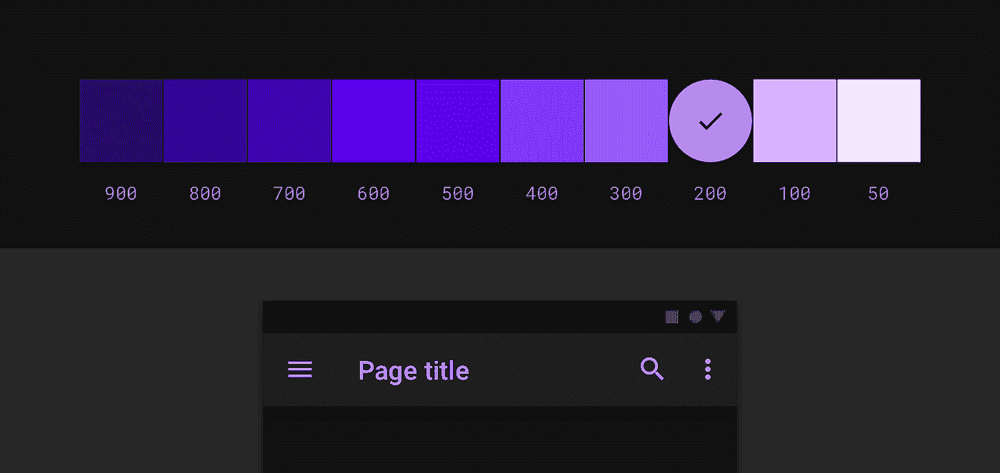
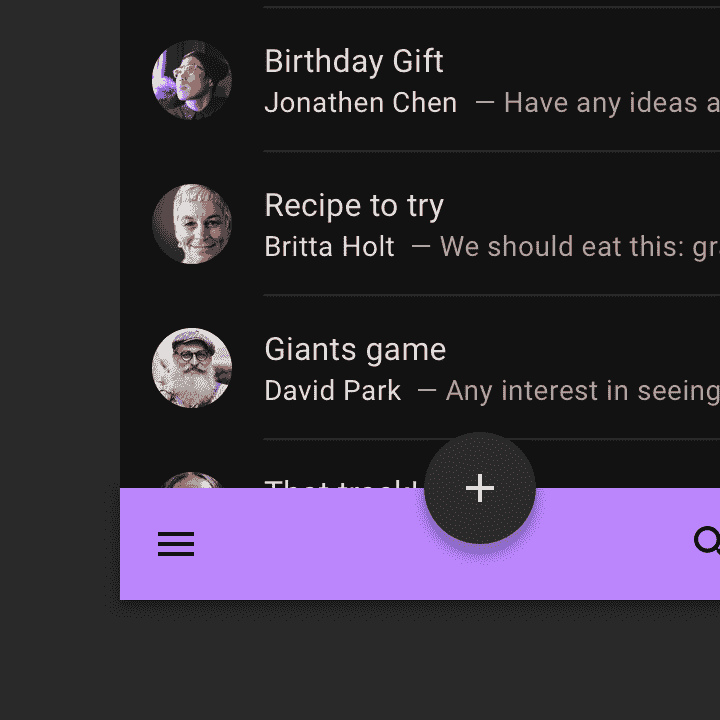
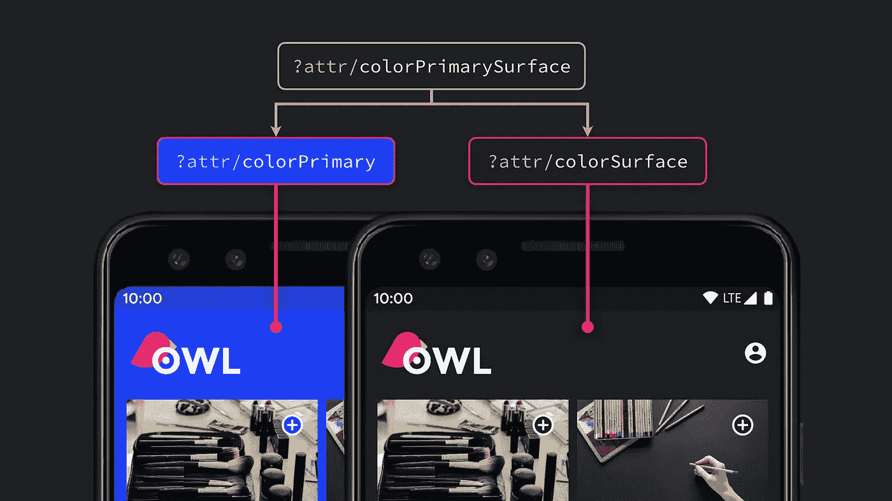
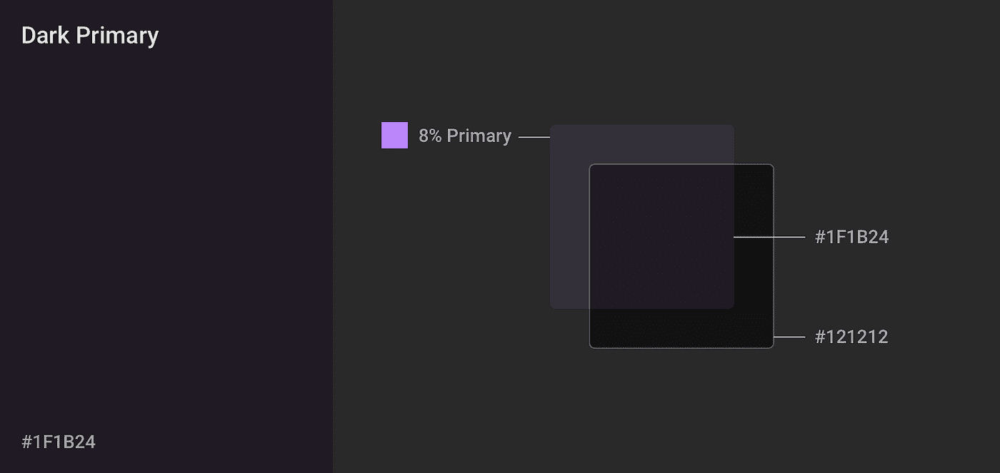
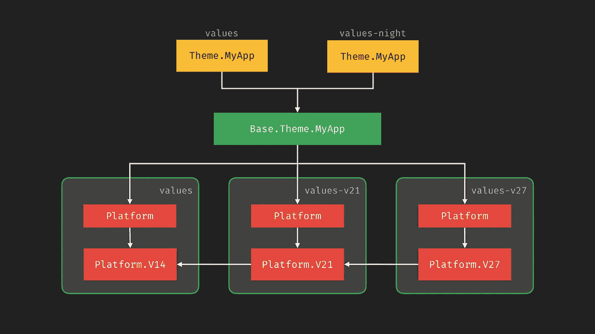
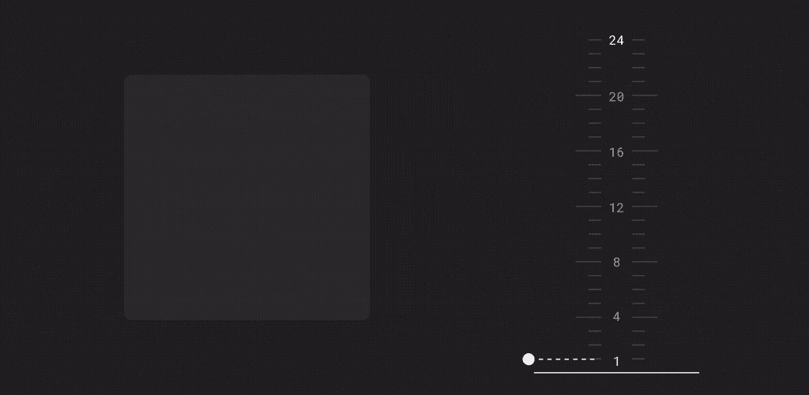

# MDC 的黑暗主题

> 原文：<https://medium.com/androiddevelopers/dark-theme-with-mdc-4c6fc357d956?source=collection_archive---------1----------------------->



## 使用材料设计组件实现黑暗主题

在之前的博文中， [Nick Rout](https://medium.com/u/37290b859aca?source=post_page-----4c6fc357d956--------------------------------) 经历了材质主题化的基础，[颜色](/androiddevelopers/material-theming-with-mdc-color-860dbba8ce2f)，[排版](/androiddevelopers/material-theming-with-mdc-type-8c2013430247)，[形状](/androiddevelopers/material-theming-with-mdc-shape-126c4e5cd7b4)的柱子。

[](/androiddevelopers/material-theming-with-mdc-color-860dbba8ce2f) [## 使用 MDC 的材质主题:颜色

### 使用 MDC 库的 Android 颜色主题

medium.com](/androiddevelopers/material-theming-with-mdc-color-860dbba8ce2f) [](/androiddevelopers/material-theming-with-mdc-type-8c2013430247) [## 使用 MDC 的材质主题:类型

### 使用 MDC 库在 Android 上输入主题

medium.com](/androiddevelopers/material-theming-with-mdc-type-8c2013430247) [](/androiddevelopers/material-theming-with-mdc-shape-126c4e5cd7b4) [## 使用 MDC 的材质主题:形状

### 材料主题化是一种定制材料组件以与您的品牌保持一致的方式。材料主题包括颜色…

medium.com](/androiddevelopers/material-theming-with-mdc-shape-126c4e5cd7b4) 

这篇文章将以此为基础，看看我们如何调整我们的应用程序来支持黑暗主题。

用户可选择的黑暗主题在 Android 平台的 Android 10 中被添加，但这并不意味着它们对应用开发者来说是新的。Android 设备的默认主题是黑暗的，直到 Android 5.0 ( [Lollipop](https://developer.android.com/about/versions/lollipop) )！

去年的不同之处在于，该平台增加了一个设备范围的设置。这意味着用户不仅可以控制设备的主题，还可以控制应用的主题。

除了最近的设备范围设置，我们现在还有关于 [material.io](https://material.io/) 的综合[设计指南](https://material.io/design/color/dark-theme.html)，我们将在这篇博文的后面讨论。

# 为什么支持黑暗主题？

首先，为什么要支持黑暗主题呢？关于[黑暗主题](https://material.io/design/color/dark-theme.html#usage)的 Material.io 页面很好地总结了一些技术优势(重点是我的):

> 深色主题会降低设备屏幕发出的亮度[…]。它们有助于**改善视觉人体工程学**，减少眼睛疲劳，根据当前照明条件调整亮度，以及**在黑暗环境中方便屏幕使用**——同时**节省电池电量**【用于有机发光二极管显示器】。

最重要的原因是你的用户想要它。Android 团队增加了全系统的黑暗主题设置，因为它一直是用户要求最多的功能。

现在，我已经说服你在你的应用程序中支持黑暗主题，让我们看看你如何添加一个…

# 快速启动

要给你的应用添加一个黑暗主题，使用[材质设计组件](https://material.io/develop/android/) (MDC)获得 Android 的支持:

## #1:改变你的主题

您需要更改您的主题，以扩展其中一个`Theme.MaterialComponents.**DayNight**`主题:

```
<style name="Theme.MyApp"
       parent="Theme.MaterialComponents.DayNight"> <!-- Other theme attributes --></style>
```

## #2:选择要进入的模式(可选)

这一步是可选的，但是允许你支持运行 Android 10 之前版本的 Android 的设备。由于【Android 10 之前的大多数设备都没有系统级黑暗主题设置 ***** ，应用可以提供自己的应用内设置，让用户选择每个应用使用什么主题。



Example in-app dark theme setting

这在 Android 10+上仍然有用，因为它允许用户按照自己的意愿覆盖系统设置。作为一个例子，假设用户将他们的设备主题设置为按时间表控制，但他们知道他们总是希望他们的社交应用程序使用深色主题。

为此，[app compat](https://developer.android.com/jetpack/androidx/releases/appcompat)(MDC 使用的)提供了一个 API 来设置所选择的模式:`AppCompatDelegate.[setDefaultNightMode()](https://developer.android.com/reference/androidx/appcompat/app/AppCompatDelegate#setDefaultNightMode(int))`。通常，每当偏好发生变化时，就会调用这个函数。

> *不完全正确。一些设备制造商已经为他们运行 Android 9(及以下版本)的设备添加了系统级黑暗主题。不幸的是，在运行时没有办法确定这一点。

如果你想了解更多关于 [AppCompat](https://developer.android.com/jetpack/androidx/releases/appcompat) 中的夜间模式功能是如何工作的，请看这篇博文:

[](/androiddevelopers/appcompat-v23-2-daynight-d10f90c83e94) [## 日夜——给你的应用添加一个黑暗主题

### AppCompat 中的日夜功能允许您的应用程序在黑暗和光明主题之间轻松切换。

medium.com](/androiddevelopers/appcompat-v23-2-daynight-d10f90c83e94) 

## #3:测试！

这就是我们黑暗主题的基础！现在是时候通过检查应用程序的每个部分来测试它了，包括明主题和暗主题。注意深色背景上的深色文本，以及与深色背景对比度不足的硬编码颜色(通常为灰色)。

如果你在你的应用程序中使用硬编码的颜色值，我推荐阅读 Nick Butcher 的博客文章，这篇文章谈到了更喜欢的主题属性:

[](/androiddevelopers/android-styling-prefer-theme-attributes-412caa748774) [## Android 风格:偏好主题属性

### 所有事物的主题属性

medium.com](/androiddevelopers/android-styling-prefer-theme-attributes-412caa748774) 

我们在 2019 年 Android 开发峰会上的“[主题风格](https://www.youtube.com/watch?v=Owkf8DhAOSo)”演讲中也谈到了这一点:

# 物质黑暗主题

现在让我们来看看 [Material.io](https://material.io/design/color/dark-theme.html) 上描述的黑暗主题的设计特点。

## 灰色对黑色

你可能注意到的第一件事是，深色主题应用的默认背景是*而不是*黑色，而是深灰色:`#121212`。

有很多关于我们为什么选择灰色而不是黑色的讨论，特别是因为 Android 10 平台使用了黑色背景。这在很大程度上是可用性和节能之间的权衡。

在平台中使用纯黑色`#000000`作为背景，允许系统应用程序和表面在有机发光二极管显示器上打开时尽可能少用电。这些系统界面往往非常简单，通常只有文本和简单的图标，所以为了解决对比度问题，我们可以调整文本和图标的颜色。

然而在应用程序中，你的表面可以包含任何东西:复杂的彩色矢量动画、明亮的图像、对比鲜明的品牌表面等等。将它们放在纯黑色的背景下意味着最终的对比度更高，这会增加眼睛的疲劳。与我们上面提到的文本和图标不同，通常很难或不需要对这些类型的内容进行着色/重新着色来降低对比度，这意味着更亮的背景是解决方案。

## 调色板

接下来，让我们看看你的应用程序的调色板。很可能你的应用程序的调色板是基于亮/白背景的假设选择的，所以当应用程序在暗主题下运行时，我们可能需要对调色板进行一些调整。

## 概述材料颜色系统

我们将在下面大量讨论色调，所以这里有一个关于材质颜色系统的快速回顾。它将颜色定义为每种颜色中的一系列色调。色调编号从 **50** (最浅、最不饱和的色调)，到 **900** (最深、最饱和的色调)。这是蓝绿色和靛蓝色的基本色调:



Baseline Material color palettes

您也可以在[材质颜色工具](https://material.io/resources/color/)中进行试验，了解不同颜色的色调如何变化。 [Nick Rout](https://medium.com/u/37290b859aca?source=post_page-----4c6fc357d956--------------------------------) 也在这里写了一篇关于色系[的深度剖析。](/androiddevelopers/material-theming-with-mdc-color-860dbba8ce2f)

## 原色

你的应用程序的主要颜色是显示最多的颜色(除了背景和表面颜色)，所以我们需要确保它在深色主题中清晰可见。通常在浅色主题中，你的浅色主题将是一种颜色的 **500** 色调，而在深色主题中，我们推荐一种饱和度较低且更明亮的色调，通常为 **200** ，但根据色调的不同可以达到 **50** 。

对于您的`colorPrimaryVariant`，我们建议您使用灯光主题中的`colorPrimary`。作为一个粗略的指南:

这些值只是一个起点。你应该确保在所有使用的标高水平上，所选颜色相对于背景/表面颜色的 [WCAG AA](https://www.w3.org/WAI/standards-guidelines/wcag/) 对比度至少为 *4.5* **:** 1。



[材质颜色工具](https://material.io/resources/color/)可以方便地进行颜色实验。

## 彩色二次色

对于你的第二种颜色，它和`colorPrimary`的过程是一样的，使用一种不太饱和而更明亮的同色色调。

基线材质黑暗主题对待`colorSecondaryVariant`和`colorPrimaryVariant`略有不同，对`colorSecondary`和`colorSecondaryVariant`使用相同的色调。

同样，作为一个粗略的指南:

## 表面颜色

[大胆的彩色表面](https://material.io/design/color/applying-color-to-ui.html#sheets-and-surfaces)可以在常用的组件中很好地表达你的品牌，比如卡片。虽然鲜艳和大胆的颜色在白色背景下效果很好，但它们在深色背景下的易读性就不那么好了。

如果设备和/或应用程序已经设置为使用深色主题，应用程序应该将此解读为用户想要一个柔和、不太鲜艳的配色方案。

考虑到这一点，即使我们对品牌表面使用柔和的**50**–**200**色调，对于深色主题来说，它仍然可能过于大胆，发出过多的光:



***Don’t do this.*** *Demo showing a bottom app bar with a vivid surface color*

那么你应该怎么做呢？有两个选项可以一起使用:

## 使用主表面

第一步是明显的，在黑暗的主题中不要使用明亮、色彩丰富的表面。Android 的 Material Design Components 通过其`PrimarySurface`风格使这一点变得简单，它在浅色主题的`Primary`颜色和深色主题的`Surface`颜色之间切换。

让我们看一个例子。比方说我们有一个`[BottomAppBar](https://material.io/develop/android/components/bottom-app-bars/)`就像上面的例子，我们可以使用`Widget.MaterialComponents.BottomAppBar.PrimarySurface`风格:

```
<com.google.android.material.bottomappbar.BottomAppBar
   style="Widget.MaterialComponents.BottomAppBar.PrimarySurface" />
```

如果您有一个非 MDC 视图，并且希望得到类似的对待，那么您可以使用`?attr/colorPrimarySurface`主题属性:

```
<FrameLayout
    android:background="?attr/colorPrimarySurface" />
```



Examples showing the PrimarySurface and styles and attribute

事实上，在浅色主题中使用明亮表面颜色的组件(如`[MaterialToolbar](https://material.io/develop/android/components/top-app-bars/)`)默认具有相同的行为。你可能会发现你在这里不需要做任何工作。

## 品牌表面颜色

为了巧妙地在你的应用程序的所有表面上表达你的品牌颜色，你可以将你的`colorSurface`设置为`colorPrimary`的计算颜色，当处于深色主题时，具有 **8%** 的不透明度，在`colorSurface`上合成。

对于使用基线主题值的示例:



How to calculate a branded surface color

这使得你的品牌可以微妙地应用于整个应用程序，同时仍然保持一个柔和的，低亮度的调色板的意图。

## 制作黑暗主题示例

如果你想看一个使用浅色主题的应用程序并添加深色主题的例子，请在这里观看 [Liam Spradlin](https://medium.com/u/ed7976045e2f?source=post_page-----4c6fc357d956--------------------------------) 的视频，他为[回复](https://material.io/design/material-studies/reply.html)材料研究应用程序制作了一个深色主题:

我们刚刚浏览了很多关于选择颜色的信息，但是你应该如何在你的 Android 应用程序中设置这些呢？

我们将依靠我们的主题的一些组织。我们将使用这样的主题结构:



Theme structure which works well for dark themes

这种结构使我们能够轻松地在亮暗主题中改变主题，同时也允许我们在基本主题中重用通用内容。

如果你想更多地了解这个结构，我推荐你观看我和尼克·布彻去年做的[](https://chris.banes.dev/talks/2019/developing-themes-with-style-berlin/)**风格主题发展讲座。**

****values/themes.xml****

****values-night/themes.xml****

# **高程覆盖**

**在这篇文章的前面，我们在几个地方提到了测试所有标高的对比度。你可能想知道为什么会这样，因为仰角就是提升表面来投射阴影，对吗？是的，仰角是关于提升表面，但它不仅仅是关于投射阴影。**

**材质系统中的阴影是由许多[光源](https://material.io/design/environment/light-shadows.html#light)投射的，当我们提升表面(使用高度属性)时，我们会将它们提升到光源的方向。就像我们周围的世界一样，当那些光源被表面阻挡时，就会产生阴影。类似地，表面越靠近光源，表面被照亮的越多，从而改变其感知的颜色。**

**对于较亮的表面颜色，例如白色，这种变化是察觉不到的，因为它已经变亮了。但是对于黑暗的表面，它会有很大的影响:**

****

**Demo showing elevation overlay at different elevation levels**

**这就是[高程覆盖](https://material.io/design/color/dark-theme.html#properties)发挥作用的地方。将表面颜色变亮的行为表现为在表面颜色上合成半透明的白色覆盖。海拔越高，覆盖越不透明。**

**回到前面的问题，这就是为什么你需要在不同的高度进行测试。由于可视表面根据高程而变化，您需要确保任何前景色都提供足够的对比度。理想情况下，你设置一个单一的`onSurface`颜色，它适用于你的应用程序中使用的所有高程值。**

# **小部件支持**

**材料设计组件中的所有组件都支持标高自动叠加，包括:[顶部应用栏](https://material.io/components/android/catalog/top-app-bars/)、[底部应用栏](https://material.io/components/android/catalog/bottom-app-bars/)、[底部导航](https://material.io/components/android/catalog/bottom-navigation/)、[标签页](https://material.io/components/android/catalog/tab-layout/)、[卡片](https://material.io/components/android/catalog/cards/)、[对话框](https://material.io/components/android/catalog/dialogs/)、[菜单](https://material.io/components/android/catalog/menu/)、[底单](https://material.io/components/android/catalog/bottom-sheet-behavior/)、[导航抽屉](https://material.io/components/android/catalog/navigation-view/) & [开关](https://material.io/components/android/catalog/switches/)。**

**这意味着只要背景设置为`?attr/colorSurface`(显式设置或使用表面样式变量)，使用标准的高程 API 将自动应用高程覆盖。回到我们之前的例子:**

**您可以设置一些主题属性来更改高程叠加的行为:**

*   **`?attr/**elevationOverlayEnabled**`允许您打开/关闭主题的立面覆盖。这在暗主题中默认为真，在亮主题中默认为假。**
*   **`?attr/**elevationOverlayColor**`允许你改变任何高程覆盖的颜色。这默认为`?attr/colorOnSurface`。**

**但是，您不应该真的需要更改这些值。**

# **自定义视图**

**这很好，但是如果您有一个需要支持高程覆盖的自定义视图呢？你很幸运。所有的立面叠加支持都内置在`[MaterialShapeDrawable](https://developer.android.com/reference/com/google/android/material/shape/MaterialShapeDrawable)`中，在你看来有点像管道:**

# **好吧，谷歌，晚安🌚**

**希望在这篇博文结束的时候，你已经理解了你需要做什么来给你的应用添加一个黑暗主题。如果你在实现黑暗主题时发现有什么困难，请在下面留下评论或在 Twitter [@MaterialDesign](https://twitter.com/materialdesign) 和 [@AndroidDev](https://twitter.com/AndroidDev) 上联系我们。**