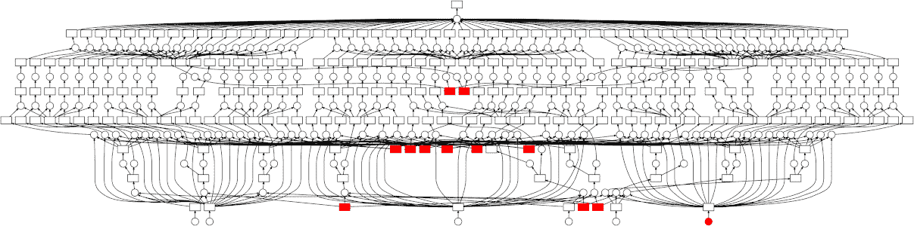
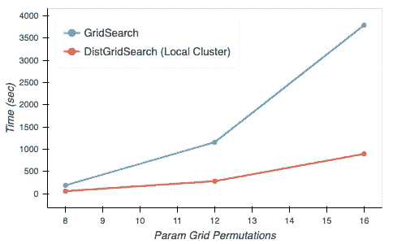

# Dask 和 RAPIDS:Capital One 的数据科学和机器学习的下一件大事

> 原文：<https://medium.com/capital-one-tech/dask-and-rapids-the-next-big-things-for-data-science-and-machine-learning-at-capital-one-d4bba136cc70?source=collection_archive---------3----------------------->

## 软件工程高级总监 Ryan McEntee 和软件工程总监 Mike McCarty

# **设置舞台**

在过去 3 年多的时间里，我有机会领导 Capital One 的工程工作，以实现我们的企业数据科学、定量分析和数据分析平台的现代化。我们的核心目标是将我们的企业数据用户从内部部署的、主要基于 SAS 的平台迁移到支持各种开源技术的定制云原生平台。你可以想象，我和我的团队从这次经历中学到了很多，但令人惊讶的是，并不是所有的经验都是技术性的。

我们的早期战略包括寻找顶尖的数据科学和机器学习工程人才(包括公司内部和外部)，以及我们的行业趋势研究，以了解该领域领先的开源技术和平台。我们还花了大量时间与来自整个企业的最终用户交流，涵盖了广泛的技术知识，以确定我们必须解决的当前痛点。解决这些棘手问题非常重要，因为我们的最终目标不仅是实现最新和最棒的技术，而且还要提高最终用户群的效率和效能。

在交付了我们新的基于云的平台的第一次迭代后，我们看到了快速、广泛的采用以及巨大的反馈。任务完成了，对吧？不幸的是，情况并非如此。几乎立刻，我们注意到大量最大的 AWS 实例在平台内旋转，用户仅利用每个实例上 128 个可用核心中的 1 个。此外，在这些实例上运行的作业将运行数小时，因为它们使用单线程 Python 或 r 在内存中存储高达 3TB 的数据。我们的目标之一是提高计算利用率，对于这些工作负载来说，达不到目标是轻描淡写的。

尽管我们非常重视了解最终用户的痛点，但我们未能考虑到最终用户群体将承受的不可避免的技能转变。

# **理解人的转变是成功的关键**

在我们所有的用户研究中，我们没有意识到 SAS 用户需要多少培训和支持才能使用开源技术并行化作业。他们在 SAS 中很容易做到这一点，但如果没有它，并行化他们的工作负载就非常困难和耗时。

例如，传统的 SAS 用户首先需要精通最流行的 Python 计算库，其中许多都不使用多个 CPU 内核，更不用说多个服务器了。一旦需要并行化来扩展更大的数据集，他们还需要精通 Spark 来重新编写他们的解决方案。重新编码可能很重要，因为许多 Python 计算库(即 NumPy 和 Pandas)在 Spark 中不是高性能的，并且 dataframe APIs 是不同的。此外，当 Spark 中的作业崩溃时，为了有效地调试错误，最终用户需要了解 Java。考虑到我们的业务不能在最终用户学习这些新技术时停止运营，完成这一转型的前景有一条非常长的尾巴。

那么，工程师们呢？难道他们不能帮助减轻从 Python 到 Spark 重新编码的负担吗？简而言之，答案是否定的。Capital One 数据的最终用户数量远远超过我们的工程人员，因此培养他们的技能使他们能够自助服务是我们成功的关键。

这就是 Dask 和 RAPIDS 的切入点。

# **为什么是达斯克和急流？**

Dask 为扩展 Python 工作负载提供了一个有前途的解决方案，最终用户可以利用熟悉的 API，避免学习 Spark 和调整不兼容代码的需要。是的，利用 Dask 仍然需要学习，但是进入的门槛比使用 Spark 要低得多。由 NVIDIA 孵化的 GPU 加速数据科学库 RAPIDS 提供了相同的 API 兼容性，并支持来自 Python 的 NVIDIA GPU 计算。与较低的准入门槛一样引人注目的是，Dask 和 RAPIDS 在应用于一些现有用例时也表现出了令人印象深刻的性能提升。

在 Capital One，Dask 的早期实现在几个月的开发时间内将模型训练时间减少了 91%。下图显示了我们在模型培训管道的一个步骤中对本地 Dask 集群所做的改进；在分布式 Dask 集群上的生产中，性能甚至更好。Dask 加快了开发过程中的迭代周期，这使得开发人员可以更快地测试他们的代码。

Dask 和 RAPIDS 可以协同使用，在 GPU 上水平和垂直扩展计算。下图显示了一个对 XGBoost 训练执行的弱伸缩性研究，该研究使用了一个不适合单个系统内存的数据集。这里，Dask 用于在 AWS 上的单个 EC2 实例上跨多个 GPU 分布计算。每个 GPU 都有一个特殊的 Dask 工人，知道如何使用 RAPIDS 在上面运行计算。多核 CPU 系统上的原始训练时间也包括在内，以供参考。请注意，y 轴是对数刻度。

通过这些改进，我们已经看到了大约 100 倍改进模型培训时间和成本下降了 97%，假设您只需在培训期间支付计算费用。

现在已经演示了使用 Dask 和 RAPIDS 的潜在计算性能增益，接下来的步骤是理解模型准确性、改进部署基础设施和培训用户。随着问题的发现，团队将尽可能地为开源项目做出贡献。

Dask 和 RAPIDS 本机扩展 Python，这允许 Capital One 数据科学家和 ML 工程师保持对他们代码的所有权，并专注于他们最擅长的领域。

# **想了解更多？**

这是一系列博客中的第一篇介绍性文章，我们的常驻 Dask 和 RAPIDS 专家 Mike McCarty 将深入探讨 Dask 和 RAPIDS 的技术细节。我们也会让你们了解我们在 Capital One 内部大规模实施这些技术的进展。

# **达斯克和激流资源**

*   【https://dask.org/ 
*   [https://rapids.ai](https://rapids.ai/)

*披露声明:2019 首创一。观点是作者个人的观点。除非本帖中另有说明，否则 Capital One 不隶属于所提及的任何公司，也不被这些公司认可。使用或展示的所有商标和其他知识产权是其各自所有者的财产。*