# 2019 年 65 大数据分析师面试问答

> 原文：<https://medium.com/edureka/data-analyst-interview-questions-867756f37e3d?source=collection_archive---------3----------------------->


Data Analyst Interview Questions — Edureka

“数据”这个词已经存在很久了。在每天产生 2.5 万亿字节数据的时代，数据在业务运营决策中扮演着至关重要的角色。但是你觉得我们怎么处理这么多数据呢？今天，在这个行业中有几个角色通过处理数据来收集见解，其中一个非常重要的角色就是数据分析师。数据分析师是一名专业人士，他的唯一职责是处理数据，收集隐藏的见解，为企业带来好处。数据分析师的平均工资预计为**₹404,660**或**83，878 美元(美国)。**我相信你已经意识到这些事实，这促使你阅读这篇数据分析师面试问题文章。

在这篇关于数据分析师面试问题的文章中，我将讨论在您的面试中与数据分析相关的常见问题。为了让您更好地理解，我将文章分成了以下几个部分:

*   *基础数据分析师面试问题*
*   *数据分析师面试问题:Excel*
*   *数据分析师面试问题:统计学*
*   *数据分析师面试问题:SAS*
*   *数据分析师面试问题:SQL*
*   *数据分析师面试问题:Tableau*
*   *数据分析师面试问题:困惑*

所以，让我们开始吧伙计们。

# 数据分析师面试问题:基本


这部分问题将包括您需要了解的与数据分析及其术语相关的所有基本问题。

## Q1。数据挖掘和数据分析有什么区别？

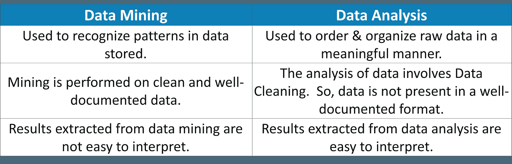

所以，如果你必须总结的话，数据挖掘经常被用来识别存储数据中的模式。它主要用于机器学习，分析师只需在算法的帮助下识别模式。然而，数据分析用于从原始数据中收集见解，在执行分析之前，必须对原始数据进行清理和组织。

## Q2。数据分析的流程是怎样的？

数据分析是收集、清理、解释、转换和建模数据以收集见解并生成报告来获取商业利润的过程。参考下图，了解该过程中涉及的各个步骤。

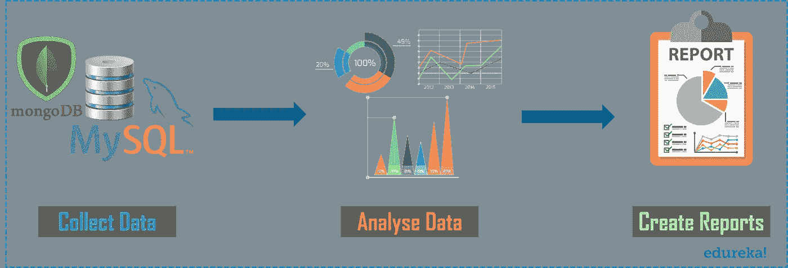

*   **收集数据:**从各种来源收集数据并存储，以便清理和准备。在这一步中，所有缺失值和异常值都将被删除。
*   分析数据:一旦数据准备好了，下一步就是分析数据。模型被反复运行以进行改进。然后，对模式进行验证，以检查它是否满足业务需求。
*   **创建报告:**最后，模型被实现，然后这样生成的报告被传递给涉众。

## Q3。数据挖掘和数据分析的区别是什么？

**数据挖掘:**数据挖掘是指对数据进行分析，找出以前没有发现的关系。它主要侧重于异常记录的检测、依赖性和聚类分析。

**数据剖析:**数据剖析是指分析数据的单个属性的过程。它主要侧重于提供关于数据属性的有价值的信息，如数据类型、频率等。

## Q4。什么是数据清理，实践数据清理的最佳方法是什么？

数据清理或争论或数据清理。意思都一样。它是识别和消除错误以提高数据质量的过程。您可以参考下图，了解处理缺失数据的各种方法。

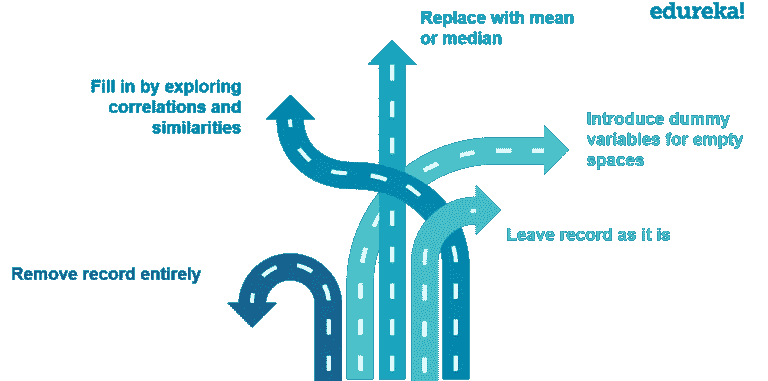

## Q5。数据验证过程中有哪些重要步骤？

顾名思义，数据验证就是验证数据的过程。这一步主要涉及两个过程。这些是数据筛选和数据验证。

*   **数据筛选:**这一步使用不同种类的算法对整个数据进行筛选，找出任何不准确的值。
*   **数据验证:**在各种用例上评估每一个可疑值，然后最终决定该值是否必须包含在数据中。

## Q6。你认为一个开发的数据模型好不好的标准是什么？

嗯，这个问题的答案可能因人而异。但是下面是我认为在决定一个开发的数据模型是好是坏时必须考虑的几个标准:

*   为数据集开发的模型应该具有可预测的性能。这是预测未来所需要的。
*   如果一个模型能够根据业务需求轻松地适应变化，那么它就是一个好的模型。
*   如果数据发生变化，模型应该能够根据数据进行缩放。
*   开发的模型还应该能够被客户容易地消费，以获得可操作的和有利可图的结果。

## Q7。你认为什么时候应该重新培训一个模特？是否依赖于数据？

业务数据每天都在变化，但格式不会改变。当一个企业进入一个新的市场，看到一个突然上升的反对或看到自己的立场上升或下降，建议重新培训模型。因此，当业务动态发生变化时，建议根据客户行为的变化重新训练模型。

## Q8。您能提到数据分析师在执行分析时通常会遇到的几个问题吗？

以下是执行数据分析时通常会遇到的一些问题。

*   存在重复条目和拼写错误，降低数据质量。
*   如果您从一个差的数据源提取数据，那么这可能是一个问题，因为您将不得不花费大量的时间来清理数据。
*   当您从源中提取数据时，数据的表现形式可能会有所不同。现在，当您组合来自这些来源的数据时，可能会发生表示上的变化导致延迟。
*   最后，如果有不完整的数据，那么这可能是执行数据分析的一个问题。

## Q9。什么是 KNN 插补方法？

此方法用于估算缺失属性值，这些缺失属性值由与缺失值的属性最相似的属性值估算。通过使用距离函数来确定两个属性的相似性。

## Q10。提到 Apache 为分布式计算环境中的应用程序处理大型数据集而开发的框架的名称？

完整的 Hadoop 生态系统旨在为分布式计算环境中的应用处理大型数据集。Hadoop 生态系统由以下 Hadoop 组件组成。

*   **HDFS**->T2【Hadoop 分布式文件系统
*   **纱**->又一个资源谈判者
*   **MapReduce**->-*数据处理使用编程*
*   **火花** - >内存数据处理
*   **PIG，HIVE**->-*数据处理服务使用查询(类 SQL)*
*   **h base**->-*NoSQL 数据库*
*   **看象人，Spark ml lib**->-机器学习
*   **Apache Drill**->-*Hadoop 上的 SQL*
*   **动物园管理员**->-管理集群
*   **oo zie**->-*作业调度*
*   **Flume，sq OOP**->-*数据摄取服务*
*   **Solr&Lucene**->搜索&索引
*   **Ambari**->-*提供、监控和维护集群*

现在，进入下一组问题，这是 Excel 面试问题。

# 数据分析师面试问题:Excel


Microsoft Excel 是目前最简单、最强大的软件应用程序之一。它允许用户使用直观的数据操作界面进行定量分析和统计分析，以至于它的使用跨越了不同的领域和专业需求。这是一个重要的领域，为成为数据分析师提供了良好的开端。所以，现在让我们快速讨论一下关于这个话题的问题。

## Q1。你能说出什么是瀑布图，我们什么时候使用它吗？

瀑布图显示了导致最终结果值的正值和负值。例如，如果你正在分析一家公司的净收入，那么你可以在这个图表中得到所有的成本值。有了这样的图表，你可以直观地看到，当所有的成本都被扣除后，从收入到净收入的值是如何得到的。

## **Q2。如何在 Excel 中高亮显示有负值的单元格？**

通过使用条件格式，可以在 Excel 中突出显示带有负值的单元格。以下是您可以遵循的步骤:

*   选择要用负值突出显示的单元格。
*   转到**主页标签**，点击**条件格式**选项
*   转到**突出显示单元格规则**并点击**小于**选项。
*   在“小于”对话框中，将值指定为 0。

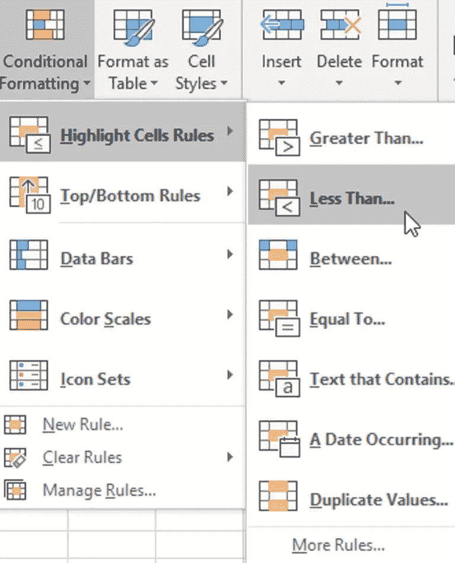

## Q3。如何在不删除单元格内容的情况下清除所有格式？

有时，您可能想要删除所有格式，只想要基本/简单的数据。为此，您可以使用主页选项卡**中的**清除格式**选项。**点击**‘Clear’**下拉菜单，可以明显看到该选项。


## Q4。什么是数据透视表，数据透视表有哪些不同的部分？

数据透视表是 Microsoft Excel 中的一个简单功能，它允许您快速汇总庞大的数据集。它非常容易使用，因为它需要拖放行/列标题来创建报告。

数据透视表由四个不同的部分组成:

*   **数值区**:数值在此区域报告
*   **行区域**:显示在数值左侧的标题。
*   **列区域:**值区域顶部的标题构成了列区域。
*   **过滤区:**这是一个可选的过滤器，用于在数据集中向下钻取。

## Q5。你能从多个表中创建一个数据透视表吗？

是的，当这些表之间存在连接时，我们可以从多个不同的表中创建一个数据透视表。

## **Q6。如何才能在 Excel 中选择所有空白单元格？**

如果您希望选择 Excel 中的所有空白单元格，那么您可以使用 Excel 中的**转到特殊对话框**。下面是在 Excel 中选择所有空白单元格时可以遵循的步骤。

*   首先，选择整个数据集并按 F5 键。这将打开一个**转到对话框**。
*   点击“**特殊**按钮，将打开一个**转到特殊对话框**。
*   之后，选择**毛坯**并点击**确定**。

最后一步将选择数据集中的所有空白单元格。

## Q7。在创建仪表板之前，您应该问客户哪些最常见的问题？

这个问题的答案因人而异。但是，这里有一些在 Excel 中创建仪表板时可以问的常见问题。

*   仪表板的用途
*   不同的数据源
*   Excel 仪表板的使用
*   仪表板需要更新的频率
*   客户端使用的 Office 版本。

## Q8。什么是打印区域，如何在 Excel 中设置？

Excel 中的打印区域是您在打印工作表时指定要打印的单元格区域。例如，如果您只想打印整个工作表的前 20 行，那么您可以将前 20 行设置为打印区域。

现在，要在 Excel 中设置打印区域，您可以按照以下步骤操作:

*   选择要设置打印区域的单元格。
*   然后，单击页面布局选项卡。
*   点击打印区域。
*   点击设置打印区域。

## Q9。您可以采取哪些步骤来处理运行缓慢的 Excel 工作簿？

嗯，有各种方法来处理缓慢的 Excel 工作簿。但是，这里有一些处理工作簿的方法。

*   尝试使用手动计算模式。
*   在单个工作表中维护所有引用的数据。
*   经常使用 excel 表格和命名区域。
*   使用辅助列而不是数组公式。
*   尽量避免在引用中使用整行或整列。
*   将所有未使用的公式转换为值。

## Q10。可以一次对多列进行排序吗？

多重排序是指对一列进行排序，然后通过保持第一列不变来对另一列进行排序。在 Excel 中，您可以一次对多个列进行排序。

要进行多重排序，需要使用**排序对话框**。现在，为了得到这个，你可以选择你想要排序的数据，然后点击**数据标签**。之后，点击**排序图标。**

在此对话框中，您可以指定一列的详细信息，然后通过点击**添加级别**按钮排序到另一列。

接下来是下一组问题，即与统计相关的问题。

# 数据分析师面试问题:统计


统计学是数学的一个分支，处理数据的收集、组织、分析、解释和展示。统计学可以分为两类:差异统计学和推断统计学。这个领域与数学有关，因此给了数据分析职业生涯一个启动。

## Q1。你对正态分布这个术语的理解是什么？

这是统计学中最重要和最广泛使用的分布之一。正态分布通常被称为钟形曲线或高斯曲线，用于测量值的均值和标准差之间的差异。参考下图。

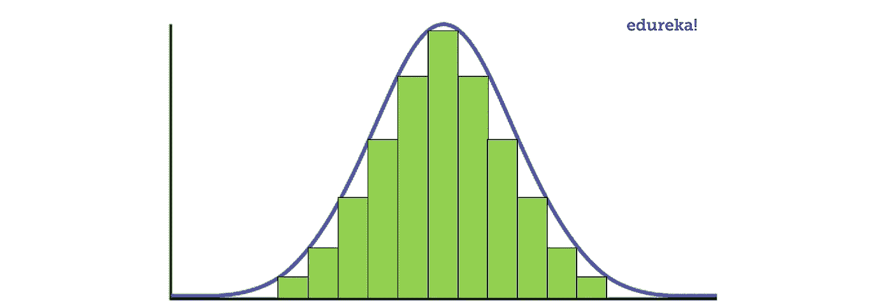

正如您在上面的图像中看到的，数据通常分布在一个中心值周围，不会偏向左侧或右侧。此外，随机变量以对称钟形曲线的形式分布。

## **Q2。什么是 A/B 测试？**

A/B 检验是对具有两个变量 A 和 B 的随机实验进行的统计假设检验。也称为分割检验，它是一种基于样本统计估计总体参数的分析方法。该测试通过显示两个变量 A 和 B 来比较两个网页，对于相似数量的访问者，给出更好转化率的变量获胜。

A/B 测试的目标是确定网页是否有任何变化。例如，如果你有一个横幅广告，你已经花了大量的钱。然后，你可以通过横幅广告了解投资回报，即点击率。

## Q3。敏感度的统计能力是什么？

敏感度的统计能力用于验证分类器的准确性。该分类器可以是逻辑回归、支持向量机、随机森林等。

如果我必须定义敏感度，那么敏感度就是预测真实事件与总事件的比率。现在，真实事件是真实的事件，模型也预测它们是真实的。

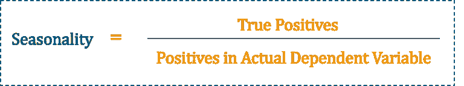

## Q4。另一个假设是什么？

要解释替代假设，可以先解释什么是零假设。零假设是一种统计现象，用于在假设随机结果为真的情况下测试可能的拒绝。

在这之后，你可以说替代假设又是一个统计现象，与零假设相反。通常，人们认为这些观察结果是一个有变化可能性的结果。

## Q5。单变量、双变量、多变量分析有什么区别？

单变量、双变量和多变量分析之间的差异如下:

*   **单变量:**一种描述性的统计技术，可以基于在给定时间实例中涉及的变量计数来区分。
*   **双变量:**该分析用于一次找出两个变量之间的差异。
*   **多元:**对两个以上变量的研究无非就是多元分析。这种分析用于理解变量对响应的影响。

## Q6。你能告诉我什么是特征向量和特征值吗？

**特征向量:**特征向量基本用来理解线性变换。这些是为相关或协方差矩阵计算的。

为了定义的目的，你可以说特征向量是一个特定的线性变换通过翻转、压缩或拉伸作用的方向。

**特征值:**特征值可指变换的强度或在特征向量方向上发生压缩的因子。

## Q7。单样本 T 检验和双样本 T 检验有什么区别？

你可以回答这个问题，首先解释一下 T 检验到底是什么。关于 T 检验的解释，请参考下文。

t 检验是一种假设检验，通过它你可以比较平均值。对样本数据执行的每个测试都会将样本数据降低到一个值，即 T 值。参考下面的公式。

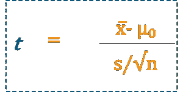

现在，为了解释这个公式，您可以使用信噪比的类比，因为这个公式是一个比率格式。

这里，分子是信号，分母是噪声。

因此，要计算单样本 T 检验，必须从样本均值中减去零假设值。如果样本均值等于 7，零假设值为 2，则信号将等于 5。

因此，我们可以说，样本均值和零假设之间的差异与信号的强度成正比。

现在，如果你观察噪声的分母，在我们的例子中，它是变异性的量度，称为均值的标准误差。因此，这基本上表明了您的样本估计总体或完整数据集的平均值的准确程度。

因此，可以认为噪声与样本精度成间接比例关系。

现在，信噪比就是 T 检验 1 的计算方法。所以，你可以看到你的信号是如何从噪音中区分出来的。

要计算双样本检验，需要找出两个样本的差值与零假设的比值。

因此，如果我必须为您总结一下，单样本 T-检验决定了一个样本集如何与平均值保持一致，而双样本 T-检验决定了两个样本集之间的平均值是否对整个人群真的有意义，或者纯粹是偶然的。

## Q8。什么是不同类型的假设检验？

假设检验的不同类型如下:

*   **T-检验:**T-检验用于标准差未知且样本量相对较小的情况。
*   **独立性卡方检验:**这些检验用于找出总体样本中分类变量之间关联的显著性。
*   **方差分析(ANOVA):** 这种假设检验用于分析各组均值之间的差异。这种检验通常类似于 T 检验，但用于两组以上的人群。
*   **韦尔奇 T 检验:**该检验用于找出两个总体样本间均值相等的检验。

## Q9。如何以马尔可夫随机场(MRF)的形式表示贝叶斯网络？

要以马尔可夫随机场的形式表示贝叶斯网络，可以考虑以下示例:

考虑在贝叶斯网络中通过边连接的两个变量，然后我们可以有一个概率分布，分解成概率 A 和概率 b，然而，如果我们在马尔可夫随机场提到同一个网络，它将被表示为单个势函数。参考下文:

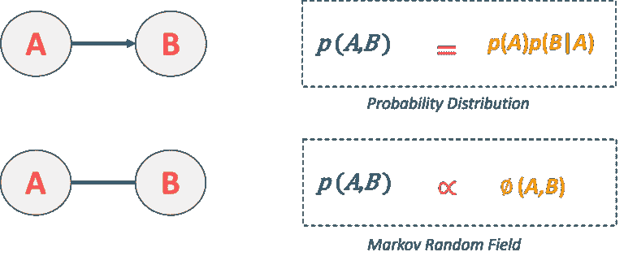

这是一个简单的例子。现在，我们来看一个复杂的例子，其中一个变量是另外两个变量的父变量。这里，A 是父变量，它指向 B 和 C。在这种情况下，概率分布将等于 A 的概率和 B 的条件概率，给定 A，给定 C。现在，如果您必须将其转换为马尔可夫随机场，类似结构图的因式分解，其中我们有 A/B 边的势函数和 A/C 边的势函数。参考下图。

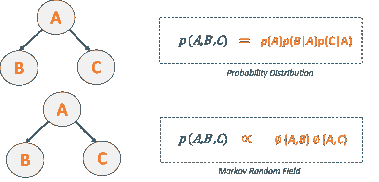

## Q10。方差和协方差的区别是什么？

方差和协方差是统计学中常用的两个数学术语。方差基本上是指数字与平均值之间的差距。另一方面，协方差指的是两个随机变量将如何一起变化。这个基本上是用来计算变量之间的相关性的。

如果您最近参加过任何数据分析面试，请将这些面试问题粘贴到评论部分，我们会尽快回答。如果您在 Data Analytics 面试中有任何疑问，也可以在下面发表评论。

现在，让我们进入下一组问题，即 SAS 面试问题。

# 数据分析师面试问题:情景应用程序


**SAS 研究所自己提供的统计分析系统(SAS)** 是目前市场上最流行的数据分析工具。简而言之，情景应用程序可以处理复杂的数据，并生成有意义的见解，帮助组织做出更好的决策或预测不久的将来可能的结果。因此，这让你挖掘，改变，管理和检索不同来源的数据，并对其进行分析。

## Q1。什么是 SAS 中的交叉存取？

SAS 中的交错意味着将单独排序的 SAS 数据集组合成一个排序的数据集。您可以使用 SET 语句和 BY 语句来交叉存取数据集。

在下面的例子中，数据集按变量 Age 排序。

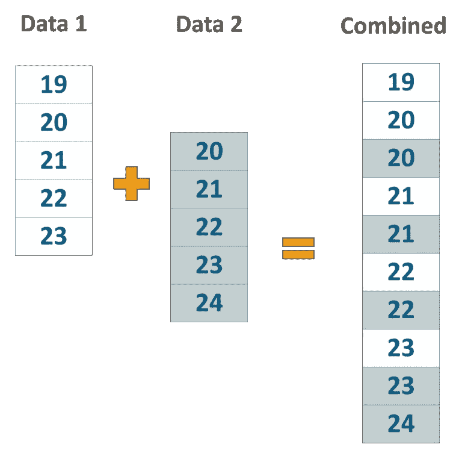

通过编写以下查询，我们可以对年龄数据集进行排序，然后将其连接起来:

```
data combined;
set Data1, Data2;
by Age;
run;
```

## Q2。SAS 写代码的基本语法风格是什么？

在 SAS 中编写代码的基本语法风格如下:

1.  编写数据语句，该语句将命名数据集。
2.  编写输入语句来命名数据集中的变量。
3.  所有语句都应以分号结束。
4.  单词和语句之间应该有适当的间隔。

## Q3。Do 索引、Do While 和 Do Until 循环有什么区别？举例说明。

要回答这个问题，可以先回答到底什么是 Do 循环。因此，Do 循环用于根据条件重复执行代码块。你可以参考下图来看看 Do 循环的工作流程。

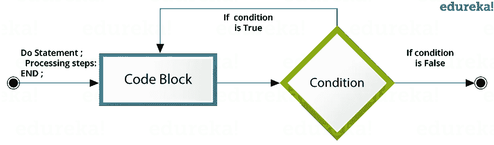

*   我们使用一个索引变量作为**执行索引循环的开始和停止值:执行索引循环**。SAS 语句重复执行，直到索引变量达到最终值。
*   **Do While 循环:Do While** 循环使用 While 条件。当条件为真时，该循环执行代码块，并一直执行，直到条件为假。一旦条件变为假，循环就终止。
*   Do Until 循环使用一个 **Do Until 循环:Until** 条件。当条件为假时，该循环执行代码块，并一直执行，直到条件为真。一旦条件变为真，循环就终止。

如果你必须解释代码，那么让我们说，我们要计算变量的总数。

对于循环，您可以编写如下代码:

**做指标**

```
DATA ExampleLoop;
SUM=0;
Do VAR = 1 = 10;
SUM = SUM + VAR;
END;
PROC PRINT DATA = ExampleLoop;
Run;
```

输出将是:


**边做边做**

```
DATA ExampleLoop;
SUM = 0;
VAR = 1;
Do While(VAR<15);
SUM = SUM + VAR;
VAR+1;
END;
PROC PRINT DATA = ExampleLoop;
Run;
```

输出将是:


**一直做到**

```
DATA ExampleLoop;
SUM = 0;
VAR = 1;
Do Until(VAR>15);
SUM=SUM+VAR;
VAR+1;
END;
PROC PRINT;
Run;
```

输出将是:


## Q4。SAS 中的 ANYDIGIT 函数是什么？

ANYDIGIT 函数用于搜索字符串。找到字符串后，它将简单地返回所需的字符串。

## Q5。你能说出 VAR X1 — X3 和 VAR X1 — X3 之间的区别吗？

当在变量之间指定单个破折号时，则指定连续编号的变量。类似地，如果在变量之间指定双破折号，那么这将指定数据集中所有可用的变量。

**例如:**

考虑以下数据集:

数据集:ID 名称 X1 X2 Y1 X3

然后，X1 — X3 将返回 X1 X2 X3

X1 — X3 将返回 X1 X2 Y1 X3

## Q6。尾随@和@@的目的是什么？你如何使用它们？

结尾的@通常被称为列指针。因此，当我们在输入语句中使用尾随@时，它使您能够读取原始数据行的一部分，测试它并决定如何从同一记录中读取额外的数据。

*   单个尾随@告诉 SAS 系统“保持线路”。
*   双尾@@告诉 SAS 系统“更有力地保持线路”。

以@@结尾的*输入*语句指示程序仅在当前原始数据行中没有数据值可供读取时才释放该行。因此,@@即使在数据步骤的多次迭代中也能保存输入记录。

## Q7。以下 SAS 函数的结果会是什么(假设 2017 年 12 月 31 日是星期六)？

## Weeks = intck ('week '，' 2017 年 12 月 31 日' d，' 2018 年 1 月 1 日' d)；
年= intck('年'，' 2017 年 12 月 31 日' d，' 2018 年 1 月 1 日' d)；
Months = intck ('month '，' 2017 年 12 月 31 日' d，' 2018 年 1 月 1 日' d)；

这里，我们将计算 2017 年 12 月 31 日到 2018 年 1 月 1 日之间的周数。2017 年 12 月 31 日是一个星期六。因此，2018 年 1 月 1 日将是下周的一个星期天。

*   因此，Weeks = 1，因为这两天属于不同的周。
*   Years = 1，因为这两天属于不同的日历年。
*   Months = 1，因为这两天在日历的不同月份中。

## Q8。PROC SQL 是如何工作的？

PROC SQL 只不过是所有观察的同步过程。执行 PROC SQL 时，会发生以下步骤:

*   SAS 扫描 SQL 过程中的每一条语句，并检查语法错误。
*   SQL 优化器扫描语句中的查询。因此，SQL 优化器基本上决定了应该如何执行 SQL 查询，以最小化运行时间。
*   如果 FROM 语句中有任何表，那么它们将被加载到数据引擎中，然后可以在内存中访问它们。
*   执行代码和计算。
*   最终表在内存中创建。
*   最终的表被发送到 SQL 语句中描述的输出表。

## Q9。如果给你一个未排序的数据集，你将如何读取新数据集的最后一个观察值？

我们可以使用`end = dataset`选项将最后一次观察读取到新的数据集。

例如:

```
data example.newdataset;
set example.olddataset end=last;
If last;
run;
```

其中*新数据集*是要创建的新数据集，而*旧数据集*是现有数据集。 *last* 是临时变量(初始化为 0)，当 set 语句读取最后一个观察值时，该变量被设置为 1。

## Q10。sum 函数和使用“+”运算符有什么区别？

**SUM** 函数返回非缺失参数的总和，而 **"+"** 操作符在任何参数缺失时返回缺失值。考虑下面的例子。

**示例:**

```
data exampledata1;
input a b c;
cards;
44 4 4
34 3 4
34 3 4
. 1 2
24 . 4
44 4 .
25 3 1
;
run;
data exampledata2;
set exampledata1;
x = sum(a,b,c);
y=a+b+c;
run;
```

在输出中，第四、第五和第六次观察的 y 值缺失，因为我们使用了“+”运算符来计算 y 值。

```
x y
52 52
41 41
41 41
3 .
28 .
48 .
29 29
```

现在，让我们进入下一组问题，即 SQL 面试问题。

# 数据分析师面试问题:SQL

RDBMS 是迄今为止最常用的数据库之一，因此 ***SQL 技能*** 在大多数工作角色中是不可或缺的，例如数据分析师。了解结构化查询语言，可以引导你成为一名数据分析师，因为在面试中你会清楚地知道如何处理数据库。

## Q1。SQL 的默认端口是什么？

官方互联网号码管理机构(IANA)为 SQL server 分配的默认 TCP 端口是 1433。

## Q2。DBMS 是什么意思？它有哪些不同的类型？

**数据库管理系统** ( **DBMS** )是一个软件应用程序，它与用户、应用程序和数据库本身进行交互，以捕获和分析数据。存储在数据库中的数据可以修改、检索和删除，并且可以是任何类型，如字符串、数字、图像等。

主要有 4 种类型的数据库管理系统，它们是层次的、关系的、网络的和面向对象的数据库管理系统。

*   **分层数据库管理系统:**顾名思义，这种类型的数据库管理系统具有一种前任-继任关系类型的风格。因此，它具有类似于树的结构，其中节点表示记录，树的分支表示字段。
*   **关系型数据库管理系统(RDBMS):** 这种类型的数据库管理系统使用一种结构，允许用户识别和访问与数据库中另一段数据相关的数据*。*
*   **网络 DBMS:** 这种类型的 DBMS 支持多对多关系，其中可以链接多个成员记录。
*   **面向对象的 DBMS:** 这种类型的 DBMS 使用称为 objects 的小型独立软件。每个对象都包含一段数据和对数据进行操作的指令。

## Q3。什么是数据库中的 ACID 属性？

酸是原子性、一致性、隔离性和持久性的缩写。该属性在数据库中用于确保数据事务在系统中是否得到可靠处理。如果你必须定义这些术语中的每一个，那么你可以参考下面。

*   **原子性:**是指事务要么完全成功，要么完全失败。这里的事务指的是单个操作。因此，即使单个事务失败，整个事务也会失败，并且数据库状态保持不变。
*   **一致性:**该特性确保数据必须符合所有的有效性规则。因此，这基本上确保了事务不会在没有完成其状态的情况下离开数据库。
*   **隔离:**隔离使事务在完成之前保持相互隔离。所以基本上每一笔交易都是独立的。
*   持久性:持久性确保你提交的交易永远不会丢失。因此，这保证了数据库将跟踪挂起的更改，即使出现断电、崩溃或任何类型的错误，服务器也可以从异常终止中恢复。

## Q4。什么是正常化？解释不同类型的标准化的优点。

标准化是组织数据以避免重复和冗余的过程。标准化有许多连续的层次。这些被称为**范式**。每个连续的范式都依赖于前一个范式。前三种范式通常就足够了。

*   ***【1NF】***—行内无重复组
*   ***第二范式(2NF)*** —每个非键(支持)列值都依赖于整个主键。
*   ***第三范式(3NF)*** —只依赖主键，不依赖其他非键(支持)列值。
*   ***【Boyce-Codd 范式(BCNF)*** *— BCNF 是 3NF 的高级版本。如果一个表是 3NF，并且对于每个 X - > Y，关系 X 应该是该表的超级键，则称该表在 BCNF。*

***的一些优点有:***

*   更好的数据库组织
*   更多行更小的表格
*   高效的数据访问
*   更大的查询灵活性
*   快速查找信息
*   更容易实现安全性
*   允许轻松修改
*   减少冗余和重复数据
*   更紧凑的数据库
*   确保修改后数据一致

## Q5。有哪些不同类型的连接？

用于在表之间检索数据的各种类型的连接有内部连接、左连接、右连接和完全外部连接。请参考右侧的图像。


*   **内部连接:**SQL 中的内部连接是最常见的连接类型。它用于返回满足连接条件的多个表中的所有行。
*   **Left Join:**SQL 中的 Left Join 用于返回左表中的所有行，但只返回右表中满足连接条件的匹配行。
*   **右连接:**SQL 中的右连接用于返回右表中的所有行，但只返回左表中满足连接条件的匹配行。
*   **完全联接:**当任何表中有匹配项时，完全联接将返回所有记录。因此，它返回左侧表中的所有行和右侧表中的所有行。

## Q6。假设您有一个由列名(employeeId、employeeName)组成的雇员详细信息表，并且您想从表中提取备用记录。你认为你如何能完成这项任务？

您可以通过使用元组的行号来获取替代元组。假设我们想要显示偶数记录的 employeeId，那么您可以使用 mod 函数，只需编写以下查询:

```
Select employeeId from (Select rownumber, employeeId from employee) where mod(rownumber,2)=0
```

其中' ***雇员'*** 是表名。

类似地，如果您想要显示奇数记录的 employeeId，那么您可以编写以下查询

```
Select employeeId from (Select rownumber, employeeId from employee) where mod(rownumber ,2)=1
```

## Q7。考虑下面的两个表。

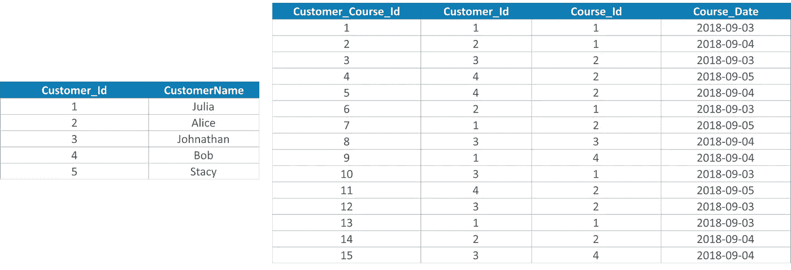

## 现在，编写一个查询来获取在同一天多次参加该课程的客户列表。客户应该按照客户分组，课程和列表应该按照最近的日期排序。

```
SELECT
c.Customer_Id,
CustomerName,
Course_Id,
Course_Date,
count(Customer_Course_Id) AS count
FROM customers c JOIN course_details d ON d.Customer_Id = c.Customer_Id
GROUP BY c.Customer_Id,
CustomerName,
Course_Id,
Course_Date
HAVING count( Customer_Course_Id ) > 1
ORDER BY Course_Date DESC;
```

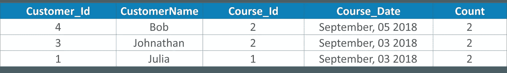

## Q8。考虑下面的 Employee_Details 表。这里的表有各种特性，比如 Employee_Id、EmployeeName、年龄、性别和班次。班次有 m =早班，e =晚班。现在，您必须用一个更新查询交换' m '和' e '值，反之亦然。


您可以编写以下查询:

```
UPDATE Employee_Details SET Shift = CASE Shift WHEN 'm' THEN 'e' ELSE 'm' END
```

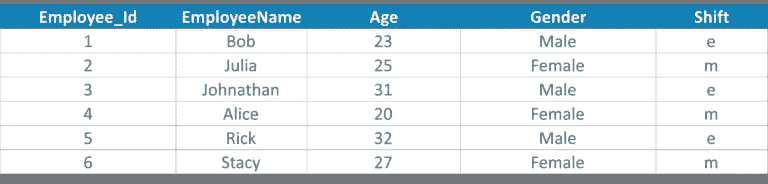

## Q9。编写一个 SQL 查询，从 Employee_Details 表中获取雇员的第三高工资，如下所示。

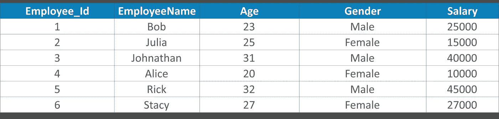

```
SELECT TOP 1 Salary
FROM(
SELECT TOP 3 Salary
FROM Employee_Details
ORDER BY salary DESC) AS emp
ORDER BY salary ASC;
```

## Q10。SQL 中的 NVL 和 NVL2 函数有什么区别？

NVL(exp1，exp2)和 NVL2(exp1，exp2，exp3)是检查 exp1 的值是否为空的函数。

如果我们使用 NVL(exp1，exp2)函数，那么如果 exp1 不为空，那么将返回 exp1 的值；否则将返回 exp2 的值。但是，exp2 必须与 exp1 具有相同的数据类型。

同样，如果我们使用 NVL2(exp1，exp2，exp3)函数，那么如果 exp1 不为空，将返回 exp2，否则将返回 exp3 的值。

# 数据分析师面试问题:Tableau


**Tableau** 是一款商业智能软件，允许任何人连接到各自的数据。它可视化并创建交互式、可共享的仪表板。了解 Tableau 会增强你对数据分析和数据可视化的理解。

## Q1。Tableau 和 Power BI 有什么区别？

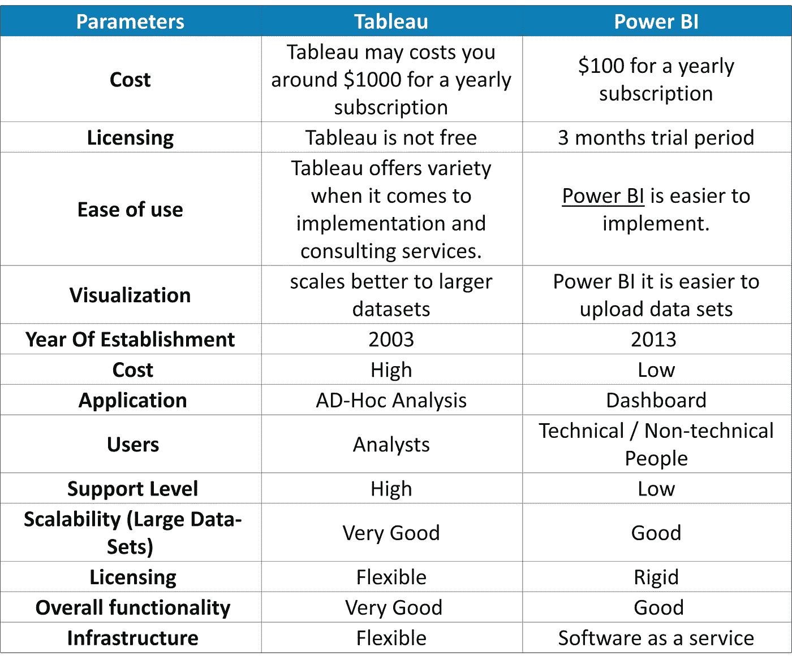

## Q2。什么是双轴？

双轴是 Tableau 提供的现象。这有助于用户在同一个图表中查看两个度量的两个尺度。像 Indeed.com 这样的网站利用双轴来显示两个指标之间的比较以及这两个指标在一系列年份中的增长情况。双轴让您可以一次比较多个度量，两个独立的轴一个在另一个之上。参考下图，看看它是什么样子的。

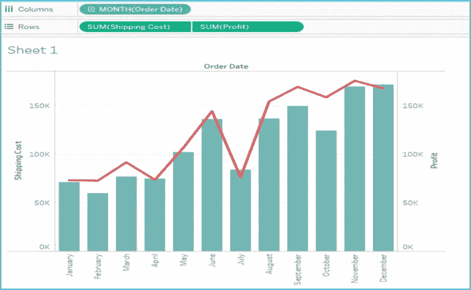

## Q3。Tableau 中的加入和融合有什么区别？

当您组合来自同一个源的数据时，例如 Excel 文件中的工作表或 Oracle 数据库中的表，就会使用**联接**术语。而**混合**需要你的报告中有两个完全定义的数据源。

## Q4。如何在 Tableau 中创建计算字段？

要在 Tableau 中创建计算字段，可以按照以下步骤操作:

*   单击数据窗格上维度右侧的下拉菜单，选择“**创建** > **计算字段**”打开计算编辑器。
*   命名新字段并创建一个公式。

看看下面的快照:

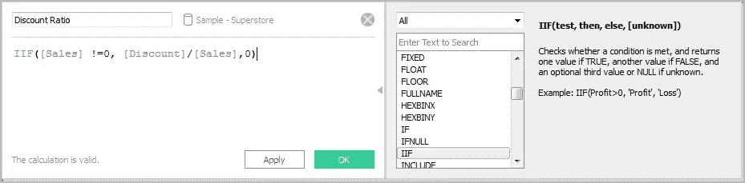

## Q5。如何在 Tableau 中查看底层 SQL 查询？

要在 Tableau 中查看底层 SQL 查询，我们主要有两个选项:

*   **使用性能记录功能:**您必须创建一个性能记录来记录您与工作簿交互的主要事件的信息。用户可以在 Tableau 创建的工作簿中查看绩效指标。
    *帮助- >设置和演奏- >开始演奏录音。*
    *【帮助】- >设定和演奏- >停止演奏录音。*
*   **查看 Tableau 桌面日志:**您可以查看位于*C:users my documents my Tableau*存储库的 Tableau 桌面日志。对于数据源的实时连接，可以检查 log.txt 和 tabprotosrv.txt 文件。对于摘录，请检查 tdeserver.txt 文件。

## Q6。在地图中设计一个视图，如果用户选择任何国家，该国家下的州必须显示利润和销售额。

根据您的问题，您的数据集中必须有国家、州、利润和销售字段。

*   双击国家字段。
*   将状态拖放到标记卡中。
*   拖动销售并将其放入大小。
*   拖动利润并将其放入彩色。
*   点击尺寸图例并增加尺寸。
*   右键单击国家字段并选择显示快速过滤器。
*   现在选择任何国家并查看视图。

## Q7。热图和树状图有什么区别？

热图用于用颜色和大小来比较类别。使用热图，您可以一起比较两种不同的度量。树状图是一种强大的可视化工具，其功能与热图相同。除此之外，它还用于说明分层数据和部分到整体的关系。

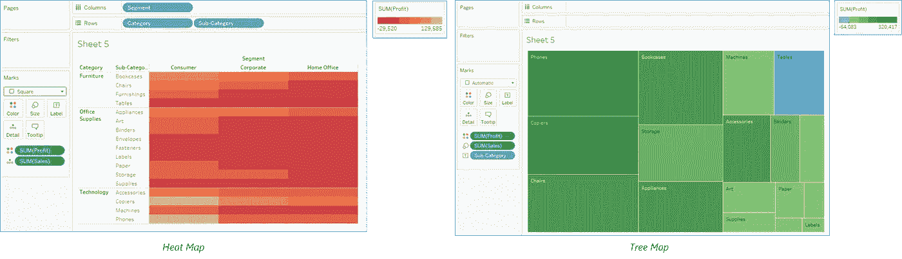

## Q8。什么是数据的聚集和分解？

**数据聚集:**数据聚集是指在更高、更汇总的数据级别查看数值或度量的过程。当您将一个测量放在架子上时，Tableau 会自动汇总您的数据。只需查看函数，就可以确定聚合是否已应用于某个字段。这是因为当功能放在工具架上时，它总是出现在字段名称的前面。

***举例* :** *销售*字段汇总后将变成*总和(销售额)*。

只能对关系数据源使用 Tableau 来聚合度量值。多维数据源仅包含聚合数据。在 Tableau 中，多维数据源仅在 Windows 中受支持。

数据分解:数据分解允许您查看数据源的每一行，这对分析度量很有用。

***示例:*** 考虑一个场景，您正在分析产品满意度调查的结果。这里参与者的年龄沿着一个轴。现在，您可以合计年龄字段来确定参与者的平均年龄，或者您可以分解数据来确定参与者对其产品最满意的年龄。

## Q9。你能告诉我如何在 Tableau 中创造故事吗？

故事用于叙述一系列事件或制作一个业务用例。Tableau 仪表板提供了创建故事的各种选项。每个故事点可以基于不同的视图或仪表板，或者整个故事可以基于相同的可视化，只是在不同的阶段看到，过滤了不同的标记并添加了注释。

***要在 Tableau 中创建一个故事，您可以遵循以下步骤:***

*   点击**新故事标签**。
*   在屏幕左下角的*中，为您的故事选择一个尺寸。从预定义的大小中选择一个，或以像素为单位设置自定义大小。*
*   默认情况下，您的故事的标题来自其工作表名称。要**编辑**它，双击标题。您还可以更改标题的字体、颜色和对齐方式。单击应用查看您的更改。
*   要开始构建您的故事，*从左侧的**故事选项卡**中拖动一个工作表*，并将其放入视图的**中心。**
*   点击**添加**标题到**总结**故事点。
*   要为您的观众突出显示一个关键要点，请将一个文本对象拖到故事工作表中，然后键入您的注释。
*   为了进一步突出这个故事点的主要思想，您可以更改视图中某个字段的过滤器或排序，然后通过单击导航框上方的**更新**来**保存您的更改。**

## Q10。你能告诉我如何在网页上嵌入视图吗？

您可以将交互式 Tableau 视图和仪表板嵌入到网页、博客、wiki 页面、web 应用程序和 intranet 门户中。嵌入式视图会随着基础数据的更改或其工作簿在 Tableau Server 上的更新而更新。嵌入式视图遵循 Tableau 服务器上使用的相同许可和权限限制。也就是说，要查看网页中嵌入的 Tableau 视图，访问该视图的人还必须拥有 Tableau Server 帐户。

或者，如果您的组织在 Tableau Server 上使用基于核心的许可证，则可以使用来宾帐户。这使您组织中的人员无需登录服务器即可查看嵌入在网页中的 Tableau 视图并与之交互。请与您的服务器或网站管理员联系，以确定您发布到的网站是否启用了来宾用户。

***您可以执行以下操作来嵌入视图并调整其默认外观:***

*   获取视图提供的嵌入代码:每个视图顶部的“共享”按钮包含嵌入代码，您可以将其复制并粘贴到您的网页中。(如果在代码中将 showShareOptions 参数更改为 false，则“共享”按钮不会出现在嵌入式视图中。)
*   自定义嵌入代码:您可以使用控制工具栏、选项卡等的参数自定义嵌入代码。有关更多信息，请参见嵌入代码的参数。
*   使用 Tableau JavaScript API: Web 开发者可以在 Web 应用程序中使用 Tableau JavaScript 对象。要访问 API、文档、代码示例和 Tableau 开发人员社区，请参见 Tableau 开发人员门户。

现在，转到更有趣的事情上，我计划了一套 5 个谜题，这是数据分析师访谈中最常被问到的问题。

# 数据分析师面试问题:谜题

分析行业主要依赖于专业人士，他们不仅擅长市场上可用的各种数据分析工具，而且还依赖于那些具有出色的解决问题技能的专业人士。你需要掌握的最重要的技能是解决问题的方法。哦，是的，你的方法也应该是这样的，你应该能够向面试官解释。

所以让我们开始吧！

## Q1。第一个和第二个罐子里分别有 3 个贴错标签的黑白球。第三个罐子里装的是黑白两色的球。现在，你可以根据需要挑选尽可能多的球来给每个罐子贴上正确的标签。

## 告诉你在给罐子贴标签的过程中要捡的球的最少数量。

如果你注意到问题中的条件，你会观察到有一个循环错位。我的意思是，如果黑色被错误地标记为黑色，黑色就不能被标记为白色。所以，必须取名为背+白。如果你认为这 3 个罐子都放错了，也就是说，黑+白罐子里要么有黑球，要么有白球，但不是两个都有。现在，假设你从黑+白的罐子里选了一个球，让我们假设它是一个黑球。所以，很明显，你会把罐子命名为黑色。但是，标有黑色的罐子不能有黑+白。因此，流程中剩下的第三个罐子应该贴上黑+白的标签。所以，如果你拿起一个球，你就能正确地给瓶子贴上标签。

## Q2。南瓜必须平均分成 8 等份。你只能切三次。

## 你认为，你会使这成为可能吗？

回答这个问题的方法很简单。你只需要从中间水平切开南瓜，然后再垂直交叉切开另外两个切口。所以，这会给你 8 个相等的部分。

## Q3。跑道上有五条车道。人们需要在总共 25 匹马中找出 3 匹最快的马。

## 确定要进行的最少比赛次数，以便找到最快的三辆车。

现在，你可以开始考虑赛车的数量来解决这个问题。因为有 25 辆汽车在 5 条车道上比赛，所以最初会进行 5 场比赛，每组有 5 辆汽车。接下来，将在前 5 场比赛的获胜者之间进行第六场比赛，以确定 3 辆最快的汽车(比如 X1、Y1 和 Z1)。

现在，假设 X1 是三辆车中最快的，那么这意味着 A1 是 25 辆赛车中最快的。但问题是如何最快地找到第二和第三个？我们不能假设 Y1 和 Z1 是第二和第三，因为 X1s’车厢组中的其余车厢可能比 Y1 和 Z1 更快。因此，为了确定这一点，在车辆 Y1、Z1 和来自 X1 组(X3 X2)的车辆以及来自 Y1 组 Y2 的第二辆车辆之间进行 7 次跟踪。

所以，完成第一站第二和第七名的赛车实际上是所有赛车中第二和第三快的赛车。

## Q4。考虑 10 叠每叠 10 枚硬币，每枚硬币重 10 克。但是，10 叠硬币中有一叠是有缺陷的，这一叠有缺陷的硬币每叠有 9 克。

## 找出识别有缺陷的堆垛所需的最小砝码数量。

这个难题的解决方法很简单。你必须从第一叠硬币中选择 1 枚，从第二叠硬币中选择 2 枚，从第三叠硬币中选择 3 枚，以此类推，直到从第十叠硬币中选择 10 枚。所以，如果你加上硬币的数量，那就等于 55。

因此，如果没有硬币有缺陷，那么重量将是 55*10 = 550 克。

然而，如果堆叠 1 被证明是有缺陷的，那么总重量将比 550 克少 1，即 549 克。类似地，如果堆叠 2 有缺陷，那么总重量将等于 2 小于 50 克，即 548 克。类似地，你可以找到其他 8 种情况。

因此，只需要一次测量来识别有缺陷的堆叠。

## Q5。两辆在同一轨道上相向行驶的公共汽车以每小时 40 公里的速度行驶，相距 80 公里。一只鸟从公共汽车 A 起飞，以每小时 100 公里的恒定速度飞向公共汽车 B。一旦它到达公共汽车 Y，它就转向并开始飞向公共汽车 x。这只鸟一直飞来飞去，直到两辆公共汽车相撞。

## 找出这只鸟走过的距离。

解决上述问题的方法如下:

*   两辆公共汽车相向接近的速度= (40 + 40)公里/小时
*   公交车相撞的时间= 80 公里/小时= 1 小时。
*   鸟飞行的总距离= 100 公里/小时* 1 小时= 100 公里。

所以，这篇关于数据分析师面试问题的文章到此结束。我希望你发现这篇文章信息丰富。你在这篇文章中学到的问题是面试中最受欢迎的问题，这将有助于你在面试中取得成功。如果你想查看更多关于 Python、DevOps、Ethical Hacking 等市场最热门技术的文章，你可以参考 Edureka 的官方网站。

请留意本系列中的其他文章，它们将解释数据科学的各个方面。

> *1。* [*数据科学教程*](/edureka/data-science-tutorial-484da1ff952b)
> 
> *2。* [*数据科学的数学与统计*](/edureka/math-and-statistics-for-data-science-1152e30cee73)
> 
> *3。*[*R 中的线性回归*](/edureka/linear-regression-in-r-da3e42f16dd3)
> 
> *4。* [*数据科学教程*](/edureka/data-science-tutorial-484da1ff952b)
> 
> *5。*[*R 中的逻辑回归*](/edureka/logistic-regression-in-r-2d08ac51cd4f)
> 
> *6。* [*分类算法*](/edureka/classification-algorithms-ba27044f28f1)
> 
> *7。* [*随机森林中的 R*](/edureka/random-forest-classifier-92123fd2b5f9)
> 
> *8。* [*决策树中的 R*](/edureka/a-complete-guide-on-decision-tree-algorithm-3245e269ece)
> 
> *9。* [*机器学习入门*](/edureka/introduction-to-machine-learning-97973c43e776)
> 
> *10。* [*朴素贝叶斯在 R*](/edureka/naive-bayes-in-r-37ca73f3e85c)
> 
> *11。* [*统计与概率*](/edureka/statistics-and-probability-cf736d703703)
> 
> *12。* [*如何创建一个完美的决策树？*](/edureka/decision-trees-b00348e0ac89)
> 
> *13。* [*关于数据科学家角色的 10 大误区*](/edureka/data-scientists-myths-14acade1f6f7)
> 
> *14。* [*顶级数据科学项目*](/edureka/data-science-projects-b32f1328eed8)
> 
> 15。 [*数据分析师 vs 数据工程师 vs 数据科学家*](/edureka/data-analyst-vs-data-engineer-vs-data-scientist-27aacdcaffa5)
> 
> 16。 [*人工智能的种类*](/edureka/types-of-artificial-intelligence-4c40a35f784)
> 
> *17。*[*R vs Python*](/edureka/r-vs-python-48eb86b7b40f)
> 
> *18。* [*人工智能 vs 机器学习 vs 深度学习*](/edureka/ai-vs-machine-learning-vs-deep-learning-1725e8b30b2e)
> 
> 19。 [*机器学习项目*](/edureka/machine-learning-projects-cb0130d0606f)
> 
> 20。[*5 大机器学习算法*](/edureka/machine-learning-algorithms-29eea8b69a54)
> 
> *21。* [*面向非程序员的数据科学和机器学习工具*](/edureka/data-science-and-machine-learning-for-non-programmers-c9366f4ac3fb)
> 
> *22。* [*十大机器学习框架*](/edureka/top-10-machine-learning-frameworks-72459e902ebb)
> 
> *23。* [*用于机器学习的统计*](/edureka/statistics-for-machine-learning-c8bc158bb3c8)
> 
> *24。* [*随机森林中的 R*](/edureka/random-forest-classifier-92123fd2b5f9)
> 
> *25。* [*广度优先搜索算法*](/edureka/breadth-first-search-algorithm-17d2c72f0eaa)
> 
> *26。*[*R 中的线性判别分析*](/edureka/linear-discriminant-analysis-88fa8ad59d0f)
> 
> *27。* [*机器学习的先决条件*](/edureka/prerequisites-for-machine-learning-68430f467427)
> 
> *28。* [*互动 WebApps 使用 R 闪亮*](/edureka/r-shiny-tutorial-47b050927bd2)
> 
> *29。* [*机器学习十大书籍*](/edureka/top-10-machine-learning-books-541f011d824e)
> 
> *三十。* [*无监督学习*](/edureka/unsupervised-learning-40a82b0bac64)
> 
> *31.1* [*0 最佳数据科学书籍*](/edureka/10-best-books-data-science-9161f8e82aca)
> 
> 32。 [*监督学习*](/edureka/supervised-learning-5a72987484d0)

*原载于*[*https://www.edureka.co*](https://www.edureka.co/blog/interview-questions/data-analyst-interview-questions/)*。*