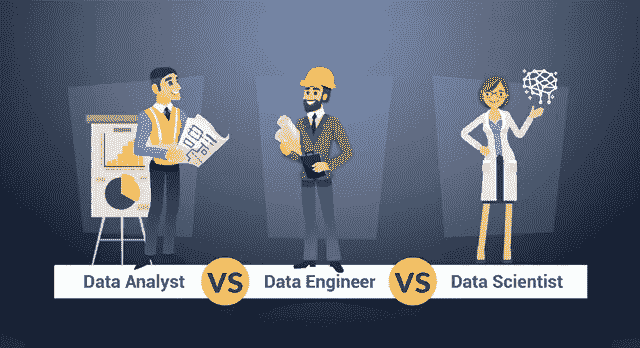
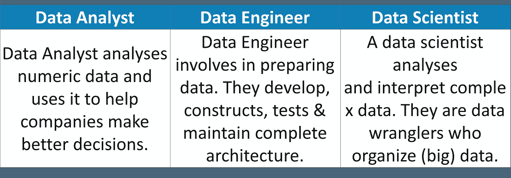
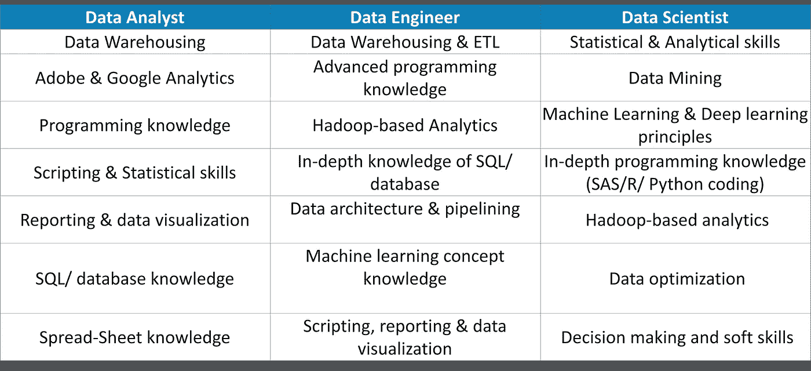
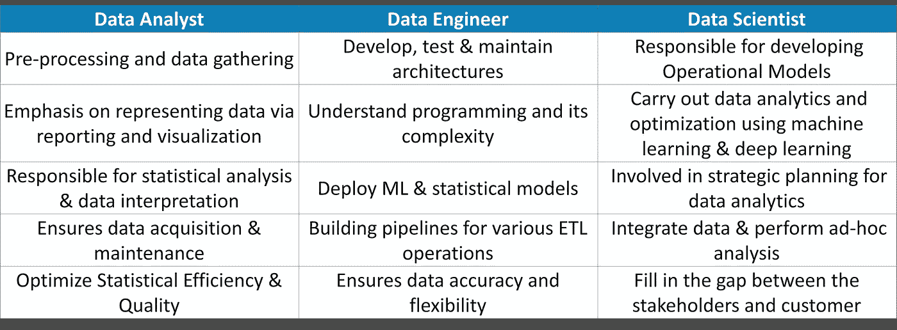

# 数据分析师 vs 数据工程师 vs 数据科学家

> 原文：<https://medium.com/edureka/data-analyst-vs-data-engineer-vs-data-scientist-27aacdcaffa5?source=collection_archive---------0----------------------->

Data Analyst vs Data Engineer vs Data Scientist — Edureka

数据对任何决策都至关重要。当今世界完全依靠数据运行，如果没有数据驱动的决策和战略计划，任何组织都无法生存。由于数据的宝贵见解和信任，如今行业中有几个与数据打交道的角色。在本文中，我们将讨论数据分析师、数据工程师和数据科学家之间的主要区别和相似之处。

在我们深入研究技术细节之前，让我们先来看看本文将涵盖的内容:

1.  谁是数据分析师、数据工程师和数据科学家？
2.  技能组合
3.  角色和职责
4.  薪资趋势

# 谁是数据分析师、数据工程师和数据科学家？

## 数据分析师

大多数对数据相关工作感兴趣的入门级专业人士都是从数据分析师做起的。获得这个角色的资格非常简单。你需要的只是一个学士学位和良好的统计知识。较强的技术技能将是一个加分项，可以让你比大多数其他申请人更有优势。除此之外，公司希望你了解数据处理、建模和报告技术，以及对业务的深刻理解。

## 数据工程师

数据工程师要么获得数据相关领域的硕士学位，要么作为数据分析师积累大量经验。一个**数据工程师**需要有强大的技术背景，能够创建和集成 API。他们还需要了解数据管道和性能优化。

## 数据科学家

数据科学家是分析和解释复杂数字数据的人。虽然进入数据科学家角色有多种方式，但最无缝的方式是获得足够的经验并学习各种数据科学家技能。这些技能包括高级统计分析、对机器学习的全面理解、数据处理等。

为了更好地了解这些专业人士，让我们更深入地了解他们所需的技能。

# 技能组合

下表说明了数据分析师、数据工程师和数据科学家所需的不同技能:

如上所述，数据分析师的主要技能集围绕数据采集、处理和加工。另一方面，数据工程师需要对编程有中级的理解，以构建全面的算法，并精通统计学和数学！最后，数据科学家需要精通这两个领域。数据、统计和数学，以及用于机器学习和深度学习的深度编程知识。

现在，我们已经完全了解了成为数据分析师、数据工程师或数据科学家所需的技能，让我们看看这些专业人员的典型角色和职责。

接下来，让我们比较一下数据分析师、数据工程师和数据科学家在日常生活中的不同角色和职责。

# 角色和职责

从数据分析师、数据工程师和数据科学家的技能组合中可以看出，他们的角色和职责非常相似。请参考下表以获得更多了解:

现在，数据科学家和数据工程师的工作角色非常相似，但数据科学家在所有与数据相关的活动中都占上风。说到与商业相关的决策，数据科学家有 ***更高的熟练度*** *。*

在这两个有趣的话题之后，现在让我们看看进入数据分析、数据工程或数据科学领域的职业生涯可以赚多少钱。

# 薪水

数据分析师的典型工资略低于 59000 美元/年。数据工程师的年薪最高可达**90，8390 美元/年**，而数据科学家的年薪最高可达**91，470 美元/年**。

看一下数据工程师和数据科学家的这些数据，一开始你可能看不出太大的区别。但是，深入研究这些数字，数据科学家的收入可以比普通数据工程师高出 20%到 30%。脸书、IBM 以及更多公司的招聘信息都给出了高达 13.6 万美元的年薪。

到此，我们结束这篇文章。如果你想查看更多关于 Python、DevOps、Ethical Hacking 等市场最热门技术的文章，那么你可以参考 [Edureka 的官方网站。](https://www.edureka.co/blog/?utm_source=medium&utm_medium=content-link&utm_campaign=data-analyst-vs-data-engineer-vs-data-scientist)

请留意本系列中的其他文章，它们将解释数据科学的各个方面。

> *1。* [*数据科学教程*](/edureka/data-science-tutorial-484da1ff952b)
> 
> *2。* [*数据科学的数学与统计*](/edureka/math-and-statistics-for-data-science-1152e30cee73)
> 
> *3。*[*R 中的线性回归*](/edureka/linear-regression-in-r-da3e42f16dd3)
> 
> *4。* [*数据科学教程*](/edureka/data-science-tutorial-484da1ff952b)
> 
> *5。*[*R 中的逻辑回归*](/edureka/logistic-regression-in-r-2d08ac51cd4f)
> 
> *6。* [*分类算法*](/edureka/classification-algorithms-ba27044f28f1)
> 
> *7。* [*随机森林中的 R*](/edureka/random-forest-classifier-92123fd2b5f9)
> 
> *8。* [*决策树中的 R*](/edureka/a-complete-guide-on-decision-tree-algorithm-3245e269ece)
> 
> *9。* [*机器学习简介*](/edureka/introduction-to-machine-learning-97973c43e776)
> 
> *10。*[*R 中的朴素贝叶斯*](/edureka/naive-bayes-in-r-37ca73f3e85c)
> 
> 11。 [*统计与概率*](/edureka/statistics-and-probability-cf736d703703)
> 
> *12。* [*如何创建一个完美的决策树？*](/edureka/decision-trees-b00348e0ac89)
> 
> *13。* [*关于数据科学家角色的十大神话*](/edureka/data-scientists-myths-14acade1f6f7)
> 
> *14。* [*顶级数据科学项目*](/edureka/data-science-projects-b32f1328eed8)
> 
> *15。*[*5 大机器学习算法*](/edureka/machine-learning-algorithms-29eea8b69a54)
> 
> *16。* [*人工智能的种类*](/edureka/types-of-artificial-intelligence-4c40a35f784)
> 
> *17。*[*R vs Python*](/edureka/r-vs-python-48eb86b7b40f)
> 
> *18。* [*人工智能 vs 机器学习 vs 深度学习*](/edureka/ai-vs-machine-learning-vs-deep-learning-1725e8b30b2e)
> 
> *19。* [*机器学习项目*](/edureka/machine-learning-projects-cb0130d0606f)
> 
> *20。* [*数据分析师面试问答*](/edureka/data-analyst-interview-questions-867756f37e3d)
> 
> *21。* [*面向非程序员的数据科学和机器学习工具*](/edureka/data-science-and-machine-learning-for-non-programmers-c9366f4ac3fb)
> 
> *22。* [*十大机器学习框架*](/edureka/top-10-machine-learning-frameworks-72459e902ebb)
> 
> *23。* [*统计机器学习*](/edureka/statistics-for-machine-learning-c8bc158bb3c8)
> 
> *24。* [*随机森林中的 R*](/edureka/random-forest-classifier-92123fd2b5f9)
> 
> 25。 [*广度优先搜索算法*](/edureka/breadth-first-search-algorithm-17d2c72f0eaa)
> 
> *26。*[*R 中的线性判别分析*](/edureka/linear-discriminant-analysis-88fa8ad59d0f)
> 
> *27。* [*机器学习的先决条件*](/edureka/prerequisites-for-machine-learning-68430f467427)
> 
> 28。 [*互动 WebApps 使用 R 闪亮*](/edureka/r-shiny-tutorial-47b050927bd2)
> 
> *29。* [*机器学习十大书籍*](/edureka/top-10-machine-learning-books-541f011d824e)
> 
> 三十。 [*无监督学习*](/edureka/unsupervised-learning-40a82b0bac64)
> 
> *31.1* [*0 本数据科学最佳书籍*](/edureka/10-best-books-data-science-9161f8e82aca)
> 
> *32。* [*监督学习*](/edureka/supervised-learning-5a72987484d0)

*原载于 2018 年 12 月 10 日*[*https://www.edureka.co*](https://www.edureka.co/blog/data-analyst-vs-data-engineer-vs-data-scientist/)*。*