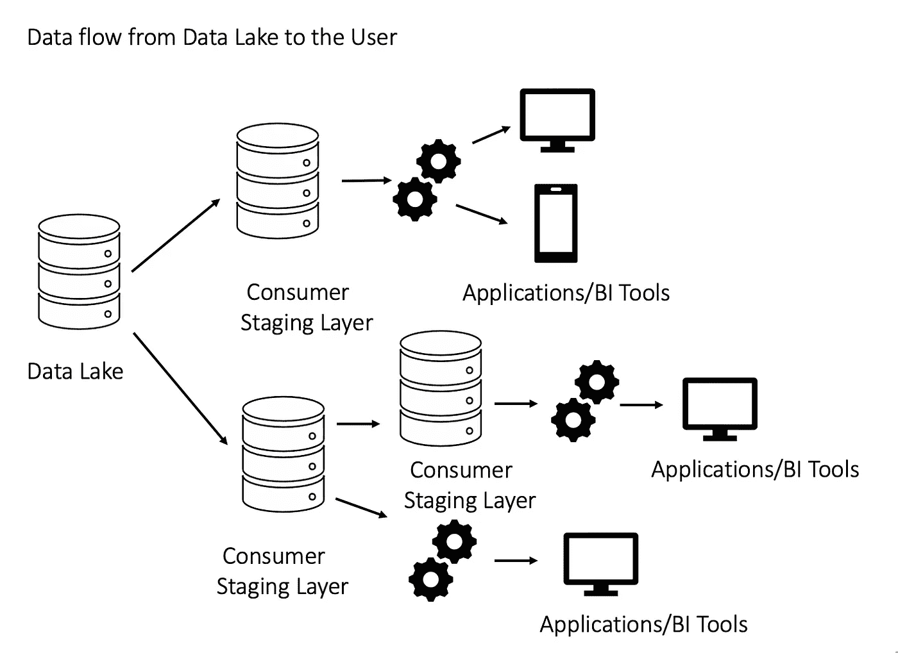
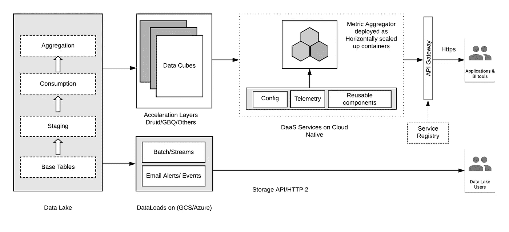

# 数据即服务

> 原文：<https://medium.com/walmartglobaltech/data-as-a-service-c75c0fe3660b?source=collection_archive---------0----------------------->

数据湖以其原始格式保存大量数据。数据工程团队将原始数据清理和丰富为结构化数据，并在整个企业中用于特别分析，或由数据科学家用于机器学习目的。此外，这些数据流经不同的下游团队，转换并存储在自己的基础架构中，各种应用程序基于业务需求构建在基础架构之上。

尽管大多数关键性能指标和见解在应用程序中是通用的，但是下游团队将数据存储在他们自己的基础架构中，并且他们必须遵循在源上应用的相同的业务规则、治理和法规遵从性，以满足所有要求的标准。这可能导致采购、维护和遵循所有这些流程的额外成本和资源限制。

数据和流程总是在不断发展，任何更改，例如添加新的数据资产或修改现有的数据资产，或者对业务规则的更改，都应该在所有团队中进行沟通和实施。源团队必须确保变更的向后和向前兼容性，因为所有团队可能不会同时实现这些变更。这通常会延迟整个过程，因为我们必须支持旧版本，直到所有团队都坚持新的变更。

数据即服务(DaaS)通过利用软件即服务模型提供解决方案，并以 API 的形式提供数据和见解。它利用自己的基础设施来处理大量数据，并以低延迟提供见解。它将数据的使用从特定软件环境或平台的成本中抽象出来，并集中管理数据的质量、安全性、合规性和治理。它提供了访问和控制数据的统一方式。

Data as a Service Design

让我们来看看数据即服务的优势

**一致的业务规则**

在组织中，数据管理员将拥有数据资产，负责数据的治理，并定义业务规则及其访问控制，这些规则和控制适用于使用数据的所有其他团队。

让我们以其他团队使用的销售指标为例，相同的业务规则适用于所有团队，以保持数据的一致性。如果销售报告结构发生任何更新，那么所有这些团队都必须实施这些更改，并且应该始终与源团队保持同步。规则改变得越频繁，就需要额外的努力和时间。

数据即服务将这些业务规则包装在 API 中，并提供更好的治理，以便数据在应用程序之间保持一致。它还提供了底层业务规则的详细信息，以及根据应用程序需求添加更多规则的能力。

**减少数据重复和基础设施成本**

大多数团队从大数据系统到关系数据库(如 Azure SQL、MariaDB)进行 ETL，以实现低延迟读取。这会导致跨团队的多个数据副本，并且随着数据量的日益增加，可能会对性能产生影响。此外，必须对数据进行索引以允许更快的读取，但这会降低写入速度并影响 SLA。维护基础设施的成本是巨大的，并且当今的业务需求期望以更快的性能处理更大量的数据，并且这经常导致基础设施的升级，这涉及到努力和时间。

数据即服务减少了跨域的数据重复，并且可以以较低的基础架构成本运行。它运行在软件即服务之上，并基于按使用付费提供数据和见解。随着微服务架构和基于容器的负载的出现，团队可以使用这些 API 并在应用程序中使用它。大多数云供应商还提供运行在 HTTP/2 上的存储 API，可用于特定分析。

**加速响应和实时数据**

数据即服务利用加速层，如 Apache druid、clickhouse 等。，以提供低延迟响应。它还利用分布式 SQL 查询引擎(如 Presto 或云数据仓库)进行即席分析。终端用户可以使用接近实时的数据，而无需等待在各种存储库中加载和丰富这些数据。它提供了一种处理大数据的方法，具有更好的性能。

**数据资产开发**

由于数据即服务集中了治理和法规遵从性，数据管理员可以专注于从数据资产中创造价值，并获得有助于业务的见解。除了维护元数据信息之外，一个位置的用户文档还可以让用户更好地理解无缝集成的数据。它加快了将数据转化为行动的过程。

**描述性分析到规定性分析**

数据即服务不仅支持低延迟响应或即席分析，而且对于规定的分析来说更加灵活。关键业务决策基于实时预测。有如此多的例子，如欺诈扣除，销售预测，产品供应，产品定价等。，而且都是用 API。现在大多数家庭都在使用虚拟助手、自然语言处理和物联网。数据流入量每天都在增加，数据即服务提供了处理数据和更快响应的能力，从而改善了客户体验。

**云原生**

部署在公共云(如 Microsoft Azure)上的云本地容器化工作负载，Google 云平台提供了可靠、可扩展和可维护的 API。云本地应用程序倾向于通过水平扩展来保持各种负载条件下的性能，并在不需要时释放资源。它支持构建容错系统，提供软件升级，维护资源的高可用性，为灾难管理提供可靠的服务。它附带了必要的工具来进行故障排除和监控，例如，Splunk 用于应用程序日志，Dynatrace 用于应用程序性能监控等。,

**移动和网络应用**

数据即服务 API 既可用于移动应用程序，也可用于 Web 应用程序，因为它将业务逻辑与表示层分离。由于数据缓存在加速层中，因此在更高的负载下响应会好得多，而各种性能改进(例如仅使用用户请求的指标进行响应)会减少延迟，并使其成为移动应用程序的最佳选择。较小有效负载的 JSON 格式具有支持不同表示格式的灵活性，并且可以使用 D3.js、Plotly 与库轻松集成以构建仪表板。