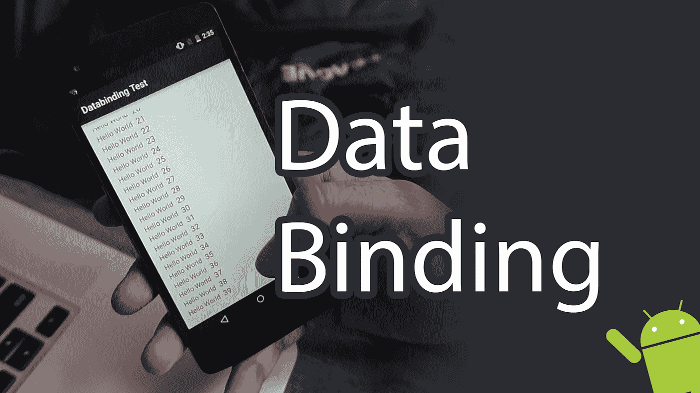

# Android 的数据绑定

> 原文：<https://medium.com/google-developer-experts/data-binding-for-android-d6b425539bb2?source=collection_archive---------1----------------------->

为 Android 开发用户界面曾经非常复杂。我们需要使用大量的 findviewbyid 和可见性。

在今年的 Google I/O 上，Google 推出了 Android Studio 的 Android 数据绑定开源库。这个插件现在可用了，你可以用它以一种更简单的方式构建你的应用程序。

下面是费萨尔·阿比德做的视频教程。在这个视频中，他将向你展示如何使用 Android 的新数据绑定来构建一个简单的列表视图。