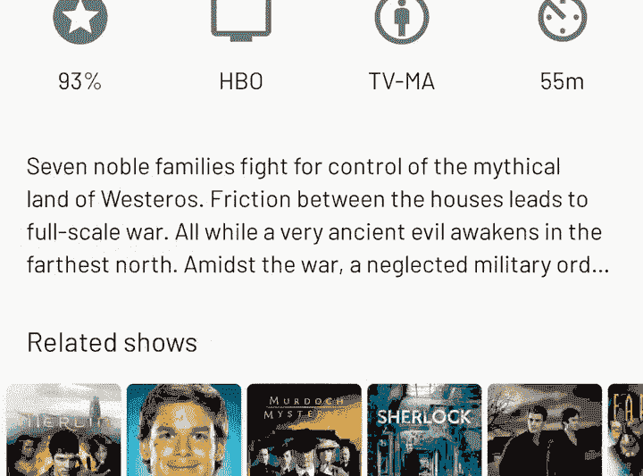

# 数据绑定—吸取的教训

> 原文：<https://medium.com/androiddevelopers/data-binding-lessons-learnt-4fd16576b719?source=collection_archive---------1----------------------->

Photo by [rawpixel](https://unsplash.com/photos/uQkwbaP0UrI?utm_source=unsplash&utm_medium=referral&utm_content=creditCopyText) on [Unsplash](https://unsplash.com/?utm_source=unsplash&utm_medium=referral&utm_content=creditCopyText)

[数据绑定库](https://developer.android.com/topic/libraries/data-binding/)(在本文的其余部分称为“数据库库”)提供了一种灵活而强大的方式来将数据绑定到用户界面，但使用一句老话:“能力越大，责任越大”。仅仅因为你使用数据绑定并不意味着你可以避免成为一个好的 UI 公民。

在过去的几年里，我一直在 Android 上使用数据绑定，这篇文章详细介绍了我在这个过程中学到的一些东西。

# 尽可能使用标准绑定

[定制绑定适配器](https://developer.android.com/topic/libraries/data-binding/binding-adapters#custom-logic)是一种很好的方式，可以很容易地为视图添加定制功能。像许多开发人员一样，我在绑定适配器方面走得有点远，最终得到了一个包含不同质量的 15 个适配器的类。

最大的元凶是一些适配器，它们生成格式化的字符串并将它们设置在`TextViews`上。适配器通常只在一个布局中引用:

虽然这看起来很聪明，但有三个大的缺点:

1.  组织他们是一件痛苦的事情。除非您组织得非常好，否则您很可能有一个包含所有适配器方法的大文件。内聚和去耦的对立面。
2.  **你需要用仪器来测试**。根据定义，绑定适配器不返回值，它们接受输入，然后在视图上设置属性。这意味着您必须使用一个工具来测试您的定制逻辑，这使得测试更慢并且可能更难维护。
3.  **定制绑定适配器代码(通常)不是最佳的。**如果你看看内置的文本绑定[ [这里是](https://android.googlesource.com/platform/frameworks/data-binding/+/master/extensions/baseAdapters/src/main/java/android/databinding/adapters/TextViewBindingAdapter.java#63) ]，你会看到它做了很多*检查以避免调用`[TextView.setText()](https://developer.android.com/reference/android/widget/TextView.html#setText(java.lang.CharSequence))`，从而节省了浪费的布局通道。我陷入了一个陷阱，以为 DB 库会自动优化我的视图更新。的确如此，*但前提是*您使用精心优化的内置绑定适配器。*

相反，将方法逻辑抽象成内聚类(我称之为文本创建器)，然后将它们传递到绑定中。从那里，您可以调用您的文本创建者并使用内置的视图绑定:

这样，我们可以从内置绑定中获得所有的效率，并且我们可以非常容易地对创建格式化字符串的代码进行单元测试。

# 使您的定制绑定适配器高效

如果您真的需要使用定制适配器，因为您想要的功能并不存在，那么请尽可能地提高它的效率。我的意思是使用所有标准的 Android UI 优化:尽可能避免触发测量/布局。

这很简单，只需检查视图当前使用的内容与您正在设置的内容。下面是我们为`android:drawable`重新实现标准 ImageView 适配器的示例:

不幸的是，视图并不总是能够显示我们需要检查的状态。这是一个在文本视图上设置切换最大行数的例子。它通过改变 TextView 的`maxLines`属性以及[延迟布局转换](https://developer.android.com/reference/androidx/transition/TransitionManager.html#beginDelayedTransition(android.view.ViewGroup))来实现切换。

Just so you get an idea of what it does

以前，绑定适配器很简单，总是设置`maxLines`属性和一个点击监听器。当调用`[setMaxLines()](https://developer.android.com/reference/android/widget/TextView.html#setMaxLines(int))`时，TextView 将总是触发一个布局，这意味着每次运行绑定适配器时，都会触发一个布局。

所以让我们解决它。因为这个功能完全独立于文本视图(我们只是在点击时用不同的值调用`setMaxLines()`)我们需要存储当前状态的引用。幸运的是,“数据库库”为我们在绑定适配器中接收它提供了一种便捷的方式。通过提供两次参数，第一个参数接收当前的值*，第二个参数接收新的*值*。*

所以这里我们只是比较*当前*和*新* `collapsedMaxLines`值。如果值确实改变了，我们称之为`setMaxLines()`，等等。

*编辑:感谢*[*Alexandre Gianquinto*](https://medium.com/u/de767d1edb4b?source=post_page-----4fd16576b719--------------------------------)*在评论中提到“双参数”功能。*

# 小心你提供的变量

我一直在慢慢地重新设计 [Tivi](https://tivi.app) 使用类似 MVI 的东西，使用优秀的 [MvRx 库](https://github.com/airbnb/MvRx)使其正式化。这实际上意味着我的片段/视图订阅了一个[视图模型](https://developer.android.com/reference/androidx/lifecycle/ViewModel)，并接收视图状态实例。这些实例包含显示 UI 所需的所有状态。

这里有一个来自 Tivi ( [link](https://github.com/chrisbanes/tivi/blob/master/app/src/main/java/app/tivi/showdetails/details/ShowDetailsViewState.kt) )的示例状态类:

你可以看到它只是一个简单的数据类，包含了用户界面显示一个电视节目的细节所需的所有东西。

听起来像是传递给我们的数据绑定实例的完美候选，让我们的绑定表达式更新 UI，对吗？是的，这确实很好，但有一些事情需要注意，这是由于“数据库库”的工作方式。

在数据绑定中，通过`<variable>`标签声明输入，然后编写绑定表达式引用视图(属性)上的那些变量。当任何因变量改变时，“数据库库”将运行您的绑定表达式(并因此更新视图)。这种变化检测是一个伟大的优化，你可以免费获得。

回到我的场景。我的布局最终看起来像这样:

因此，我最终拥有了一个包含整个 UI 状态的大型全局视图状态实例，正如你所想象的，这些变化相当大。UI 状态的任何微小变化都会导致一个全新的视图状态生成并传递给我们的数据绑定实例。

那么问题出在哪里？因为我们只有一个输入变量，所有的绑定表达式都将引用这个变量，这意味着“数据库库”不再能够有选择地选择运行哪个表达式。实际上，这意味着每次变量改变时(不管有多小),每个绑定表达式都要运行。

*这个问题并不特别与 MVI 相关，它只是一个将状态与数据绑定结合使用的产物。*

## 那么你能做些什么呢？

另一种方法是从布局中的视图状态显式声明每个变量，然后显式传递来自组合状态实例的值，如下所示:

作为开发人员，这显然需要您维护和保持同步的代码要多得多，但这确实意味着“数据库库”可以优化运行哪些表达式。如果你的 UI 状态不经常改变(可能在创建时改变几次)，并且变量的数量很少，我会使用这种模式。

就我个人而言，我一直在我的布局中使用单个变量，传入我的视图状态实例，并相信我们的视图绑定会做正确的事情。这就是为什么让我们的视图绑定高效非常重要。

*另外需要注意的是，Tivi 是*[*recycler view*](https://developer.android.com/guide/topics/ui/layout/recyclerview)*的重度用户，与*[*Epoxy*](https://github.com/airbnb/epoxy)*+*[*数据绑定*](https://github.com/airbnb/epoxy/wiki/Data-Binding-Support) *，意味着*[*diff util*](https://developer.android.com/reference/androidx/recyclerview/widget/DiffUtil)*中有一个额外级别的变更计算发生。因此，如果你的 ui 大部分也是由 RecyclerViews 组成的，你也可以免费获得类似的优化。*

# 小胜利累积起来

希望这篇文章强调了一些优化数据绑定实现的小事情。了解一点“数据库库”的内部工作方式可以帮助您有效地进行数据绑定，并提高 ui 的性能。