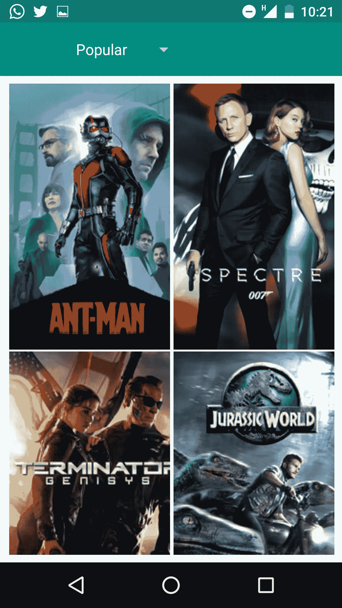
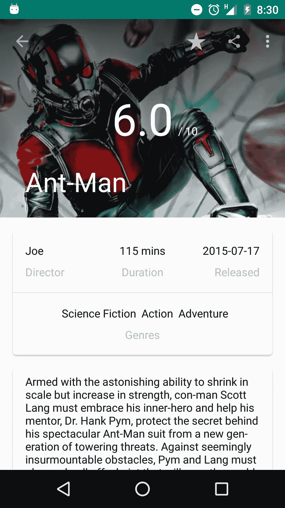

# 数据绑定库:代码更少的伟大用户界面

> 原文：<https://medium.com/google-developer-experts/data-binding-library-great-ui-s-with-less-code-f2575e0c588e?source=collection_archive---------4----------------------->

几个月前，随着代号为 Marshmallow 的 android 6.0 的发布，这个版本中添加了许多新东西，老实说，在从事其他项目的同时跟上这些新东西可能是一项艰巨的任务。在一整套新的 API 中，比如 fingerprint、doze、新的权限模型，真正引起我注意的新事物之一是数据绑定库。

简而言之，“数据绑定库帮助您编写声明性布局，并最大限度地减少绑定应用程序逻辑和布局所需的粘合代码”。为了使这句话更清楚，我将不得不回到图书馆之前的事情是如何做的。

让我们举一个简单的例子，我们想创建一个简单的应用程序，它在 EditText 上接收一个用户名，单击一个按钮，它就会在 Toast 上显示这个名称。

假设我们已经通过了在 Android studio 上创建新应用程序的向导([顺便说一下，在这里获得 2.0 版本](http://tools.android.com/download/studio/builds/2-0-preview))，并且我们有一个自动生成的活动和布局资源文件，我们将经历以下步骤:

1.  打开活动的布局资源文件，添加一个编辑文本和一个按钮，不要忘记为每个视图分配一个惟一的 id。
2.  转到主活动 java 类，并创建视图的 java 实例。
3.  使用 findViewById 方法，使用我们在 1 中定义的每个视图的惟一 Id 来查找视图。
4.  最后，我们可以开始在代码中处理视图属性了，比如获取用户文本输入，设置监听器等等。

这 4 个步骤是我们每次在应用程序 UI 上添加或更改东西时都必须遵循的。起初，当我们在做简单的 UI 时，看着这 4 个步骤并对它们偷懒可能看起来很傻，但是当 UI 复杂性增加时，boiler plate 代码的数量会急剧增加。

回到我们的句子，数据绑定库的主要目标是削减这些步骤，减少代码量，使其更具可读性。

# 但是它是怎么做到的呢？

关于这个库是如何工作的，没有太多要说的，因为在一个高层次的概念中，它只为我们做我之前提到的步骤，为了更深入的理解，有一个必须观看的演讲，由@YigitBoyar 在 android dev 峰会期间详细解释了它是如何工作的。

# 一些代码的时间:)

跳到有趣的部分，要开始使用数据绑定库，我们首先要为它配置您的项目，为此我们只需将数据绑定元素添加到我们的应用程序模块 build.gradle 文件中，如下所示:

```
dataBinding{
    enabled = true
}
```

同步你的 gradle 文件，然后*瞧*你就可以开始在你的应用程序上使用这个库了。

要在您的项目中实际应用它，有 3 个关键部分需要考虑:

1.  布局文件:布局文件是我们要看的第一个组件，因为它与之前相比有一些变化。为了编写支持绑定的 UI，布局文件根标签通常是一个视图组，它将变成标签“**布局**”，其中包含 2 个孩子、**数据**标签和我们的常规**视图组**以及 UI 代码的其余部分。**数据**标签是我们现在声明可能要在绑定表达式中使用的变量的地方。要为属性编写一个简单的表达式，我们必须按如下方式设置属性值:@ {<expression go here>}就像下面的代码一样，我们将字符串 url 变量设置为 image view app:loadImage 属性。数据绑定库知道当表达式被传递到公共属性时如何正确解析，例如我们用来在 EditText 上设置文本的 android:text 或用来设置视图可见性的 android:visibility，但是正如我们将在后面看到的，有些情况下我们需要自己指定如何设置数据。

```
<?xml version="1.0" encoding="utf-8"?>
<layout  xmlns:android="http://schemas.android.com/apk/res/android"
         xmlns:app="http://schemas.android.com/apk/res-auto">

    <data>
        <variable name="imageUrl" type="String"/>
    </data>

    <LinearLayout
        android:orientation="vertical" 
        android:layout_width="match_parent"
        android:layout_height="match_parent">

        <ImageView
            android:layout_width="190dp"
            android:layout_height="280dp"
            app:imagesource="@{imageUrl}"
            />

    </LinearLayout>
</layout>
```

2.一旦我们构建了我们的项目，就会生成一个绑定类，它的作用是提供方法让我们从 java 代码到 UI 进行实际的绑定。

3.使用 binding 类进行实际绑定并传递数据是最后一步，这是通过创建在上一步中自动生成的 binding 类的新实例，并使用 DataBindingUtil 类来扩展布局文件来实现的，这可以通过使用该类提供的方法在不同情况下以多种不同方式发生。

有几个常用的方法是**databindingutil . setcontentview(r . layout)**当我们想直接设置活动内容视图并返回相关联的绑定时使用，**databindingutil . inflate(layoutin flater，layoutId，viewgroup，boolean flag)** 当我们创建片段视图时通常可以使用。文档中提供了更多的方法，我真的建议去看看。

我们需要 next 来获取绑定类实例，并使用从我们在布局的数据标签上定义的变量中生成的 setters 来将数据绑定到 UI。将活动布局绑定到用户数据对象的 java 文件中的简单代码如下所示:

```
@Override
protected void onCreate(Bundle savedInstanceState) {
   super.onCreate(savedInstanceState);
   MainActivityBinding binding = DataBindingUtil.setContentView(this, R.layout.main_activity);
   User user = new User("Test", "User");
   binding.setUser(user);
}
```

# **超越基础**

开始使用数据绑定库非常简单，但是还有很多很酷的事情要做。为了涵盖一些有趣和深刻的东西，本文的剩余部分将主要讲述我如何使用数据绑定库来修改 Udacity 的 android nanodegree 的 My Movie 应用程序的一些部分。

## 一张电影海报

该应用程序的第一个屏幕是一个简单的电影海报缩略图网格，可以通过流行度，评级过滤。



```
<?xml version="1.0" encoding="utf-8"?>
<layout  xmlns:android="http://schemas.android.com/apk/res/android"
         xmlns:app="http://schemas.android.com/apk/res-auto">

    <data>
        <variable name="imageUrl" type="String"/>
    </data>

    <LinearLayout
        android:orientation="vertical"
        android:layout_width="match_parent"
        android:layout_height="match_parent">

        <ImageView
            android:id="@+id/movie_thumbnail"
            android:layout_width="190dp"
            android:layout_height="280dp"
            app:imagesource="@{imageUrl}"
            />

    </LinearLayout>
</layout>
```

上面的布局和代码与我们看到的布局完全一样，但这里最大的不同是我们如何将图像缩略图设置到网格上的每个项目。正如我前面提到的，这个库知道如何处理为一些属性传递的数据，因为它在后面做的只是将一组数据传递给那个对象。
对于像文本这样的情况，设置一个字符串是非常直接的，但是对于更具体的情况，比如将图像加载到 imageview，我们只有现成的 android:src 方法，基本上遵循相同的类比，当使用库时，它为我们提供了一个 drawable 的 setter，这不是我们所需要的，因为我们通常希望从 url 或任何其他源加载图像，就像这个例子。为了解决这个问题，我们只需要添加一个类和一个新方法，将其注释为一个绑定适配器，并指定我们想要使用的属性的名称，该名称可以是像我一样的自定义名称，也可以简单地覆盖现有的属性，如 android:src。
对于这个方法签名，我们传递 ImageView 和第二个参数，ImageView 是我们想要设置图像的组件，第二个参数将是我们想要加载的图像的 url。实现非常简单，我们只需从 imageview 获取上下文，并使用 picasso(我经常使用)或其他图像加载器库，开始将图像加载到 imageview。

```
@BindingAdapter("app:imagesource") // could also be "android:src"
public static void loadGridImage(ImageView image,String imageUrl){
    //we do all the magic with Picasso or any other lib here
    Picasso.with(image.getContext()).load(imageUrl).into(image);
}
```

## 电影海报网格

是时候把所有的海报放在一个网格上了，就像上面的截图一样，然后把图片绑定到每一张海报上。正如我们在向 ListView、GridView 或 RecyclerView 填充数据时所做的那样，我们首先需要创建一个适配器，将数据传递给它，然后将适配器设置为返回给它。这个过程没有改变，但是关于如何做的代码可能会略有不同。

1.  首先改变的是海报视图的视图持有者，当我们滚动浏览时，它持有一个引用，这样视图就不会被重新创建。这个视图容器曾经包含了我们布局中所有视图的实例，在我们构建视图的时候，我们曾经通过这个视图的 id 来查找视图。由于我们正在使用数据绑定库，我们不再需要通过 id 查找视图，因为我们已经有了在编译时自动生成的绑定类供我们使用，就像本文开始时的第一种情况一样。这里的问题是，由于我们可以有一个包含不同项目的元素列表或网格，为某个类型指定确切生成的布局绑定类并不是一个好主意，并且会给我们带来一些额外的工作，检查我们可能希望在列表中出现的不同类型的视图。其思想是，在 ViewHolder 中，我们创建一个基本绑定类 **ViewDataBinding，**的对象，使用 DataBindingUtil 类中的 bind 方法从 ViewHolder 构造器上传递的视图中获取一个绑定(假设我们不知道将会是什么),并公开一个 getter 方法来访问该绑定，如下面的代码所示。

```
public class MoviesGridViewHolder extends RecyclerView.ViewHolder {

    private ViewDataBinding bindingView;

    public MoviesGridViewHolder(View itemView) {
        super(itemView);
        bindingView = DataBindingUtil.*bind*(itemView);
    }

    public ViewDataBinding getBindingView(){
        return bindingView;
    }

}
```

在适配器内部，与 RecyclerView 相比，list 和 grid 视图的实现可能稍有不同，但背景思想是相同的，第一次创建视图时，我们创建视图持有人，随后的时间我们一直使用视图持有人。说到我们的回收器视图适配器，我们首先在方法 **onCreateViewHolder 上创建视图持有者。**

```
@Override
public MoviesGridViewHolder onCreateViewHolder(ViewGroup parent, int viewType) {
    LayoutInflater inflater = LayoutInflater.*from*(parent.getContext());
    View view= inflater.inflate(R.layout.*layout_single_movie_poster*, parent, false);
    MoviesGridViewHolder holder = new MoviesGridViewHolder(view);
    return holder;
}
```

在创建视图容器之后，下一个重要的时刻是我们最终将数据绑定到 UI 的时候。我们在适配器的 **onBindViewHolder** 方法中这样做，方法是使用视图持有者中的 getter 方法来获取基本绑定类，然后调用方法 setVariable(int variableId，Object ),该方法接收两个参数，即变量 Id 和我们要设置的对象的值。

这里需要理解的非常重要的一点是，当我们编译项目时，传递的变量 Id 是自动生成的，并作为自动生成的类 BR 的字段添加，BR 的工作方式与 R 处理视图和任何其他资源上的 Id 的方式相同。

在将所有数据 data 设置到各自的变量后，我们必须调用 **executePendingBindings** ，以便将所有视图与我们的模型同步，并防止在试图修复之前动画帧上可能发生的任何布局错误时创建两个布局。这主要是因为当数据改变时，数据绑定库不会立即更新视图，而是跟踪它们，并且只在下一个动画帧上进行改变。

```
@Override
public void onBindViewHolder(MoviesGridViewHolder holder, final int position) {
    final Movie movie = movies.get(position);
    holder.getBindingView().setVariable(BR.*movie*,movie);
    holder.getBindingView().setVariable(BR.*clickHandler*,movie.getPosterUrl());
    holder.getBindingView().executePendingBindings();
}
```

## 单击缩略图打开详细信息

网格就位后，我们要做的下一件事就是点击相应的缩略图打开一个电影细节屏幕。如果您对不使用 findViewById 方法的事实非常怀疑，那么当您开始考虑这一点时，您可能已经找到了“啊哈”的时刻。

但幸运的是，我将不得不给出一个坏消息，即有一种方法可以在没有 findViewById 的情况下处理 click 事件。实际上，这并不是什么新东西，因为在数据绑定库之前，我们就可以为视图设置一个 onClick 属性，然后创建一个方法，将视图作为参数传递，并在单击指定视图时实现我们可能想要做的所有事情。

使用数据绑定库，我们只需创建一个简单的类 class(让我们将其命名为 handler)，编写一个具有与我刚才解释的相同签名的方法，在布局文件的数据标签内创建一个具有 handler 类的变量，该布局文件带有我们想要添加的单击行为的视图，最后添加 onClick 属性，并在它的值上传递一个表达式，在该表达式中我们调用处理程序所需的方法，如下面的代码片段所示。

```
public class BindingClickHandlers { public void onThumbnailClick(View view){
       context = view.getContext();
       intent = new Intent(context, MovieDetails.class);
       bundle = new Bundle();
       bundle.putParcelable("movie",movie);
       intent.putExtras(bundle);
       context.startActivity(intent);
   }}<?xml version="1.0" encoding="utf-8"?>
<layout  xmlns:android="http://schemas.android.com/apk/res/android"
         xmlns:app="http://schemas.android.com/apk/res-auto">

    <data>
        <variable name="imageUrl" type="String"/>
        <variable name="clickHandler" type="com.app.mymooviapp.bindingAdapters.BindingClickHandlers"/>
    </data>

    <LinearLayout
        android:orientation="vertical"
        android:layout_width="match_parent"
        android:layout_height="match_parent"
        android:padding="8dp"
        android:onClick="@{clickHandler.onThumbnailClick}"
        >

        <ImageView
            android:id="@+id/movie_thumbnail"
            android:layout_width="190dp"
            android:layout_height="280dp"
            app:imagesource="@{imageUrl}"
            />

    </LinearLayout>
</layout>
```

如果您一直关注代码片段，您可能会注意到最后两个代码片段中的两件事情。

1.  方法实现将一个电影对象传递给似乎不知从哪里来的 intent。
2.  与第一点思路相同，你应该已经注意到，当我们调用方法时，我们不传递任何额外的参数，正确的原因是因为我们不能。

这里最大的问题是我们如何把那个物体带到那里？

嗯，我不能说这是否是最终和最好的实现，但这里是我如何设法工作。由于我们的处理程序将主要是一个我们在布局代码的最后一个片段中声明的变量，我们可以用类中的电影和一个静态工厂方法创建一个变量，我们将在这个方法中构造处理程序，设置电影对象，并像以前一样在代码中使用它。我完整实现的整个类会是这样的。

```
public class BindingClickHandlers {

    private Movie movie;

    private Context context;

    private Intent intent;

    private Bundle bundle;

    public BindingClickHandlers(){}

    //construct a binding class for movie thumbnail click
    public static  BindingClickHandlers newThumbnailClickHandler(Movie movie){
        BindingClickHandlers handler = new BindingClickHandlers();
        handler.setMovie(movie);
        return handler;
    }

    public void onThumbnailClick(View view){
        context = view.getContext();
        intent = new Intent(context, MovieDetails.class);
        bundle = new Bundle();
        bundle.putParcelable("movie",movie);
        intent.putExtras(bundle);
        context.startActivity(intent);
    }

    public void setMovie(Movie movie){
        this.movie = movie;
    }
}
```

我们只需在适配器中添加几行代码，并像这样设置处理程序:

```
final Movie movie = movies.get(position);
final BindingClickHandlers handler = BindingClickHandlers.*newThumbnailClickHandler*(movie);
holder.getBinding().setVariable(BR.*clickHandler*,handler);
```

## 更多精彩—电影详情屏幕



因此，在点击一个电影缩略图后，该应用程序应该会打开一个新的活动，并显示电影的细节。正如我们在图中看到的，与第一种布局相比，这种布局稍微复杂一些，除了可能必须在另一种布局中包含一些布局之外，您可能会在片段中包含一些大代码，以便将数据设置到这些代码中，等等。

幸运的是，有了数据绑定，使用一些很酷的特性，您的问题可以减少到几乎没有，例如:

**将数据绑定到包含的布局**

尽可能简单地说，库允许您将根布局上的某个变量绑定到包含布局，条件是包含布局在其文件上也有一个同名变量的声明。

```
<layout xmlns:android="http://schemas.android.com/apk/res/android"
        xmlns:bind="http://schemas.android.com/apk/res-auto">

    <data>
        <variable name="movie" type="com.app.mymooviapp"/>
    </data>

    <android.support.v4.widget.NestedScrollView
        android:layout_width="match_parent"
        android:layout_height="match_parent"
        >

        <FrameLayout
            android:orientation="vertical"
            android:layout_width="match_parent"
            android:layout_height="match_parent"
            >

            <include layout="@layout/layout_details_content"
                android:id="@+id/layout_details"
                bind:movie="@{movie}"
                /><!-- REST OF THE LAYoUT CODE
```

**导入类并在表达式中使用它们**

查看电影评级的详细信息屏幕的标题，我们可以看到当前电影评级显示了它可以达到的总评级，但对于一些评级为 10 分的罕见电影，我认为显示删除 10 分是很酷的，因为我们已经达到了峰值。为了做到这一点，我们必须通过它们的 id 找到两个 textviews，并实现您的逻辑来实现它。

现在事情变得更小了，因为数据绑定让您可以导入类以用于布局文件中的表达式。这种导入发生在数据标记内部，它是通过一行简单的代码完成的，如下所示:

```
<import type="android.view.View"/>
```

需要注意的一点是，类型应该是类所在的包的全名，如果我们想要导入两个同名的类，我们可以定义一个别名，通过添加一个别名属性来区分两个类，并将值设置为所需的名称。

所以在导入类之后，我们可以用它来声明一个变量的类型，或者直接在表达式中使用。对于我刚才提到的 rating 的例子，通过导入 View 类，我们可以使用它根据用户等级的值来设置视图的可见性。下面是一个布局示例，展示了在表达式中导入和使用类的方式

```
<?xml version="1.0" encoding="utf-8"?>
<layout  xmlns:android="http://schemas.android.com/apk/res/android">

    <data>
        <import type="android.view.View"/>

        <variable name="backdropPath" type="String"/>
        <variable name="movieRating" type="int"/>

    </data>

    <FrameLayout
        android:layout_width="match_parent"
        android:layout_height="250dp"
        >

        <ImageView
            android:layout_width="match_parent"
            android:layout_height="match_parent"
            android:id="@+id/header"
            android:scaleType="centerCrop"
            />

        <TextView
            android:layout_width="wrap_content"
            android:layout_height="wrap_content"
            android:id="@+id/current_rating"
            android:textSize="56sp"
            android:layout_gravity="center"
            android:textColor="@color/white"
            android:text="@{movieRating}"
            />

        <TextView
            android:layout_width="wrap_content"
            android:layout_height="wrap_content"
            android:layout_marginLeft="56dp"
            android:id="@+id/max_rating"
            android:layout_marginTop="16dp"
            android:layout_gravity="center"
            android:textColor="@color/white"
            android:text=" / 10"
            android:visibility="@{movieRating == 10 ? View.GONE : View.VISIBLE}"
            />

    </FrameLayout>

</layout>
```

这篇文章是一个简短的说明，展示了我认为关于这个库的一些非常基本和有趣的东西，但是你可以肯定还有很多东西需要探索，到最终发布的时候，我们可能会有一些新的东西。

要了解更多信息，我建议在 Android 开发峰会期间看看 Yigit Boyar 的[入门](http://developer.android.com/tools/data-binding/guide.html)指南、javadoc 和[演讲](https://www.youtube.com/watch?v=NBbeQMOcnZ0)。

希望在评论中听到你对这个话题的看法，如果你喜欢这个帖子，推荐给一些可能也会对此感兴趣的朋友:)

分米