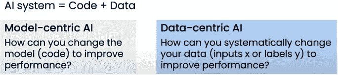

# 以数据为中心的人工智能——数据工程师的再次崛起

> 原文：<https://medium.com/walmartglobaltech/data-centric-ai-the-rise-again-of-the-data-engineer-584c9f9c03a6?source=collection_archive---------0----------------------->

数据操作 vs 操作

Photo credit: Pixabay

2017 年左右，Maxime Beauchemin 写了 [*数据工程师的崛起*](/free-code-camp/the-rise-of-the-data-engineer-91be18f1e603) 其中谈到了数据工程师的历史以及数据工程师比以前发挥更显著作用的原因。我从这个博客中学到了很多，强烈推荐其他人阅读它，即使它是一个 4 岁的博客。

今年早些时候，吴恩达提出了一个有趣的话题，关于 [*从以模型为中心到以数据为中心的 AI*](https://www.youtube.com/watch?v=06-AZXmwHjo&t=69s) ，这表明数据对于机器学习(ML)有多么重要，甚至比 ML 模型本身重要得多。

数据工程师构建工具、基础设施、框架和服务——所有这些都与数据相关，这意味着数据工程将在处理数据方面发挥重要作用，有助于以数据为中心的人工智能。

# 议程

*   以数据为中心的人工智能与以模型为中心的人工智能
*   大数据集与好数据集
*   数据操作与 m 操作
*   数据工程师对 ML 工程师
*   为什么是数据工程，它将如何影响 MLOps 的数据工程师角色？
*   摘要

# **以数据为中心的人工智能与以模型为中心的人工智能**

Figure 1 — Source credit: MLOps: From Model-centric to Data-centric AI by Andrew Ng — Reference 1

基于图 1，我们可以发现以模型为中心的 AI 和以数据为中心的 AI 的区别。在人工智能研究领域，大多数时候，研究人员专注于建模改进或在一些新领域应用不同的建模。随着越来越多的鲁棒神经网络模型被开发出来，仅仅依靠模型调整来提高性能并不容易。

Figure 2 — Source credit: MLOps: From Model-centric to Data-centric AI by Andrew Ng — Reference 1

您可以看到图 2 中的性能指标并没有提高多少性能。然而，对于以数据为中心的方法，您可以看到它比以模型为中心的方法更能提高性能。现在让我们关注数据本身。

# 大数据集与好数据集

我对大数据集和好数据集没有偏好。对我来说，他们更像是平衡的兄弟。拥有大型数据集有助于获得或筛选更好的数据集。拥有一个好的数据集可以减少模型使用的数据集的大小。

对于 ML 的某些领域，*数据越多越有帮助*总是正确的。但对于其他一些 ML 领域，如语音识别，就像 Andrew 在我上面链接的视频中提到的那样。此外，高质量的数据总是有助于建模。

那么还有另一个问题:W *什么样的数据大小对模型来说足够好？*我会说如果满足下面两点，那么数据满足第一阶段使用。

1.  数据应该有良好的分布，这意味着它需要有良好的覆盖面。有时候，我们无法获得良好的覆盖率，那么就需要更多的数据。大数据集允许为所需的覆盖范围选择数据。
2.  足够高质量的数据包含输入 x 和标签 y。

# 数据操作与 m 操作

在深入探讨 DataOps 与 MLOps 之前，我们先来关注一个数据产品的端到端数据流流程。

根据图 3，我们可以看到两种不同的数据产品有三个共同的领域(数据接收、数据质量检查和数据转换/加载)。这三个领域侧重于确保我们能够获得高质量的原始数据和目录数据。然后，数据将流入两个分支——一个是数据处理产品，另一个是 ML 产品。

Figure 3\. DataOps vs MLOps

对于数据处理产品，还有两个组件—数据反规范化和数据速度层加载，它们都支持终端用户的高性能分析。进入生产阶段后，这些组件需要得到数据运营的支持。

> **DataOps** (数据操作)是一种敏捷的、面向流程的方法，用于开发和交付分析。

对于一个 ML 产品，有四个阶段——模型训练、模型评估、模型验证和模型预测。进入生产阶段后，这些类型的组件需要得到 MLOps 的支持

> **MLOps** 或 MLOps 是一套实践，旨在可靠有效地在生产中部署和维护 ML 模型。

# 数据工程师对 ML 工程师

数据工程师和 ML 工程师都是处理数据的软件工程师下的子领域，他们有很多重叠的领域。

> 一名*数据工程师*专注于为组织数据提供动力的基础设施和工作流。
> 
> ML 工程师做和数据工程师类似的工作，但是针对 ML 模型。

双方都在管道和基础设施方面开展工作。让我们深入探讨一下这两个问题。

自下而上，数据工程师通常承担以下职责:

1.  为整个数据流构建基础设施。
2.  建立、优化和维护数据管道。
3.  构建交付数据产品的系统。
4.  数据建模。

自下而上，ML 工程师通常承担以下职责:

1.  为 ML 系统建立基础设施。
2.  为数据科学模型的使用建立、优化和维护 ML 管道。
3.  将数据科学模型扩展到生产层面。

我们可以发现这两个角色都从事编程、监控、基础设施、管道、生成高质量数据等工作。数据工程师需要更多地了解数据库的数据建模(结构化或非结构化)。另一方面，ML 工程师需要了解更多关于 ML 建模和商业敏锐度的知识。

# 为什么是数据工程，它将如何影响 MLOps 的数据工程师角色？

以数据为中心的 AI 和 MLOps 是一个新世界。现在的行业，没有界限。

如果你是一名数据工程师，更有意义的工作是如何系统地生成一致的高质量数据，监控数据的概念漂移/数据漂移等。但这是真的吗？答案是对半分。诚然，高质量的数据和监控数据属于数据工程师的职责，但数据工程的数据和数据科学建模的数据之间几乎没有区别。

对于数据科学建模的数据，它包含输入 x 和标签 y。目前，数据工程师的工作主要是预处理部分，这是输入 x 的一部分。但如何获得或生成标签一致性是数据质量的另一个方面。

如果数据工程师想要处理更多的 MLOps，他们不应该只是对数据进行预处理，还需要在整个 ML 系统中进行更多的交互，如下所示。

1.  需要深入了解数据科学模型的数据质量。
2.  创建更多可重用的组件，这些组件可以移植到 ML 系统或预 ML 系统中。
3.  使系统微服务化。
4.  如果需要，学习基本的 ML 模型和系统。

如果数据工程师在 MLOps 上工作，团队可以获得的好处。

1.  加强数据工程系统和 ML 系统之间的联系，减少重复的数据工作。
2.  数据工程师拥有强大的编程和大数据技能，可以提高数据处理的性能。
3.  数据工程师有很强的数据处理系统基础技能。

# 摘要

对于以数据为中心的 AI、DataOps 和 MLOps，数据工程师可以做出很多贡献，不仅仅是数据质量、监控和数据处理，还有 ML 管道性能和易于采用。

# 参考

1.  [https://www . deep learning . ai/WP-content/uploads/2021/06/MLOps-From-Model-centric-to-Data-centric-ai . pdf](https://www.deeplearning.ai/wp-content/uploads/2021/06/MLOps-From-Model-centric-to-Data-centric-AI.pdf)
2.  【https://www.youtube.com/watch?v=06-AZXmwHjo】T2&t = 69s