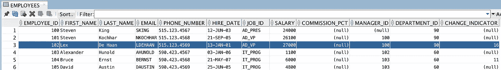

# ADF BC REST 与版本控制的数据冲突解决方案

> 原文：<https://medium.com/oracledevs/data-conflict-solution-for-adf-bc-rest-with-versioning-d94c710daca4?source=collection_archive---------1----------------------->

我想分享在 ADF BC REST 中使用版本控制处理数据冲突的示例解决方案。当多个用户同时编辑同一数据行时，在覆盖其他用户已经提交的更改之前通知用户是很重要的。实现数据冲突控制还有其他方法，在应用之前，您应该评估下面解释的解决方案是否适合您的用例。

示例代码可以从 [GitHub](https://github.com/abaranovskis-redsamurai/ADFBCRestApp) 资源库获得。

我使用自定义更改指示器属性来评估客户端数据是否过期。改变指示符值与请求数据一起被发送到客户端。补丁请求必须包括当前客户端更改指示符值，如果更改指示符与后端中的值匹配，则允许打补丁，否则新的更改指示符将返回给客户端，并且响应将标记有 *409 冲突*状态代码。基于此，客户端可以决定重新提交带有新更改指示符的补丁请求并覆盖数据库中的当前数据，或者刷新客户端数据并尝试稍后提交更改。

在本例中——使用有效的变更指示器执行补丁，响应状态为 *200 OK* 。向客户端返回新的变更指示符值(应该在下一次对当前行进行补丁调用时提交):

为了测试数据更改冲突，我会直接转到 DB 并更改相同的记录。变更指示器也将更新:

客户端不知道更改指示器更新(数据已被另一个用户更改)。客户端将包括当前已知的更改指示符值并执行补丁。这将导致 *409 冲突*状态。后端在响应中返回最新的更改指示器值:

数据未更新，补丁请求在后端停止:

客户端知道最新的更改指示符值，并且可以再次提交它—这一次是成功的(在此期间没有其他人更改数据):

返回状态 *200 OK* ，以及新的变化指示器值。数据库中的数据按预期更改:

后端实现并不复杂。您需要 DB 触发器，它将从 DB 序列中获取值，并将其分配给每个已更改的行:

ADF BC REST 包括更改指示器属性，它标记有*更新时刷新*支持。这允许获取从数据库触发器分配的最新值，并将其返回给客户端:

在 doDML 方法中，我们比较当前存储在数据库中的变化指示器属性值和来自客户端的值。如果值不匹配(客户端没有最新值)—不允许更新:

当不允许更新时，我们还必须将 HTTP 响应代码更改为 *409 冲突*。这将允许在客户端执行错误回调，并采取必要的措施来处理客户端的数据冲突。HTTP 响应代码是从自定义 ADF BC REST 筛选器设置的:

*原载于 2018 年 8 月 6 日*[*【andrejusb.blogspot.com*](http://andrejusb.blogspot.com/2018/08/data-conflict-solution-for-adf-bc-rest.html)*。*