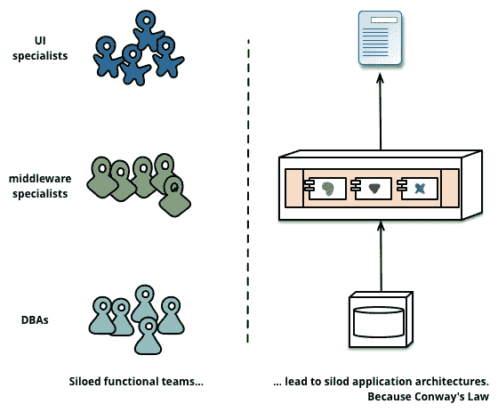
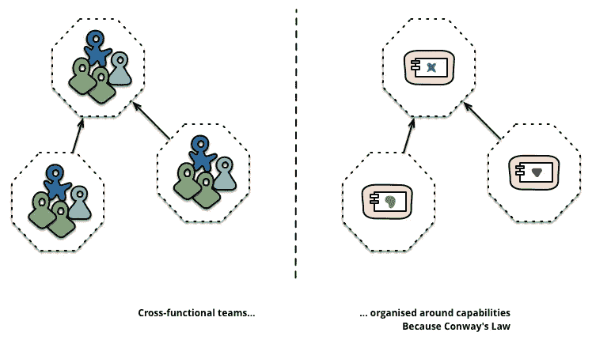
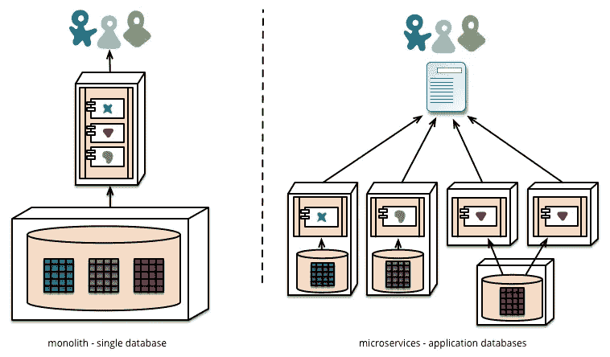
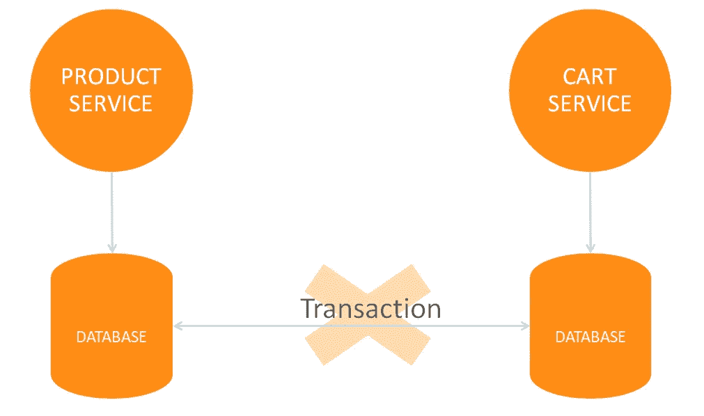
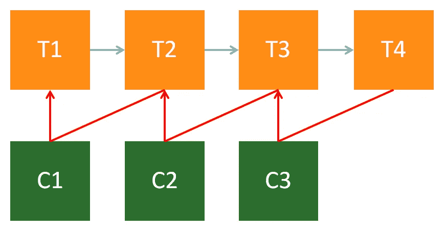
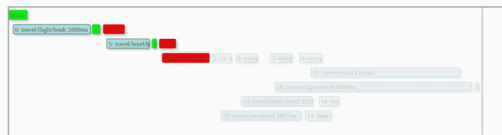

# 微服务之间的数据一致性:可能吗？

> 原文：<https://medium.com/oracledevs/data-consistency-among-microservices-is-it-possible-fe48938235d1?source=collection_archive---------0----------------------->

微服务是一种趋势，很好看，很酷……甚至很牛逼！但是，如果您正在考虑使用它或者已经转向这种方法，您是否已经考虑过如何正确地处理数据？你觉得你应该考虑一下吗？

# 第一:为什么是微服务？

您为什么要在项目中考虑微服务呢？为什么开发人员应该关心它？

答案可以通过康威定律找到:

> “设计系统的组织……不得不生产这些组织的通信结构的复制品。”

换句话说，你和/或你的公司交付的软件是以你们内部相互交流的方式构建的。

在马丁·福勒的一篇著名文章(URL 1)中，有一些康威定律的好例子。

首先，他展示了“孤立的职能团队”如何构建他们的应用程序:

那么“跨职能团队”是如何做到的:

什么给我们带来了一个重要的概念:微服务打算先规模化人，而不是软件。

也就是说，不管你把你的整体分成几十个、几百个甚至几千个服务。如果在分解的过程之前没有对你的团队的组织方式进行分解，你的项目结果可能是一场灾难。

另一个与组织你的团队的方式有关的定律也是众所周知的:“两个披萨定律”。它指出，组织中的任何团队和/或会议都不应该太大，以至于不能只用两个披萨来满足。通过这样做，公司保持了所有团队的小规模、独立性，如果一切顺利，还保持了敏捷。

通过加入两个定律(康威和 2 个比萨饼)，你明白你会分解你的团队，并保持小规模，以帮助你扩大规模。甚至在考虑扩展软件之前。

如果团队有自主权，他们可以选择服务中使用的技术。他们可以定义服务 API。当然，他们可以选择服务的数据库。

# 数据库和微服务

因为我们这里的观点是专门用微服务处理数据，所以 Fowler 的文章也讨论了这个问题。根据康威定律,“孤立”和“跨职能”团队的自然数据库输出如下:

在左侧，我们有整体数据库:整个应用程序只有一个数据库。

在右侧，每个应用程序一个数据库，也称为“每个服务模式一个数据库”。

如果你想更好地知道如何从左边来，到右边去，看看我的朋友 Edson Yanaga 的这本书(URL 2)。

每个服务一个数据库的模式有助于处理微服务开发的许多方面，但是也产生了一个问题:一致性。

# 数据一致性

在一张图片中，你会怎么说“一致性”？我会这样做:

当谈到微服务数据一致性时，它关系到我们应该做些什么来避免猫中的猫头鹰…

对于 monolith 数据库，使用 ACID 事务来保证一致性是很容易和自然的。ACID 缩写的意思是:

*   原子性:不管一个事务有一个、两个还是一百个步骤；所有这些都必须成功完成。否则，事务将被回滚；
*   一致性:在事务结束时，数据库中的所有数据必须一致。与完整性引用、业务逻辑引用等保持一致；
*   隔离:一个事务不能接触其他事务同时接触的数据；
*   持久性:与持久性有关。在事务结束时，数据必须持久保存在数据库中。

好吧，但是…当数据库彼此分离时，你会怎么做呢？你甚至不能保证它们使用相同的技术。你如何在它们之间进行交易？

它们可以在不同的网络、云供应商、服务器、框架下……请看下图:

到目前为止，我希望您确信您不能在微服务架构中的数据库之间进行事务处理，因此您不能使用事务来保证一致性。但是您仍然需要 ACID 事务能够为您的应用程序带来的结果，对吗？

# 拯救传奇

为了帮助我们应对这一挑战，有一个很棒的设计模式叫做 Sagas。作为一个快速的背景介绍，它在 1987 年由埃克托·加西亚-莫利纳和肯尼斯·塞勒姆写的一篇论文中首次被提及，该论文由普林斯顿大学出版。

这篇论文很棒，你可以在 URL 3 这里读到它的副本。

本文中最重要的一点是一个叫做“补偿交易”的概念。

因此，对于事务的每一步，都有一个在失败时调用的辅助步骤。重要提示:补偿事务不会回滚所做的事情，但会…嗯…补偿它。你可以在下图中看到:

假设你用信用卡购物 100 美元。但是产品有问题，你决定马上退货。信用卡公司不会回滚或删除交易:他们会创建另一个交易来恢复交易。来补偿它。

在你的信用卡账单上，你将会有 100 美元以上和 100 美元以下的交易。

因此，当您调用了一系列服务，其中一个失败时，您可以调用前一个服务的补偿事务，以便将数据状态返回到起点。

# 如何管理补偿电话

好的，很好。补偿交易无处不在，一切都会起作用。问题解决了！

良好的..

调用补偿有两种方式:

*   自我管理:如果出现问题，服务知道应该做什么。它知道必须调用哪个补偿；
*   编排:有一个服务用于编排调用链。它知道调用服务的顺序，以及当任何一个服务失败时必须做什么。

第一种在服务之间产生耦合。也增加了服务的复杂性。并且降低了它的可用性。所以，要避免。

第二个是松耦合的，复杂性转移到了 orchestrator 服务，服务保持了它们的可重用性。更喜欢。

想象一下，信用交易可以用在不同的场景中。一个用于购物，另一个用于退货，另一个用于在线服务……每一个都有不同的补偿要做。因此，每个场景可以有一个 orchestrator，让它管理所有棘手的部分。

太好了！现在，您已经有了一个模式和实现该模式的方法，以便在与不一致性的斗争中取得成功。但是，您是否注意到应用程序的复杂性正在增加？你如何保持它的可管理性，同时还能获得最好的佐贺外卖？

# 来自 Fn 流的手

有一个很棒的开源项目叫做 Fn。我不会在这里说太多的细节，但是你可以在 URL 4 得到更多的信息。

Fn 是一个无服务器的平台，在这里你可以像函数一样运行你的应用。为了帮助你管理你的函数执行，Fn 有一个很棒的工具叫做 Fn Flow。

Fn Flow 不仅可以管理、监控和记录所有函数的执行(如果你用它来调用它们的话)，还可以给你一个编排你的传奇故事的方法。

下面的代码可以在 URL 5 的 Fn 教程中找到。

它模拟了一个旅行社，您可以在其中预订和取消不同的旅游服务:酒店、汽车租赁和航班。在请求结束时，您应该会收到一封确认电子邮件。

服务编排器代码将如下所示:

要理解代码:

*   首先从"*"中获得一个 Fn 流的实例。current flow()*"；
*   通过这个实例，您可以从“ *invokeFunction(…)* ”创建每个服务端点的调用；
*   这些调用是未来的实例，因此您可以享受异步调用的所有好处；
*   做*然后作曲*的时候，可以管理调用的顺序，以及任何一个失败的时候应该调用什么；
*   对于每个“ *excepcionallyCompose* ”，它被称为“取消”方法，指向一个端点。

“*取消*的方法代码是这样的:

这些呼叫由 Fn Flow 跟踪，并可通过其仪表板进行监控。查看以下示例:

厉害！但是我们并不仍然“在那里”…我们“几乎在那里”…

这种方法通过调用另一个服务(“取消”服务)来解决处理每个服务失败的问题。但是如果“取消”服务也失败了呢？

你不能写长篇大论，因为出错的可能性是无穷无尽的，这样的代码会非常糟糕。那么，你应该怎么做呢？

# 商业方面

在补偿失败的情况下应该做什么的决定更多地与业务方面相关。

对于这个例子，选择是创建一个重试它的逻辑。因此，它没有调用“取消”方法，而是创建了一个“重试取消”方法:

Retry 类后面的代码在这里没有太大的区别，知道它将针对失败的端点安排一些重试就足够了。

如前所述，关于失败补偿的决定与商业方法密切相关。可能是:

*   打开求助服务台的票证
*   改变应用程序行为，直到问题得到解决
*   给某人/某处发电子邮件
*   你说出其他人的名字…

# 结论

微服务是解决许多情况的好方法，但前提是以正确的方式和正确的理由使用它。否则，它只会制造你的项目和团队中没有的复杂情况。

轮到你了！如果你尝试这些方法，分享你的想法和结果。

# 参考

网址 1:[https://martinfowler.com/articles/microservices.html](https://martinfowler.com/articles/microservices.html)

网址 2:[https://www . oreilly . com/programming/free/migrating-to-microservice-databases . CSP](https://www.oreilly.com/programming/free/migrating-to-microservice-databases.csp)

网址 3:[https://www . cs . Cornell . edu/andru/cs 711/2002 fa/reading/sagas . pdf](https://www.cs.cornell.edu/andru/cs711/2002fa/reading/sagas.pdf)

网址 4:[http://fnproject.io/](http://fnproject.io/)

URL 5:[https://github . com/delabassee/tutorials/tree/master/flow saga](https://github.com/delabassee/tutorials/tree/master/FlowSaga)