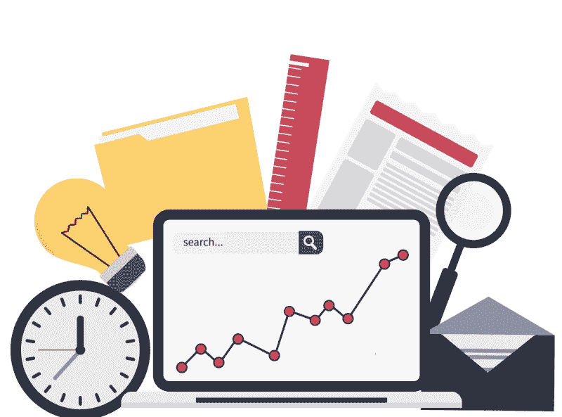

# “新世界”中的数据驱动营销

> 原文：<https://medium.com/globant/data-driven-marketing-in-the-new-world-a2d7e2fa8f20?source=collection_archive---------2----------------------->

很明显，在危机的不同阶段，公司需要回到绘图板，重新设计他们的品牌信息和管理他们的品牌形象。在这些艰难时期，公司必须小心行事。我注意到有两种品牌处于危机中:一种是等待和观望的品牌，另一种是观察场景并重新调整受众的品牌

传统媒体和 f2f 与客户的互动不再是一个选项，50%的营销预算现在可以使用或转移到数字渠道。

让我们来探讨数字渠道是如何在危机中重塑的，以及品牌可以做些什么来建立和保持客户信心及其品牌形象。

社交不再被娱乐或简单地追踪 Kardasians 人发布的图像所主导。前瞻性的品牌使用社交渠道作为与顾客互动的延伸。我能听出你在想，f2f 客户互动什么都不会发生，但我保证这是第二次。简而言之，如果一个渠道有一个固定的受众，不要仅仅把你的广告费花在它上面，而是用它来重塑你的品牌传播和建立新的收入渠道。

那么你怎么处理所有的广告费呢？根据 IAB 的数据，60%的买家已经调整或暂停了他们的广告支出计划，而 16%的买家仍在决定采取什么行动。在第三和第四季度，甚至在 2021 年的某个时候，这些预算的一部分将转移到受众定位和 OTT 平台，营销信息将转移到相关和基于任务的营销

现在比以往任何时候都更需要的是保持联系和维持客户信心。营销自动化将在未来创造富人和穷人之间的差异，因为拥有受众培养流程且营销引擎不会过热的品牌将轻而易举地胜出

接下来看你的品牌的内容策略。这不仅仅是危机管理的策略，这是卫生。根据 SCMP 的一篇文章，研究表明移动用户现在每天花超过 6 个小时在线——这几乎是一周两整天。全球范围内的移动参与没有显示出放缓的迹象。品牌创建内容计划变得比以往任何时候都更加重要，无论你选择将内容外包给数字营销供应商还是拥有内部核心团队，都要确保你可以衡量哪些内容对你有用。在这个每个主题都有大量内容的时代，专注于互动内容而非静态内容才能保持领先

随着不断变化的搜索引擎算法，是时候不知疲倦地工作，让你在搜索引擎上排名靠前

最后也是最重要的一点，让数据驱动您的决策。追踪追踪追踪你的受众是如何与你的品牌互动的。我怎么强调都不为过的是，那些不了解自己客户行为的公司在瞎猜，他们的市场份额被那些拥有数据驱动营销战略的公司抢走了。让数据显示你的品牌的优势和劣势，并预测你的受众的未来行为

大多数企业将经历减速。你现在越是努力保持你的品牌存在，当世界进入全新的常态时，品牌就会越快恢复和反弹。花些时间来维持客户的信心并建立长期信任。