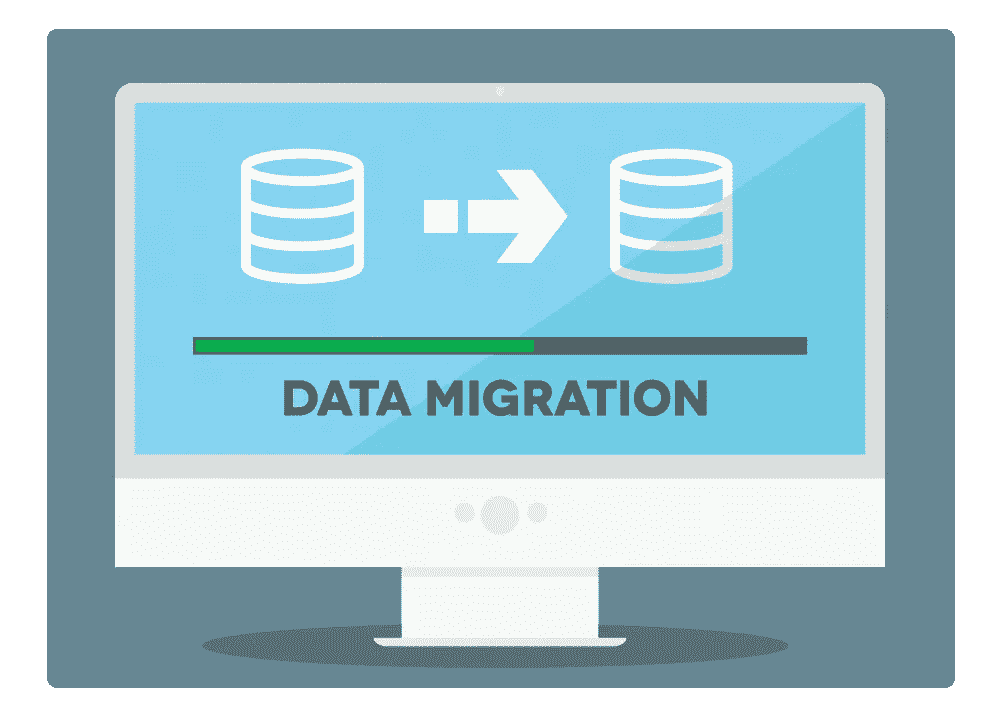
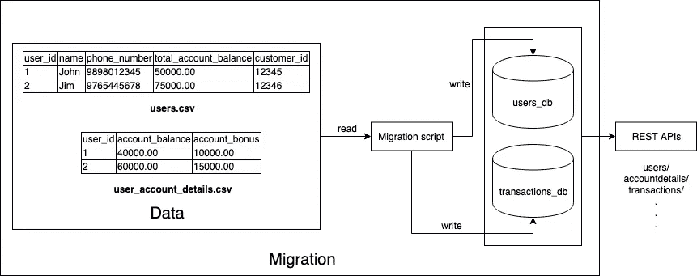
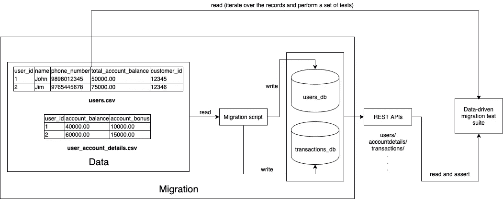

# 用 REST APIs 和 Python 进行数据驱动的迁移测试

> 原文：<https://medium.com/quick-code/data-driven-migration-testing-with-rest-apis-and-python-4585fb13b23f?source=collection_archive---------1----------------------->

数据迁移是将信息(数据)从一个系统转移到新系统的过程。

Image courtesy: [https://www.cobalt.net](https://www.cobalt.net/)

## 背景

在通过在数据库上运行迁移脚本来迁移数据之后，确保迁移的数据“正确地”进入数据库是很重要的，尤其是在数据的正确性是首要考虑的问题并且任何与该数据有关的问题都可能是昂贵的情况下，例如涉及有价值的数据、敏感信息、基于一些复杂的业务逻辑从迁移的数据中导出的数据等的交易记录。

## 问题陈述

考虑这个简单的例子，我们打算将数据从多个 CSV 文件迁移到数据库，来自数据库的数据在银行账户管理系统的 API 层进行处理。这个系统有不同的电话号码的不同用户。

这里，我们有两个 CSV(*users . CSV*包含银行账户持有人的主要详细信息，以及 *user_account_details.csv* 包含不同用户在各自账户中的余额和奖励金额的详细信息)。在现实世界中，可能有更多这样的 CSV 文件。事实上，可以有另一个数据库来代替 CSV。

如前所述，确保这些数据“正确地”进入数据库是至关重要的。**因此，在 API 层测试迁移脚本和业务逻辑变得很重要。**因为实际数据的正确性是这里最关心的问题，所以仅仅做一些简单的测试，比如针对来自 CSV 的参考数据记录的计数断言迁移数据记录的计数，可能是不够的(事实上，这是不可能的！).

## 方法

所以我用 Python 编程语言使用了类似[*lemoncheesecake*](http://docs.lemoncheesecake.io/en/latest/ddt.html)的测试框架/运行器的[数据驱动测试](https://en.wikipedia.org/wiki/Data-driven_testing)功能。将会有一个[*lemoncheesecake*](http://docs.lemoncheesecake.io/en/latest/tests-and-suites.html)测试套件，该套件将具有参数化的测试，该测试将运行来自参考 CSV(该 CSV 可能本质上是馈送给迁移脚本以迁移数据的相同文件)的不同记录，并通过进行实际的相关 REST API 调用来验证不同的数据点。

下面是测试套件的样子。当然，在现实世界中，通过断言从 API 响应返回的值，可以实现更多的验证。