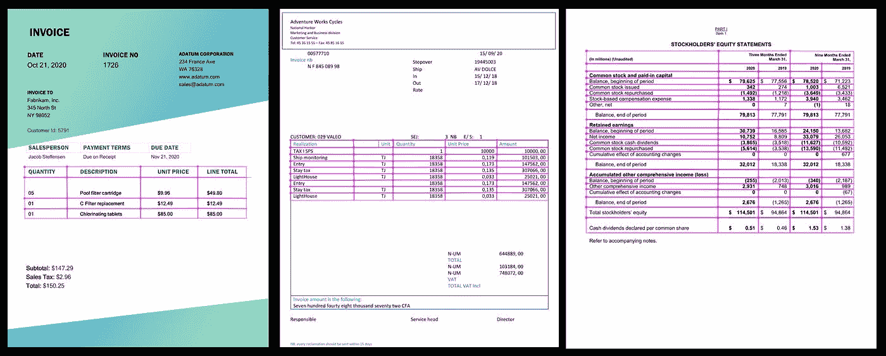
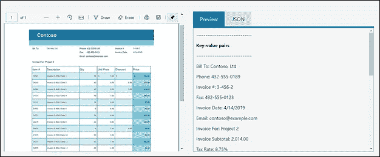
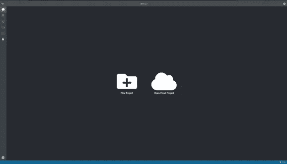

# 使用 Azure“表单识别器”自定义模型提取数据

> 原文：<https://medium.com/version-1/data-extraction-using-azure-form-recognizer-custom-model-python-sdk-ec40bb89a611?source=collection_archive---------0----------------------->

Credit: Pixabay

# 需求:

在自动化、机器学习和 AI 的时代，许多公司仍然手动读取和处理成千上万的表格(发票、税务表格、手写表格等。)并将数据输入到结构化模式中。

一些公司甚至雇佣第三方公司来处理他们的表格，每页的费用高得令人望而却步。在这两种情况下，表单处理都是耗时、繁琐、昂贵的，并且容易出现人为错误。

从印刷和手写表单中自动提取数据现在是一项屡试不爽的技术。微软 Azure 提供了许多认知服务**(视觉、语音、语言、知识和搜索)**协助开发者将 AI 引入应用，使其变得智能。

这些认知服务可以结合起来，使应用程序**更加智能，更有吸引力，更容易被发现。作为微软 Azure 认知服务的一部分，Azure [**表单识别器就是这样一种服务。**](https://docs.microsoft.com/en-us/azure/cognitive-services/form-recognizer/overview?tabs=v2-0)**

Image from [Microsoft Azure Cognitive Services Demos](https://azure.microsoft.com/en-us/services/cognitive-services/form-recognizer/#features)

# **概述:**

[**表单识别器**](https://docs.microsoft.com/en-us/azure/cognitive-services/form-recognizer/overview?tabs=v2-0) 是一个人工智能支持的文档提取服务，它可以理解表单，并从 W2 税务报表、完成报告、发票和采购订单等文档中提取键值对、表格和文本。

除了打印表单，表单识别器还增加了对手写和混合模式(打印和手写)的支持。

**例如:从收据中提取键值对。**

Image from [Microsoft Azure Cognitive Services Demos](https://azure.microsoft.com/en-us/services/cognitive-services/form-recognizer/#features)

**表单识别器由以下服务组成:**

**布局 API** —从文档中提取文本、选择标记和表格结构以及它们的边界框坐标。

**自定义模型** —从表单中提取文本、键/值对、选择标记和表格数据。这些模型是用我们自己的数据训练的，所以它们是为我们的表单量身定制的。

**预建模型** —使用预建模型从独特的表单类型中提取数据。目前可用的有以下预建模型、发票、销售收据、名片。

在这篇博客中，我们将主要关注定制模型，以及我们如何通过使用 REST API 或客户端库 SDK**来调用它们，以降低复杂性并将其集成到我们的工作流或应用程序中。**

# **表单识别器—自定义模型:**

表单识别器使用[机器学习技术](https://www.expert.ai/blog/machine-learning-definition/#:~:text=Machine%20learning%20is%20an%20application,use%20it%20learn%20for%20themselves.)从文档中提取数据。为此，至少需要 5 个表单来创建一个模型，后续表单可以将该模型用作标签目的的参考点。

用于辅助标记的工具是**表单识别器标记工具**。

**贴标工具:**

微软已经通过 [Docker 提供了这个工具。](https://www.docker.com/)你可以在笔记本电脑或 VM(虚拟机)上安装 Docker。任何操作系统都可以做到这一点:Linux、Windows 或 macOS。这是一个很好的方法，可以让我们把建模项目留在现场。有些人更喜欢使用 PaaS 方法来安装工具，因为它可以保证可用性，而不依赖于笔记本电脑或虚拟机。请点击找到设置工具[的链接。](https://docs.microsoft.com/en-us/azure/cognitive-services/form-recognizer/deploy-label-tool?tabs=v2-0)

**构建定制模型的先决条件:**

**1。Azure 订阅**

**2。表单识别器资源(通过 Azure 门户创建)**

**3。Azure 存储帐户(用于存储培训文档集)**

**4。** [**邮差**](https://www.postman.com/automated-testing/) **(一个 API 测试工具)**

我们可以通过手动标记训练文档来训练定制模型。使用标签/标记进行训练可以在许多情况下带来更好的表现。返回的 **CustomFormModel** 显示了模型可以提取的所有字段，以及每个字段的估计精度。

为了使用标签进行训练，我们需要在训练文档旁边的 blob 存储容器中有一些特殊的标签信息文件(例如，在 pdf 训练文件的情况下:\ <filename>.pdf.labels.json)。上面提到的表单识别器示例标签工具为我们提供了一个 UI 来帮助创建这些标签文件。</filename>

模型的训练可以使用标记工具本身来完成，或者开发人员可以使用表单识别器客户端库来以编程方式用以下语言集成训练过程 Python、JavaScript、C#和 Java。有关各种语言的示例代码 SDK，请访问微软 GitHub 页面或[文档](https://docs.microsoft.com/en-us/azure/cognitive-services/form-recognizer/quickstarts/client-library?tabs=ga&pivots=programming-language-csharp)。

成功训练后，我们可以使用所开发的训练模型的模型 id，从定制表单中提取键/值信息和其他用户定义的标签。分析也可以在标签工具上进行，并使用任何 4 种语言编程。

除了训练和测试模型，我们还可以管理创建的不同模型。可以执行与管理模型相关的以下操作。

**1。请检查 FormRecognizer 资源帐户中的模型数量。**

**2。列出当前存储在资源帐户中的模型。**

**3。使用型号 ID** 获取特定型号

**4。从资源帐户中删除一个模型**

上述操作可以使用 4 种语言中的任何一种来执行。

Credit: [Christina Morillo](https://www.pexels.com/@divinetechygirl)

# **更进一步:**

**预处理:**

众所周知，Azure 表单识别器使用 Azure Read API 对手写文本和打印文本进行 OCR。在现实世界中，我们无法获得完美的扫描或定向文档，OCR 的性能会受到严重影响。

这种情况是通过采取一些预处理步骤来处理的，以增强、准确定位和消除文档中的任何倾斜。使用开源库 [**Open-CV**](https://docs.opencv.org/master/d9/df8/tutorial_root.html) **进行预处理。**

**后处理:**

此外，在获取结果后，**OCR 值的准确度与地面真实值相比往往更低。**这可以通过建立机器学习模型来创建自动文本校正的后处理步骤来控制，该机器学习模型馈入特定领域的训练数据集。

**结论:**

我强烈建议使用 Azure Form Recognizer，并添加预处理和后处理步骤来补充 Azure 服务，并构建一个适合您自己特定需求的解决方案。

# **了解更多:**

*Sumit Kumar 是一名数据分析顾问，在第 1 版工作了两年，对数据分析、数据工程和数据科学有浓厚的兴趣。Sumit 目前在版本 1 创新实验室工作。创新实验室自 2018 年以来一直在行动，并以成功的合作价值证明(POV)的形式拥有许多成功的故事。我们热衷于在没有现有客户和新客户的情况下吸引更多客户，以展示最新技术如何为他们的业务增加价值。要了解更多关于版本 1 的创新，请访问我们的* [*这里的*](http://www.version1.com/innovation) *。*