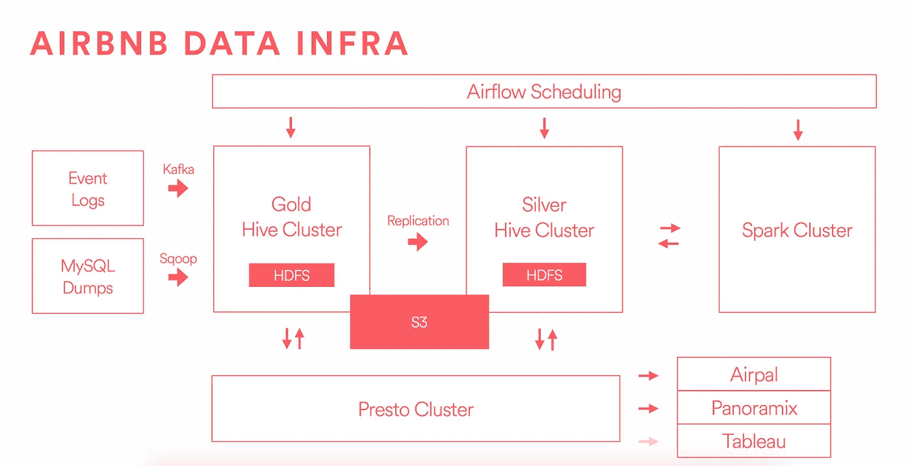

# Airbnb 的数据基础设施

> 原文：<https://medium.com/airbnb-engineering/data-infrastructure-at-airbnb-8adfb34f169c?source=collection_archive---------1----------------------->

由[詹姆斯·梅菲尔德](https://www.linkedin.com/in/james-mayfield-15b71354)、[克里希纳·普塔斯瓦米](https://www.linkedin.com/in/krishnaputtaswamy)、[斯瓦鲁普·贾加迪什](https://www.linkedin.com/in/swaroopjagadish)和[凯文·朗](https://www.linkedin.com/in/xi-kevin-long-2197a712)

## **第 1 部分:我们数据基础设施背后的理念**

在 Airbnb，我们倡导数据知情文化，并将数据作为决策的关键输入。跟踪指标、通过实验验证假设、构建机器学习模型以及挖掘深层业务洞察力，这些对于我们快速和明智地行动都至关重要。

经过许多发展步骤后，我们现在觉得我们的数据基础设施栈是稳定、可靠和可扩展的，因此这似乎是一个与社区分享我们经验的好机会。在接下来的几周内，我们将发布一系列博客文章，重点介绍我们的分布式架构和工具套件。因为开源贡献者提供了我们每天使用的许多基础系统，所以我们非常乐意不仅在公开的 GitHub repos 中贡献有用的项目，而且描述我们一路上学到的东西。

在我们从事数据基础设施工作期间，出现了一些非正式的理念:

*   **关注开源世界:**开源社区中有很多关于数据基础设施的好资源，我们尝试采用这些系统。此外，如果我们自己创造了一些有用的东西，并且回馈社会是可行的，我们也会回报社会。
*   **更喜欢标准组件和方法**:有时候发明一个全新的基础设施是有意义的，但通常这并不是对资源的良好利用。对何时构建独特的解决方案以及何时采用现有的解决方案有直觉是很重要的，这种直觉必须正确地考虑维护和支持的隐性成本。
*   **确保它可以扩展:**我们发现，数据不会随着业务的增长而线性增长，而是随着技术员工在业务增长的基础上开始构建新产品和记录新活动而超线性增长。
*   **通过倾听同事的意见来解决实际问题:**与公司周围的数据用户共情是为我们的路线图提供信息的重要组成部分。按照亨利·福特的口号，我们必须在制造更快的马和制造汽车之间取得平衡——但首先要倾听客户的意见。
*   **留点余地:**我们为集群超额订购资源，以培养一种无边界探索的文化。基础设施团队很容易过早地沉浸在资源最大化的兴奋中，但我们的假设是，在仓库中发现的一个新的业务机会将远远抵消这些额外的机器。

## **第二部分:基础设施概述**

这是一个简化的图表，显示了我们基础架构堆栈的主要组件。

源数据通过两个主要渠道进入我们的系统:通过 [Kafka](http://kafka.apache.org/index.html) 发送事件的源代码中的工具，以及使用 RDS 上的 AWS 时间点还原获取的生产数据库转储，然后通过 [Sqoop](http://sqoop.apache.org/) 交付。

然后，包含用户活动事件数据和维度快照的源数据被发送到黄金集群，我们在那里存储数据并开始运行提取、转换和加载作业。在这一步中，我们应用业务逻辑，制作汇总表，并执行数据质量检查。

在上图中，有两个独立的“黄金”和“白银”集群，我们将在本文稍后详细描述。这种分离的主要原因是为了保证计算和存储资源的隔离，并在发生停机时提供灾难恢复保证。这种体系结构提供了一个黄金环境，其中最关键的作业可以在严格保证和服务级别协议的情况下运行，不会受到资源密集型即席查询的任何干扰。我们也将 Silver 集群视为一个生产环境，但是放松了所做的保证，并容忍资源密集型查询的爆发。

请注意，通过拥有两个集群，我们获得了隔离的能力，但这是以管理大量数据复制和维护动态系统之间的同步性为代价的。黄金是我们真相的来源，我们将每一位数据从黄金复制到白银。在白银集群上生成的数据不会复制回黄金集群，因此您可以将此视为单向复制方案，让白银集群成为所有数据的超集。由于我们的大部分分析和报告都是在白银集群中进行的，因此当新数据进入黄金集群时，我们必须尽快将其复制到白银集群，以确保所有用户作业无延迟运行。更重要的是，如果我们更新黄金集群上预先存在的数据，我们必须注意到该更新，并将该更改向下传播到白银集群。这个复制优化问题在开源中没有一个好的解决方案，所以我们建立了一套新的工具，我们将在即将到来的帖子中更详细地描述它。

我们已经做了很大的努力来处理 HDFS，更准确地说，处理 Hive 管理的表，作为我们数据的中心源和接收器。仓库的质量和健全性依赖于数据的不变性和数据的所有派生的可再现性——使用分区的 Hive 表对于这个目标非常重要。此外，我们不鼓励不同数据系统的扩散，不希望在我们的源数据和最终用户报告之间维护单独的基础设施。根据我们的经验，这些中间系统混淆了事实的来源，增加了 ETL 管理的负担，并且使得很难在仪表板上追踪指标数字的谱系，一直追溯到它所源自的源数据。我们不运行 Oracle、Teradata、Vertica、Redshift 等。而是对 Hive 管理的表上的几乎所有特别查询使用 Presto。我们希望在不久的将来将 Presto 直接连接到我们的 Tableau 装置上。

图表中需要注意的其他一些事情包括 [Airpal](http://airbnb.io/airpal/) ，这是一个基于 web 的查询执行工具，由 Presto 提供支持，由我们构建并开源。它是我们的主要界面，供用户针对仓库运行特定的 SQL 查询，超过 1/3 的员工使用该工具运行过查询。作业调度通过[气流](http://airbnb.io/projects/airflow/)进行，这是一个以编程方式创作、调度和监控数据管道的平台，可以在 Hive、Presto、Spark、MySQL 等平台上运行作业——注意，我们在逻辑上跨集群共享气流，但实际上气流作业在适当的集群、机器和工作人员集合上运行..我们也建立了 Airflow 并开源了它。Spark cluster 是另一个深受从事机器学习的工程师和数据科学家青睐的处理工具，对于流处理非常有用。你可以在 [Aerosolve](http://airbnb.io/aerosolve/) 的帖子中查看我们在 ML 方面的更多努力。S3 是一个独立的存储系统，我们可以从 HDFS 退役的数据廉价的长期存储。Hive 管理的表可以改变它们的存储并指向 S3 文件，以便维护简单的访问模式和元数据管理。

## **第 3 部分:详细了解我们的 Hadoop 集群发展**

今年，我们进行了一次重大迁移，从一组架构不佳的集群“Pinky and Brain”迁移到上述的“Gold and Silver”系统。为了给规模设定一些背景，两年前我们从 Amazon EMR 迁移到一组运行 HDFS 的 EC2 实例上，拥有 300 的数据。如今，我们有两个独立的 HDFS 集群，拥有 11pb 的数据，此外，我们还在 S3 存储了数 Pb 的数据。在此背景下，以下是主要的问题领域以及我们为解决这些问题所做的工作:

**A)在 Mesos 架构上运行独特的 Hadoop**

Airbnb 的一些早期工程师对一种名为 Mesos 的基础设施有着浓厚的兴趣，该基础设施旨在在许多服务器上部署单一配置。我们在 AWS 中构建了一个由 c 3.8 x 大型机器组成的集群，每个机器都有 3TB 的 EBS 支持，并在 Mesos 上运行所有 Hadoop、Hive、Presto、Chronos 和 Marathon。

明确地说，许多公司使用 Mesos 取得了巨大的成效，并实现了新的解决方案来管理运行重要基础设施的大型机器。但是，我们的小团队决定运行一个更标准的、无处不在的部署将减少我们在操作和调试上花费的时间。

关于 Mesos 问题的 Hadoop:

*   对正在运行的作业和日志文件的了解非常少
*   对集群运行状况的了解非常少
*   Mesos 上的 Hadoop 只能运行 MR1
*   任务跟踪器争用导致的性能问题
*   正在使用的集群
*   高操作负荷和系统推理困难
*   缺乏与 Kerberos 的安全性集成

***解决方案:*** 答案是简单地移动到一个“标准”堆栈。我们很高兴从数百家，甚至可能是数千家运营大型集群的其他公司那里了解到，他们并没有试图发明一种新颖的解决方案来解决我们无法解决的问题。

**B)远程读写**

通过将我们所有的 HDFS 数据存储在挂载的 EBS(弹性块存储)卷中，我们通过公共的 Amazon EC2 网络发送大量数据，以便运行查询。Hadoop 是为商用硬件构建的，并期望在旋转的磁盘上进行本地读写，因此这是一种设计不匹配。

除了读取和写入的远程特性，我们错误地选择了在 AWS 的一个区域内，将我们的数据存储拆分到三个独立的可用性区域。此外，每个可用性分区都被指定为自己的“机架”，因此 3 个副本存储在不同的机架上，因此远程读取和写入会不断发生。这又是一个设计缺陷，导致数据传输缓慢，每当机器丢失或数据块损坏时，都会发生远程拷贝。

***解决方案:*** 使用本地存储的专用实例，在没有 EBS 的单一可用性区域中运行，解决了这些问题。

**C)同构机器上的异构工作负载**

查看我们的工作负载，我们发现对我们的架构组件有不同的需求。我们的 Hive/Hadoop/HDFS 机器需要大量存储，但不需要太多 RAM 或 CPU。Presto 和 Spark 渴望内存和处理能力，但不需要太多存储。运行由 3TB EBS 支持的 c 3.8x 大型实例被证明是非常昂贵的，因为存储是我们的限制因素。

***解析:*** 一旦我们迁移出 Mesos 架构，我们就能够选择不同的机器类型来运行各种集群，例如使用 r3.8xlarge 实例来运行 Spark。在我们评估一个转变的时候，亚马逊碰巧发布了他们的新一代“D 系列”实例，从成本角度来看，这使得转变更加可取。从 c 3.8x 大型计算机上的每节点 3TB 远程存储迁移到 d 2.8x 大型计算机上的 48TB 本地存储是非常有吸引力的，将在未来三年为我们节省数百万美元。

**D) HDFS 联邦**

我们使用 Pinky 和 Brain 运行了一个联合 HDFS 集群，其中的数据保存在共享的物理块池中，但是映射器和缩减器的集合是按逻辑集群隔离的。这带来了令人敬畏的最终用户体验，任何数据都可以通过 Pinky 查询或 Brain 查询来访问，但不幸的是，我们发现 federation 没有得到广泛支持，并且被专家认为是实验性的和不可靠的。

****E)系统监控负担过重****

**拥有独特的基础架构系统的最严重的问题之一是被迫为集群创建自定义的监控和警报。Hadoop、Hive 和 HDFS 是复杂的系统，它们的许多旋钮和刻度盘容易出现错误。尝试预测所有的失败状态并设置合理的分页阈值被证明是相当具有挑战性的，并且它也感觉我们正在解决一个已经解决的问题。**

*****解决方案:*** 我们与 Cloudera 签订了支持合同，以利用他们在设计和运营这些大型系统方面的专业知识，最重要的是通过使用 Cloudera Manager 工具来减轻我们的维护负担。将它链接到我们的厨师食谱中，大大减轻了我们的监控和警报负担，我们很高兴地报告，我们在系统维护和警报上花费的时间非常少。**

****结论****

**在评估了旧集群设置的所有错误和低效之后，我们开始系统地解决这些问题。在不中断同事服务的情况下，迁移数 Pb 的数据和数百个用户作业是一个漫长的过程；我们将单独就该主题撰写一篇新的帖子，并向开源社区发布我们的一些工具。**

**现在迁移已经完成，我们已经大幅减少了平台中的事故和停机次数。不难想象，在不成熟的平台上运行我们的定制堆栈时，我们要处理的错误和问题的数量有多少，但是这个系统现在已经很旧了，而且基本上是稳定的。另一个好处是，当我们雇用新的工程师加入团队时，入职流程得到了简化，因为其他公司所采用的系统都很熟悉。**

**最后，因为我们有机会在新的黄金级和白银级设置中重新设计事物，所以我们有机会旋转所有新的实例并添加 IAM 角色来以合理的方式管理安全性。这意味着在集群之上有一个更加合理的访问控制层，并与我们管理所有机器的方式相集成。**

**事实上，我们能够大幅削减成本，同时提高性能是了不起的。以下是一些统计数据:**

*   **磁盘读/写速度从 70–150 MB/秒提高到 400 多 MB/秒**
*   **配置单元作业的 CPU 和挂钟时间快 2 倍**
*   **在适用的情况下，我们的机器上的网络可以完全饱和**
*   **读取吞吐量提高了约 3 倍**
*   **写吞吐量提高了约 2 倍**
*   **成本降低了 70%**

## ****第四部分:感谢和赞美****

**非常感谢在 Airbnb 建立数据基础设施原始基础的工程师团队，以及一直在稳步改善和稳定系统的人们。我很高兴写这篇博文，但真正的功劳归于尼克·巴罗-威廉姆斯、格雷格·勃兰特、丹·达维多夫、华文生、斯瓦鲁普·贾加迪什、安迪·克拉莫利施、凯文·龙、经纬·卢、威尔·莫斯、克里希纳·普塔斯瓦米、·唐、保罗·杨、曾洪波和。**

## **在 [airbnb.io](http://airbnb.io) 查看我们所有的开源项目，并在 Twitter 上关注我们:[@ Airbnb eng](https://twitter.com/AirbnbEng)+[@ Airbnb data](https://twitter.com/AirbnbData)**