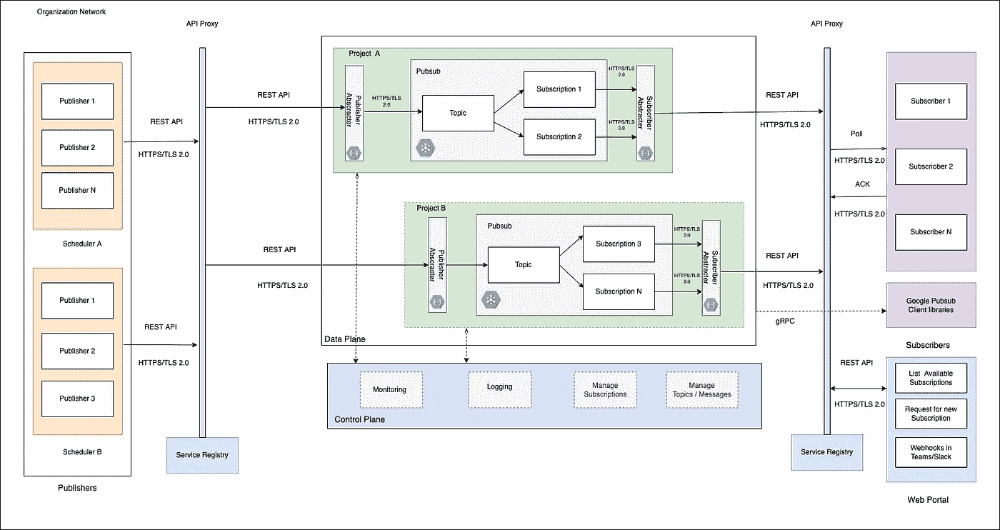
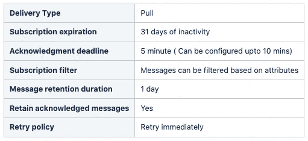

# 使用 Google PubSub 的数据湖工作负载同步

> 原文：<https://medium.com/walmartglobaltech/data-lake-workloads-synchronization-using-google-pubsub-17b85e75c51c?source=collection_archive---------7----------------------->

这篇博客是由[斯里达尔·丽卡拉](https://medium.com/u/b4a06d6c3926?source=post_page-----17b85e75c51c--------------------------------) & [罗希特·博加拉朱](https://medium.com/u/2dccc845553f?source=post_page-----17b85e75c51c--------------------------------)共同撰写的


Relay race depicting workload dependencies

作为沃尔玛全球技术公司的数据工程师，我们在大规模环境中运行多种工作负载，处理的数据比以往任何时候都多。就像在接力赛中一样，我们监视大量的源团队工作负载，并等待它们完成。接力棒交给我们后，我们开始工作，然后移交给下一个团队，他们的工作依赖于我们的数据。始终存在满足服务级别协议(SLA)的竞赛，这些工作负载的相互依赖性在数据完整性和向企业及时交付数据方面起着至关重要的作用。我们将讨论承认这些相互依赖性所遵循的常见模式，以及我们的工作流同步框架如何使我们能够解决一些关键挑战。

## 对工作负载同步的期望

如今，数据被视为一种产品。它应该在正确的时间、正确的地点可用，并且有向自助式数据基础设施的巨大转变，通过数据网格连接数据湖。有了这些分布式架构，工作负载之间的联系比以前更加紧密。工作负载需要更多关于数据可用性的信息，而不是基于接触文件的确认。此外，创建、查看和管理特定于工作负载的触控文件在规模上也极具挑战性。


Workload interdependency patterns

另一种常见的做法是基于时间的调度。大多数时候，我们会看到工作负载提前完成。如果从属工作负载在父工作负载完成后立即得到通知，那么我们可以提前交付关键业务报告。有时，数据刷新通过电子邮件通信通知，相关团队将通过电子邮件跟进并启动他们的工作负载。

应用程序和 BI 工具需要基于推送的通知来启动数据刷新，而不是全天轮询。同时，我们需要能够存储同步数据，以便我们可以运行分析来优化工作负载。

为了解决上述需求，我们构建了一个基于事件的消息传递框架，该框架包装在 Google PubSub 周围，用于同步工作负载，而不考虑它们运行的调度程序或应用程序。以下部分详细介绍了该框架。

## 工作流同步框架

工作流同步框架建立在抽象消息中间件的思想上，使不同平台上的生产者和订户能够同步他们的工作流。它为由消息生产者团队管理的板载项目和创建主题提供了灵活性。例如，项目 A 和项目 B 可以属于不同的团队，每个团队都可以创建自己的主题、管理订阅和定义访问控制。以下段落提供了该框架每个组成部分的更多细节。



Workflow synchronization framework

**消息生产者**

消息生产者通过 REST API 将消息发布到主题。API 代理会将消息重定向到在不同项目上创建的相关主题。生产者可以通过在服务注册中心注册而自行加入，他们将被分配一个惟一的消费者 id，该 id 必须与 REST API 调用的附加头一起传递。此外，服务注册中心提供了添加关于传入吞吐量、延迟等的策略的能力。对于传入的请求。

然后，请求通过发布者抽象器，发布者抽象器接收请求，验证请求，并通过 Pubsub API 将消息发布到主题。一旦消息被发布到主题，API 返回一个消息 id 作为确认，消息框架负责将消息发送给订阅者。

**消息订阅者**

订阅者可以通过 REST API 使用消息，也可以在客户端库中查看消息。就像消息生成者一样，订阅者也可以通过 service registry 自行加入主题列表。注册时，将为该主题创建一个订阅，每个订阅者将被分配一个唯一的消费者 id。在入职期间，订阅者可以选择配置订阅，如下所示。



A sample subscription configuration for a daily load

**消息格式**

消息格式(模式)充当生产者和消费者之间的契约，并根据需要发展。该框架提供了可用主题及其消息格式的列表，这有助于订阅者应用过滤器并在他们结束时解析消息。

```
{
 “data”: {
 “schemaName”: “sales_dl_rpt”,
 “tableName”: “item_sales”,
 “status”: “completed”,
 “loadType”: “incremental”,
 “loadedTime”:1641270222
 },
 “attributes”: {
 “source”: “datalake”,
 “subjectArea”: “sales”,
 “storageLayer”: “object store”
 }
}
```

上面的示例消息格式显示加载了一个特定的表。消息本身包含关于模式、表、状态和加载时间的详细信息。属性中有几个字段，订阅可以根据需要使用它们来过滤消息。框架在创建主题时不强制模式。消息结构也可以在生产者抽象层中定义。

**监控和记录**

该框架提供了一个集中的位置来监控主题、生成的消息、订阅的消息、项目的延迟和审计操作，例如主题的创建、数据访问和系统事件。团队还可以构建自己的监控仪表板和控制台来检查日志。

**前进**

我们使用这个框架已经有一段时间了，并且成功地同步了下游团队的工作负载和应用程序，因为工作负载是从源完成的。门户网站帮助生产者和订阅者自助，下一步，我们将增加新功能，以提供对工作负载谱系的可见性。