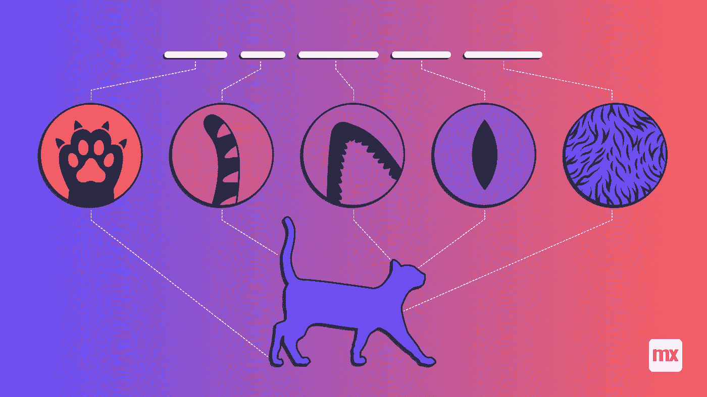
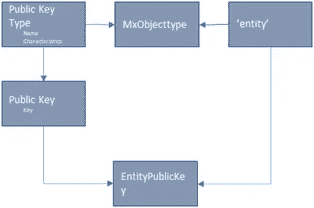
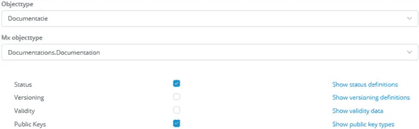

# 数据生命周期管理:公钥

> 原文：<https://medium.com/mendix/data-lifecycle-management-public-keys-bc989d3a1675?source=collection_archive---------3----------------------->

# 在之前的帖子中，我一直在讨论秘鲁纳斯卡的一幅猫的图画，作为项目中数据生命周期的例子。现在我们来看看这幅图，想象一下不同的公共组织会如何给同一只猫贴上标签。

例如，国家政府可能将猫标识为公共艺术作品 N098，而山可能被编码为 14.70–75.10，代表其地理位置。国家旅行社将纳斯卡所有绘画的综合体标注为 NAZ17，该综合体的世界遗产代码为 PERU172。在《纳斯卡线条手册》中，这幅特别的画被称为“C3”。

所有这些键都用于识别不同系统中的图形，并用于这些系统之间的数据接口。因为这些密钥也是供外部使用的，所以我称它们为'**公钥**。

现在，在我所知道的大多数系统中，每种类型的公钥都有一个单独的属性添加到表示对象的实体中，所有的业务规则(唯一性、格式、搜索特征)都是按属性编程的。当然，如果只有几个与系统相关的公钥，这是可以的。

但是在许多情况下，为公钥建立一个单独的结构是有意义的。因为这种结构允许在使用外部代码时有更多的动态，所以它为我们提供了每个应用实例具有不同特征的可能性(例如，在比利时不同于荷兰)，并且更高效(解决一次，使用多次)。

下面你会发现一个公开密钥的草案结构。什么时候用？我的建议:如果有两个以上的实体使用公钥，或者至少有一个实体使用两个以上的公钥。

# 公钥类型

在 Mendix 应用程序中使用公钥需要这样的结构:

**要理解这个结构:**

‘公共密钥类型’定义了公共密钥的类型、其唯一性、其格式(例如，作为通用表达式),并引用它所引用的 Mendix 对象类型；

“公钥”定义了密钥的值；

当使用公共密钥时，密钥本身链接到与 Mendix 对象类型相关的实体；

在上面的示例中,“地理位置”链接到 Mendix 对象类型“山”,它在特定时刻是唯一的，其格式为“99.99–99.99”。这种类型的公钥是“14.70–75.10”，并链接到实体山的特定对象。

**一些注意事项:**

唯一性可以定义为它同时链接到多个对象的能力，或者可以链接到多个对象但不能同时链接，也可能根本不能链接到多个对象；

在特定实体的搜索表单中，如果相应的 Mendix 对象类型由一个或多个公钥类型使用，则应添加对公钥(在目标日期)的搜索；

公钥类型的维护应分配给其自己的用户角色；

注意，如果存在应用的几个实例(例如，应用被提供给不同的客户)，每个实例的公钥类型和特征可能不同，并且维护应该是每个实例的；

根据其他实体属性，格式可能会有所不同。例如，荷兰地址公司的财政号码可能是“NL999999999B99”，而在比利时是“BE0999999999”。

在接口中，在大多数情况下，什么样的键类型用于键是清楚的。这应该在接口规范中参数化，以避免选择错误的副本(在不同的公钥类型中)。

# 为什么企业会在意？

从功能的角度来看，使用公钥结构提供了以下可能性:

**为每个属性和每个关联创建一个时间线**(使用了哪些关键字，哪些对象在时间上被用作公共关键字，等等。);

**对在特定时刻被替换的外部公钥**进行操作的可能性。

每件物品都有正确的**历史**。

正如我在以前的文章中所说的，**灵活性通过对所有可以被外部方使用的实体都有效而增加**。

# 使用通用有效性特征

当启动一个新的应用程序时，预先创建公钥结构是有意义的。这具有以下优点:

只需要**开发测试一次**。如果它有效，它可以很容易地被添加到另一个实体中:因此它增加了应用程序的灵活性；

维护和访问数据的功能只需开发和测试一次，并且可以很容易地为新实体复制:它**减少了上市时间**；

最重要的是:连同版本和有效性**一起，实体的完整生命周期被创建**，因此(功能性)故障排除、错误纠正、审计能力等等被改进；

**通过用实体对象替换公共密钥的链接来替换公共密钥，可以很容易地纠正错误。通过这种方式，历史是完整的，故障排除也更容易:在所有错误的公钥在某个时间范围内被用于对象之后——它可能被用于接口等..**

# 我的实现

使用基本的 Mendix 功能，我没有找到一个通用的解决方案，所以我建立了一个公钥结构，并在我的应用程序中使用它。

# Mendix 实现

我希望 Mendix 考虑在平台中加入这个特性:在我看来，每个实体和每个关联都可以被标记为拥有公钥。虽然这不是一个技术问题，但它肯定是每个管理应用程序的功能数据基础的一部分。

## 阅读更多

 [## 数据生命周期管理

### 很久以前，纳斯卡人在秘鲁纳斯卡附近的一块岩石上画了一只猫。连同其他物品的图纸，它是…

medium.com](/mendix/data-lifecycle-management-ef1db9af9fce)  [## 数据生命周期管理:状态

### 在我之前的帖子中，我检查了一幅山上猫的古画。没有人知道它为什么被制造出来，但是我们知道…

medium.com](/mendix/data-lifecycle-management-statuses-d742770ac69d)  [## 数据生命周期管理:版本

### 猫的版本——没有人知道，但这幅画的创作可能是一个项目。也许他们设计了…

medium.com](/mendix/data-lifecycle-management-versions-a4b6e2c1c1a1)  [## 数据生命周期管理:有效性

### 猫的数据的有效性:在我以前的作品中，我一直在讨论一幅由…在山上画的猫的画

medium.com](/mendix/data-lifecycle-management-validity-98e0b46265ac) 

*来自发布者-*

*如果你喜欢这篇文章，你可以在我们的* [*中页*](https://medium.com/mendix) *找到更多喜欢的。对于精彩的视频和直播会话，您可以前往*[*MxLive*](https://www.mendix.com/live/)*或我们的社区*[*Youtube PAG*](https://www.youtube.com/c/MendixCommunity/community)*e .*

*希望入门的创客，可以注册一个* [*免费账号*](https://signup.mendix.com/link/signup/?source=direct) *，通过我们的* [*学苑*](https://academy.mendix.com/link/home) *获得即时学习。*

有兴趣加入我们的社区吗？你可以加入我们的 [*Slack 社区频道*](https://join.slack.com/t/mendixcommunity/shared_invite/zt-hwhwkcxu-~59ywyjqHlUHXmrw5heqpQ) *或者想更多参与的人，看看加入我们的*[*Meet ups*](https://developers.mendix.com/meetups/#meetupsNearYou)*。*