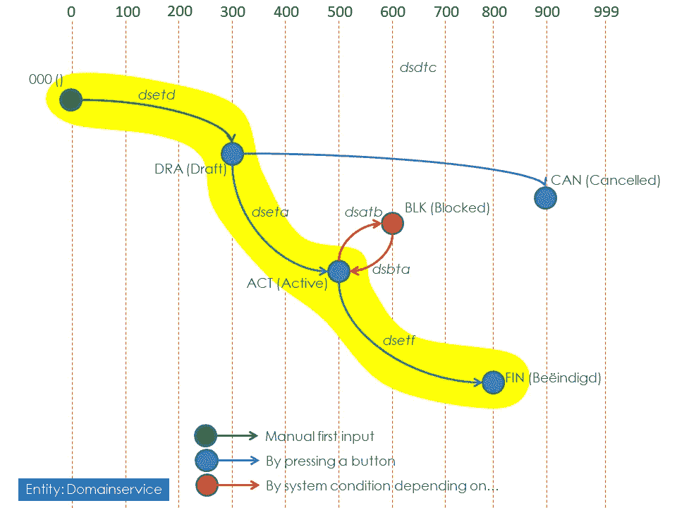

# 数据生命周期管理:状态

> 原文：<https://medium.com/mendix/data-lifecycle-management-statuses-d742770ac69d?source=collection_archive---------5----------------------->

# 猫的地位

在我的上一篇文章中，我检查了一幅山上猫的古画。没有人知道为什么要制作这幅画，但是我们知道这幅画的创作是一个项目的完美范例。有人提出了画一只猫的想法，另一个印加人选择了这座山，另一个人批准了这个项目，然后有人开始创作。创建花费了一些时间，最终它被批准，其状态变为“已完成”。在未来的某个时候，它可能会被“删除”。

因此，图纸显然有一个状态，但甚至这个项目中的工人也可能有一个状态，如“已招聘”、“正在工作”、“已完成”，而图纸的初始草稿也有自己的状态，如“概念”、“未批准”、“已批准”。

不难看出与行政系统的相似之处。在大多数系统中，我知道一些实体有状态。而且，在许多情况下，状态和状态变化使用固定值进行编码，也称为“硬编码”。由于编码需要时间，许多没有状态但应该有状态的实体没有用它们的状态信息来充实，因为开发人员优先考虑其他更重要的事情。

# 状态设计

从业务角度来看，状态看起来像这样:

Example of the status flow on an entity

黄色路线是最普通的路线。出现一些特殊情况。允许的每个状态状态更改都有直接访问它们的代码:这些代码没有意义，仅用作参考。有一些数字顺序允许检查状态是否已经发生。

在这个例子中，所有状态都是固定的。但是可能存在更动态的状态(例如，如果状态是“活动的”，但是没有活动的合同，则将状态呈现为“非活动的”)。

# 为什么企业会在意？

使用状态标志可以自动处理用户的数据生命周期:

通过使用状态数据，更改可以与数据所具有的角色保持一致。

报告和选择可以取决于状态，表格只需要显示相关数据。

通过自动维护状态，可以在不依赖于用户是否看到正确状态的情况下做出决策。

适当的历史。

通过一个通用特性来调整所有相关实体的状态处理是有意义的。

# 使用通用状态功能

因此，在开始应用程序构建之前，为状态创建这个通用特性，并为所有需要状态的(功能)实体使用它是有意义的。

使用通用状态功能有许多优点:

它只需要开发和测试一次。如果它有效，它可以很容易地被添加到另一个实体中:因此它增加了应用程序的灵活性；

像状态更改、授权、渲染和历史记录这样的功能只需开发一次，并且质量有保证；

最重要的是:创建了实体的完整生命周期，因此改进了(功能性)故障排除、纠错、可听度等。

通用功能应该:

注意对象的初始状态。

在允许状态改变之前必须进行的检查。

处理状态变化。

处理动态状态。

处理新状态对其他对象状态的影响。

提交所有要做的事情，因为状态发生了变化。

跟踪对象状态历史。

向实体添加状态应该只需要在实体上设置一个标志，并提供上述状态流的内容。

[https://bit.ly/MXW21](https://bit.ly/MXW21)

# Mendix 实现

Mendix 应用程序可轻松创建状态功能:

使用 MxReflection，标记实体并填充状态定义。

包含状态名称的枚举。

创建包含所有实体的所有状态历史的状态历史表。

添加与实体的状态的关联，并且还添加由提交前事件维护的改变时刻、状态级别和状态字的属性。

创建一些微流:1 直接检索状态，1 根据状态变化(代码)检索新的状态。

在更高级的环境中，您可以添加:

允许更改状态之前应满足的条件。

状态改变后应该启动的微流。

在我看来，每个应用程序都需要至少一个实体的状态(假设有必要至少管理一些或多或少可重复的东西)。我希望有一天 Mendix 会考虑将这一特性添加到平台中，这肯定会使创建每个管理应用程序的功能数据基础的一部分更加容易和更加标准化。

如果你想知道更多关于如何处理这个功能特性，或者复制我的，请联系我们。

## 报名门迪克斯世界:[https://bit.ly/MXW21](https://bit.ly/MXW21)

*来自发布者-*

*如果你喜欢这篇文章，你可以在我们的* [*媒体页面*](https://medium.com/mendix) *或我们自己的* [*社区博客网站*](https://developers.mendix.com/community-blog/) *找到更多类似的文章。*

*希望入门的创客，可以注册一个* [*免费账号*](https://signup.mendix.com/link/signup/?source=direct) *，通过我们的* [*学苑*](https://academy.mendix.com/link/home) *即时获取学习。*

有兴趣更多地参与我们的社区吗？你可以加入我们的 [*闲散社区频道*](https://join.slack.com/t/mendixcommunity/shared_invite/zt-hwhwkcxu-~59ywyjqHlUHXmrw5heqpQ) *或者想更多参与的人，看看加入我们的* [*遇见 ups*](https://developers.mendix.com/meetups/#meetupsNearYou) *。*