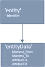
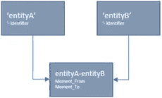
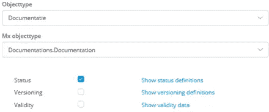

# 数据生命周期管理:有效性

> 原文：<https://medium.com/mendix/data-lifecycle-management-validity-98e0b46265ac?source=collection_archive---------4----------------------->

Banner Image — Data lifecycle management: Validity

## 猫的数据的有效性

在我以前的作品中，我一直在讨论秘鲁纳斯卡人在山上画的一只猫。没有人知道，但这幅画的创作可能是一个项目。也许他们设计了这只猫，这只猫是在一座山上的某个地方创造的，经理不满意，因为它太小了，他们在这座山上重新画了它，做了一些改变。这只猫有自己的生命周期——项目生命周期。

猫的建造是一个大项目，或者说是一个建立一系列图纸的项目。在这两种情况下，后来的分析、评估和报告都必须进行。要做到这一点，你可以想象所有的数据在任何时候都必须被保存。我称之为“有效性”:对于每个数据属性和关联，对于最终用户来说，它在任何时间点的值都必须是清楚的。

从分析和(功能)故障排除的角度来看，用例是清晰的:作为一个用户，在任何时间点，我都可以准确地看到数据的状态，这使我可以看到在那个时间点做出了什么数据决策和操作。

**对于所有的管理系统，这个用例都是有效的。我甚至确定它对所有系统都有效。**

现在许多系统提供者通过指向日志文件来宣称对有效性的支持。然而，这不是一个合适的解决方案:日志文件从技术的角度支持故障排除数据，而用户从(功能)过程的角度需要数据的有效性:用户不需要数据，但需要以与原来相同的功能形式(具有相同的含义)呈现的信息。

例如，在 Excel 中，您需要两个工作表上的有效性。为此，您将精确的布局复制到另外两个工作表“history”中，并创建一个宏，在更改了原始工作表中的某些内容后，将整行添加到正确的 history 工作表中，并添加更改日期。现在，对于用户来说，一切都是可以按照他/她习惯的方式复制的。

[Find out more about Mendix Basic](https://www.mendix.com/pricing/)

# 版本

在我的上一篇博客中，我讨论了“版本”。它们是可用于保存历史数据的功能，但在大多数情况下，它适用于对(外部)业务伙伴也有意义的更改。因此，并非所有数据都是版本的一部分。同样，不是所有的实体都有版本，但是它们需要有效性。有效性将适用于所有数据，以及没有其他机制来处理历史值的所有关联。

# 属性的有效性

这种有效性适用于实体的属性。所有重要属性(实体用户直接可见或输入的所有属性)都聚集在一个单独的具有日期有效性的历史实体中。

假设为该公司输入的地址是“Mendix Mansion”、“3076 NX”、“Rotterdam”，但在 2019 年 7 月 13 日，有人发现邮政编码必须是“3076 MX”，那么将有两个 entityData-objects。一个包含旧数据，一个包含新数据。第一个对象没有时刻 _ 从，仅仅是因为我们不知道它何时开始，另一个对象也没有时刻 _ 到:我们不知道它里面的数据何时会被替换。

请注意，有一种更规范化的方法来构造有效性，但这样数据将分布在多个实体上，必须应用一些逻辑来选择正确的数据。上面的构造还将基于目标时刻选择一个记录(entityData ),一次选择所有必要的数据。

现在，如果用户被问及为什么 2019 年初的信件上有一个邮政编码“3076 NX ”,可以通过选择目标日期为 2019 年初的数据得到完美的解释！

# 关联的有效性

这种有效性适用于实体之间的关联。每个关联(甚至 1:n 关联)都被包含有效性的 m:n 关联所取代。

假设 entityB 包含地址，entityA 包含公司。在某些地址上，可能会注册多个公司，但公司也可以更改为另一个地址。在这种情况下，对于公司“Mendix BV ”,存在一个与地址“3076 NX”相关的与 Moment _ To 13–7–2019 相关的关联对象，以及另一个与 Moment _ From 13–7–2019 相关的与“3076 MX”相关的关联对象。

如果用户使用 2019 年初的目标日期，则仅选择“3076 NX”对象。

# 为什么企业会在意？

使用有效性提供功能性商业价值:

它为每个属性和每个关联创建了一个时间表(用户可以查找和访问历史，跟踪变化并解释基于数据本身所做的决策)；

它仅从应用程序数据中生成功能审计跟踪；

它记录了每件物品的历史。

如前所述，通过对所有实体有效来增加灵活性。

# 使用通用有效性特征

当向应用程序添加新实体时，为其创建有效性构造是有意义的，包括选择数据的微流和添加数据新版本的微流。

> **使用通用有效性特性确实有好处:**
> 
> 它只需要开发和测试一次。如果它有效，它可以很容易地被添加到另一个实体中:因此它增加了应用程序的灵活性；
> 
> 维护和访问数据有效性的功能只需开发和测试一次，并且可以很容易地为新实体复制:它减少了上市时间；
> 
> 通过微流选择原始数据对象并用当前时间戳(如 Moment_From 和 no Moment_To)更新它，可以很容易地纠正错误。
> 
> **最重要的**:连同版本控制一起，实体的完整生命周期被创建，因此(功能)故障排除、错误纠正、审计能力等被改进；

# Mendix 实现

我希望 Mendix 考虑将这个特性添加到平台中:在我看来，每个实体和每个协会都需要有效性实体。

虽然这不是一个技术问题，但它肯定应该是大多数管理应用程序的功能数据基础的一部分。

**我的实现—** 使用基本的 Mendix 特性，我找不到通用的解决方案，所以我不得不为每个实体复制相同的解决方案，然后更改它以支持新的实体。这确实会导致一些额外的工作，但是这比最终为所有实例提供不同的解决方案要少。

> 他的作品是一个系列的一部分，是以下作品的延续:

 [## 数据生命周期管理:版本

### 猫的版本——没有人知道，但这幅画的创作可能是一个项目。也许他们设计了…

medium.com](/mendix/data-lifecycle-management-versions-a4b6e2c1c1a1) 

# 阅读更多

 [## 数据生命周期管理:状态

### 在我的上一篇文章中，我检查了一幅山上猫的古画。没有人知道它为什么被制造出来，但是我们知道…

medium.com](/mendix/data-lifecycle-management-statuses-d742770ac69d)  [## 数据生命周期管理

### 很久以前，纳斯卡人在秘鲁纳斯卡附近的一块岩石上画了一只猫。连同其他物品的图纸，它是…

medium.com](/mendix/data-lifecycle-management-ef1db9af9fce) 

*来自发布者-*

*如果你喜欢这篇文章，你可以在我们的* [*媒体页面*](https://medium.com/mendix) *或我们自己的* [*社区博客网站*](https://developers.mendix.com/community-blog/) *找到更多类似的内容。*

*希望入门的创客可以注册一个* [*免费账号*](https://signup.mendix.com/link/signup/?source=direct) *，通过我们的* [*学苑*](https://academy.mendix.com/link/home) *获得即时学习。*

有兴趣更多地参与我们的社区吗？你可以加入我们的 [*Slack 社区频道*](https://join.slack.com/t/mendixcommunity/shared_invite/zt-hwhwkcxu-~59ywyjqHlUHXmrw5heqpQ) *或者想更多参与的人，看看加入我们的*[*Meet ups*](https://developers.mendix.com/meetups/#meetupsNearYou)*。*