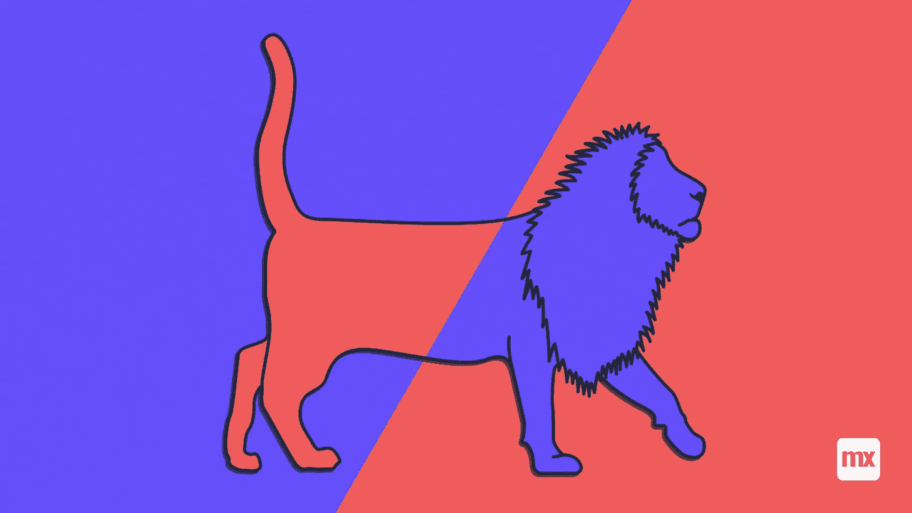
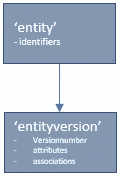

# 数据生命周期管理:版本

> 原文：<https://medium.com/mendix/data-lifecycle-management-versions-a4b6e2c1c1a1?source=collection_archive---------2----------------------->

# 猫的版本

没有人知道，但这幅画的创作很可能是一个项目。也许他们设计了这只猫，这只猫是在一座山上的某个地方创造的，经理不满意，因为它太小了，他们在这座山上重新画了它，做了一些改变。第二只猫一准备好，第一只猫就被取消了，小山又恢复了原样。

显然有两个版本的猫，每个版本都被启动和激活。其中一个版本甚至被取消，后来被删除。我们看到有两个版本:各有各的山头，各有各的规模，各有各的地位。

不难看出与行政系统的相似之处。在大多数系统中，一些实体有一个状态。从数据管理的角度来看，明智的做法是将一个版本分配给所有主要实体(主要实体是在现实生活中有表示的实体，您可以实际看到它)，并且不用于历史或关联目的。

在许多情况下，用户看不到对象上版本的必要性:这根本就不是问题。但是，如果你不使用它们，就没有办法用它们保存信息(老山)，没有办法找出为什么会有新版本(这只猫太小了)，也没有办法准确再现发生了什么。这就是为什么至少对于主实体，你应该总是使用版本控制的原因。

# 版本设计

从业务角度来看，具有状态的实体(so…:所有主要实体)看起来像这样:

通常，几乎所有属性和关联都存储在实体版本中(例如，名为“合同版本”的实体)。在任何特定时刻，这些版本中只能有一个版本处于“活动”状态。如果实体是直接寻址的，则活动版本包含实体上的所有有效数据。

开始、结束和创建新版本的协议可能因公司而异。但是，建议对所有实体使用相同的协议。例如，如果新的合同版本需要预先批准才能生效，为什么新的产品版本不需要批准？这种方法的优点是，将来可以很容易地决定，对于某些新产品，必须批准新的 product_versions，因为版本和状态已经存在。对于其他产品，批准可能是自动的(状态“等待批准”仅分配一小段时间)。

如果你一次做对了，下一次做对并不难(复制)。

# 为什么企业会在意？

基本上，使用版本和状态会关注用户的数据生命周期:

通过检查对象的时间线，可以清楚地了解对象的生命周期，所有版本都在时间线上。

启动对象、更改对象和停用对象所需的活动可以链接到适当的版本(和状态)。

适当的历史。

如前所述，通过为所有主要实体建立版本控制来增加灵活性。

# 使用通用版本控制功能

因此，在开始构建应用程序之前，有必要为版本创建这个通用特性，并将其用于所有需要版本控制的(功能)实体。

使用通用状态功能有以下优点:

它只需要开发和测试一次。如果它有效，可以很容易地添加到另一个实体中:因此它增加了应用程序的灵活性。

版本历史、时间表、协议和数据结构等功能只需开发一次，质量有保证。

**最重要的**:创建实体的完整生命周期，因此(功能)故障排除、纠错、审计能力等。都有所改善。

通过停用较新版本，可以轻松恢复对象的先前版本。

**通用特性应:**

处理新版本的创建。

处理版本属性和关联。

在创建和验证新版本之前，执行必须进行的检查。

应用协议以便对实体进行更改。

应用协议以撤消应用于实体的更改和/或撤消新版本。

负责实体时间线。

跟踪历史记录中的对象状态。

**如何对实体应用版本控制？**

用新属性“versionNumber”(设置为“1”)将实体从“entity”重命名为“entity_version”。

创建一个名为“entity”的新实体，并与“entity_version”建立 1:n 关联，向该新实体添加标识属性。

为每个“实体 _ 版本”创建并填充“实体”对象，并创建它们之间的关联。

仅此而已。现在开始为处理这个实体的新版本开发创建、条件和协议。

我认为实体本身不应该包含状态。它的状态是所有版本状态的结果，所以它是一个动态状态。

-如果只有一个状态为“待批准”的 entity_version，则实体的动态状态可能为“即将到来”。

-如果至少有一个 entity_version 的状态为“活动”，则该实体的动态状态可能为“正在运行”。

-如果没有“活动”实体版本，并且当前实体版本为“非活动”，则实体的动态状态可能为“挂起”。

-如果没有“活动”实体版本，并且最后一个实体版本的状态为“已结束”，则实体的动态状态可能为“已结束”。

# Mendix 实现

可以在 Mendix 应用程序中轻松创建版本控制功能。

**为每个实体创建微流以:**

创建新版本；

检查和批准新版本的创建；

撤消新版本。

在我看来，每个应用程序都需要至少一个实体的状态(假设有必要至少管理一些或多或少可重复的东西)。如果这能包含在 Mendix 平台的未来版本中，我会很高兴，希望有一天我们能看到这一点。

虽然这不是一个技术问题，但它肯定是每个管理应用程序的功能数据基础的一部分。

如果你想知道更多关于如何处理这个功能特性，或者复制我的，请联系我们。

## 阅读更多

 [## 数据生命周期管理:状态

### 在我的上一篇文章中，我检查了一幅山上猫的古画。没有人知道它为什么被制造出来，但是我们知道…

medium.com](/mendix/data-lifecycle-management-statuses-d742770ac69d)  [## 数据生命周期管理

### 很久以前，纳斯卡人在秘鲁纳斯卡附近的一块岩石上画了一只猫。连同其他物品的图纸，它是…

medium.com](/mendix/data-lifecycle-management-ef1db9af9fce) 

*来自发布者-*

*如果你喜欢这篇文章，你可以在我们的* [*媒体页面*](https://medium.com/mendix) *或我们自己的* [*社区博客网站*](https://developers.mendix.com/community-blog/) *找到更多类似的文章。*

*希望入门的创客，可以注册一个* [*免费账号*](https://signup.mendix.com/link/signup/?source=direct) *，通过我们的* [*学苑*](https://academy.mendix.com/link/home) *即时获取学习。*

有兴趣更多地参与我们的社区吗？你可以加入我们的 [*Slack 社区频道*](https://join.slack.com/t/mendixcommunity/shared_invite/zt-hwhwkcxu-~59ywyjqHlUHXmrw5heqpQ) *或者想更多参与的人，看看加入我们的* [*遇见 ups*](https://developers.mendix.com/meetups/#meetupsNearYou) *。*