# 数据库中的数据加载比以往更容易

> 原文：<https://medium.com/oracledevs/data-load-in-database-easier-than-ever-9dfa00b41ffb?source=collection_archive---------7----------------------->

将数据加载到数据库中可能是一项说起来容易做起来难的任务，但现在不是了，Oracle autonomous database ADB 上的一个新功能将使 DBA 的工作更轻松。

[https://unsplash.com/photos/1K6IQsQbizI](https://unsplash.com/photos/1K6IQsQbizI)

在我们开始之前，让我告诉您，作为我们始终免费服务层的一部分，您有 2 个 Oracle Autonomous Database 是免费的。 [**在甲骨文云永远免费层查看本文，了解更多信息并注册！**](/@roberto.di.bella/5-reasons-why-oracle-free-tier-is-better-than-your-raspberry-pie-277ac8cb37e3)
欲注册永远免费服务[请点击此链接。](https://www.oracle.com/cloud/free/?source=:so:li:or:awr:ocorp:::RC_WWSA191002P00028:GjTemp&SC=:so:li:or:awr:ocorp:::RC_WWSA191002P00028:GjTemp&pcode=WWSA191002P00028)
**免责声明:**如果您没有明确表示同意，并且免费服务没有到期日，甲骨文云将不会向您收取费用。

回到数据加载最新工具，现在您可以:

*   将您的数据加载到 ADB 中
*   将您的数据链接到远程位置
*   设置直播

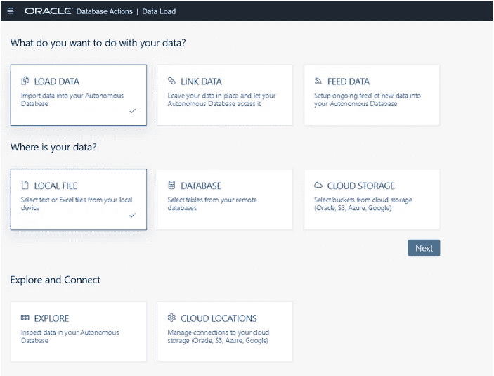

然后根据您数据的位置进行选择:

*   本地文件
*   远程数据库
*   存储在云提供商上的对象

然后按“运行”，就这样你的数据被上传了

在以下示例中，我将向您展示如何从本地文件或[云存储](https://www.oracle.com/cloud/storage/what-is-cloud-storage/)对象加载数据:

# 从本地文件上传数据库

只需点击几下鼠标，您就可以在 ADB 上添加您的本地数据文件:

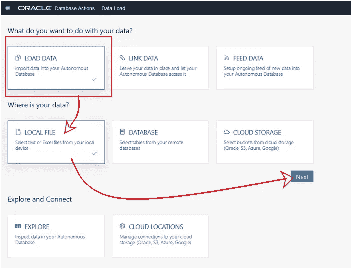

# 步骤:

## 第一步:

选择“本地文件”工具后，单击“下一步”，然后您可以通过按“选择文件”来导航您的本地文件，或者简单地拖放它们进行上传

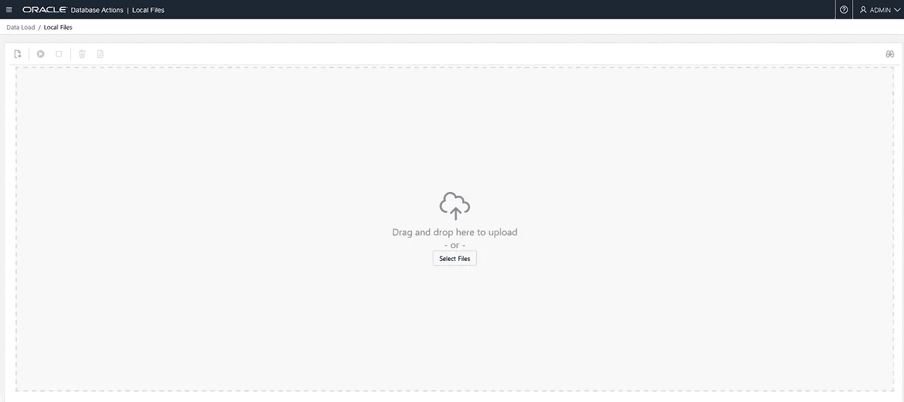

## 第二步:

点击运行按钮，瞧，你的数据已经上传了。

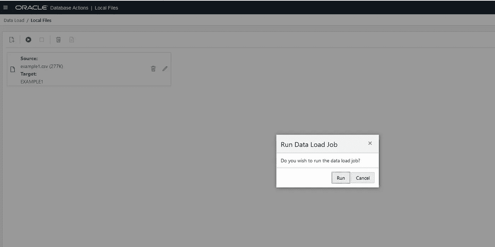

## 带上您的云桶链接

如果您的数据保存在 Oracle object storage、Amazon AWS S3、Azure 或 Google 上，您现在只需点击几下鼠标就可以将其加载到您的 ADB 中。

为了完成这个过程，您需要一个[云存储](https://www.oracle.com/cloud/storage/what-is-cloud-storage/)对象，该对象有一个指向云存储中存储桶的链接。

让我们看看如何在 Oracle 云上获取一个对象存储链接，并将其添加到[云存储](https://www.oracle.com/cloud/storage/what-is-cloud-storage/)中，这样我们就可以将数据上传到 ADB 中，

# 步伐

## 第一步:

在 oracle object storage 的一个分区中创建存储桶后，单击上传对象选择要上传的文件，一旦文件上传到存储桶，您就可以单击操作图标，选择“查看对象详细信息”，

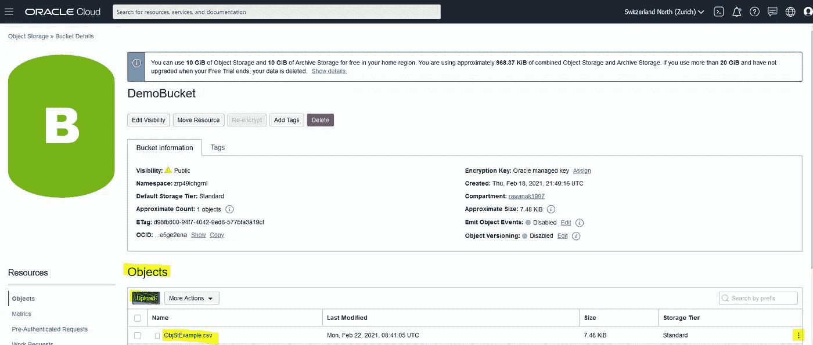

复制所有的 URL 路径(URI)除了文件名，一定要包括尾随斜线。例如对于文件

`[**https://objectstorage.us-phoenix-1.oraclecloud.com/n/myoci/b/my_bucket/o/MyFile.csv**](https://objectstorage.us-phoenix-1.oraclecloud.com/n/myoci/b/my_bucket/o/MyFile.csv)`

选择以下内容，

`[**https://objectstorage.us-phoenix-1.oraclecloud.com/n/myoci/b/my_bucket/o/**](https://objectstorage.us-phoenix-1.oraclecloud.com/n/myoci/b/my_bucket/o/)`

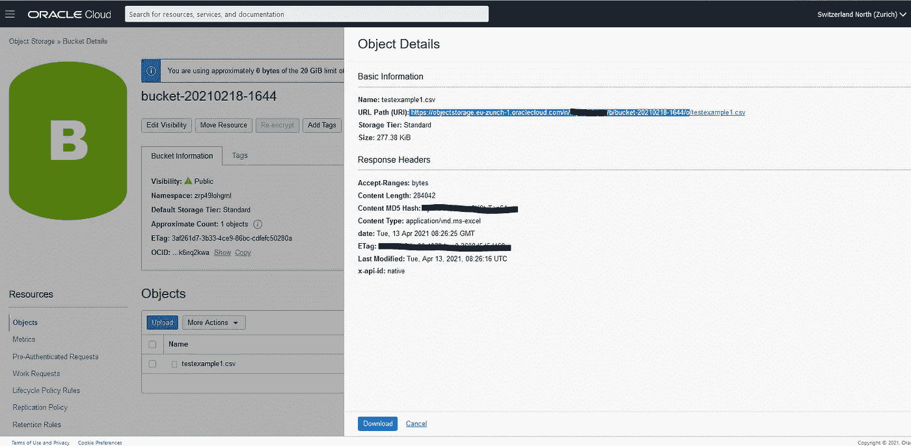

## 第二步:

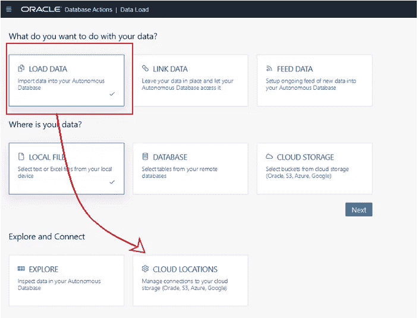

从云管理器页面点击“添加云存储”，输入名称，选择您的云存储并粘贴桶的链接，如下图所示。

选择一个凭据选项。如果选择创建凭据，请在相应的字段中输入凭据名称、访问密钥和访问密码。有关获取 Oracle 云基础架构(OCI)实例的访问密钥和访问机密的信息，请参见管理用户凭据中的[创建客户机密密钥](https://docs.oracle.com/en-us/iaas/Content/Identity/Tasks/managingcredentials.htm#To4)。

如果选择凭据，请从下拉列表中选择一个凭据。

如果存储桶是公开可用的，则选择无凭据。

输入所需的值后，单击测试以验证这些值是否有效。

要创建云存储对象，请单击创建。

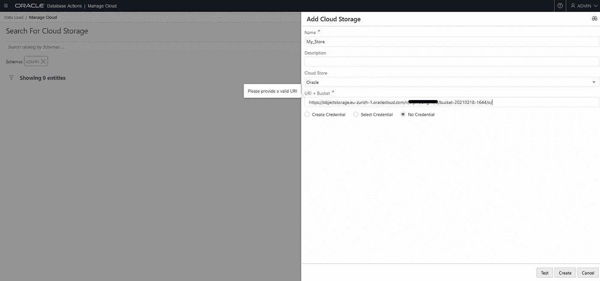

创建对象后，它将在“管理云”页面上可用。您可以单击对象的操作图标来编辑对象的规范或删除它。

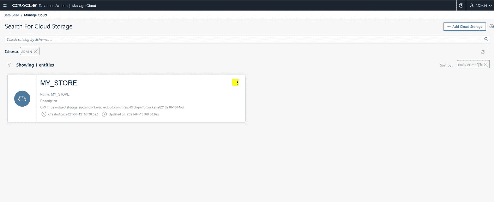

## 第四步:

回到数据加载工具，选择**云存储，**按**下一步:**

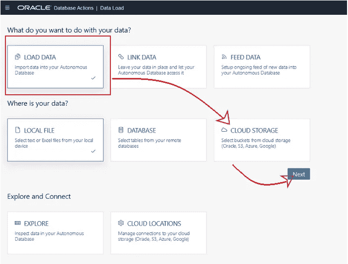

最后，在选择您刚刚创建的云存储后，拖放文件，然后单击 run 上传数据。

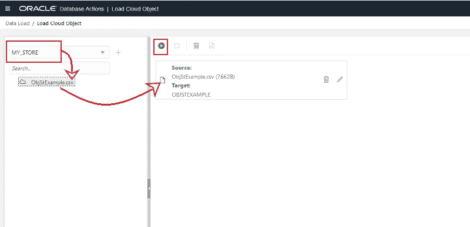

# 摘要

本快速教程展示了如何使用 Oracle cloud 上提供的最新数据加载工具，以最简单的方式在您的云上上传数据库。

在第一个例子中，我们看到只需点击几次鼠标，就可以轻松地从本地文件上传数据库。

对于第二个示例，我们已经在 Oracle Cloud 上创建了对象存储并上传了数据文件，然后创建了云存储并上传了数据库。

# 想了解更多？

如果您有兴趣了解自治数据库中包含的工具的更多信息，并发现它们如何帮助您[请查看我们的现场活动](https://go.oracle.com/LP=105660?elqCampaignId=283506&src1=:se:lw:ie:pt:::OD&evite=WWMK210112P00135:se:lw:ie:pt:::OD#On-Demand-Webinars)！

## 要了解始终免费的云资源[请点击此处！](https://www.oracle.com/cloud/free/?source=:so:li:or:awr:ocorp:::RC_WWSA210222P00027:ADBTools_Rawan&SC=:so:li:or:awr:ocorp:::RC_WWSA210222P00027:ADBTools_Rawan&pcode=WWSA210222P00027)

## 想要更多吗？加入非官方的[不和社区](https://discord.gg/NfcvyKxrRU)！