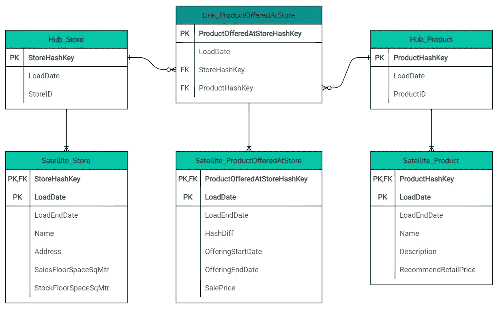
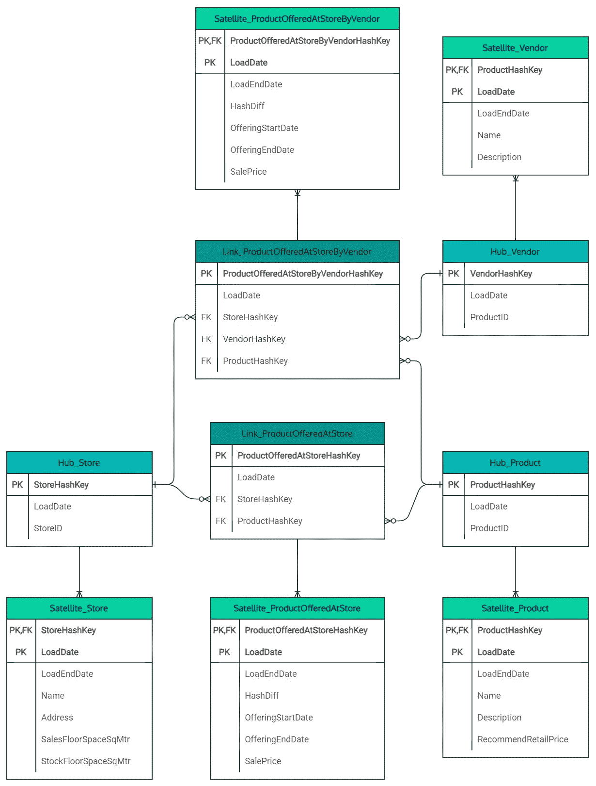

# 数据建模没有死亡:但是我们需要它来进化

> 原文：<https://medium.com/version-1/data-modelling-isnt-dead-but-we-need-it-to-evolve-65dc7819fd62?source=collection_archive---------0----------------------->

## 虽然大数据项目背后的工程备受关注，但我们仍然需要关注数据如何提供商业价值。

## 对数据仓库建模的介绍给出了实现这一价值的另一种方法。

Photo by [Shubham Dhage](https://unsplash.com/@theshubhamdhage?utm_source=unsplash&utm_medium=referral&utm_content=creditCopyText) on [Unsplash](https://unsplash.com/s/photos/data?utm_source=unsplash&utm_medium=referral&utm_content=creditCopyText)

## TL；速度三角形定位法(dead reckoning)

Data Vault 建模为我们提供了一种灵活的数据建模方法，允许我们的模型随着它所代表的业务而发展。
这种灵活性意味着我们可以利用标准化的数据管道&随着业务&其数据模型的发展，降低数据工程的复杂性。

## 工程变更

组织越来越多地将他们的数据分析挑战视为纯粹的工程问题:如何及时向人们提供数据。

以前，重点是使用 Kimball 星型模式等方法对组织的数据进行建模。延迟是次要的，因为报告关注的是后视镜视图，而昨天的数据足以支持战略规划。

随着新数据点的不断增加和旧数据点的淘汰，人们现在期望获得高细节水平的近实时数据，即多样性和速度。这推动了对数据工程和数据交付的关注。

## 组织变革

> 要预测几年后你会在哪里，你需要能够解释你是如何到达现在的位置的。

业务在变化&数据系统需要毫不费力地表现这种变化。随着操作系统和流程的发展，描述它的数据模型也必须发展。

在过去，夜间加载允许有时间重构转换逻辑，并将数据仓库重建到新的模型中。尽管这经常导致旧模式和真相版本的丢失。

数据工程的改进和应用读取模式的能力允许我们推迟定义数据模型。然而，如果没有仔细的规划，这些模型背后的数据工程很快就会变得复杂，因为管道试图适应不断变化的组织。

最终，数据模型是业务的表示，它必须能够与业务一起发展，而不必重构大量的数据工程代码。我们不仅需要代表业务的现状，还需要代表它的过去以及这个过程中的所有过渡状态。

## 数据仓库建模

在操作系统和分析数据集市之间建立一个层，可以将组织变革的混乱从需要简化视图的数据消费者那里抽象出来。无论这个中间层是一个数据湖还是一个数据仓库，它仍然必须以一种允许它发展和保留历史信息的方式建模。

Data Vault 方法是由 Dan Linstedt 在 90 年代提出的，此后不断得到发展，并在 Daniel Linstedt 和 Michael Olschimke 所著的《使用 Data Vault 2.0 构建可伸缩的数据仓库》一书中得到了最完整的描述。

虽然许多人会将 Data Vault 方法的一个关键优势描述为其维护详细审计跟踪的能力，但我认为采用它的最有说服力的理由是它的进化能力。

这是可能的，这要归功于业务标识符(进入集线器)与其属性(进入卫星)的物理分离，以及允许关系基数改变的桥接表(链接)的使用。

每个中枢使用多个卫星允许在不同的操作系统中掌握属性，具有不同的生命周期和变化率。这简化了数据管道，减少了数据平台内形成复杂依赖关系的机会。

## 行动中的进化建模

例如，如果我们想要了解商店中有哪些产品可供销售，我们可以创建如下模型。

Data Model of a relationship indicating products offered at a store

*   Hub 表只包含业务标识符和源数据中最后一次提供标识符的时间。
*   链接表包含该产品至少在商店提供过一次的事实，但除此之外没有更多信息。
*   附属表包含所有属性，包括所提供产品的任何有效日期。

这种模型的强大之处在于，数据永远不需要更新，这对审计和性能都有帮助。HashDiff 属性不是用来更新的，而是用来检查自上一次加载以来属性是否发生了变化，如果发生了变化，则在卫星表中创建一个新记录，并设置旧记录的 LoadEndDate。

你可以说这没有什么特别的，它非常类似于经典的 2 型渐变维度。然而，当严格实现时，它允许随着业务的变化对数据模型进行简单的改进。

当商店发展成为一个市场时，您可以看到一个新的链接表被创建，表明哪个供应商提供每种产品。我们没有删除旧的链接或卫星表，只是设置 LoadEndDate 来将所有数据标记为历史数据。

除此之外，所有的变化本质上都是附加的，允许从旧数据模型到新数据模型的平稳演进，同时支持任何历史报告需求。

Data Model of a relationship indicating products offered at a store by vendor

## 规划您的下一个数据平台

数据仓库建模不如更熟悉的 Inmon 和 Kimball 方法直观。它需要更专业的建模技能，而且还没有得到与同行同等程度的关注。

虽然它增加了复杂性，但它定义的标准模式有助于模板化、元数据驱动的管道；不仅如此，由元数据驱动的平台比手工制作的平台更容易维护。

因此，下一次您在增强您的数据模型时，看看 Data Vault 方法，您可能会发现它解决了您面临的一些挑战，并允许您创建一个可以随着您的业务发展的模型。

## 关于作者

Carl Follows 是第 1 版英国数字、数据&云实践的解决方案架构师，专门研究基于微软 Azure 构建的数据分析平台。