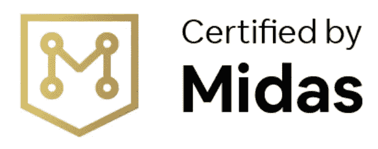
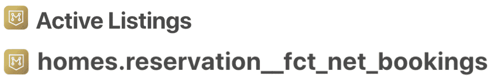
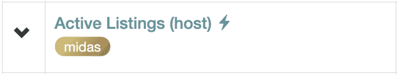
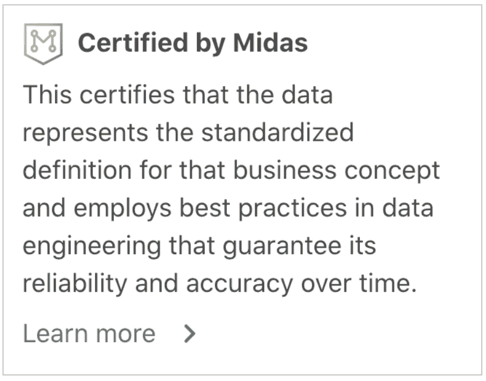
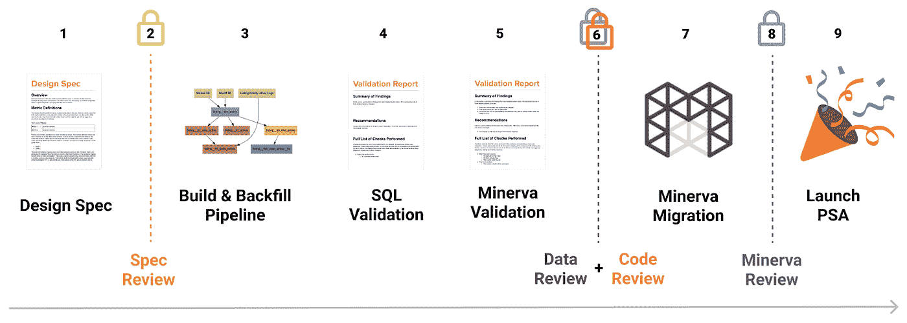
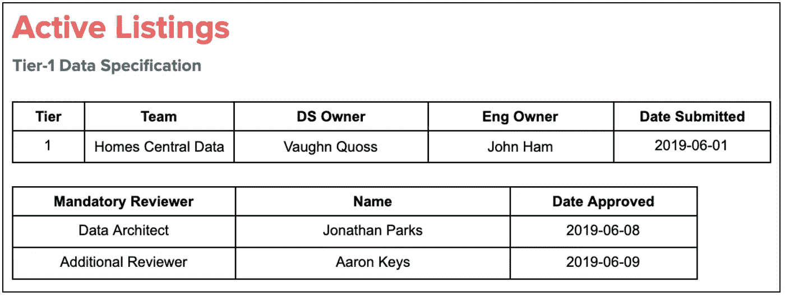
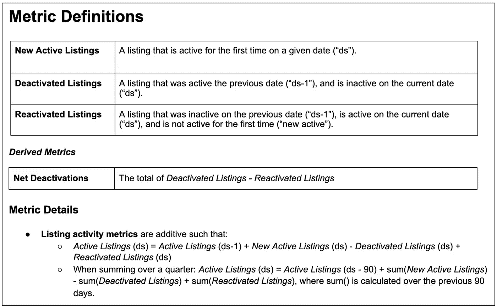
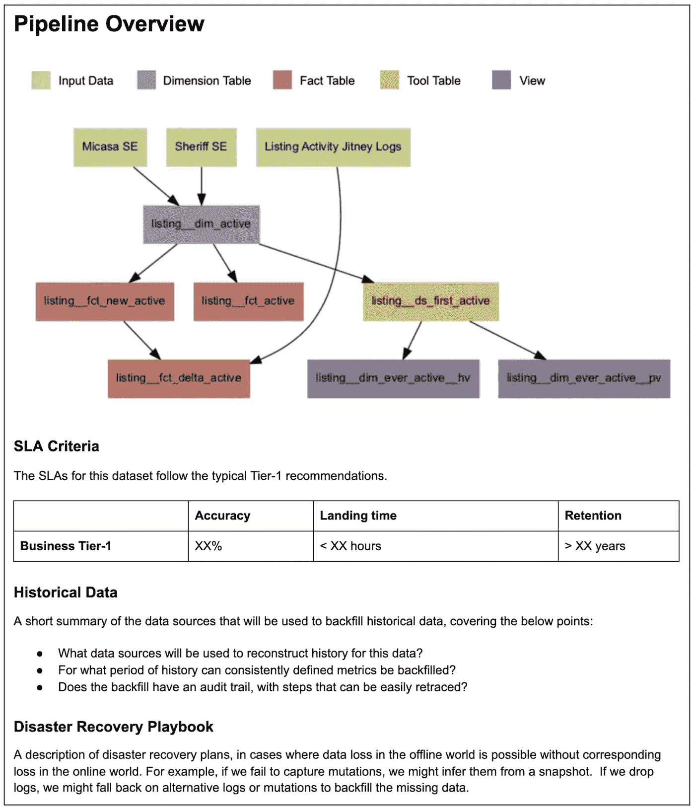
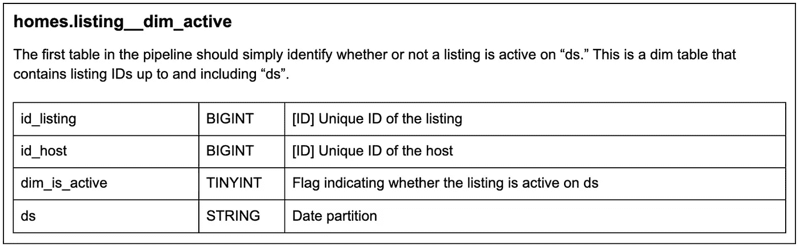
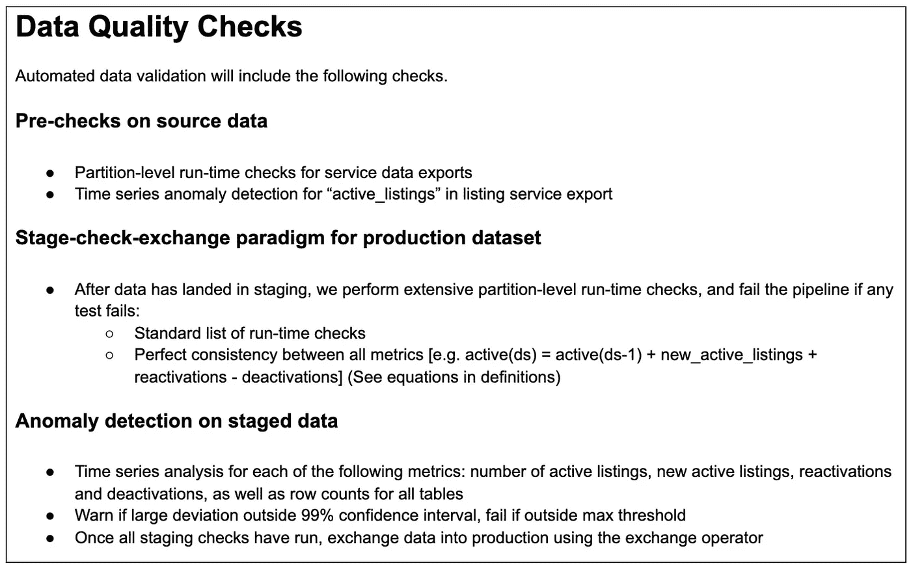

# Airbnb 的数据质量

> 原文：<https://medium.com/airbnb-engineering/data-quality-at-airbnb-870d03080469?source=collection_archive---------1----------------------->

第 2 部分—新的黄金标准

作者:沃恩·考斯，乔纳森·帕克斯，保罗·埃尔伍德

# 介绍

在 Airbnb，我们一直有一种数据驱动的文化。我们组建了一流的数据科学和工程团队，构建了行业领先的数据基础设施，并启动了众多成功的开源项目，包括 [Apache Airflow](https://airflow.apache.org/) 和 [Apache Superset](https://superset.apache.org/) 。与此同时，Airbnb 已经从一个以光速前进的初创公司转变为一个拥有数千名员工的成熟组织。在这一转型过程中，Airbnb 经历了大多数公司都会遇到的典型增长挑战，包括那些影响数据仓库的挑战。

在本系列的[第一篇文章](/airbnb-engineering/data-quality-at-airbnb-e582465f3ef7)中，我们分享了我们如何发展我们的组织和技术标准以应对高速增长期间面临的数据质量挑战的概述。在本帖中，我们将重点关注 Midas，这是我们开发的一种机制，旨在将公司团结在一个共享的“黄金标准”之下，作为 Airbnb 数据质量的保证。

# 定义黄金标准

随着 Airbnb 的业务逐年增长，该公司的数据仓库显著扩大。随着我们的数据资产规模以及开发和维护数据资产的团队规模的增长，在整个公司范围内实施一套一致的数据质量和可靠性标准成为了一项挑战。2019 年，一项内部客户调查显示，Airbnb 的数据科学家发现浏览不断增长的仓库越来越困难，并且难以识别哪些数据源符合他们工作所需的高质量标准。

这被认为是为 Airbnb 的数据质量定义一致的“黄金标准”的一个重要机会。

## 多方面的挑战

虽然所有利益相关者都认为数据质量很重要，但员工对“数据质量”的定义包含一系列不同的问题。其中包括:

*   **准确性:**数据是否正确？
*   一致性:每个人都在看同样的数据吗？
*   **可用性:**数据容易访问吗？
*   **时效性:**数据是否按时刷新，并且在正确的节奏上？
*   **成本效率:**我们在数据上的支出是否高效？
*   可用性:我们是否有所有需要的数据？

这个问题的范围意味着专注于个别数据质量组成部分的标准将产生有限的影响。为了取得真正的进展，我们需要一个雄心勃勃的、全面的计划来跨多个维度标准化数据质量预期。随着工作的开始，我们将我们的计划命名为 Midas，以表彰我们希望应用于 Airbnb 数据的点金术。

## 端到端数据质量

除了解决数据质量的多个维度，我们还认识到该标准需要适用于所有常用的数据资产，并且端到端地覆盖所有数据输入和输出。特别是，提高数据仓库表的质量是不够的，因为这仅涵盖数据资产和工作流程的一个子集。

Airbnb 的许多员工永远不会直接查询数据仓库表，但每天都会使用数据。不管功能或专业知识如何，所有类型的数据用户都习惯于通过指标来查看数据，这种抽象不需要熟悉底层数据源。对于与许多最重要的数据用例相关的数据质量保证，我们需要保证数据表*和*的质量——从它们派生的单个指标。

在 Airbnb 的数据架构中，指标是在 [Minerva](/airbnb-engineering/how-airbnb-achieved-metric-consistency-at-scale-f23cc53dea70) 中定义的——这是一种使每个指标能够在单一位置唯一定义的服务——并且可以通过公司的数据工具广泛访问。Minerva 中定义的指标可以在公司的仪表板工具、我们的实验和 A/B 测试框架、异常检测和沿袭工具、我们的 ML 训练特征库中直接访问，并使用内部 R 和 Python 库进行专门分析。

例如，以*活跃房源*为例，这是一个用来衡量 Airbnb 房源供应的顶级指标。一名主管在 Apache 超集仪表板中查找*活动列表*的数量，一名数据科学家在 R 中分析*活动列表*转换漏斗，一名工程师在我们的内部实验框架中审查实验如何影响*活动列表*都将依赖相同的单元进行分析。当你通过 Airbnb 的任何一套数据工具分析一个指标时，你可以肯定你看到的数字和其他人一样。

**在 Airbnb 的离线数据架构中，全公司共享的每个指标定义都有一个真实的来源*。*** 这个关键的架构特性使得 Midas 能够保证端到端的数据质量，涵盖了数据仓库表*和*从它们派生的度量定义。

## 迈达斯的承诺

为了构建符合一致质量标准的数据，我们创建了认证流程。认证的目标是向最终用户做出一个简单明了的承诺:“Midas 认证”数据代表了数据质量的黄金标准。

为了做出这样的声明，认证过程需要共同解决数据质量的多个方面，保证以下每个方面:

*   **准确性:**经过认证的数据经过了*的全面准确性验证*，对所有历史数据进行了详尽的一次性检查，并在生产管道中内置了持续的自动检查。
*   **一致性**:经过认证的数据和指标代表了*跨公司所有团队和利益相关者的关键业务概念*的唯一真实来源。
*   **及时性:**经认证的数据具有*到达时间 SLA*，由中央事件管理流程提供支持。
*   **成本效益:**经认证的数据管道遵循*数据工程最佳实践*，可优化存储和计算成本。
*   **可用性:**认证数据*在内部工具*中明确标注，并有*定义和计算逻辑的广泛文档*支持。
*   **可用性:**认证是*对公司重要数据*的强制。

最后一步，一旦数据得到认证，就需要将该状态清楚地传达给内部最终用户。通过与我们的分析工具团队合作，我们确保“Midas 认证”的数据将通过我们内部数据工具中的徽章和上下文得到明确识别。

*Fig 1: Midas badging next to metric and table names in Dataportal, Airbnb’s data discovery tool.*

*Fig 2: Midas badging for metrics in Airbnb’s Experimentation Reporting Framework (ERF).*

*Fig 3: Pop-up with Midas context in Airbnb’s internal data tools.*

全面的 Midas 质量保证，加上 Airbnb 内部工具对认证数据的明确识别，成为我们保证在整个公司访问高质量数据的大赌注。

# Midas 认证流程

我们开发的认证流程包括九个步骤，如下图所示。

*Figure 4: An overview of the nine steps in the Midas Certification process.*

对于单个**数据模型**来说，这个认证过程是在一个项目接一个项目的基础上进行的，这些数据模型由一组对应于特定业务概念或项目特征的数据表和指标组成。Airbnb 的示例数据模型涵盖了诸如*活动列表*、*客户服务票*和*客人增长会计*等主题。虽然没有一套完美的标准来定义给定数据模型的边界，但是在这个抽象层次上聚合我们的数据表、管道和度量标准允许我们更有效地组织、构建和维护我们的离线数据仓库。

虽然这篇文章不会详细描述认证过程的每一个步骤，但是下面的部分提供了这个过程中最重要的组成部分的概述。

## 广泛的利益相关者意见

这一进程的一个重要特点是它正式确定了跨职能的伙伴关系。每个 Midas 模型都需要一个数据工程和数据科学所有者，他们共享数据模型设计的所有权，并从各自的职能部门提供专家意见。跨职能输入对于确保认证能够解决数据质量方面的所有问题至关重要，这些问题包括技术实施问题以及有效业务使用和下游数据应用的要求。

此外，该流程旨在鼓励使用 Midas 模型的所有团队的利益相关者参与进来。认证的一个主要目标是确保我们构建的数据模型满足整个公司用户的数据需求，而不仅仅是构建模型的团队的需求。认证过程为来自每个团队的数据消费者提供了作为新数据模型设计的评审者签约的选项，并且我们发现在设计过程早期的小请求或反馈通过减少未来修订的需要而节省了大量时间。

在 Midas 之前，这些跨职能、跨团队的伙伴关系通常很难有机地形成。认证过程提供的正式结构有助于简化整个公司的数据设计协作。

## 设计规格

Midas 流程的第一步是编写设计规范，它既是描述将要构建的管道、表格和指标的技术合同，也是数据模型的主要持续文档。设计规格遵循带有标准化子部分的共享模板。总的来说，这些规范形成了 Airbnb 离线数据资产的文档库。该文档代表了高价值的可交付成果，因为它减少了对数据生产者专业知识的依赖，简化了现有数据模型的未来迭代，并简化了数据资产在所有者之间的转移。

设计规范的内容最好用例子来说明。下图描绘了 Airbnb 的*活动列表*数据模型的设计规范的精简示例。

规范以对个人和团队数据模型所有者以及相关设计评审者的描述开始。

*Fig 5: Owners and reviewers are formalized in the heading for each Midas design spec.*

规范的第一部分描述了数据模型中包含的标题指标，以及与解释指标相关的纯文本业务定义和具体细节。

*Fig 6: An example Metric Definitions section from a Midas design spec.*

下一节总结了用于构建模型中包含的数据表的管道。该摘要包括输入和输出表的简单图表、管道 SLA 标准概述、关于如何回填历史数据的上下文以及简短的灾难恢复行动手册。

*Fig 7: Example pipeline overview section from a Midas design spec.*

数据管道概述之后是将要构建的表模式的文档。

*Fig 8: Example table schema details from a Midas design spec.*

最后，规范提供了数据质量检查的概述，这些检查将被构建到数据模型的验证管道中(下面将进一步讨论)。

*Fig 9: Example section on data quality checks details from a Midas design spec.*

上面的例子涵盖了主要的设计规范部分，但都是以浓缩和简化的形式显示的。实际上，度量和管道细节的描述要长得多，一些更复杂的设计规格超过 20 页。虽然这种级别的文档需要大量的前期投资，但它可以确保数据架构正确，为来自多个利益相关方的设计输入提供工具，并减少对少数数据专家专业知识的依赖。

## 数据有效性

写完设计规范和建立数据管道后，需要对结果数据进行验证。验证依赖两组数据质量检查:

1.  自动检查由数据工程师构建到数据管道中，并在设计规范中进行描述。这些检查是认证数据所必需的，涵盖了对管道生成的新数据的基本健全性检查、定义测试和异常检测。
2.  针对历史数据的一次性验证检查由数据科学家运行，并记录在单独的验证报告中。该报告总结了所执行的检查，并链接到带有代码和查询的共享数据工作簿(例如 Jupyter Notebook ),这些代码和查询可用于在数据模型更新时重新运行验证。这项工作涵盖了数据管道中不易自动化的检查，包括对历史时间序列进行更详细的异常检测，以及与现有数据源或预期与新数据模型一致的指标进行比较。

与设计规范一样，这种级别的验证和文档需要更大的前期投资，但大大减少了数据的不准确性和未来的错误报告，并使数据模型在未来发展时更新验证变得容易。

## 认证审查

认证审查是 Midas 程序的主要组成部分。这些第三方审查由公司公认的数据专家执行，他们被指定为数据架构师或指标架构师。通过执行 Midas 审查，架构师成为公司数据质量的把关人。

Midas 流程中有四个不同的审查:

1.  **规格评审:**在实现开始之前，评审为数据模型提议的设计规格。
2.  **数据审查:**审查管道的数据质量检查和验证报告。
3.  **代码评审:**评审用于生成数据管道的代码。
4.  **Minerva Review:** 回顾 Airbnb 的度量服务 Minerva 中实现的真实度量定义的来源。

总体而言，这些审查涵盖所有数据资产的工程实践和数据准确性，并确保认证的数据模型符合 Midas 承诺:端到端数据质量的黄金标准。

## 错误和变更请求

最后，尽管不是初始管道开发过程的一部分，Midas 计划提高了我们管理离线数据错误和变更请求的能力。将离线数据组织成离散的数据模型并明确所有权，使我们能够将公司范围的流程正式化，以满足数据消费者的请求。员工现在可以使用一个简单的表格来提交缺陷和变更请求，这在以前是不可行的。

# 结论

Midas 计划使我们能够为全公司共享的数据质量定义一个全面的标准。Midas 认证的数据资产保证是准确、可靠和具有成本效益的，有一致的操作支持，并有详细的用户文件支持。随着公司规模和我们的数据仓库持续快速增长，认证流程确保我们能够为数据消费者提供大规模数据质量的一致保证。

Midas 认证并非没有挑战。特别是**质量需要时间**。对文档、审查和来自广泛的利益相关者的输入的要求意味着构建符合 Midas 标准的数据模型比构建未经认证的数据要慢得多。大规模重新构建数据模型也需要大量的数据和分析工程专家([我们正在招聘！](https://careers.airbnb.com/positions/))，并且需要团队迁移到新数据源的成本。

线下数据是 Airbnb 的关键技术资产，这项投资是有保证的。经过认证的数据模型是所有数据应用的共享基础，涵盖商业报告、产品分析、实验、机器学习和人工智能。对数据质量的投资提高了这些应用程序的价值，并将在未来几年改善 Airbnb 基于数据的决策。

*特别感谢 Aaron Keys，他是 Midas 计划早期设计和愿景的重要合作伙伴。*