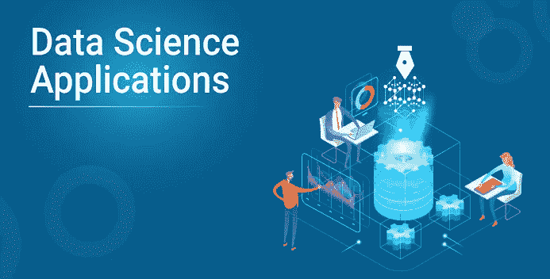
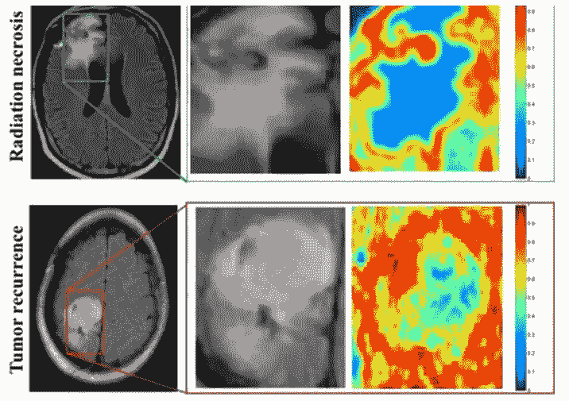
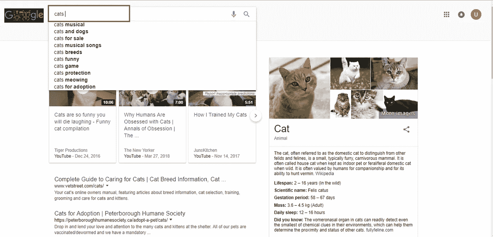
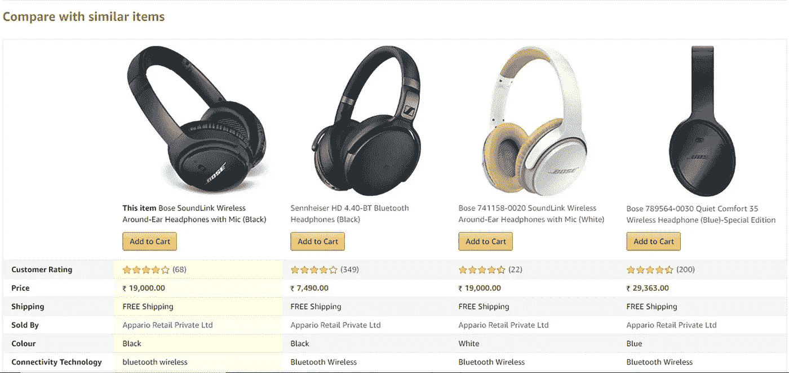

# 2021 年十大数据科学应用

> 原文：<https://medium.com/edureka/data-science-applications-f4cf081fd84d?source=collection_archive---------4----------------------->

**数据科学应用**的角色并不是一夜之间演变而来的。由于更快的计算和更便宜的存储，我们现在可以在几分钟内预测结果，而这可能需要几个小时才能完成。

一名数据科学家每年可以拿到高达 124，000 美元的收入，这是因为该领域缺乏熟练的专业人士。

通过这篇文章，我们为您带来了基于 ***数据科学*** 概念的 10 个应用程序，探索了如下各个领域:

*   欺诈和风险检测
*   卫生保健
*   互联网搜索
*   定向广告
*   网站推荐
*   高级图像识别
*   语音识别
*   航线规划
*   赌博
*   增强现实

# 欺诈和风险检测

数据科学最早的应用是在金融领域。公司受够了每年的坏账和亏损。然而，在批准贷款时，他们有许多在最初的文书工作中收集的数据。他们决定引进 ***数据科学家*** 来挽救他们的损失。

多年来，银行公司学会了通过客户档案、过去的支出和其他基本变量来分而治之，分析风险和违约的概率。此外，这也有助于他们根据客户的购买力推销他们的银行产品。

# 卫生保健

尤其是医疗保健行业，从数据科学应用中获益匪浅。

## 1.医学图像分析

诸如检测肿瘤、动脉狭窄、器官描绘之类的过程采用各种不同的方法和框架，如 MapReduce，来为诸如肺纹理分类之类的任务找到最佳参数。它将机器学习方法、支持向量机(SVM)、基于内容的医学图像索引和小波分析应用于固体纹理分类。

## 2.遗传学和基因组学

数据科学应用还可以通过遗传学和基因组学研究实现更高级别的个性化治疗。目标是了解 DNA 对我们健康的影响，并找到遗传学、疾病和药物反应之间的个体生物学联系。数据科学技术允许在疾病研究中整合不同种类的数据和基因组数据，这提供了对特定药物和疾病反应中的遗传问题的更深入理解。一旦我们获得可靠的个人基因组数据，我们将对人类 DNA 有更深入的了解。先进的遗传风险预测将是向更多个体化治疗迈出的重要一步。

## 3.药物开发

药物发现过程非常复杂，涉及许多学科。最伟大的想法往往受到数十亿次测试、巨大的财务和时间支出的束缚。平均而言，正式提交需要 12 年时间。

数据科学应用和机器学习算法简化并缩短了这一过程，为从药物化合物的初始筛选到基于生物因素的成功率预测的每个步骤添加了一个视角。这种算法可以使用先进的数学建模和模拟而不是“实验室实验”来预测化合物在体内的作用。计算药物发现背后的想法是创建计算机模型模拟作为生物相关网络，以高精度简化未来结果的预测。

## 4.对患者和客户支持的虚拟帮助

临床过程的优化建立在这样一个概念上，即对于许多病例来说，病人实际上没有必要亲自去看医生。移动应用程序可以通过*将医生带到患者面前，而不是*来给出更有效的解决方案。

人工智能驱动的移动应用程序可以提供基本的医疗支持，通常作为聊天机器人。你只需描述你的症状，或者问一些问题，然后从一个联系症状和原因的广泛网络中获得关于你的医疗状况的关键信息。应用程序可以提醒你按时吃药，如果有必要，还可以预约医生。

这种方法通过鼓励患者做出健康的决定来促进健康的生活方式，节省他们排队等待预约的时间，并允许医生专注于更重要的病例。

现在最流行的应用是 ***你的。MD*T5【和**Ada。****

# 互联网搜索

现在，当你想到数据科学应用时，这可能是你首先想到的。

当我们谈到搜索时，我们会想到“谷歌”。对吗？但是还有许多其他的搜索引擎，像雅虎、必应、Ask、AOL 等等。所有这些搜索引擎(包括谷歌)都利用数据科学算法，在几秒钟内为我们的搜索查询提供最佳结果。考虑到这一事实，谷歌每天处理超过 20pb 的数据。

如果没有数据科学，谷歌就不会是我们今天所知的“谷歌”。

# 定向广告

如果你认为搜索会是所有数据科学应用中最大的，那么现在有一个挑战者——整个数字营销领域。从各种网站上的显示横幅到机场的数字广告牌，几乎所有这些都是通过使用数据科学算法来决定的。

这就是为什么数字广告能够获得比传统广告高得多的 CTR(通过率)的原因。他们可以根据用户过去的行为来确定目标。

这就是为什么你可能会看到数据科学培训项目的广告，而我会在同一时间同一地点看到服装的广告。

# 网站推荐

我们不是都习惯了亚马逊上关于同类产品的建议吗？它们不仅能帮助你从数十亿的可用产品中找到相关的产品，还能增加用户体验。

许多公司已经热情地使用这个引擎来根据用户的兴趣和信息的相关性来推广他们的产品。亚马逊、Twitter、Google Play、网飞、Linkedin、IMDb 等互联网巨头都使用这个系统来改善用户体验。这些推荐是基于用户先前的搜索结果做出的。

# 高级图像识别

你上传了你和朋友在脸书上的照片，然后你开始得到给你的朋友加标签的建议。这种自动标签建议功能使用人脸识别算法。

在他们的最新更新中，脸书概述了他们在这一领域取得的其他进展，特别提到了他们在图像识别准确性和能力方面的进步。

> 我们见证了图像分类的巨大进步(图像中有什么？)以及对象检测(对象在哪里？)，但这只是理解任何图像或视频最相关视觉内容的开始。最近，我们一直在设计识别和分割图像中每一个对象的技术，这是一项将实现全新应用的关键能力。

此外，Google 为您提供了通过上传图片来搜索图片的选项。它使用图像识别，并提供相关的搜索结果。

# 语音识别

语音识别产品的一些最好的例子是谷歌语音，Siri，Cortana 等。使用语音识别功能，即使你不能输入信息，你的生活也不会停止。只需大声说出信息，它就会被转换成文本。然而，有时你会意识到，语音识别并不准确。

# 航线规划

众所周知，全球航空业亏损严重。除了少数航空服务提供商，其他公司都在努力维持他们的入住率和运营利润。随着航空燃料价格的大幅上涨以及向客户提供大幅折扣的需要，这种情况进一步恶化。没过多久，航空公司就开始使用数据科学来确定改进的战略领域。现在，利用数据科学，航空公司可以:

1.  预测航班延误
2.  决定购买哪种级别的飞机
3.  是直接降落在目的地还是中途停留(例如，航班可以有从新德里到纽约的直达路线。或者，它也可以选择在任何国家暂停。)
4.  有效推动客户忠诚度计划

西南航空公司和阿拉斯加航空公司是采用数据科学来改变工作方式的顶级公司。

# 赌博

现在，游戏是使用机器学习算法设计的，随着玩家向更高层次发展，这些算法会自我改进/升级。同样在动态游戏中，你的对手(电脑)会分析你之前的动作，并相应地调整游戏。EA Sports、Zynga、索尼、任天堂、动视暴雪利用数据科学将游戏体验提升到了一个新的水平。

# 增强现实

这是未来最令人兴奋的数据科学应用的最后阶段。增强现实。

数据科学和虚拟现实确实有关系，考虑一个 VR 头戴设备包含计算知识、算法和数据，为你提供最佳的观看体验。向这个目标迈出的一小步是热门游戏《口袋妖怪 GO》。能够在周围走来走去，看着墙上、街道上的口袋妖怪，那些并不存在的东西。这款游戏的创作者使用了同一公司的最后一款应用 Ingress 的数据来选择口袋妖怪和健身房的位置。

就这样，我们到了这篇文章的结尾。如果你对这个话题有任何疑问，请在下面留下评论，我们会尽快回复你。

既然您已经了解了数据科学背后的统计数据，如果您希望查看更多关于 Python、DevOps、Ethical Hacking 等市场最热门技术的文章，那么您可以参考 Edureka 的官方网站。

请留意本系列中的其他文章，它们将解释数据科学的各个方面。

> *1。* [*数据科学教程*](/edureka/data-science-tutorial-484da1ff952b)
> 
> *2。*[*R 中的机器学习*](/edureka/machine-learning-with-r-c7d3edf1f7b)
> 
> *3。* [*机器学习算法*](/edureka/machine-learning-algorithms-29eea8b69a54)
> 
> *4。*[*R 中的线性回归*](/edureka/linear-regression-in-r-da3e42f16dd3)
> 
> *5。*[*R 中的逻辑回归*](/edureka/logistic-regression-in-r-2d08ac51cd4f)
> 
> *6。* [*分类算法*](/edureka/classification-algorithms-ba27044f28f1)
> 
> *7。* [*决策树中的 R*](/edureka/a-complete-guide-on-decision-tree-algorithm-3245e269ece)
> 
> *8。* [*随机森林中的 R*](/edureka/random-forest-classifier-92123fd2b5f9)
> 
> *9。* [*机器学习入门*](/edureka/introduction-to-machine-learning-97973c43e776)
> 
> 10。[*R 中的朴素贝叶斯*](/edureka/naive-bayes-in-r-37ca73f3e85c)
> 
> 11。 [*统计与概率*](/edureka/statistics-and-probability-cf736d703703)
> 
> *12。* [*如何创建一个完美的决策树？*](/edureka/decision-trees-b00348e0ac89)
> 
> *13。* [*关于数据科学家角色的十大神话*](/edureka/data-scientists-myths-14acade1f6f7)
> 
> 14。 [*顶级数据科学项目*](/edureka/data-science-projects-b32f1328eed8)
> 
> 15。 [*数据分析师 vs 数据工程师 vs 数据科学家*](/edureka/data-analyst-vs-data-engineer-vs-data-scientist-27aacdcaffa5)
> 
> 16 岁。 [*人工智能的种类*](/edureka/types-of-artificial-intelligence-4c40a35f784)
> 
> *17。*[*R vs Python*](/edureka/r-vs-python-48eb86b7b40f)
> 
> *18。* [*人工智能 vs 机器学习 vs 深度学习*](/edureka/ai-vs-machine-learning-vs-deep-learning-1725e8b30b2e)

*最初发表于 2020 年 5 月 15 日*[*www.edureka.co*](https://www.edureka.co/blog/data-science-applications/)*。*