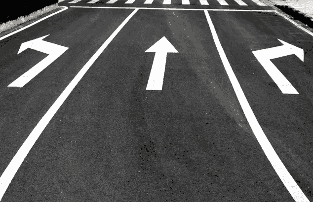

# 沃尔玛供应链技术中的数据科学

> 原文：<https://medium.com/walmartglobaltech/data-science-in-walmart-supply-chain-technology-bdb5d6b4105c?source=collection_archive---------0----------------------->

# 什么是数据科学？

数据科学的公认定义是，它是一个跨学科领域，使用科学方法、流程、算法和系统从各种形式的结构化和非结构化数据中提取有用的知识和有价值的见解。和所有零售行业一样，这个定义在沃尔玛最适用。然而，在沃尔玛，我们走得更远。数据科学方法正在演变和发展成为市场上的竞争优势。在沃尔玛，数据科学改变了游戏规则。

# 沃尔玛实验室是如何应用数据科学的？

作为世界上最大的零售商，沃尔玛正在经历巨大的数字增长，现在比以往任何时候都更需要数据科学的深刻应用。在沃尔玛实验室，数据科学家专注于构建算法，以提高复杂供应链管理流程的效率和效力。我们成功地解决了经典问题和新问题。

# 数据科学应用于供应链管理的哪些特定领域？

在沃尔玛实验室，数据科学方法正被积极应用于各种供应链领域，包括但不限于采购、订单/装运准备、运输、最后一英里路线安排/调度和最后一英里订单提货。

# 采购

沃尔玛应用数据科学的一个主要领域是与采购相关的问题。具体来说，这些包括交货承诺和订单来源。

*送货承诺* 每天，数百万顾客在[Walmart.com](http://walmart.com/)查看数百万件商品。对于查看的每件商品，如果该商品是在给定的未来时间戳之前购买的，沃尔玛会向顾客提供实时的预计发货日期。后端的算法基于许多事实进行估算，包括:

客户和履行中心之间的距离(FC)

FC 中物料的库存水平

可用的运输方式和运输能力(在某种程度上也考虑了运输成本)

交付承诺的主要挑战在于毫秒级的预期响应时间要求。

*订单采购* 无论何时下订单，供应链管理系统都需要确定以下事项:

哪个 FC 是履行订单或部分订单的最佳 FC，

选择哪种承运人方法来最小化运输成本，同时仍然满足承诺的交货日期(算法考虑了过去的准时交货绩效)

如果我们仅仅依赖于只关注底线的短视战略，可能会产生机会成本。

# 订单/装运准备

在订单/装运准备中，有两个重要问题正在使用数据科学解决。这些是拣选优化和包装优化。

*提货优化—提货人路线优化(VRP 或 VRPTW)* 每当订单或订单的一部分被指定由指定的 FC(或杂货店和发货商店(SFS))履行，并有给定的承诺交货时，订单中的商品将需要及时从货架上提货。对于每个订购项目，SCM 系统需要确定以下内容:

该物品应分配给哪个提货人

对于给定的拣货员，为了最小化总行走距离和最大化拣货员的生产率，要拣货的最优顺序

这个问题对于有经验的数据科学家来说是很熟悉的。物品到提货人的分配，以及分配给每个提货人的物品的提货排序，自然就形成了通常所说的带时间窗(VRP 或 VRPTW)的车辆路径问题，这是一个经典的 NP 难问题。计算复杂性理论中的 NP 难度(非确定性多项式时间难度)是一类问题的定义性质，这些问题非正式地至少与 NP 中最难的问题一样难。

*包装优化——箱子推荐(装箱问题)* 每当同一个顾客下的一个订单或多个订单的商品从货架上被取走，并准备包装时，沃尔玛开发了一个箱子推荐系统，该系统可以确定能够容纳所有订购商品的最佳尺寸的箱子，同时最大限度地减少箱子空间的浪费。这个问题自然被建模为装箱问题，这是数据科学家熟悉的另一个经典的 NP-Hard 问题。

实现了一组现有技术的试探法，以在预定的时间内有计划地确定每个订单的最佳盒子。根据订单的不同属性，一些试探法的性能明显优于其他试探法。更进一步，沃尔玛应用深度学习方法来训练基于神经网络的分类器，以确定用于每个订单箱确定的最佳启发式方法。

# 运输

沃尔玛成功应用数据科学方法的另一个供应链管理领域是运输。

*运输路线规划(混合整数规划问题)* 在对货物进行挑选和包装后，会生成一个运输标签(由采购部门确定)。根据标签上的信息，员工对包裹进行分类，并将其放在离出站码头门很近的地方。

根据源设施、承运人、运输方式，有时根据目的地设施来定义运输路线。每天处理数百万个包裹，分别有相应的承诺交付日期和交付地址。

挑战在于如何在连接不同类型的设施和分配承运人(车道规划)方面设计运输网络。关键是最大限度地降低运输成本，同时保持令人满意的准时交付水平。

这个问题被建模为经典的混合整数规划问题。沃尔玛与第三方 Gurobi Optimization 合作成功解决了这一问题。

*连续移动(组合优化问题)* 空载/空载里程是长途运输中浪费的主要来源。为了减少这种情况，通常的做法是由一名司机和一辆卡车以优化的顺序运送多辆卡车的货物。

主要挑战在于以下方面:

需要满足复杂的业务规则以及适用的交通部(DOT)和劳工部(DOL)的规则和法规。

优化时间有限或没有时间。移动中的早期装货可能已经完成，而移动中计划的后期装货尚未准备或实现。

其核心是，这被称为一个经典的组合优化问题。

*DC 到商店的配送路线和调度【VRPTW】* 商店的杂货需要每天补充，从预定的配送中心(DC)或区域配送中心(RDC)进行。一个好的牛奶运行来完成它最小化总行驶距离以及总空载距离。

# 最后一英里路由和调度

沃尔玛目前正在应用数据科学方法的另一个供应链管理领域是最后一英里路线和调度。具体的应用领域包括杂货递送路线、一般商品递送路线、相关递送路线、地图路线和供应形状。

*杂货配送路线和调度(VRPTW 和指派问题)* 杂货订单在客户指定的预约时间窗口内配送。用专业车队按时交付这些订单通常非常昂贵。为了降低成本和提高交付能力，ROVR 实施了一套先进的和专有的元启发式和局部搜索算法。

这些用于实时优化路线，预期新订单，更新/取消现有订单；对于中低密度地区的杂货配送，一个更低成本的选择是与优步和 Lyft 等第三方承运商合作。在这些情况下，详细的路线并不是最重要的。相反，订单到车辆的分配成为主要焦点。

## GM 交付路线-关联交付(VRP)

除了杂货配送，沃尔玛还在考虑普通商品(GM)的配送。应用数据科学原理的两个重要领域包括 GM 交付路线和关联交付系统的实施。

*地图路由(图论-最短路径问题)* 沃尔玛已经确定，在大型道路网络中，例如整个英国，甚至更大的美国，具有各种堆实现的经典 Dijkstra 算法不可扩展用于批量位置到位置路由问题。作为回应，我们开发和部署了资源优化和车辆路线(ROVR)。ROVR 采用最先进的技术收缩层次，将重载计算从实时转移到预计算。

## 供应成形

需求塑造是一种可操作的供应链管理(SCM)策略，其中公司使用价格激励、成本调整和产品替代等策略来吸引客户购买特定商品。

# 最后一英里订单提货

check In Notifications Engine(CINE)是沃尔玛最后一英里系统整体计划的几个组成部分之一，旨在预测我们的客户何时接近物理目的地(接入点),并采取准备措施进行响应。

能够在不耗尽智能手机电池的情况下准确检测客户的位置，并预测客户何时要拍摄电影集，这与其他接近和定位方法不同。电影开辟了一个广泛的用途，否则将无法工作，由于低精度和可靠性差的其他解决方案。

电影是最后一英里系统在线到离线接送体验的关键。当顾客靠近时，电影提醒网上杂货店(OG)店员，这样顾客一停下来，订单就准备好了。

*顾客等待时间估计和控制(排队论)* 作为送货上门的替代选择，顾客可以选择从商店提取他们的在线杂货订单。顾客的到达模式、员工的处理时间、配送/预测都会影响顾客的排队等待时间。沃尔玛正在开发一种基于排队论的方法来帮助估计每个顾客的等待时间，并确定人员配备水平来控制顾客的排队等待。

