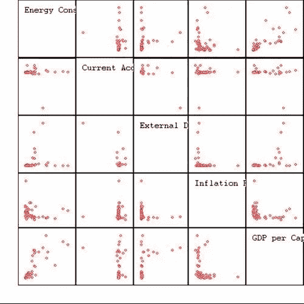
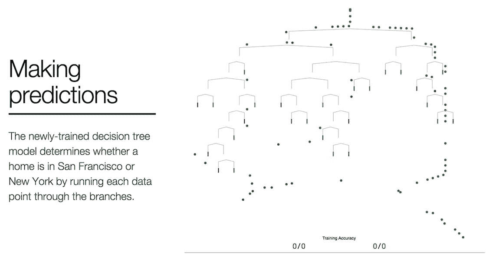
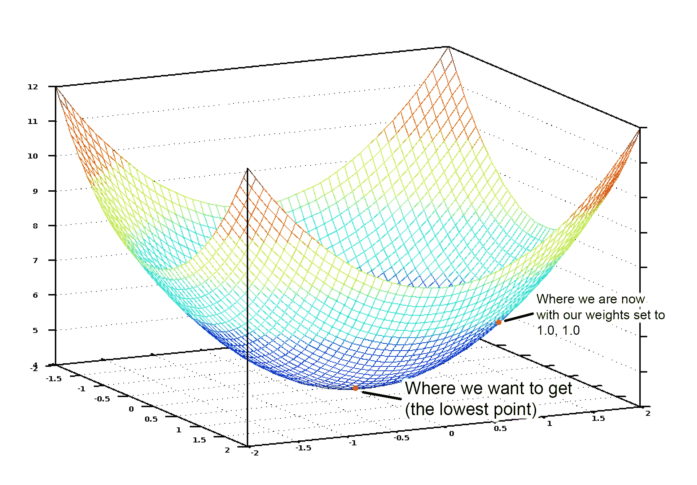
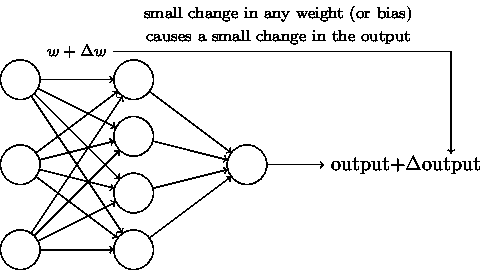

# 数据科学简讯 2017–09

> 原文：<https://medium.com/compendium/data-science-newsletter-2017-09-8422d1ba1ec?source=collection_archive---------8----------------------->

Computas 的数据科学社区小组致力于每月的时事通讯，我们将在这个博客上持续发布。第一份简讯是九月份的，我们将内容分为三个不同的部分:“入门”、“初学者教程”和“高级”。我们希望你喜欢它！

# 入门指南

本节包括一些文章的链接，在这些文章中可以获得机器学习的概述。没有代码，没有数学，只有简单的英语。

# [程序员/数据科学的统计学入门最好的方法是什么？](http://www.datasciencecentral.com/profiles/blogs/what-is-the-best-way-for-getting-started-in-statistics-for)

经常有人问我这个问题:程序员入门统计学的最佳方式是什么？

我在教学中使用了下面的方法。

# [机器学习的可视化介绍](http://www.r2d3.us/visual-intro-to-machine-learning-part-1/)

在机器学习中，计算机应用统计学习技术来自动识别数据中的模式。

这些技术可以用来进行高度准确的预测。

# 初学者教程

本节包含指向您可以跟进的教程的链接。有些有你可以跟随的代码。

# [机器学习速成班:第一部分](https://ml.berkeley.edu/blog/2016/11/06/tutorial-1/)

这是一系列教程，向初级和高级读者介绍机器学习的基础知识，并深入了解机器学习算法实际上是如何学习的。

*   没有数学
*   漂亮的图表
*   写得不错
*   很好的解释
*   鸟类概述

# [机器学习很有趣！](/@ageitgey/machine-learning-is-fun-80ea3ec3c471)

本指南适用于任何对机器学习感兴趣但不知道从哪里开始的人。我想有很多人试图阅读维基百科的文章，但感到沮丧，并放弃了希望有人能给他们一个高层次的解释。就是这样。

目标是任何人都可以访问——这意味着有很多概括。但是谁在乎呢？如果这让任何人对 ML 更感兴趣，那么任务就完成了。

*   一点数学知识
*   写得不错
*   不错的对比
*   由莉迪亚赞助？

# 先进的

这一部分包括链接到你需要付出更多努力的资源。但这是值得的。

# [神经网络和深度学习](http://neuralnetworksanddeeplearning.com/index.html)

*神经网络和深度学习*是一本免费的在线书籍。这本书会教你:

*   神经网络，一个美丽的生物启发编程范例，使计算机能够从观察数据中学习
*   深度学习，一套强大的神经网络学习技术

神经网络和深度学习目前为图像识别、语音识别和自然语言处理中的许多问题提供了最佳解决方案。

这本书会教你很多神经网络和深度学习背后的核心概念。

*   从容做
*   很好的解释

# [带 Tensorflow 的上下文聊天机器人](https://chatbotsmagazine.com/contextual-chat-bots-with-tensorflow-4391749d0077)

我们将创建一个聊天机器人框架，并为**岛助力车租赁店**建立一个对话模型。这家小型企业的聊天机器人需要处理关于营业时间、预订选项等简单问题。我们还希望它能够处理上下文相关的响应，比如关于当天租赁的查询。做好这件事[可以节省一个假期](/p/how-a-messaging-app-saved-my-vacation-192b031a96f5)！

我们将通过 3 个步骤来学习:

*   我们将把会话意图定义转换成张量流模型
*   接下来，我们将构建一个聊天机器人框架来处理响应
*   最后，我们将展示如何将基本上下文整合到我们的响应处理器中

我们将使用 [**tflearn**](http://tflearn.org/) ，上面一层 [**tensorflow**](https://www.tensorflow.org/) ，当然还有 [**Python**](https://www.python.org/) 。一如既往，我们将使用 iPython 笔记本 作为工具来方便我们的工作。

这个链接引自这个:[https://hackernoon . com/I-build-a-chatbot-in-2-hours-and-this-is-what-I-learned-f 5 db B4 ba 5 FCC](https://hackernoon.com/i-built-a-chatbot-in-2-hours-and-this-is-what-i-learned-f5dbb4ba5fcc)在这里作者按照代码说明了自己的经历。似乎是一个很酷的周末项目？如果你不想一个人尝试，我们正在考虑开一个黑客大会。