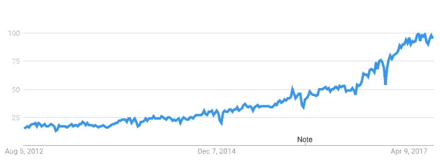

# 数据科学简讯 2017–10

> 原文：<https://medium.com/compendium/data-science-newsletter-2017-10-e69482f64962?source=collection_archive---------7----------------------->

Computas 的数据科学社区小组致力于每月的时事通讯，我们将在这个博客上持续发布。本帖将呈现十月份的时事通讯，我们将内容分为三个不同的部分:入门、初学者教程和高级。我们希望你喜欢它！

# 入门指南

本节包括一些文章的链接，在这些文章中可以获得机器学习的概述。没有代码，没有数学，只有简单的英语。

# 谁将指挥机器人军队？

一篇关于制造智能系统时的责任的好博文。

那么谁将指挥机器人军队呢？

是军队吗？警察吗？

邪恶的黑客？谷歌，还是亚马逊？

某个厌倦了的程序员不想被打扰？

脸书，还是推特？

品牌？

# [新理论破解打开深度学习黑匣子](https://www.quantamagazine.org/new-theory-cracks-open-the-black-box-of-deep-learning-20170921/)

一个被称为“信息瓶颈”的新想法有助于解释当今人工智能算法令人困惑的成功——也可能解释人类大脑如何学习。

一篇必须阅读的文章，在人工智能研究人员中广泛分享，它可能提供了为什么神经网络推广如此之好的解释。

# 初学者教程

本节包含指向您可以跟进的教程的链接。有些有你可以跟随的代码。

# [TensorFlow 游乐场](http://playground.tensorflow.org/)

介绍神经网络与一个互动的视觉操场，有助于发展对神经网络是什么的直观理解。

*   神经网络
*   可用的可视化
*   相互作用的

# [8 机器学习 8 分钟](https://www.techinasia.com/talk/8-machine-learning-8-minutes)

本文的目标不是简单地反思机器学习的流行。而是以清晰简洁的方式解释和实现相关的机器学习算法。如果我成功了，那么你将带着对算法的更好理解离开，或者至少，当你自己尝试它们时，一些代码让你开始。

*   可用代码
*   录像
*   很好的解释

# 先进的

这一部分包括链接到你需要付出更多努力的资源。但这是值得的。

# [张量流](https://codelabs.developers.google.com/codelabs/cloud-tensorflow-mnist/#0)

[https://code labs . developers . Google . com/code labs/cloud-tensor flow-mnist/# 0](https://codelabs.developers.google.com/codelabs/cloud-tensorflow-mnist/#0)

附幻灯片:[https://docs . Google . com/presentation/d/1 tvixw 6 itiz 8 igjp 6 u 17 tcgofrlsahwqmmowjlgqy 9 co/pub？slide=id.p](https://docs.google.com/presentation/d/1TVixw6ItiZ8igjp6U17tcgoFrLSaHWQmMOwjlgQY9co/pub?slide=id.p)

在这个代码实验室中，你将学习如何建立和训练一个识别手写数字的神经网络。在这个过程中，当你增强你的神经网络以达到 99%的准确率时，你也会发现深度学习专业人员用来有效训练他们的模型的工具。

这个代码实验室使用了 [MNIST](http://yann.lecun.com/exdb/mnist/) 数据集，这是一个由 6 万个带标签的数字组成的集合，让几代博士忙碌了近 20 年。您将使用不到 100 行 Python / TensorFlow 代码来解决问题。

# 你会学到什么

*   什么是神经网络，如何训练它
*   如何使用 TensorFlow 建立一个基本的 1 层神经网络
*   如何添加更多的层
*   训练技巧和诀窍:过度适应，辍学，学习速度衰减…
*   如何对深度神经网络进行故障诊断
*   如何构建卷积网络

# 你需要什么

*   Python 2 或 3(推荐 Python 3)
*   张量流
*   Python 可视化库

实验的下一步给出了安装说明。

# [递归神经网络的不合理有效性](http://karpathy.github.io/2015/05/21/rnn-effectiveness/)

递归神经网络(rnn)有一些神奇的东西。我还记得我第一次为[图像字幕](http://cs.stanford.edu/people/karpathy/deepimagesent/)训练递归网络的时候。在训练的几十分钟内，我的第一个婴儿模型(带有相当随意选择的超参数)开始生成非常漂亮的图像描述，这些图像看起来很有意义。有时候，你的模型的简单程度与你从模型中得到的结果的质量之比超出了你的预期，这就是其中的一次。当时让这个结果如此令人震惊的是，人们普遍认为 rnn 应该很难训练(随着经验的增加，我实际上得出了相反的结论)。快进大约一年:我一直在训练 rnn，我已经多次见证了它们的力量和强壮，然而它们神奇的输出仍然有办法让我开心。这篇文章就是要和你分享一些这种魔力。我们将训练 rnn 一个字符一个字符地生成文本，并思考这个问题“这怎么可能呢？

顺便说一下，和这篇文章一起，我也在 Github 上发布了[代码，允许你基于多层 LSTMs 训练字符级语言模型。你给它一大块文本，它会学习生成像这样的文本，一次一个字符。你也可以用它来复制我下面的实验。](https://github.com/karpathy/char-rnn)

*   很棒的博客帖子
*   很好的解释
*   可供播放的代码