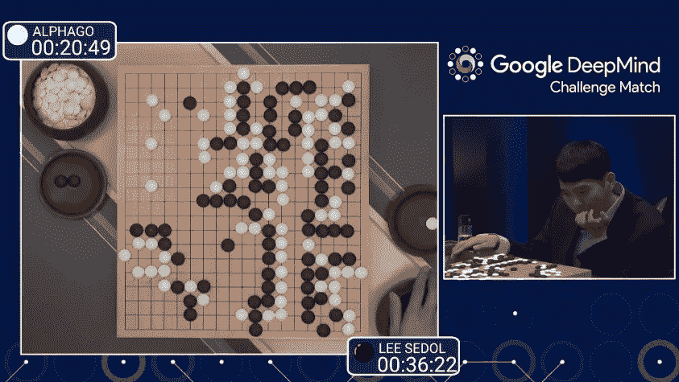

# 数据科学简讯 2017–11

> 原文：<https://medium.com/compendium/data-science-newsletter-2017-11-765825769186?source=collection_archive---------6----------------------->

Computas 的数据科学社区小组致力于每月的时事通讯，我们将在这个博客上持续发布。本帖将呈现 11 月的时事通讯，我们将内容分为三个不同的部分:入门、初学者教程和高级。我们希望你喜欢它！

# 入门指南

本节包括一些文章的链接，在这些文章中可以获得机器学习的概述。没有代码，没有数学，只有简单的英语。

# [发现适用于海量数据流的最佳算法](https://www.quantamagazine.org/best-ever-algorithm-found-for-huge-streams-of-data-20171024)

哈佛大学计算机科学家[杰拉尼·尼尔森](http://people.seas.harvard.edu/~minilek/)与丹麦奥尔胡斯大学的[卡斯珀·格林·拉森](https://cs.au.dk/~larsen/)、东北大学的 [Huy Nguyen](http://www.ccis.northeastern.edu/people/huy-le-nguyen/) 和哥本哈根大学的[米克尔·托鲁普](http://www.diku.dk/~mthorup/)合著了这项工作，他说:“我们开发了一种新的算法，它同时在每个性能维度上都是最好的”。

这种[同类最佳的流算法](https://arxiv.org/abs/1604.01357)的工作原理是记住它所看到的内容，告诉你它最常看到的内容。这表明，看似流数据分析固有的妥协实际上是不必要的。它也为一个新的战略遗忘时代指明了前进的道路。

# [人工智能专家希望终结政府的“黑箱”算法](https://www.wired.com/story/ai-experts-want-to-end-black-box-algorithms-in-government/)

负责刑事司法、卫生和福利等领域的公共机构越来越多地使用评分系统和软件来指导或决策改变生活的事件，如批准保释、判决、执行和优先服务。来自 NYU 研究人工智能社会影响的研究机构 AI Now 的报告称，太多这样的系统对它们所控制的公民来说是不透明的。

AI Now 的报告呼吁各机构避免使用它所称的对外界审查不透明的“黑箱”系统。微软研究员、AI Now 的联合创始人凯特克劳福德(Kate Crawford)表示，公民应该能够知道为他们做出决策的系统是如何运行的，并且已经过测试或验证。随着科技公司使用的机器学习等技术变得更加广泛，预计此类系统将变得更加复杂。

可以在这里阅读报告全文:[AI _ Now _ Institute _ 2017 _ Report _。pdf](https://assets.contentful.com/8wprhhvnpfc0/1A9c3ZTCZa2KEYM64Wsc2a/8636557c5fb14f2b74b2be64c3ce0c78/_AI_Now_Institute_2017_Report_.pdf)

# 初学者教程/最佳实践

本节包含您可以跟进的教程/最佳实践的链接。有些有你可以跟随的代码。

# [使用 Jupyter 笔记本的 10 个小技巧](/@r_kierzkowski/10-tips-on-using-jupyter-notebook-abc0ba7028a4)

[Jupyter 笔记本](http://jupyter.org/)(又名 iPython 笔记本)是出色的编码工具。这是做重复性研究的理想选择。以下是我整理 Jupyter 笔记本的 10 条建议，是我花了很长时间想出来的。

# [给有抱负的数据科学家的建议和其他常见问题](https://yanirseroussi.com/2017/10/15/advice-for-aspiring-data-scientists-and-other-faqs/)

有抱负的数据科学家和该网站的其他访问者经常重复同样的问题。这篇文章是我对这些问题(可能会随着时间的推移而演变)的答案的最终集合。

# 先进的

这一部分包括链接到你需要付出更多努力的资源。但这是值得的。

# [深度强化学习揭秘(第 0 集)](/@m.alzantot/deep-reinforcement-learning-demystified-episode-0-2198c05a6124)

这一系列文章的目标是提供关于"**深度强化学习**的介绍，这是构建智能机器的一种重要方法。我将从头开始讲述强化学习的基础知识，并提供实际例子来说明如何实现各种 RL 算法。遵循这些文章不需要关于强化学习或深度学习的先验知识，但任何关于机器学习的先前经验都将是有用的。我将提供 Python 中的代码示例，并将使用 [OpenAI gym](https://gym.openai.com/) 来评估我们的算法。

# [DeepXplore:深度学习系统的自动化白盒测试](https://blog.acolyer.org/2017/11/01/deepxplore-automated-whitebox-testing-of-deep-learning-systems/)

深度学习系统的状态空间是巨大的。正如我们在[对立的例子](https://blog.acolyer.org/2017/09/12/universal-adversarial-perturbations/)中看到的，这创造了机会来故意制造输入，欺骗训练有素的网络。暂时忘掉对立的例子，好的老式的虫子有机会藏在那个空间里吗？分布式系统的经验告诉我们，可能有很多！这就提出了一个有趣的问题:如何测试 DNN？这里所说的测试，我指的是那种被设计用来故意发现和暴露角落案例中的错误的测试。，而不是更常见的(在 ML 圈子里)测试集的定义，它主要关注于证明主线案例工作良好。

你怎么知道你已经做了足够的测试？

对于给定的测试用例，您如何知道正确的输出应该是什么？

# [嵌入、编码、出席、预测:最新 NLP 模型的深度学习新公式](https://explosion.ai/blog/deep-learning-formula-nlp)

这是去年的一个帖子，但仍然相关。

在过去的六个月里，一个强大的新的神经网络剧本已经出现在自然语言处理中。新方法可以概括为一个简单的四步公式:**嵌入**，**编码**，**出席**，**预测**。这篇文章解释了这种新方法的组成部分，并展示了它们是如何在最近的两个系统中组合在一起的。