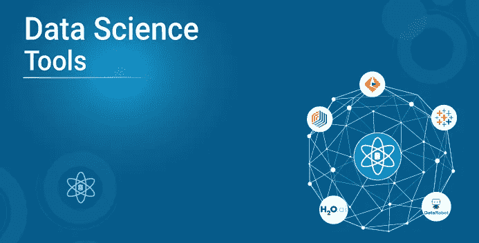
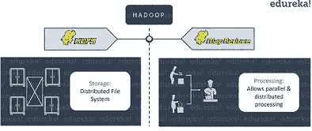
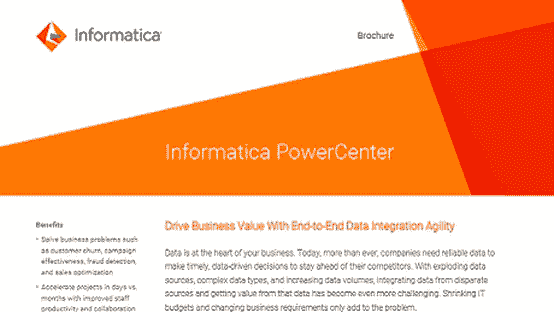
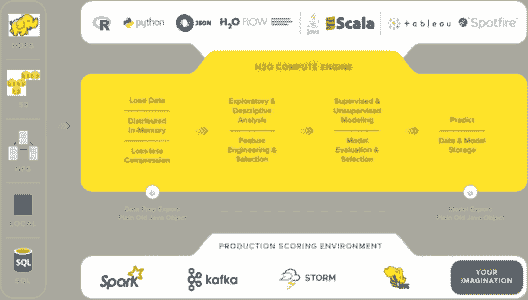
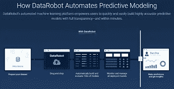
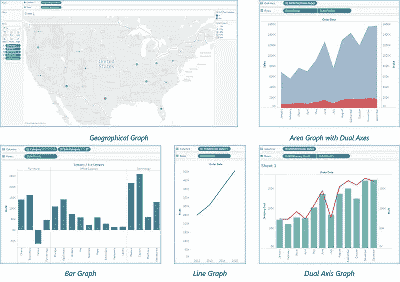
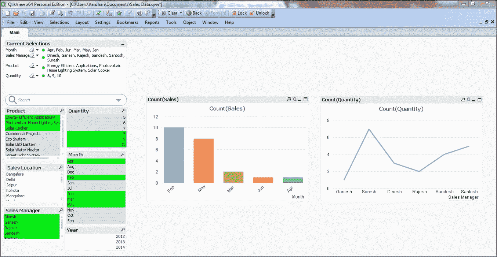

# 面向初学者的 8 大数据科学工具

> 原文：<https://medium.com/edureka/data-science-tools-5746567fe260?source=collection_archive---------2----------------------->

Data Science Tools — Edureka

你有没有想过人工智能、机器学习等革命性技术背后的流程和方法论是什么？答案是数据科学。随着市场上各种数据科学工具的出现，实施人工智能变得更加容易，也更具可扩展性。在本文中，我们将讨论市场上用于数据科学的最佳工具。

**下面是本文涉及的主题列表:**

1.  什么是数据科学？
2.  数据科学工具

*   用于数据存储的数据科学工具
*   用于数据分析的数据科学工具
*   用于数据建模的数据科学工具
*   用于数据可视化的数据科学工具

# **什么是数据科学？**

数据科学是从数据中获取有用见解的艺术。更具体地说，它是收集、分析和建模数据以解决现实世界问题的过程。

它的应用范围从欺诈检测和疾病检测到推荐引擎，因此业务不断增长。这些广泛的应用和不断增长的需求导致了数据科学工具的发展。

在下面的部分，我们将深入讨论市场上最好的数据科学工具。但是在我们开始之前，重要的是您要理解本文关注的是不同的数据科学工具，而不是可用于实现数据科学的编程语言。所以，不要指望数据科学、Python 和 r 哪个更好会有一场战争。

说到这里，让我们直接进入数据科学工具。

# **数据科学工具**

这些工具的主要特点是，你不必为了实现数据科学而使用编程语言。它们带有预定义的功能、算法和非常用户友好的 GUI。因此，它们可以用来建立复杂的机器学习模型，而不需要使用编程语言。

几家初创公司和科技巨头一直在致力于开发这种用户友好的数据科学工具。然而，由于数据科学是一个非常庞大的过程，因此在整个工作流程中使用一种工具通常是不够的。

因此，我们将了解用于数据科学流程不同阶段的数据科学工具，即:

1.  数据存储
2.  探索性数据分析
3.  数据建模
4.  数据可视化

# **用于数据存储的数据科学工具**

## **Apache Hadoop**

Apache Hadoop 是一个免费的开源框架，可以管理和存储大量的数据。它在 1000 台计算机的集群上提供大规模数据集的分布式计算。它用于高级计算和数据处理。

***下面是 Apache Hadoop 的一系列特性:***

*   在数千个 Hadoop 集群上有效扩展大数据
*   它使用 Hadoop 分布式文件系统(HDFS)进行数据存储，该系统将大量数据分布在多个节点上进行分布式并行计算
*   提供其他数据处理模块的功能，如 Hadoop MapReduce、Hadoop YARN 等

## **微软高清洞察**

Azure HDInsight 是微软提供的云平台，用于数据存储、处理和分析。Adobe、Jet 和 Milliman 等企业使用 Azure HD Insights 来处理和管理海量数据。

***下面列举一下微软 HD Insights 的特性:***

*   它为集成 Apache Hadoop 和 Spark 集群以进行数据处理提供了全面的支持
*   Windows Azure Blob 是 Microsoft HD Insights 的默认存储系统。它可以跨数千个节点有效地管理最敏感的数据
*   提供支持企业级 R 的 Microsoft R Server，用于执行统计分析和构建强大的机器学习模型。

# **用于探索性数据分析的数据科学工具**

## **信息动力中心**

围绕 Informatica 的传言可以解释为他们的收入已经接近 10.5 亿美元。Informatica 有许多专注于数据集成的产品。然而，Informatica PowerCenter 因其数据集成能力而脱颖而出。

***这里是 Informatica PowerCenter 的特性列表:***

*   基于 ETL(提取转换加载)架构的数据集成工具。
*   它有助于从各种来源提取数据，根据业务需求转换和处理数据，并最终将数据加载或部署到仓库中。
*   它支持分布式处理、网格计算、自适应负载平衡、动态分区和下推优化。

## **RapidMiner**

毫无疑问，RapidMiner 是实现数据科学最流行的工具之一。RapidMiner 在 2017 年 Gartner 数据科学平台魔力象限和 Forrester 预测分析和机器学习浪潮中排名第一，并且是 G2 人群预测分析网格中的顶级表现者之一。

***下面是它的一些特性:***

*   用于数据处理、构建机器学习模型和部署的单一平台。
*   它支持将 Hadoop 框架与其内置的 RapidMiner Radoop 集成在一起
*   使用可视化工作流设计器对机器学习算法进行建模。它还可以通过自动建模生成预测模型

# **用于数据建模的数据科学工具**

## **H2O.ai**

H2O.ai 是 H2O 等开源机器学习(ML)产品的背后公司，旨在让所有人更容易进行 ML。
拥有大约 130，000 名数据科学家和大约 14，000 个组织，H20.ai 社区正在快速发展。H20.ai 是一个开源数据科学工具，旨在简化数据建模。

***下面是它的一些特点:***

*   它是使用最流行的数据科学编程语言(即 Python 和 R)构建的。这使得应用机器学习更容易，因为大多数开发人员和数据科学家都熟悉 R 和 Python。
*   它可以实现大多数机器学习算法，包括广义线性模型(GLM)、分类算法、增强机器学习等。它还为深度学习提供支持。
*   它支持与 Apache Hadoop 集成，以处理和分析大量数据。

## **数据机器人**

DataRobot 是一个人工智能驱动的自动化平台，有助于开发精确的预测模型。DataRobot 可以轻松实现各种各样的机器学习算法，包括聚类、分类、回归模型。

***下面是它的一些特性:***

*   通过允许使用成千上万的服务器同时执行数据分析、数据建模、验证等，支持并行编程。
*   它以闪电般的速度构建、测试和训练机器学习模型。DataRobot 在几个用例上测试这些模型，并进行比较，看哪个模型给出的预测最准确。
*   大规模实现整个机器学习过程。通过实现参数调整和许多其他验证技术，它使得模型评估更加容易和有效。

# **用于数据可视化的数据科学工具**

## **画面**

Tableau 是市场上最流行的数据可视化工具。它允许您将原始的、无格式的数据分解成可处理和可理解的格式。使用 Tableau 创建的可视化可以轻松帮助您理解预测变量之间的依赖关系。

***下面是 Tableau 的几个特点:***

*   它可以用于连接多个数据源，并可以可视化海量数据集，以找到相关性和模式。
*   Tableau 桌面功能允许您创建定制的报告和仪表板，以获得实时更新
*   Tableau 还提供跨数据库连接功能，允许您创建计算字段和连接表，这有助于解决复杂的数据驱动问题。

## **QlikView**

QlikView 是另一种数据可视化工具，被全球 24，000 多家组织使用。它是最有效的可视化平台之一，用于可视化地分析数据以获得有用的业务见解。

***下面是 QlikView 的几个功能:***

*   它提供清晰的可视化效果来创建仪表板和详细的报告，从而提供对数据的精确理解。
*   它提供了内存中的数据处理，可以快速创建报告并传达给最终用户。
*   数据关联是 QlikView 的另一个重要功能。它拥有专利的内存技术，可以自动生成数据中的关联和关系。

如果你想查看更多关于 Python、DevOps、Ethical Hacking 等市场最热门技术的文章，那么你可以参考 [Edureka 的官方网站。](https://www.edureka.co/blog/?utm_source=medium&utm_medium=content-link&utm_campaign=data-science-tools)

既然您已经了解了顶级数据科学工具，我相信您一定很想了解更多。以下几篇文章将帮助您开始学习数据科学:

> *1。* [*数据科学教程*](/edureka/data-science-tutorial-484da1ff952b)
> 
> *2。* [*数据科学的数学与统计*](/edureka/math-and-statistics-for-data-science-1152e30cee73)
> 
> *3。*[*R 中的线性回归*](/edureka/linear-regression-in-r-da3e42f16dd3)
> 
> *4。* [*机器学习算法*](/edureka/machine-learning-algorithms-29eea8b69a54)
> 
> *5。*[*R 中的逻辑回归*](/edureka/logistic-regression-in-r-2d08ac51cd4f)
> 
> *6。* [*分类算法*](/edureka/classification-algorithms-ba27044f28f1)
> 
> *7。* [*随机森林中的 R*](/edureka/random-forest-classifier-92123fd2b5f9)
> 
> *8。* [*决策树中的 R*](/edureka/a-complete-guide-on-decision-tree-algorithm-3245e269ece)
> 
> *9。* [*机器学习入门*](/edureka/introduction-to-machine-learning-97973c43e776)
> 
> *10。* [*朴素贝叶斯在 R*](/edureka/naive-bayes-in-r-37ca73f3e85c)
> 
> *11。* [*统计与概率*](/edureka/statistics-and-probability-cf736d703703)
> 
> *12。* [*如何创建一个完美的决策树？*](/edureka/decision-trees-b00348e0ac89)
> 
> 13。 [*关于数据科学家角色的十大神话*](/edureka/data-scientists-myths-14acade1f6f7)
> 
> 14。 [*顶级数据科学项目*](/edureka/data-science-projects-b32f1328eed8)
> 
> *15。* [*数据分析师 vs 数据工程师 vs 数据科学家*](/edureka/data-analyst-vs-data-engineer-vs-data-scientist-27aacdcaffa5)
> 
> *16。* [*人工智能类型*](/edureka/types-of-artificial-intelligence-4c40a35f784)
> 
> 17。[*R vs Python*](/edureka/r-vs-python-48eb86b7b40f)
> 
> 18。 [*人工智能 vs 机器学习 vs 深度学习*](/edureka/ai-vs-machine-learning-vs-deep-learning-1725e8b30b2e)
> 
> 19。 [*机器学习项目*](/edureka/machine-learning-projects-cb0130d0606f)
> 
> *20。* [*数据分析师面试问答*](/edureka/data-analyst-interview-questions-867756f37e3d)
> 
> *21。* [*面向非程序员的数据科学和机器学习工具*](/edureka/data-science-and-machine-learning-for-non-programmers-c9366f4ac3fb)
> 
> *22。* [*十大机器学习框架*](/edureka/top-10-machine-learning-frameworks-72459e902ebb)
> 
> *23。* [*统计机器学习*](/edureka/statistics-for-machine-learning-c8bc158bb3c8)
> 
> *24。* [*随机森林中的 R*](/edureka/random-forest-classifier-92123fd2b5f9)
> 
> *25。* [*广度优先搜索算法*](/edureka/breadth-first-search-algorithm-17d2c72f0eaa)
> 
> *26。* [*线性判别分析中的 R*](/edureka/linear-discriminant-analysis-88fa8ad59d0f)
> 
> *27。* [*机器学习的先决条件*](/edureka/prerequisites-for-machine-learning-68430f467427)
> 
> *28。* [*互动 WebApps 使用 R 闪亮*](/edureka/r-shiny-tutorial-47b050927bd2)
> 
> *29。* [*监督学习*](/edureka/supervised-learning-5a72987484d0)
> 
> 三十岁。 [*无监督学习*](/edureka/unsupervised-learning-40a82b0bac64)
> 
> 31。 [*10 本最好的数据科学书籍*](/edureka/10-best-books-data-science-9161f8e82aca)
> 
> *32。* [*机器学习使用 R*](/edureka/machine-learning-with-r-c7d3edf1f7b)
> 
> *33。* [*机器学习书籍*](/edureka/top-10-machine-learning-books-541f011d824e)

*原载于 2019 年 7 月 29 日*[*https://www.edureka.co*](https://www.edureka.co/blog/data-science-tools/)*。*