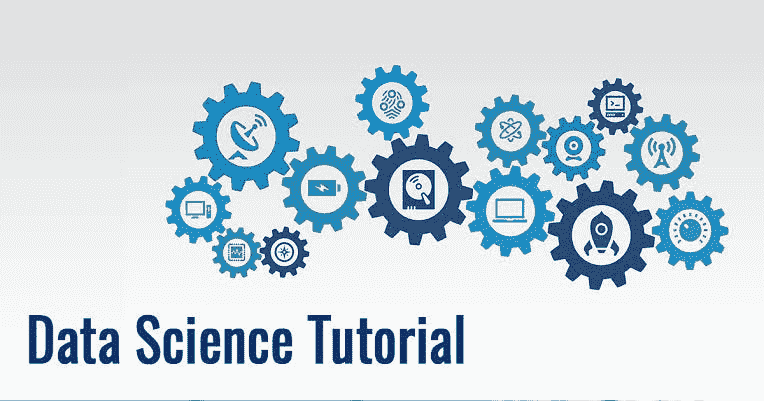

# 为什么你应该学习数据科学？

> 原文：<https://medium.com/quick-code/data-science-tutorial-16233c010a4c?source=collection_archive---------1----------------------->

## **什么是数据科学:**

数据科学是从大量多样化的数据中获取知识和见解，组织、处理和分析数据的过程。包括许多不同的学科，如数学和统计建模、从原始数据中提取数据和应用数据可视化技术。通常，它还涉及管理大数据技术以收集结构化和非结构化数据。

## **为什么是数据科学？**

以下是使用数据科学技术的显著优势:

*   数据是当今世界的石油。借助正确的工具、技术和算法，我们可以利用这些数据，并将它们转化为差异化的商业优势。
*   数据科学可以通过先进的机器学习算法帮助你检测欺诈
*   帮助避免重大金钱损失
*   在机器中建立智能技能
*   您可以执行情感分析来评估客户的品牌忠诚度
*   允许做出更好更快的决策
*   帮助您为合适的客户推荐合适的产品以改善您的业务，*更多附加信息请访问* [**数据科学在线培训**](https://onlineitguru.com/data-science-course.html)

## **数据科学中的机器学习**

它是完成一项任务的一个过程或一组规则或集合。它是计算机科学的主要概念或构建模块之一:优雅高效的代码设计、数据处理和准备以及软件工程的基础。在数据科学中，主要使用三种算法:

*   数据准备、管理和处理算法
*   用于估计参数的优化算法，包括随机梯度下降法、最小二乘法、牛顿法
*   机器学习算法

> 了解更多信息 [**数据科学 Vs 机器学习**](https://onlineitguru.com/blog/data-science-vs-machine-learning)

## **谁是数据科学家？**

如图所示，数据科学家是所有职业的老师！他必须精通数学，他必须在商业领域有所作为，他还必须有高超的计算机科学技能。恐惧？不要这样。虽然你需要在这些领域都很优秀，但即使你不是，你也不会孤单！。如果我们谈论在公司环境中工作，工作是在团队中分配的，每个团队都有自己的经验。但问题是，你必须至少在其中一个领域有能力。此外，尽管这些技能对你来说是新的，放松！这可能需要时间，但这些技能是可以培养的，我相信我值得你投入时间。

## **为什么数据科学应用如此广泛？**

在本数据科学教程中，我们还将了解 [**数据科学**](https://onlineitguru.com/blog/importance-of-data-science) 在当今数字世界中的重要性。由于我们不断创建大量数据，迫切需要从这些数据中提取有价值的见解。数据是我们这一代的石油。借助正确的工具、技术和算法，我们可以理解数据，并将其转化为差异化的商业优势。

## **数据科学工作类型**

在本数据科学教程中，您不仅将学习数据科学，还将发现数据科学领域中的各种功能，如下所示:

*   **数据分析师:-** 数据分析师的职责是提取大量数据，寻找模式、关系和趋势，从而创建有吸引力的视图和报告来分析数据并做出业务决策。
*   数据工程师:- 数据工程师负责处理大量数据。它应该能够清理数据清理、数据提取和数据准备，以便数据企业处理大量数据。
*   **机器学习专家:-** 机器学习专家是指使用各种机器学习算法的人，比如回归、分组、分类、决策树、随机森林等等。
*   **数据科学家:-** 数据科学家是指通过实施各种工具、技术、方法、算法等，处理大量数据以获得有吸引力的商业想法的人。

使用 [**数据科学和 Python**](https://onlineitguru.com/blog/data-science-with-python) 将您的职业生涯推向新的成功高度

## **数据科学应用**

探索当今世界最热门的领域——数据科学。它是一个职业领域，来源于几个学科。数据是行业的需要，因此，数据科学有大量的应用。在本文中，我们将讨论数据科学的一些重要应用，并了解它如何塑造当今世界的各个行业。

*   欺诈和风险检测
*   卫生保健
*   互联网搜索
*   定向广告
*   网站推荐
*   高级图像识别
*   语音识别
*   航线规划
*   比赛
*   增强现实

**感谢您阅读文章**