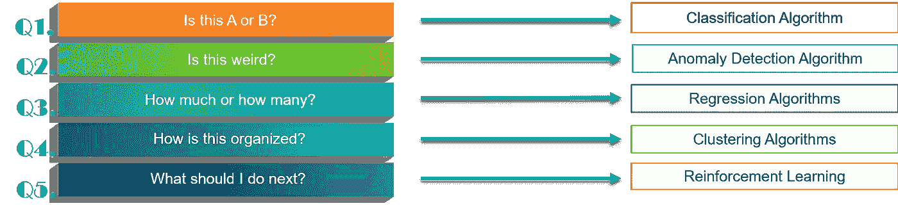

# 数据科学初学者教程—从零开始学习数据科学！

> 原文：<https://medium.com/edureka/data-science-tutorial-484da1ff952b?source=collection_archive---------2----------------------->

Data Science Tutorial — Edureka

想开始数据科学家的职业生涯，但不知道从哪里开始？你来对地方了！在这篇关于数据科学的教程中，我们将深入讨论与数据科学相关的概念。

本文将涵盖以下主题:

1.  为什么是数据科学？
2.  什么是数据科学？
3.  谁是数据科学家？
4.  工作趋势
5.  如何解决数据科学中的一个问题？
6.  数据科学组件
7.  数据科学家工作角色

# 为什么是数据科学？

有人说数据科学家是“21 世纪最性感的工作”。为什么？因为在过去的几年里，公司一直在存储他们的数据。每个公司都在这么做，这突然导致了数据爆炸。数据已经成为今天最丰富的东西。

但是，您将如何处理这些数据呢？让我们用一个例子来理解这一点:

比方说，你有一家制造手机的公司。你发布了你的第一个产品，它大受欢迎。每种技术都有生命，对吗？所以，现在是时候想出新的东西了。但你不知道应该创新什么，才能满足用户的期望，他们正急切地等待你的下一个版本？

在你的公司里，有人想出了一个利用用户反馈的主意，并挑选出我们认为用户在下一个版本中期待的东西。

在数据科学中，您应用各种数据挖掘技术，如情感分析等，并获得所需的结果。

不仅如此，你可以做出更好的决定，你可以通过想出有效的方法来降低生产成本，并给你的客户他们真正想要的东西！

有了这些，数据科学可以带来无数的好处，因此你的公司拥有一个数据科学团队是绝对必要的。诸如此类的需求导致了“数据科学”成为今天的一门学科，因此我为你写了这篇关于数据科学教程的文章。:)

# 什么是数据科学？

随着数理统计和数据分析的发展，最近出现了数据科学这个术语。这一旅程令人惊叹，我们今天在数据科学领域取得了如此多的成就。

在接下来的几年里，我们将能够预测未来，正如麻省理工学院的研究人员所宣称的那样。他们已经用他们令人敬畏的研究达到了预测未来的里程碑。他们现在可以用他们的机器预测电影的下一个场景会发生什么！怎么会？现在你可能有点难以理解，但是不要担心，在这篇博客结束时，你也会有答案的。

回来后，我们讨论了数据科学，也称为数据驱动的科学，它利用科学方法、流程和系统从各种形式的数据中提取知识或见解，例如结构化或非结构化数据。

这些方法和流程是什么，是我们今天在本数据科学教程中要讨论的内容。

展望未来，谁来做这些头脑风暴，或者谁来实践数据科学？一个**数据科学家**。

# 谁是数据科学家？

如图所示，数据科学家是所有行业的大师！他应该精通数学，应该在商业领域出类拔萃，还应该拥有出色的计算机科学技能。害怕吗？不要这样。尽管你需要在所有这些领域都做得很好，但是即使你不是，你也不是一个人！

没有所谓的“完全的数据科学家”。如果我们谈论在公司环境中工作，工作是在团队中分配的，其中每个团队都有自己的专长。但问题是，你应该精通这些领域中的至少一个。另外，即使这些技能对你来说是新的，也要冷静！这可能需要时间，但是这些技能是可以培养的，相信我，你所投入的时间是值得的。为什么？好吧，让我们看看就业趋势。

# 数据科学家工作趋势

嗯，图表说明了一切，不仅有很多数据科学家的职位空缺，而且这些职位的薪酬也很高！不，我们的博客不会报道工资数据，去谷歌吧！

嗯，我们现在知道，学习数据科学实际上是有意义的，不仅因为它非常有用，而且在不久的将来你会在 it 领域有一个伟大的职业生涯。

现在让我们开始学习数据科学的旅程，从下一个主题开始，即如何解决数据科学中的问题。

# 如何解决数据科学中的一个问题？

现在，让我们讨论如何用数据科学来处理和解决问题。数据科学中的问题是用算法解决的。但是，最需要判断的是用哪种算法，什么时候用？

基本上，在数据科学中你会面临 5 种问题。

让我们逐一解决这些问题和相关算法:

## **问题 1**

**这是 A 还是 B？**

对于这个问题，我们指的是有明确答案的问题，就像在有固定答案的问题中，答案可以是是或不是，1 或 0，感兴趣，也许感兴趣或不感兴趣。

**例如:**

你想喝点什么，茶还是咖啡？

在这里，你不能说你想要可乐！因为这个问题只提供茶或咖啡，所以你只能回答其中之一。

当我们只有两种类型的答案，即是或否，1 或 0 时，它被称为二级分类。有两个以上选项的，称为多类分类。

总结一下，每当你遇到问题，而这些问题的答案是明确的，在数据科学中，你将使用*分类算法来解决这些问题。*

这篇文章中的下一个问题，你可能会遇到，可能如下。

## 问题 2

**这很奇怪吗？**

像这样的问题涉及模式，可以使用异常检测算法来解决。

**比如:**

试着把问题和“这很奇怪吗？”在这张图上，

上面的图案有什么怪异的地方？那个红色的家伙，是不是？

每当模式出现中断时，算法就会标记出特定事件，供我们查看。信用卡公司已经实现了该算法的实际应用，其中，用户的任何异常交易都被标记以供审查。从而实现安全性并减少人的监视工作。

让我们看看这个数据科学教程中的下一个问题，不要害怕，涉及数学！

## 问题 3

**多少还是多少？**

不喜欢数学的你们，放心吧！回归算法来了！

因此，每当有一个问题可能需要数字或数值，我们就用回归算法来解决它。

**例如:**

明天的温度是多少？

因为我们期望在这个问题的响应中有一个数值，所以我们将使用回归算法来解决它。

在本数据科学教程中，我们将讨论下一个算法。

## 问题 4

**这是怎么组织的？**

假设你有一些数据，现在你没有任何想法，如何从这些数据中找到意义。因此问题是，这是如何组织的？

你可以用聚类算法来解决这个问题。他们是如何解决这些问题的？让我们看看:

聚类算法根据共同的特征对数据进行分组。例如，在上图中，点是根据颜色组织的。类似地，无论是任何数据，聚类算法都试图理解它们之间的共同点，从而将它们“聚类”在一起。

在本数据科学教程中，您可能会遇到的下一个也是最后一个问题如下。

## 问题 5

**接下来该怎么做？**

每当你遇到一个问题，其中你的计算机必须根据你给它的训练作出决定，它涉及到强化算法。

**例如:**

你的温度控制系统，当它必须决定是否应该降低或提高房间的温度。

**这些算法是如何工作的？**

这些算法基于人类心理学。我们喜欢被欣赏，对吗？计算机实现这些算法，并期望在接受训练时得到赏识。怎么会？让我们看看。

不是教计算机做什么，而是让它决定做什么，在这个动作结束时，你给出一个正面或负面的反馈。因此，你让你的系统“决定”做什么，并最终给出反馈，而不是在你的系统中定义什么是对的，什么是错的。

就像训练你的狗一样。你不能控制你的狗做什么，对不对？但是他做错了你可以骂他。同样，当他做了别人期望的事情时，也许拍拍他的背。

让我们在上面的例子中应用这种理解，想象你正在训练温度控制系统，所以每当房间中的人数增加时，系统必须采取行动。要么降低温度，要么提高温度。由于我们的系统什么都不懂，它采取随机决策，让我们假设，它提高了温度。因此，你给出了一个负面的反馈。有了这个，电脑就知道无论何时房间里的人数增加，都不会提高温度。

同样，对于其他行动，你应该给予反馈。随着每一个反馈，你的系统都在学习，并因此在下一个决策中变得更加准确，这种类型的学习被称为强化学习。

现在，我们在本数据科学教程中学习的算法涉及一个常见的“学习实践”。我们在让机器学习，对吗？

# 什么是机器学习？

它是一种人工智能，使计算机能够自主学习，即无需明确编程。通过机器学习，机器可以在遇到新情况时更新自己的代码。

本文的结论是，我们现在知道数据科学是由机器学习及其分析算法支持的。我们如何做分析，在哪里做。数据科学还有一些组件可以帮助我们解决所有这些问题。

在此之前，让我回答麻省理工学院如何预测未来，因为我想你们现在可能能够联系起来。因此，麻省理工学院的研究人员用电影训练他们的模型，计算机学习人类如何反应，或者在采取行动之前如何行动。

例如，当你要和某人握手时，你会把手从口袋里拿出来，或者靠在那个人身上。基本上，我们做的每件事都有一个“前行动”。在电影的帮助下，电脑接受了这些“预先动作”的训练。通过观察越来越多的电影，他们的计算机能够预测角色的下一步行动。

很简单，不是吗？让我在这篇文章中再抛给你一个问题！这里面一定实现了机器学习的哪个算法？

# 数据科学组件

## **1。数据集**

你会分析什么？数据，对吧？你需要大量可以分析的数据，这些数据被输入到你的算法或分析工具中。你可以从过去进行的各种研究中获得这些数据。

## **2。r 工作室**

R 是一种开源编程语言和软件环境，用于统计计算和图形，由 R 基金会支持。R 语言在一个叫做 R Studio 的 IDE 中使用。

*为什么用？*

**编程和统计语言**

除了用作统计语言，它还可以用作分析目的的编程语言。

**数据分析和可视化**

除了是最主要的分析工具之一，R 还是用于数据可视化的最流行的工具之一。

**简单易学**

r 是一个简单易学的读写工具

**免费开源**

r 是 FLOSS(自由/Libre 和开源软件)的一个例子，这意味着人们可以自由地分发这种软件的拷贝，阅读它的源代码，修改它，等等。

R Studio 足以进行分析，直到我们的数据集变得巨大，同时也是非结构化的。这种数据被称为大数据。

## **3。大数据**

大数据是指如此庞大和复杂的数据集集合，以至于难以使用现有的数据库管理工具或传统的数据处理应用程序进行处理。

现在，为了驯服这些数据，我们必须拿出一个工具，因为没有传统的软件可以处理这种数据，因此我们提出了 Hadoop。

## **4。Hadoop**

Hadoop 是一个框架，帮助我们以并行和分布式的方式**存储**和**处理**大型数据集。

让我们把重点放在 Hadoop 的存储和处理部分。

**商店**

Hadoop 中的存储部分由 HDFS 处理，即 Hadoop 分布式文件系统。它在分布式生态系统中提供高可用性。它的工作方式是这样的，它将传入的信息分成块，并将它们分发到集群中的不同节点，从而实现分布式存储。

**流程**

MapReduce 是 Hadoop 处理的核心。这些算法执行两项重要的任务，映射和归约。映射器将任务分成并行处理的更小的任务。一旦所有的映射器完成了它们的工作，它们就聚集它们的结果，然后这些结果被 Reduce 过程简化为一个更简单的值。

如果我们在数据科学中使用 Hadoop 作为存储，那么用 R Studio 处理输入就变得很困难，因为它无法在分布式环境中很好地执行，因此我们有了 Spark R。

## 5.火花河

它是一个 R 包，提供了一种轻量级的方式来使用 Apache Spark 和 R。为什么你要用它来代替传统的 R 应用程序呢？因为，它提供了一个分布式数据框架实现，支持选择、过滤、聚合等操作，但是是在大型数据集上。

现在休息一下吧！我们已经完成了本文中的技术部分，现在让我们从您的工作角度来看一下。我想你现在应该已经在谷歌上搜索了数据科学家的薪水，但是，让我们来讨论一下数据科学家的工作角色。

# 数据科学家工作角色

一些著名的数据科学家职位包括:

*   数据科学家
*   数据工程师
*   数据架构师
*   数据管理员
*   数据分析师
*   商业分析员
*   数据/分析经理
*   商业智能经理

下面的数据科学教程中的 Payscale.com 图表显示了美国和印度数据科学家的平均薪资。

提升数据科学和大数据分析技能的时机已经成熟，您可以利用数据科学职业机会。这就把我们带到了数据科学教程文章的结尾。我希望这篇文章能给你带来信息和附加值。

如果你想查看更多关于 Python、DevOps、Ethical Hacking 等市场最热门技术的文章，你可以参考 Edureka 的官方网站。

请留意本系列中的其他文章，它们将解释数据科学的各个方面。

> *1。* [*初学 R 中的机器学习*](/edureka/machine-learning-with-r-c7d3edf1f7b)
> 
> *2。* [*数据科学的数学与统计*](/edureka/math-and-statistics-for-data-science-1152e30cee73)
> 
> *3。*[*R 中的线性回归*](/edureka/linear-regression-in-r-da3e42f16dd3)
> 
> *4。* [*机器学习算法*](/edureka/machine-learning-algorithms-29eea8b69a54)
> 
> *5。*[*R 中的逻辑回归*](/edureka/logistic-regression-in-r-2d08ac51cd4f)
> 
> *6。* [*分类算法*](/edureka/classification-algorithms-ba27044f28f1)
> 
> *7。* [*随机森林中的 R*](/edureka/random-forest-classifier-92123fd2b5f9)
> 
> *8。* [*决策树中的 R*](/edureka/a-complete-guide-on-decision-tree-algorithm-3245e269ece)
> 
> *9。* [*机器学习入门*](/edureka/introduction-to-machine-learning-97973c43e776)
> 
> *10。* [*朴素贝叶斯在 R*](/edureka/naive-bayes-in-r-37ca73f3e85c)
> 
> *11。* [*统计与概率*](/edureka/statistics-and-probability-cf736d703703)
> 
> 12。 [*如何创建一个完美的决策树？*](/edureka/decision-trees-b00348e0ac89)
> 
> *13。* [*关于数据科学家角色的十大误区*](/edureka/data-scientists-myths-14acade1f6f7)
> 
> *14。* [*顶级数据科学项目*](/edureka/data-science-projects-b32f1328eed8)
> 
> 15。 [*数据分析师 vs 数据工程师 vs 数据科学家*](/edureka/data-analyst-vs-data-engineer-vs-data-scientist-27aacdcaffa5)
> 
> 16。 [*人工智能的种类*](/edureka/types-of-artificial-intelligence-4c40a35f784)
> 
> 17。[*R vs Python*](/edureka/r-vs-python-48eb86b7b40f)
> 
> *18。* [*人工智能 vs 机器学习 vs 深度学习*](/edureka/ai-vs-machine-learning-vs-deep-learning-1725e8b30b2e)
> 
> *19。* [*机器学习项目*](/edureka/machine-learning-projects-cb0130d0606f)
> 
> 20。 [*数据分析师面试问答*](/edureka/data-analyst-interview-questions-867756f37e3d)
> 
> *21。* [*面向非程序员的数据科学和机器学习工具*](/edureka/data-science-and-machine-learning-for-non-programmers-c9366f4ac3fb)
> 
> *22。* [*十大机器学习框架*](/edureka/top-10-machine-learning-frameworks-72459e902ebb)
> 
> *23。* [*用于机器学习的统计*](/edureka/statistics-for-machine-learning-c8bc158bb3c8)
> 
> *24。* [*机器学习面试问答*](/edureka/machine-learning-interview-questions-a5aef8a3ca60)
> 
> *25。* [*广度优先搜索算法*](/edureka/breadth-first-search-algorithm-17d2c72f0eaa)
> 
> *26。*[*R 中的线性判别分析*](/edureka/linear-discriminant-analysis-88fa8ad59d0f)
> 
> *27。* [*机器学习的先决条件*](/edureka/prerequisites-for-machine-learning-68430f467427)
> 
> *28。* [*互动 WebApps 使用 R 闪亮*](/edureka/r-shiny-tutorial-47b050927bd2)
> 
> 29。 [*机器学习十大书籍*](/edureka/top-10-machine-learning-books-541f011d824e)
> 
> *三十。* [*无监督学习*](/edureka/unsupervised-learning-40a82b0bac64)
> 
> *31.1* [*0 最佳数据科学书籍*](/edureka/10-best-books-data-science-9161f8e82aca)
> 
> 32。 [*监督学习*](/edureka/supervised-learning-5a72987484d0)

*原载于 2017 年 6 月 5 日 www.edureka.co***。**