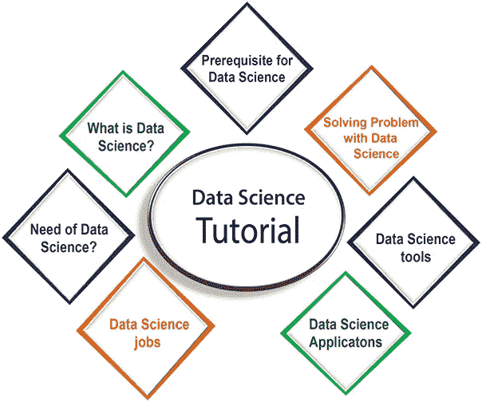
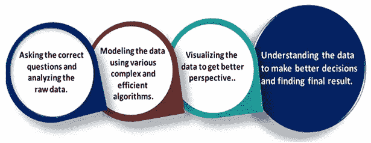
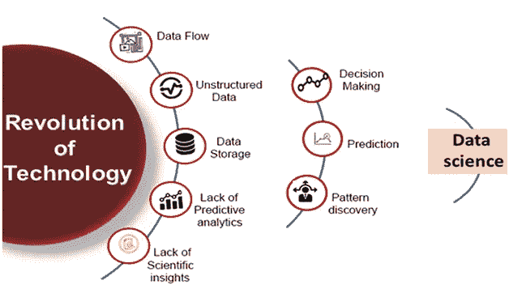
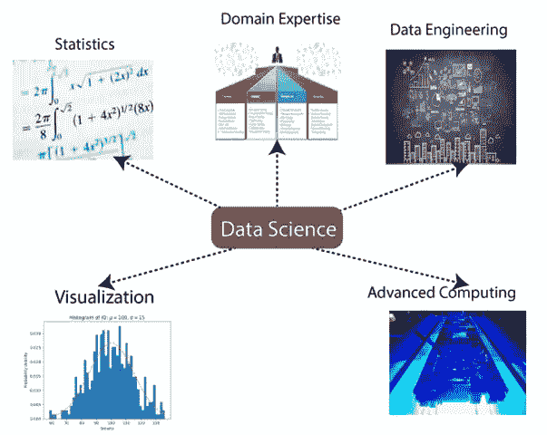
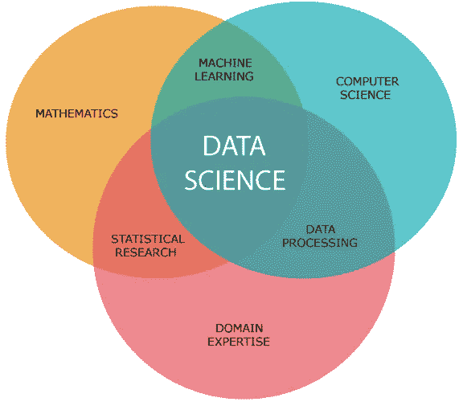
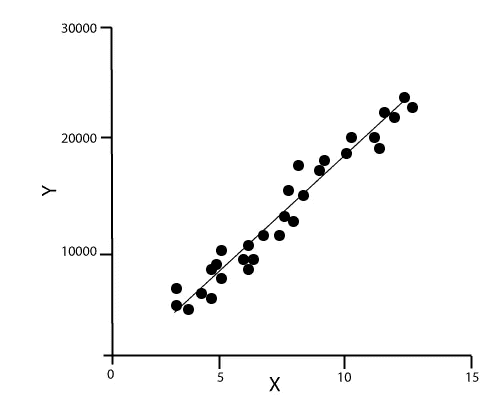
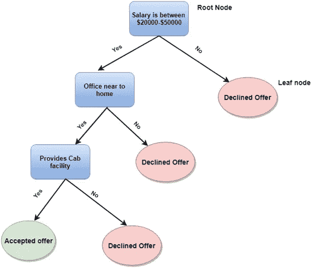
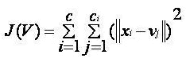
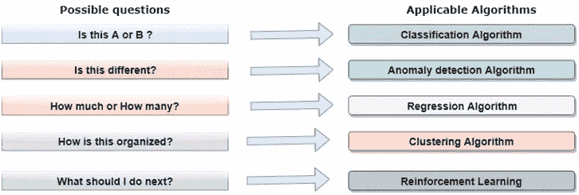
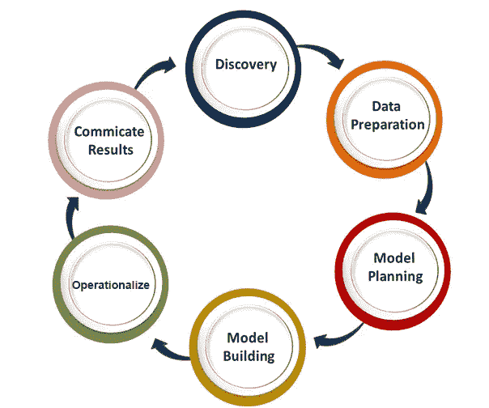

# 初学者数据科学教程

> 原文：<https://medium.com/quick-code/data-science-tutorial-for-beginners-95c150e104a?source=collection_archive---------0----------------------->

数据科学已经成为 21 世纪要求最高的工作。每个组织都在寻找具有数据科学知识的候选人。在本教程中，我们将介绍数据科学，包括数据科学工作角色、数据科学工具、数据科学组件、应用程序等。

# 什么是数据科学？

数据科学是对海量数据的深入研究，包括从使用科学方法、不同技术和算法处理的原始、结构化和非结构化数据中提取有意义的见解。

它是一个多学科领域，使用工具和技术来操纵数据，以便您可以找到一些新的和有意义的东西。

数据科学使用最强大的硬件、编程系统和最高效的算法来解决与数据相关的问题。它是人工智能的未来。更多附加信息 [**数据科学在线培训**](https://onlineitguru.com/data-science-course.html)

简而言之，我们可以说数据科学是关于:

*   提出正确的问题并分析原始数据。
*   使用各种复杂高效的算法对数据进行建模。
*   可视化数据以获得更好的视角。
*   理解数据以做出更好的决策并找到最终结果。

# 示例:

假设我们想开车从 A 站到 B 站。现在，我们需要做出一些决定，例如哪条路线将是更快到达该地点的最佳路线，哪条路线将不会出现交通堵塞，以及哪条路线将具有成本效益。所有这些决策因素都会作为输入数据，我们会从这些决策中得到合适的答案，所以这种对数据的分析就叫做数据分析，是数据科学的一部分。

# 对数据科学的需求:

几年前，数据还很少，而且大部分是以结构化的形式提供的，可以很容易地存储在 excel 表格中，并使用 BI 工具进行处理。

但在当今世界，数据变得如此庞大，即每天大约产生 **2.5 万亿字节**的数据，这导致了数据爆炸。据研究估计，到 2020 年，地球上一个人每秒将产生 1.7 MB 的数据。每个公司都需要数据来运作、发展和改善他们的业务。

现在，处理如此大量的数据对每个组织来说都是一项具有挑战性的任务。因此，为了处理、加工和分析这些数据，我们需要一些复杂、强大和高效的算法和技术，这种技术作为数据科学应运而生。以下是使用数据科学技术的一些主要原因:

*   在数据科学技术的帮助下，我们可以将大量的原始和非结构化数据转化为有意义的见解。
*   无论是大品牌还是初创公司，各种公司都在选择数据科学技术。处理大量数据的谷歌、亚马逊、网飞等公司正在使用数据科学算法来改善客户体验。
*   数据科学正在为交通自动化而努力，例如创造自动驾驶汽车，这是交通的未来。
*   数据科学可以帮助不同的预测，如各种调查、选举、机票确认等。

# 数据科学工作:

根据各种调查，由于对数据科学的需求不断增加，数据科学家的工作正在成为 21 世纪要求最高的工作。一些人还称之为“21 世纪最热门的职位”。数据科学家是能够使用各种统计工具和机器学习算法来理解和分析数据的专家。

数据科学家的平均年薪范围大约为**95，000 美元到 165，000 美元**，根据不同的研究，到 2026 年****将创造大约 1，150 万**个工作岗位。**

# **数据科学工作的类型**

**如果你学习数据科学，那么你就有机会在这个领域找到各种令人兴奋的工作角色。主要工作角色如下:**

1.  **数据科学家**
2.  **数据分析师**
3.  **机器学习专家**
4.  **数据工程师**
5.  **数据架构师**
6.  **数据管理员**
7.  **商业分析员**
8.  **商业智能经理**

**下面是对数据科学的一些关键职位的解释。**

****1。数据分析师:****

**数据分析师是一个人，他对大量数据进行挖掘，对数据建模，寻找模式、关系、趋势等等。在一天结束时，他提出了可视化和报告，用于分析决策和解决问题过程的数据。**

****所需技能:**要成为一名数据分析师，你必须在**数学、商业智能、数据挖掘**和**统计学**的基础知识方面有良好的背景。还要熟悉一些计算机语言和工具如 **MATLAB、Python、SQL、Hive、Pig、Excel、SAS、R、JS、Spark** 等。要想在面试中获得成功 [**数据科学面试问题**](https://datasciencefieldofstudy.blogspot.com/2019/12/top-15-frequently-asked-data-science.html)**

****2。机器学习专家:****

**机器学习专家是与数据科学中使用的各种机器学习算法一起工作的人，如**回归、聚类、分类、决策树、随机森林**等。**

****所需技能:**Python、C++、R、Java、Hadoop 等计算机编程语言。你还应该了解各种算法、解决问题的分析技巧、概率和统计。**

****3。数据工程师:****

**数据工程师处理大量数据，负责构建和维护数据科学项目的数据架构。数据工程师还负责创建用于建模、挖掘、采集和验证的数据集流程。**

****所需技能:**数据工程师必须具备 **SQL、MongoDB、Cassandra、HBase、Apache Spark、Hive、MapReduce** 的深度知识，具备 **Python、C/C++、Java、Perl** 等语言知识。**

****4。数据科学家:****

**数据科学家是一名专业人员，他处理大量数据，通过部署各种工具、技术、方法、算法等得出令人信服的业务见解。**

****所需技能:**要成为一名数据科学家，应该具备 **R、SAS、SQL、Python、Hive、Pig、Apache spark、MATLAB** 等技术语言技能。数据科学家必须了解统计学、数学、可视化和沟通技巧。**

# **数据科学的先决条件**

# **非技术先决条件:**

*   ****好奇心:**学习数据科学，必须有好奇心。当你有好奇心，问各种问题的时候，那么你就能很容易地理解商业问题。**
*   ****批判性思维:**这也是一个数据科学家所需要的，这样你才能找到多种新的方法来高效地解决问题。**
*   ****沟通技巧:**沟通技巧对于数据科学家来说是最重要的，因为在解决了一个业务问题之后，你需要与团队进行沟通。**

# **技术先决条件:**

*   ****机器学习:**要理解数据科学，需要理解机器学习的概念。数据科学使用机器学习算法来解决各种问题。**
*   ****数学建模:**数学建模是根据可用数据进行快速数学计算和预测所必需的。**
*   ****统计学:**需要对统计学有基本的了解，比如均值，中位数，或者标准差。需要从数据中提取知识并获得更好的结果。**
*   ****计算机编程:**对于数据科学来说，至少需要一门编程语言的知识。r、Python、Spark 是数据科学的一些必备计算机编程语言。**
*   ****数据库:**对 SQL 等数据库的深入理解，对于数据科学获取数据和处理数据是必不可少的。**

# **数据科学组件:**

****

**数据科学的主要组成部分如下:**

****1。统计学:**统计学是数据科学最重要的组成部分之一。统计学是一种收集和分析大量数字数据并从中发现有意义的见解的方法。**

****2。领域专长:**在数据科学中，领域专长将数据科学绑定在一起。领域专长是指特定领域的专业知识或技能。在数据科学中，有许多领域需要领域专家。**

****3。数据工程:**数据工程是数据科学的一部分，涉及数据的获取、存储、检索和转换。数据工程还包括数据的元数据(关于数据的数据)。**

****4。可视化:**数据可视化是指在可视化的上下文中表示数据，以便人们可以轻松理解数据的意义。数据可视化使得以可视化方式访问大量数据变得容易。**

****5。高级计算:**数据科学的重头戏是高级计算。高级计算包括设计、编写、调试和维护计算机程序的源代码。**

****

****6。数学:**数学是数据科学的关键部分。数学涉及对数量、结构、空间和变化的研究。对于数据科学家来说，良好的数学知识是必不可少的。**

****7。机器学习:**机器学习是数据科学的支柱。机器学习就是给机器提供训练，让它能像人脑一样工作。在数据科学中，我们使用各种机器学习算法来解决问题。**

# **数据科学工具**

**以下是数据科学所需的一些工具:**

*   ****数据分析工具:** R，Python，Statistics，SAS，Jupyter，R Studio，MATLAB，Excel，RapidMiner。**
*   ****数据仓库:** ETL，SQL，Hadoop，Informatica/Talend，AWS 红移**
*   ****数据可视化工具:** R，Jupyter，Tableau，Cognos。**
*   ****机器学习工具:** Spark，Mahout，Azure ML studio。**

# **数据科学中的机器学习**

**要成为一名数据科学家，还应该了解机器学习及其算法，因为在数据科学中，有各种各样的机器学习算法被广泛使用。以下是数据科学中使用的一些机器学习算法的名称:**

*   **回归**
*   **决策图表**
*   **使聚集**

** [## 如何学习数据科学？|学习数据科学| OnlineITGuru

### 学习数据科学是一项简单易行的任务。每天保持一点点努力，按照我提到的主题去做…

onlineitguru.com](https://onlineitguru.com/blog/how-to-learn-data-science) 

*   主成分分析
*   支持向量机
*   朴素贝叶斯
*   人工神经网络
*   推测的

我们将在这里为您提供一些重要算法的简要介绍，

**1。线性回归算法:**线性回归是基于监督学习的最流行的机器学习算法。该算法基于回归，这是一种基于独立变量对目标值进行建模的方法。它表示线性方程的形式，在输入集和预测输出之间存在关系。这种算法主要用于预测和预报。由于它显示了输入和输出变量之间的线性关系，因此它被称为线性回归。

下面的等式可以描述 x 和 y 变量之间的关系:

1.  Y= mx+c

其中， **y** =因变量
X=自变量
**M** =斜率
**C** =截距。

**2。决策树:**决策树算法是另一种机器学习算法，属于监督学习算法。这是最流行的机器学习算法之一。它可用于分类和回归问题。

在决策树算法中，我们可以通过使用树表示来解决这个问题，在树表示中，每个节点表示一个特征，每个分支表示一个决策，每个叶子表示结果。

以下是一个工作机会问题的示例:

在决策树中，我们从树的根开始，比较根属性和记录属性的值。在这个比较的基础上，我们按照值跟踪分支，然后移动到下一个节点。我们继续比较这些值，直到到达具有预测类值的叶节点。

**3。K-Means 聚类:** K-means 聚类是机器学习中最流行的算法之一，属于无监督学习算法。它解决了聚类问题。

如果我们给定一个具有特定特征和值的项目数据集，并且我们需要将这些项目集分类成组，那么这类问题可以使用 k-means 聚类算法来解决。

K-means 聚类算法旨在最小化一个目标函数，该目标函数被称为平方误差函数，它被给出为:

**其中**，J(V) = >目标函数
' | | Xi—vj | | ' =>Xi 与 VJ 之间的欧氏距离。
ci' = >第 I 个聚类中的数据点数。
C = >星团的数量。** 

# **如何用机器学习算法解决数据科学中的一个问题？**

**现在，让我们了解一下数据科学中最常见的问题类型，以及解决这些问题的方法。因此，在数据科学中，问题是使用算法来解决的，下面是针对可能的问题的适用算法的图示:**

****

**这是 A 还是 B？:**

**我们可以参考这种只有两个固定解的问题，如是或否、1 或 0、可能或不可能。这类问题可以使用分类算法来解决。**

****这不一样吗？:****

**我们可以参考这种属于各种模式的题型，需要从中发现 odd。这类问题可以使用异常检测算法来解决。**

****多少还是多少？****

**另一种类型的问题需要数值或数字，例如今天是什么时间，今天的温度是多少，可以使用回归算法来解决。**

**要深入了解数据科学，请注册参加 [**数据科学认证**](https://onlineitguru.com/data-science-course.html) 的现场免费演示**

****这是怎么组织的？****

**现在，如果您有一个需要处理数据组织的问题，那么它可以使用聚类算法来解决。**

**聚类分析算法根据特征、颜色或其他共同特征对数据进行组织和分组。**

# **数据科学生命周期**

**数据科学的生命周期如下图所示。**

****

**Life Cycle Of Data Science**

**数据科学生命周期的主要阶段如下所示:**

****1。发现:**第一阶段是发现，包括提出正确的问题。当您开始任何数据科学项目时，您需要确定什么是基本要求、优先级和项目预算。在这个阶段，我们需要确定项目的所有需求，如人员数量、技术、时间、数据、最终目标，然后我们可以在第一个假设级别上构建业务问题。**

****2。数据准备:**数据准备也称为数据管理。在此阶段，我们需要执行以下任务:**

*   **数据清理**
*   **数据整理**
*   **数据集成**
*   **数据转换，**

**在执行完上述所有任务后，我们可以轻松地将这些数据用于我们的进一步流程。**

****3。模型规划:**在这个阶段，我们需要确定各种方法和技术来建立输入变量之间的关系。我们将通过使用各种统计公式和可视化工具来应用探索性数据分析(EDA ),以了解变量之间的关系，并了解哪些数据可以告诉我们。用于模型规划的常用工具有:**

*   **SQL 分析服务**
*   **稀有**
*   **斯堪的纳维亚航空公司**
*   **计算机编程语言**

****4。建模:**在这个阶段，开始建模的过程。我们将创建用于训练和测试目的的数据集。我们将应用不同的技术，如关联、分类和聚类，来建立模型。**

**以下是一些常见的模型构建工具:**

*   **SAS 企业矿工**
*   **新西兰黑秧鸡**
*   **SPCS 建模师**
*   **矩阵实验室**

****5。操作化:**在这个阶段，我们将交付项目的最终报告，以及简报、代码和技术文档。在全面部署之前，此阶段为您提供完整项目性能和其他小规模组件的清晰概述。**

****6。沟通结果:**在此阶段，我们将检查是否达到我们在初始阶段设定的目标。我们将与业务团队交流调查结果和最终结果。**

# **数据科学的应用:**

*   ****图像识别和语音识别:**
    数据科学目前正在用于图像和语音识别。当你在脸书上上传一张图片，并开始得到给朋友添加标签的建议时。这种自动标记建议使用图像识别算法，这是数据科学的一部分。
    当你用“好的谷歌、Siri、Cortana”等说某事时。，并且这些设备按照语音控制进行响应，因此这可以通过语音识别算法来实现。**
*   ****游戏世界:**
    在游戏世界中，机器学习算法的使用与日俱增。EA Sports、索尼、任天堂都在广泛使用数据科学来增强用户体验。**
*   ****互联网搜索:**
    当我们想在互联网上搜索某样东西的时候，那么我们就使用不同类型的搜索引擎比如 Google、Yahoo、Bing、Ask 等。所有这些搜索引擎都使用数据科学技术来改善搜索体验，你可以在几秒钟内获得搜索结果。**
*   ****交通:**
    交通行业也在利用数据科学技术制造自动驾驶汽车。有了自动驾驶汽车，减少道路事故将会很容易。**
*   ****医疗保健:**
    在医疗保健领域，数据科学带来了诸多好处。数据科学正被用于肿瘤检测、药物发现、医学图像分析、虚拟医疗机器人等。**
*   ****推荐系统:**
    大部分公司，如亚马逊、网飞、Google Play 等。正在使用数据科学技术，通过个性化推荐来提供更好的用户体验。例如，当你在亚马逊上搜索某样东西时，你开始得到类似产品的建议，所以这是因为数据科学技术。**
*   ****风险检测:**
    金融行业一直存在欺诈和损失风险问题，但在数据科学的帮助下，这一问题可以得到解决。大多数金融公司都在寻找数据科学家，以避免风险和任何类型的损失，同时提高客户满意度。**